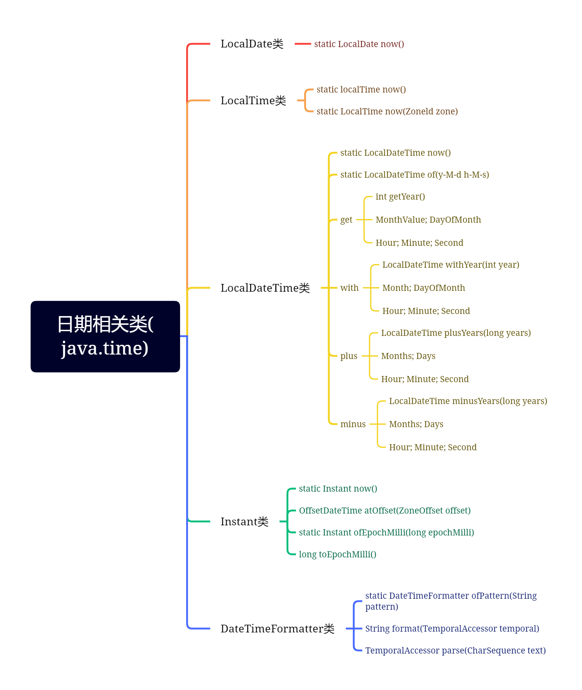

## 常用类的概述和使用

### Object类

概念：java.lang.Object类是java类层次结构的根类，即任意一个类都是它的直接或间接子类

说明：

- 如果定义一个类时没有使用extends关键字声明其父类，则其父类为java.lang.Object类
- Object类定义了“对象”的基本行为，被子类默认继承

#### Object

作用：使用无参方式构造对象

声明：Object()  

#### equals

作用：指示某个其他对象是否“等于”此对象

声明：`boolean equals(Object obj)`

说明：

- 用于判断调用对象是否与参数对象相等
- 该方法默认比较两个对象的地址是否相等，与"=="的结果一致
- 若希望比较两个对象的内容，则需要重写该方法
- 若该方法被重写后，则应该重写hashCode方法来保持结果的一致性

```java
//equals的重写,用于比较两个Student类型的ID值是否相同
 @Override
    public boolean equals(Object obj){
        //当调用对象和参数对象一致时，返回true
        if (this == obj) return true;
        //当参数对象为空时，返回false
        if (null == obj) return false;
        //判断调用对象和是否为Student类型的对象，若是则条件成立
        if (obj instanceof Student) {
            Student ts = (Student) obj;
            return  this.getId() == ts.getId();
        }
        //若不是，则类型不同，一定不一致
        return false;
    }
```

#### hashCode

作用：用于获取调用对象的哈希码值

声明：`int hashCode()`

说明：

- 若两个对象调用equals方法相等，则各自调用该方法的结果必须相同
- 若两个调用对象equals方法不相等，则各自调用该方法的结果应该不相同
- 为了使得该方法与equals方法保持一致，需要重写该方法

```java
//hashCode的重写
    @Override
    public int hashCode(){
        return this.getId();
    }
```

#### toString

作用：用于获取调用对象的字符串形式

声明：`String toString()`

说明：

- 该方法默认返回的字符串为：包名.类名@哈希码值的十六进制
- 为了返回更有意义的数据，需要重写该方法
- 使用println打印引用或字符串拼接引用都会自动调用该方法

```java
@Override
public String toString(){
    return "Student[ID = " + getId() + " ， Name = " + getName() + "]";
}

//------------------------------------------------------------------
Student s1 = new Student(100,"a");
System.out.println(s1.toString());
System.out.println(s1); //当打印一个引用变量时，会自动调用toString方法
String st = "hello " + s1;
System.out.println(st);
```

#### 案例：

- 编程实现Student类的封装，特征：学号和姓名，要求提供打印所有特征的方法
- 编程实现StudentTest类，在main方法中使用有参方式构造两个Student类型的对象并打印特征

题目扩展：

- 如何实现以姓名为基准判断两个对象是否相等？以及以学号和姓名同时为基准判断两个对象是否相等

```java
@Override
public boolean equals(Object obj){
    //当调用对象和参数对象一致时，返回true
    if (this == obj) return true;
    //当参数对象为空时，返回false
    if (null == obj) return false;
    //判断调用对象和是否为Student类型的对象，若是则条件成立
    if (obj instanceof Student) {
        Student ts = (Student) obj;
        // 如果以id为基准去比较，可以用==进行判断，因为id是int类型，基本数据类型，空间存的是数值
        // return  this.getId() == ts.getId();
        // 如果以name为基准，不可以使用==进行判断，因为String类型是引用数据类型，空间存的是地址
        // 不过String类型内部已经重写了equals方法，可以直接使用引用.调用
        return this.getName().equals(ts.getName());
    }
    //若不是，则类型不同，一定不一致
    return false;
}

@Override
public int hashCode(){
    //return this.getId();
    // 同样，String类型无法返回数值，而String类型已经重写了此方法，同样可以直接调用
    return  this.getName().hashCode();
}
```

### 包装类

概念：通常情况下基本数据类型的变量不是对象，为了满足万物皆可对象的理念就需要对基本数据类型的变量进行打包处理变成对象，而负责将这些变量声明为成员变量进行对象化处理的相关类，叫做包装类

| 包装类              | 对应的基本类型 |
| ------------------- | -------------- |
| java.lang.Byte      | byte           |
| java.lang.Short     | short          |
| java.lang.Integer   | int            |
| java.lang.Long      | long           |
| java.lang.Float     | float          |
| java.lang.Double    | double         |
| java.lang.Boolean   | boolean        |
| java.lang.Character | char           |

java.lang.Number类是一个抽象类，是上述Byte,Short,Integer,Long,Float,Double类的父类。用来描述所有类共有的成员

#### Integer类

概念：内部包装了一个int类型的变量作为成员变量，主要为了实现对int类型的包装

##### 常用的变量

```java
System.out.println("最大值是：" + Integer.MAX_VALUE);    //2^31-1
System.out.println("最小值是：" + Integer.MIN_VALUE);    //-2^31
System.out.println("所表示的二进制位数是：" + Integer.SIZE);   //32
System.out.println("所占字节的个数是：" + Integer.BYTES);    //4
System.out.println("对应int类型的Class实例是：" + Integer.TYPE); //int
```

##### 常用的方法

| 方法声明                                | 功能介绍                              |
| --------------------------------------- | ------------------------------------- |
| int **intValue**()                      | 获取调用对象中的整数值并返回          |
| static Integer **valueOf**(int i)       | 根据参数指定整数值得到Integer类型对象 |
| boolean **equals**(Object obj)          | 比较调用对象与参数指定的对象是否相等  |
| String **toString**()                   | 返回描述调用对象值得字符串形式        |
| static int **parseInt**(String s)       | 将字符串类型转换为int类型并返回       |
| static String **toString**(int i)       | 获取参数指定整数的十进制字符串形式    |
| static String **toBinaryString**(int i) | 获取参数指定整数的二进制字符串形式    |
| Static String **toHexString**(int i)    | 获取参数指定整数的十六进制字符串形式  |
| Static String **toOctalString**(int i)  | 获取参数指定整数的八进制字符串形式    |

```java
//等效于把int类型转换为integer类型，这种方式也叫做装箱
Integer it1 = Integer.valueOf(123);     //123
//等效于把string类型转换为integer类型
Integer it2 = Integer.valueOf("456");   //456
//等效于把integer类型转换为int类型，这种方式也叫做拆箱
int ia = it2.intValue();   //456

//----------------------------------------------
//java5增加了自动装箱和自动拆箱的机制
Integer it3 = 123; //使用赋值运算符直接进行运算
int ib = it3;
```

```java
// 静态方法的实现
int ic = Integer.parseInt("100");
//int id = Integer.parseInt("100a");//NumberFormatException 数字格式异常
System.out.println("字符串转换为整数的结果是：" + ic);
System.out.println("由传入的整数获取对应的十进制字符串：" + Integer.toString(200));
System.out.println("由传入的整数获取对应的二进制字符串：" + Integer.toBinaryString(200));
System.out.println("由传入的整数获取对应的十六进制字符串：" + Integer.toHexString(200));
System.out.println("由传入的整数获取对应的八进制字符串：" + Integer.toOctalString(200));
```

> NumberFormatException 数字格式异常，需记忆

##### 装箱拆箱笔试考点

```java
Integer it4 = 128;
Integer it5 = 128;
System.out.println(it4 == it5);  // false  ==比较的是地址，两个变量两个地址
System.out.println(it4.equals(it5)); // true equals比较的是内容，内容相同
Integer it6 = 127;
Integer it7 = 127;
System.out.println(it6 == it7);  // true 自动装箱池，-128~127之间的内容自动装箱
System.out.println(it4.equals(it5)); //true
```

#### Double

概念：内部包装了一个Double类型的变量作为成员变量，主要为了实现对Double类型的包装

##### 常用的变量

SIZE，BYTES，TYPE ，都对应的是Double类型的

##### 常用的方法

| 方法声明                                | 功能介绍                             |
| --------------------------------------- | ------------------------------------ |
| double **doubleValue**()                | 获取调用对象的中的浮点数据并返回     |
| static Double **valueOf**(double d)     | 根据传入浮点数据得到Double类型对象   |
| boolean **equals**(Object obj)          | 比较调用对象与参数指定的对象是否相等 |
| String **toString**()                   | 返回描述调用对象数值的字符串形式     |
| static double **parseDouble**(String s) | 将字符串类型转换为double类型并返回   |
| boolean **isNaN**()                     | 判断调用对象的数值是否为非数字       |

```java
//实现从double到Double类型的转换，即装箱
Double db = Double.valueOf(3.14);
//实现从Double到double类型的转换，即拆箱
double d = db.doubleValue();
//实现从字符串到Double类型的转换
Double db2 = Double.parseDouble("3.1415");
//判断是否为非数字，若是数字则返回false
booble b = db2.isNaN();

//java5开始已经可以实现自动装箱和自动拆箱
Double db = 3.14;
double d =  db;
//Double没有自动装箱池
```

#### Boolean

概念：内部包装了一个boolean类型的变量作为成员变量，主要为了实现对boolean类型的包装

##### 常用的常量

FALSE（对应基值为false的对象），TRUE（对应基值为true的对象），TYPE

##### 常用的方法

| 方法声明                                  | 方法声明                       |
| ----------------------------------------- | ------------------------------ |
| boolean **booleanValue**()                | boolean **equals**(Object obj) |
| static Boolean **valueOf**(boolean b)     | String **toString**()          |
| static boolean **parseBoolean**(String s) | <同样提供自动拆箱装箱>         |

#### Character

概念：内部包装了一个boolean类型的变量作为成员变量，主要为了实现对boolean类型的包装

##### 常用的常量

SIZE，BYTES，TYPE 对应的是char类型

##### 常用的方法

| 方法声明                             | 方法声明                       |
| ------------------------------------ | ------------------------------ |
| char **charValue**()                 | boolean **equals**(Object obj) |
| static Character **valueOf**(char c) | String **toString**()          |

| 方法声明                                | 功能介绍                       |
| --------------------------------------- | ------------------------------ |
| static boolean **isUpperCase**(char ch) | 判断参数指定字符是否为大写字符 |
| static boolean **isLowerCase**(char ch) | 判断参数指定字符是否为小写字符 |
| static boolean **isDigit**(char ch)     | 判断参数指定字符是否为数字字符 |
| static char **toUpperCase**(char ch)    | 将参数指定的字符转换为大写字符 |
| static char **toLowerCase**(char ch)    | 将参数指定的字符转换为小写字符 |

```java
Character c1 = 'a';  //自动装箱
char c2 = c1;       //自动拆箱
System.out.println("大写？" + Character.isUpperCase(c1));
System.out.println("小写？" + Character.isLowerCase(c1));
System.out.println("转为大写：" + Character.toUpperCase(c1));
System.out.println("转为小写：" + Character.toLowerCase(c1));
```

#### 包装类使用总结

- 基本数据类型转换为对应包装类的方式：

  调用包装类的静态方法即可

- 获取包装类对象中基本数据类型变量数值的方式

  调用包装类的xxxValue方法即可

- 字符串转换为基本数据类型的方式

  调用包装类的parseXxx方法即可

.assets/Object类.png)

### 数学处理类

#### Math类

基本概念：java.lang.Math类主要用于提供执行数学运算的方法，如：对数，平方根

##### 常用的方法

| 方法声明                                  | 功能介绍                 |
| ----------------------------------------- | ------------------------ |
| static int **max**(int a, int b)          | 返回两个参数中的最大值   |
| static int **min**(int a ,int b)          | 返回两个参数中的最小值   |
| static double **pow**(double a ,double b) | 返回第一个参数的幂       |
| static int **abs**(int a)                 | 返回参数指定数值的绝对值 |
| static long **round**(double a)           | 返回参数四舍五入的结果   |
| static double **sqrt**(double a)          | 返回参数的平方根         |
| static double **random**()                | 返回0.0到1.0的随机数     |

```java
System.out.println("两个参数的最大值：" + Math.max(10,20));
System.out.println("两个参数的最小值：" + Math.min(10,20));
System.out.println("第一个参数的幂：" + Math.pow(2,3)); //8.0
System.out.println("参数的绝对值：" + Math.abs(-2));
System.out.println("参数四舍五入后：" + Math.round(5.888));//6
System.out.println("参数平方根：" + Math.sqrt(4));    //2.0
System.out.println("返回一个0~1随机数：" + Math.random());
```


#### BigDecimal类

概念：由于float类型和double类型在运算时可能会有误差，若希望实现精确运算则借助java.math.BigDecimal类型加以描述

##### 常用方法

| 方法的声明                                       | 功能介绍                     |
| ------------------------------------------------ | ---------------------------- |
| **BigDecimal**(String val)                       | 根据参数指定的字符串构建对象 |
| BigDecimal **add**(BigDecimal augend)            | 用于实现加法运算             |
| BigDecimal **subtract**(BigDecimal subtrahend)   | 用于实现减法运算             |
| BigDecimal **multiply**(BigDecimal multiplicand) | 用于实现乘法运算             |
| BigDecimal **divide**(BigDecimal divisor)        | 用于实现除法运算             |

```java
BigDecimal bd1 = new BigDecimal("0.2");
BigDecimal bd2 = new BigDecimal("0.1");
System.out.println("加法：" + bd1.add(bd2));
System.out.println("减法：" + bd1.subtract(bd2));
System.out.println("乘法：" + bd1.multiply(bd2));
System.out.println("除法：" + bd1.divide(bd2, RoundingMode.HALF_DOWN));
```

#### BigInteger类

概念：若希望表示比long类型范围还大的整数数据，则需要借助java.math.BigInteger类型描述

| 方法声明                                             | 功能介绍                       |
| ---------------------------------------------------- | ------------------------------ |
| **BigInteger**(String val)                           | 根据参数指定的字符串来构造对象 |
| BigInteger **add** (BigInteger val)                  | 用于实现加法运算               |
| BigInteger **subtract**(BigInteger val)              | 用于实现减法运算               |
| BigInteger **multiply**(BigInteger val)              | 用于实现乘法计算               |
| BigInteger **divide**(Biginteger val)                | 用于实现除法计算               |
| BigInteger **remainder**(Biginteger val)             | 用于实现取余运算               |
| BigInteger[] **divideAndRemainder** (Biginteger val) | 用于实现取商和余数的运算       |

```java
BigInteger b1 = new BigInteger("108");
BigInteger b2 = new BigInteger("24");
System.out.println("加法：" + b1.add(b2));
System.out.println("减法：" + b1.subtract(b2));
System.out.println("乘法：" + b1.multiply(b2));
System.out.println("除法：" + b1.divide(b2)); //4
System.out.println("取余：" + b1.remainder(b2));//12

BigInteger[] arr = b1.divideAndRemainder(b2);
System.out.println("取商和取余：" + arr[0] + ";" + arr[1]); //4;12
```


## String类的概述和使用

概念：java.lang.String类用于描述字符串，java程序中所有的字符串字面值都可以使用该类的对象加以描述

注意：

- 该类由final关键字修饰，表示该类不能被继承
- 从jdk1.9开始该类的底层不使用char[]来存储数据，而是改成byte[]加上编码标记，从而节约空间
- 该类描述的字符串内容是个常量不可更改，因此可以被共享使用。如果重新赋值，改变的是指向而不是值

#### 常量池

概念：由于String类型描述的字符串内容是常量不可改变，因此java虚拟机将首次出现的字符串放入常量池中，若后续代码中出现了相同字符串内容则直接使用池中已有的字符串对象而无需申请内存和创建对象，从而提高了性能

#### 常用的构造方法（重点）

| 方法声明                                    | 功能介绍                                                     |
| ------------------------------------------- | ------------------------------------------------------------ |
| **String**()                                | 使用无参方式构造对象得到空字节序列                           |
| String(byte[] bytes.int offset,int length)  | 使用bytes数组中下标从offset位置开始的length个字节来构造对象  |
| String(byte[] bytes)                        | 使用bytes数组中的所有内容构造对象                            |
| String(char[] value, int offset, int count) | 使用value数组中下边从offset位置开始的count个字符来构造对象   |
| String(char[] value)                        | 使用value数组中的所有内容构造对象                            |
| String(String original)                     | 根据参数指定的字符串内容来构造对象，新创建对象为参数对象的副本 |

```java
String s1 = new String();
//输出为空而不是null，空是有对象无内容，null没有对象
System.out.println("s1 = " + s1);   // "" 自动调用toString方法

byte[] bArr = {97,98,99,100,101};
//会将数字转换为对应的字符，例如 'b'==98;然后截取内容
String s2 = new String(bArr,1,3);	//bcd
//输出全部内容
String s3 = new String(bArr);		//abcde

char[] cArr = {'a','b','c','d'};
//把char数组所有内容串起来
String s4 = new String(cArr); 		//abcd

//使用字符串构造字符串
String s5 = new String("hello");	//hello
```

#### String构造笔试题

```java
//笔试题1：下面的代码会创建几个对象，分别存放在什么地方
String s6 = "abc"; //一个对象，存放在常量池中
String s7 = new String("hello"); //两个对象，一个在常量池中，一个在堆区中

//笔试题2：分析下面代码的执行结果
String st1 = "hello";       //常量池
String st2 = "hello";       //常量池
String st3 = new String("hello"); //申请一个堆区复制存放常量池中的"hello"
String st4 = new String("hello");
System.out.println(st1 == st2);     //比较地址；true
System.out.println(st1.equals(st2));//比较内容；true
System.out.println(st3 == st4);     //false
System.out.println(st4.equals(st4));//true
System.out.println(st2 == st4);     //false
System.out.println(st2.equals(st4));//true

//笔试题3：常量的优化机制
System.out.println("------------------------------");
String st5 = "abcd";
String st6 = "ab" + "cd";   //常量优化机制，两个常量相加直接合并成一个常量
String st7 = "ab";
String st8 = st7 + "cd";    //变量+常量，不会触发常量优化机制
System.out.println(st5 == st6); //true
System.out.println(st5 == st8); //false
```

#### 常用的成员方法（重点）

| 方法声明                 | 功能介绍（字符串类型的转换与拆分）       |
| ------------------------ | ---------------------------------------- |
| String **toString**()    | 返回字符串本身                           |
| byte[] **getBytes**()    | 将当前字符串内容转换为byte数组并返回     |
| char[] **toCharArray**() | 用于将当前字符串内容转换为char数组并返回 |

```java
String s1 = "world";

//过程：将String类型拆分为char类型，然后char转换为byte类型
byte[] bytes = s1.getBytes();   //119, 111, 114, 108, 100
System.out.println("bytes = " + Arrays.toString(bytes));
//把byte类型再转换为String类型，直接使用构造方法
String s2 = new String(bytes);

//把String类型转换为char类型
char[] chars = s2.toCharArray();    //w, o, r, l, d
System.out.println("chars = " + Arrays.toString(chars));
//把char数组类型转换为String类型
String s3 = new String(chars);
```

| 方法声明                   | 功能介绍（获取字符串的长度） |
| -------------------------- | ---------------------------- |
| char **charAt**(int index) | 用于返回字符串指定位置的字符 |
| int **length**()           | 返回字符串字符序列的长度     |
| boolean **isEmpty**()      | 判断字符串是否为空           |

```java
System.out.println("world".charAt(0));  //w
System.out.println("world".length());   //5
System.out.println("world".isEmpty());  //false

//笔试考点
//使用两种方法实现"12345"到12345的转变
String st = "12345";
//1. 利用Integer的方法parseInt进行转换
int ia = Integer.parseInt(st);
//2. 利用ASCII方法进行转换
int ib = 0;
for (int i = 0 ; i < st.length() ; i++){
    ib = ib*10 + (st.charAt(i) - '0');
}
System.out.println(ib);
 
//实现从12345到"12345"的转换
String str = String.valueOf(ia);
```

##### 案例：判断语句是否是回文

```java
public static void main(String[] args) {
    //1.获取长度，获取一半长度内容
    String st = "上海自来水来自海上";
    int size = st.length();
    // 2. 通过循环进行比较
    for (int i=0; i<size/2;i++){
        if (st.charAt(i) != st.charAt(size-1-i)){
            System.out.println(st + " ：不是回文");
            return; //仅仅用于结束方法，避免所有结果都会输出“是回文”
        }
    }
    System.out.println(st + " ：是回文");
}
```

| 方法声明                                | 功能介绍（字符串的比较）                 |
| --------------------------------------- | ---------------------------------------- |
| int **compareTo**(String anotherString) | 用于比较调用对象和参数对象的大小关系     |
| int **compareToIgnoreCase**(String str) | 不考虑大小写，也就是'a'和'A'是相等的关系 |

```java
String a = "hello";
//this.charAt(k)-anotherString.charAt(k)
//从第一位开始比，如果都相同就比长度
System.out.println(a.compareTo("world"));   //'h' - 'w' = -15
System.out.println(a.compareTo("helli"));   //'o' - 'i' = 6
System.out.println(a.compareTo("helloworld"));   //长度 5 - 10 = -5
System.out.println(a.compareToIgnoreCase("HELLO")); //0
```

| 方法声明                                       | 功能介绍（字符串的修改与判断）               |
| ---------------------------------------------- | -------------------------------------------- |
| String **concat**(String str)                  | 用于实现字符串的拼接（很少使用）             |
| boolean **contains**(CharSequence s)           | 用于判断当前字符串是否包含参数指定的内容     |
| String **toLowerCase**()                       | 返回字符串的小写形式                         |
| String **toUpperCase**()                       | 返回字符串的大写形式                         |
| String **trim**()                              | 返回去掉前导和后继空白的字符串(即去前后空格) |
| boolean **startsWith**(String prefix)          | 判断字符串是否以参数字符串开头               |
| boolean startsWith(String prefix ,int toffset) | 从指定位置开始是否以参数字符串开头           |
| boolean **endsWith**(String suffix)            | 判断字符串是否以参数字符串结尾               |

```java
String st1 = "  Hello World";

//使用contains方法判断字符串是否存在
boolean bl = st1.contains("hello"); // false
System.out.println(bl);
bl = st1.contains("Hello");     //true

//转换字符串为大写或小写
String st2 = st1.toUpperCase(); //  HELLO WORLD
System.out.println(st1);  //此时st1仍未原值，因为字符串为常量，不可变
String st3 = st1.toLowerCase(); //  hello world

//去除空格
String st4 = st1.trim();    //Hello World

//判断字符串的开头与结尾
bl = st1.startsWith("Hello");   //false
bl = st1.startsWith(" ");   //true
bl = st1.startsWith("Hello",2);   //true，计数从0开始
System.out.println(bl);
bl = st1.endsWith("rld"); //true
System.out.println(bl);
```

| 方法声明                                           | 功能介绍（常用方法）                           |
| -------------------------------------------------- | ---------------------------------------------- |
| boolean **equals**(Object anObject)                | 用于比较字符串内容是否相等并返回               |
| int **hashCode**()                                 | 获取调用对象的哈希码值                         |
| boolean **equalsIgnoreCase**(String anotherString) | 用于比较字符串内容是否相等并返回，不考虑大小写 |

##### 案例：判断用户名和方法

提示用户输入用户名和密码信息，若为"admin"和"123456"则提示"登陆成功"，否则提示"用户名或密码错误，还有n此机会"，若用户输入三次依然错误，则提示用户"此账户已冻结"

```java
public static void main(String[] args) {

    Scanner sc = new Scanner(System.in);

    for (int i = 3 ; i>0; i--) {
        // 提示用户输入用户名和密码信息
        System.out.println("请输入用户名: ");
        String sName = sc.next();
        System.out.println("请输入密码: ");
        String sPass = sc.next();

        // 对用户名和密码信息进行判断
        // boolean bl1 = sName.equalsIgnoreCase("admin");
		boolean bl1 = "admin".equals(sName);
        boolean bl2 = "123456".equals(sPass); //固定值放前面,避免空指针异常


        if (bl1 && bl2) {
            System.out.println("登录成功");
            //return;
            break; //如果相同就退出循环,和return效果类似,但是作用区域不同
        }
        if (i == 1) {
            System.out.println("此账号已冻结");
        } else {
            System.out.println("用户名或密码错误,还有" + (i - 1) + "次机会");
        }
    }
    // 关闭扫描器
    sc.close();
}
```

| 方法声明                                   | 功能介绍（获取字符或字符串位置）                        |
| ------------------------------------------ | ------------------------------------------------------- |
| int **indexOf**(int ch)                    | 用于返回当前字符串中参数ch指定的字符第一次出现的下标    |
| int indexOf(int ch , int fromIndex)        | 用于从fromIndex位置开始查找ch指定的字符                 |
| int indexOf(String str)                    | 在字符串中检索str返回其第一次出现的位置，若找不到返回-1 |
| int indexOf(String str , int fromIndex)    | 表示从字符串的fromIndex位置开始检索str第一次出现的位置  |
| int **lastIndexOf**(int ch)                | 用于返回参数ch指定的字符最后一次出现的下标              |
| int lastIndexOf(int ch , int fromIndex)    | 用于从fromIndex位置开始查找ch指定字符出现的下标         |
| int lastIndexOf(string str)                | 返回str指定字符串最后一次出现的下标                     |
| int lastIndexOf(String str, int fromIndex) | 用于从fromIndex位置开始反向搜索的第一次出现的下标       |

```java
String st = "Hello World ,";
System.out.println(st);

//返回传入参数对应的第一个索引位置
int ia = st.indexOf("L");//若不存在,则返回-1
int ib = st.indexOf("l");//2 
int ic = st.indexOf("llo"); //2
//返回从指定下标开始查找l第一次出现的的索引位置(包含0)
int id = st.indexOf("l",0); // 2
int ie = st.indexOf("l",3); // 3

//-----------------------------------------------------
//案例：打印字符串中所有"l"的索引
int pot = st.indexOf("l");
while (-1 != pot){
    System.out.println("pot = " + pot);
    pot = st.indexOf("l" , pot+1);
}

//上述语句有重复字段,可以优化一下
int pot1 = 0;
while ((pot1 = st.indexOf("l",pot1)) != -1){
    System.out.println("pot1 = " + pot1);
    pot1 += 1;
}
//-----------------------------------------------------

//返回传入参数对应的最后一个索引位置，反向查找
int a = st.lastIndexOf("l");    //9
int b = st.lastIndexOf("l",8);  //3
```

| 方法声明                                            | 功能介绍（获取子字符串）                                     |
| --------------------------------------------------- | ------------------------------------------------------------ |
| String **substring**(int beginIndex , int endIndex) | 返回字符串从下标beginIndex(包括)开始到endIndex(不包括)结束的子字符串 |
| String substring(int beginIndex)                    | 返回字符串从下标beginIndex(包括)开始到字符串结尾的子字符串   |

```java
String st = "To be or not to be";
String sst  = st.substring(9);		//not to be
String sst1  = st.substring(9,12);	//not 	

//案例: 获取指定字符后面的字符串
int ia = st.indexOf("or");
String sst2 = st.substring(ia + 3);
System.out.println(sst2);
```


### 正则表达式（了解）

概念：用于对字符串数据的格式进行验证，以及匹配，查找，替换等操作。该字符串通常使用^运算符作为开头标志，使用$运算符作为结尾标志，当然也可以忽略

| 正则表达式  | 说明                              |
| ----------- | --------------------------------- |
| [abc]       | 可以出现abc中任意一个字符         |
| [^abc]      | 可以出现除了abc之外的任亿一个字符 |
| [a-z]       | 可以出现从a到z中的任意一个字符    |
| [a-zA-Z0-9] | 可以出现任意的英文字符和数字      |

| 正则表达式 | 说明                                 |
| ---------- | ------------------------------------ |
| .          | 任意一个字符（不含换行符）           |
| \d         | 任意一个数字字符                     |
| \D         | 任意一个非数字字符                   |
| \s         | 空白字符，不包含特殊字符             |
| \S         | 非空白字符                           |
| \w         | 任意一个单词字符，等效于[a-zA-Z_0-9] |
| \W         | 任意一个非单词字符                   |

| 正则 数量限制 | 说明                        |
| ------------- | --------------------------- |
| X?            | X可以出现0~1次，最多1次     |
| X*            | X可以出现0~n次，任意次      |
| X+            | X可以出现1~n次，至少1次     |
| X{n}          | X可以出现恰好n次            |
| X{n,}         | X可以出现至少n次            |
| X{n,m}        | X可以出现至少n次且不超过m次 |

#### 正则表达式相关的方法

| 方法名称                          | 方法说明                                                 |
| --------------------------------- | -------------------------------------------------------- |
| boolean **matches**(String regex) | 判断当前正在调用的字符串是否匹配参数指定的正则表达式规则 |

```java
String st = "123456";
String re1 = "^[0-9]{6}$"; // = "\\d{6}";
System.out.println(st.matches(re1));

//描述QQ号码的规则：由非0开头的5~15位数组成
String st2 = "12455";
String re2 = "^[1-9]\\d{4,14}";

//描述手机号码的规则：由1开头，第二位是3、4、5、7、8中的一位，共11位
String st3 = "15000000000";
String re3 = "^1[34578]\\d{9}$";

//描述身份证号码的规则：总共18位，6位数字代表地区，4位数字代表年，2位数字代表月，2位数字代表日期，三位数字代表个人最后一位可能是X
String st4 = "999999999999999999";
//()代表分组,|代表或
String re4 = "(\\d{6})[12]\\d{10}([0-9|X])";
```


| 方法名称                                                 | 方法说明                                                |
| -------------------------------------------------------- | ------------------------------------------------------- |
| String[] **split**(String regex)                         | 以regex所表示的字符串为分隔符，将字符串拆分为字符串数组 |
| String **replace**(char oldChar , char newChar)          | 使用参数newChar替换字符串中出现的所有参数oldChar        |
| String **replaceFirst**(String regex,String replacement) | 替换此字符串匹配给定的正则表达式的第一个字符串          |
| String **replaceAll**(String regex,String replacement)   | 将字符串中匹配regex的字符串替换成replacement            |

```java
String st = "1001,zhang,30";
//使用参数分割字符串
String[] s = st.split(","); //[1001, zhang, 30]

//使用参数替换字符串
String s1 = st.replace(",","|");    //  1001|zhang|30
//使用正则表达式替换字符串,方便匹配第一个与所有的
String s2 = st.replaceFirst("[0]" ,"1");// 1101,zhang,30
String s3 = st.replaceAll("[0]","9");//   1991,zhang,39
```

## 可变字符串类和日期相关类

### 可变字符串类（重点）

概念：由于String 类描述的字符串内容是个常量不可改变，但需要在java代码中描述大量类似的字符串是，只能单独申请和存储，因此造成内存空间的浪费。为了解决这种情况，可以使用java.lang.StringBuilder类的java.lang.StringBuffer类来描述字符序列可以改变的字符串

- StringBuffer类是从jdk1.0开始存在，属于线程安全的类，因此效率比较低
- StringBuilder类是从jdk1.5开始存在，属于非线程安全的类，效率比较高

#### StringBuilder类常用的构造方法

| 方法声明                    | 功能介绍                                              |
| --------------------------- | ----------------------------------------------------- |
| **StringBuilder**()         | 使用无参方式构造对象，容量为16                        |
| StringBuilder(int capacity) | 根据参数指定的容量来构造对象，容量为参数指定大小      |
| StringBuilder(String str)   | 根据参数指定的字符串来构造对象，容量为：16+字符串长度 |

#### StringBuilder类常用的成员方法

| 方法声明                                                 | 功能介绍                                    |
| -------------------------------------------------------- | ------------------------------------------- |
| int **capacity**()                                       | 用于返回调用对象的容量                      |
| int **length**()                                         | 用于返回字符串的长度，也就是字符的个数      |
| StringBuilder **insert**(int offset, String str)         | 插入字符串并返回调用对象的引用，就是自己    |
| StringBuilder **append**(String str)                     | 追加字符串                                  |
| StringBuilder **deleteCharAt**(int start)                | 将当前字符串中下标为index位置的单个字符删除 |
| StringBuilder **delete**(int start ,int end)             | 删除字符串[start end)                       |
| StringBuilder **replace**(int start ,int end,String Str) | 替换字符串                                  |
| StringBuilder **reverse**()                              | 字符串反转                                  |

```java
StringBuilder sb = new StringBuilder("morning");
System.out.println(sb.capacity());  //23
System.out.println(sb.length());    //7

//---------------------------需背诵记忆-----------------------
//  增 (插入）
sb.insert(0,"Hi ");        //Hi morning
sb.insert(3,"fusi ");       //Hi fusi morning
//  增 (追加）
//默认扩容算法：若超过原始容量：原始容量 * 2 + 2
//底层采用byte数组存放所有字符内容，使用位运算来进行计算
sb.append("!");                     //Hi fusi morning!

//  删 (指定下标删除)
sb.deleteCharAt(8);         //Hi fusi orning!
//  删 (删除指定区域) [) 左闭右开
sb.delete(8,sb.length());       //Hi fusi

//  改 (更改单个字符)
sb.setCharAt(3,'F'); //Hi Fusi
//  改 (替换多个字符)
sb.replace(3,7,"xixifu");   //Hi xixifu

//  查 (查找顺序第一个)
int ia = sb.indexOf("i");       //1
//  查 (查找逆序第一个)
int ib = sb.lastIndexOf("i");    //6

//  逆序
sb.reverse();    // ufixix iH
```

#### 笔试考点

- 既然StringBuilder类的对象本身就可以修改，为何还要有返回值

    答：为了可以连续调用：`sb.reverse().delete(8).append("a");`

- 如何实现StringBuilder和String类型的互相转换

    ```java
    String str = sb.toString();		//使用toString即可获取
    StringBuilder sb2 = new StringBuilder(str);		//使用构造方法即可
    ```

- String、StringBuilder、StringBuffer之间谁的效率高

    答：StringBuilder > StringBuffer > String


### Java8之前的日期相关类(熟悉)

#### System类的概述

概念： `java.lang.System`类中提供了一些有用的类字段和方法

常用的方法：

| 方法声明                        | 功能介绍                                             |
| ------------------------------- | ---------------------------------------------------- |
| static long currentTimeMillis() | 返回当前时间与1970年1月1日整之间以毫秒为单位的时间差 |

#### Date类的概述

概念：java.util.Date类主要用于描述特定的瞬间，也就是年月日时分秒，可以精确到毫秒

常用的方法：

| 方法声明                 | 功能介绍                                   |
| ------------------------ | ------------------------------------------ |
| Date()                   | 使用无参的方式构造对象，也就是当前系统时间 |
| Date(long date)          | 根据参数指定毫秒构造对象                   |
| long getTime()           | 获取调用对象距离1970.1.1的毫秒数           |
| void setTime(long time ) | 设置调用对象为距离基准时间time毫秒的时间点 |

#### SimpleDateFormat类

概念：java.**text**.SimpleDateFormat类主要用于实现日期和文本之间的转换

常用的方法：

| 方法声明                         | 功能介绍                                         |
| -------------------------------- | ------------------------------------------------ |
| SimpleDateFormat()               | 使用无参方式构造对象                             |
| SimpleDateFormat(String pattern) | 根据参数指定的模式来构造对象，y年M月d日H时m分s秒 |
| final String format(Date date)   | 用于将日期类型转换为文本类型                     |
| Date parse(String source)        | 用于将文本类型转换为日期类型                     |

```java
// 获取当前系统时间
Date d = new Date();

//实例化一个SimpleDateFormat的对象，并使用有参构造设置好时间输出格式
SimpleDateFormat sdf = new SimpleDateFormat("y-M-d H:m:ss");

//使用format方法转换传入的时间参数为指定格式的字符串类型
String st = sdf.format(d);

//使用parse方法转换传入的字符串格式的时间为Date类型
Date parse = sdf.parse(st);
```

#### Calendar类

概念： java.util.Calendar类主要用于描述特定的瞬间，取代Date类中的过时方法实现全球化

该类是一个抽象类，因此不能实例化对象，其具体子类针对不同国家的日历系统，其中应用最广泛的是GregorianCalendar（格里高利历），对应世界上绝大多数国家、地区使用的标准日历系统

常用的方法：

| 方法声明                                                     | 功能介绍                         |
| ------------------------------------------------------------ | -------------------------------- |
| static Calendar getInstance()                                | 用于获取Calendar类型的引用       |
| void set(int year,int month,int date,int hourOfDay,int minute,int second) | 用于设置年月日时分秒信息         |
| Date getTime()                                               | 用于将Calendar类型转换为Date类型 |
| void set(int field,int value)                                | 设置指定字段的数值               |
| void add(int field,int amount)                               | 向指定字段增加数值               |

```java
/**
* 如果希望使用calendar获取值并按照指定格式打印,则需要使用以下流程
* 即:创建一个SimpleDateForamt,再创建一个Calendar,使用Calendar设置初始值
* 使用C的方法getTime()转换格式为Date类型,再使用SDF的方法format把Date类型转为自己的类型并输出
* 即 Calendar --> Date --> SimpleDateForamt
*/
//设置日期的输出格式
SimpleDateFormat sdf = new SimpleDateFormat("y-M-d H:m:s");
//获取Calendar抽象类的引用
Calendar c = Calendar.getInstance();

//设置指定的时间，需注意，月值基于0，也就是说0就是1月
c.set(2008,8-1,8,20,8,8);
//转换为date类型的引用,使用Calendar的getTime方法
Date time = c.getTime();
//转换Date为String格式,使用SimpleDateFormat中的format方法
String format = sdf.format(time);


//使用Calendar的set方法,设置指定的字段为指定的值
//需注意,使用的是常量,所以需要类名.的方式调用
c.set(Calendar.YEAR , 2018);
Date time1 = c.getTime();
System.out.println(sdf.format(time1));

//使用Calendar的add方法,增加月份的值
c.add(Calendar.MONDAY , 3);
Date time2 = c.getTime();
System.out.println(sdf.format(time2));
```

- 笔试题  : 既然Calendar是一个抽象类,为什么上面的方法可以获取Calendar类型的引用哪
    答:由源码可知,返回的并不是Calendar类型,而是Calendar类的子类的对象,形成了多态

#### 多态的使用场合

- 通过方法的参数传递形成多态

    ```java
    public static void draw(Shape s){
        s.show();
    }
    ```

- 在方法体中直接使用多态的语法格式

    ```java
    Account acc = new FixedAccount();
    ```

- 通过方法的返回值类型形成多态

    ```java
    Calendar getInstance(){
        return new GregorianCalendar(zone,aLocale);
    }
    ```


### Java8之后的日期相关类(熟悉)

之前的Date类和Calendar类都有很多问题,例如:

- 月份都是从0开始的
- 格式化只对Date类有用,对Calendar类不能使用,造成代码的繁琐
- 非线程安全等

所有从java8开始,发布了新的类:`Date.Time`类来加强对日期和时间的处理

#### Java日期类的概述

- java.time : 该包日期/时间API的基础包
- java.time.chrono包 : 该包提供对不同日历系统的访问
- java.time.format包 : 该包能格式化和解析日期时间对象
- java.time.temporal包 : 该包包含底层框架和扩展特性
- java.time.zone包 : 该包支持不同时区以及相关规则的类

#### LocalDate类

概念: java.time.LocalDate类主要用于描述年-月-日格式的日期信息,该类不表示时间和时区信息

常用的方法:

| 方法声明                   | 功能描述                           |
| -------------------------- | ---------------------------------- |
| static LocalDate **now**() | 在默认时区中从系统时钟获取当前日期 |

#### LocalTime类

概念 : java.time.localTime类主要用于描述时间信息,可以描述时分秒以及纳秒

| 方法声明                          | 功能介绍                           |
| --------------------------------- | ---------------------------------- |
| static LocalTime **now**()        | 从默认时区的系统时间中获取当前时间 |
| static LocalTime now(Zoneld zone) | 获取指定时区的当前时间             |

#### LocalDateTime类

| 方法声明                                                     | 功能介绍                                      |
| ------------------------------------------------------------ | --------------------------------------------- |
| static LocalDateTime **now**()                               | 从默认时区的系统时间中获取 当前日期时间       |
| static LocalDateTime **of**(int year, int month, int dayOfMonth, int hour, int minute, int second) | 根据参数指定的年月日时分秒 信息来设置日期时间 |
| int **getYear**()                                            | 获取年份字段的数值                            |
| int getMonthValue()                                          | 获取1到12之间的月份字段                       |
| int getDayOfMonth()                                          | 获取日期字段                                  |
| int getHour()  ; int getMinute()  ; int getSecond()          | 获取时分秒数                                  |
| LocalDateTime **withYear**(int year)                         | 设置为参数指定的年                            |
| withMonth ;  withDayOfMonth                                  | 设置为参数指定的月,日                         |
| withHour ; withMinute ; withSecond                           | 设置为参数指定的时,分,秒                      |
| LocalDateTime **plusYears**(long years)                      | 加上参数指定的年                              |
| plusMonths ; plusDays                                        | 加上参数指定的月,日                           |
| plusHours ; plusMinutes ; plusSeconds                        | 加上参数指定的时分秒                          |
| LocalDateTime **minusYears**(long years)                     | 减去参数指定的年                              |
| minusMonths ; minusDays ;                                    | 减去参数指定的月 , 天                         |
| minusHours ; minusMinutes ; minusSeconds ;                   | 减去时分秒                                    |

```java
//获取当前日期
LocalDate now = LocalDate.now(); //2021-10-19
//获取当前时间
LocalTime now1 = LocalTime.now();//22:16:52.504320100
//获取当前时间日期
LocalDateTime now2 = LocalDateTime.now();//2022-10-19T22:16:52.504320100

//使用参数指定的日期时间获取对象
LocalDateTime of = LocalDateTime.of(2008, 8, 8, 20, 8, 8);
System.out.println(of); //自动调用toString方法
System.out.println("获取到的年是: " + of.getYear());

//更改日期时间,这里更改年份.不改变原值,返回新值
LocalDateTime localDateTime = of.withYear(1998);

//增加日期时间,这里更改年份.不改变原值,返回新值
LocalDateTime localDateTime1 = localDateTime.plusDays(2);

//减少时间,这里更改月份.不改变原值,返回新值
LocalDateTime localDateTime2 = localDateTime1.minusHours(12);
```

#### Instant类

概念：java.time.Instant类主要用于描述瞬间的时间点信息

常用的方法

| 方法声明                                     | 功能介绍                                                   |
| -------------------------------------------- | ---------------------------------------------------------- |
| static Instant now()                         | 从系统时钟上获取当前时间                                   |
| OffsetDateTime atOffset(ZoneOffset offset)   | 将此瞬间与偏移量组合以创建偏移时间                         |
| static Instant ofEpochMilli(long epochMilli) | 根据参数指定的毫秒数来构造对象，参数为距离1970年整的毫秒数 |
| long toEpochMilli()                          | 获取距离1970年整的毫秒数                                   |

```java
// 获取到的时间，是本初子午线的时间，与系统时间相差八小时
Instant now = Instant.now(); //2022-10-22T07:32:23.509967500Z

// 加上偏移量创建时间 , 2022-10-22T15:32:23.509967500+08:00 
OffsetDateTime odt = now.atOffset(ZoneOffset.ofHours(8));

// 获取距离1970年的毫秒数
long l = now.toEpochMilli();

// 根据偏移毫秒数获取到的时间，应与当前时间相同
Instant instant = Instant.ofEpochMilli(l);
```

#### DateTimeFormatter类

概念：java.time.format.DateTimeFormatter类主要用于格式化和解析日期

常用的方法：

| 方法声明                                           | 功能介绍                       |
| -------------------------------------------------- | ------------------------------ |
| static DateTimeFormatter ofPattern(String pattern) | 根据参数指定的模式来获取对象   |
| String format(TemporalAccessor temporal)           | 将参数指定日期时间转换为字符串 |
| TemporalAccessor parse(CharSequence text)          | 将参数指定字符串转换为日期时间 |

```java
// 1. 获取当前时间日期并打印
LocalDateTime now = LocalDateTime.now();

// 2. 创建一个DateTimeForamtter类型的对象
DateTimeFormatter dtf = DateTimeFormatter.ofPattern("y-M-d H-m-s");

// 3. 实现日期时间到字符串类型的转换并打印
String format = dtf.format(now);

// 4. 实现字符串类型到时间类型的转换并打印
TemporalAccessor parse = dtf.parse(format);
```



## 集合类库


### Collection集合（重点）

概念：java.util.Collection接口是List接口，Queue接口以及Set接口的父接口，因此该接口里定义的方法既可用于操作List集合，也可用于操作Queue集合和Set集合

#### 常用方法（练熟）

| 方法声明                                    | 功能介绍                                        |
| ------------------------------------------- | ----------------------------------------------- |
| boolean **add**(E e)                        | 向集合中添加对象                                |
| boolean **addAll**(Collection<? extend E>c) | 用于将参数指定集合c中的所有元素添加到当前集合中 |
| boolean **contains**(Object o)              | 判断是否包含指定对象                            |
| boolean **containsAll**(Collection<?> c)    | 判断是否包含参数指定的所有对象                  |
| boolean **retainAll**(Collection<?> c)      | 保留当前集合中存在且参数集合中存在的所有对象    |
| boolean **remove**(Object o)                | 从集合中删除对象                                |
| boolean **removeAll**(Collection<?> c)      | 从集合中删除参数指定的所有对象                  |
| void **clear**()                            | 清空集合                                        |
| int **size**()                              | 返回包含对象的个数                              |
| boolean **isEmpty**()                       | 判断是否为空                                    |
| boolean **equals**(Object o)                | 判断是否相等                                    |
| int **hashCode**()                          | 获取当前集合的哈希码值                          |
| Object[] **toArray**()                      | 将集合转换为数组                                |
| Iterator<E> **iterator**()                  | 获取当前集合的迭代器                            |


```java
//------------------元素的填加------------------
Collection c1 = new ArrayList();
c1.add(4); //自动装箱机制
c1.add("hello"); //常量池机制
c1.add(new People("K",18));

Collection c2 = new ArrayList();
c2.add(8);
c2.add("world");
// 需注意，addAll会把元素一个一个传入，而add则只会传入一个参数。
c1.addAll(c2);

//-----------------元素的判断--------------------
c1.contains("hello"); //true
//contains的判断机制{return (a == b) || (a != null && a.equals(b)}
// 即：1. 两者地址相同。 2. 调用对象的equals方法与之相同.
// 如果People方法中没有重写equals，则调用父类Object的equals方法，通过地址判断
// 如果希望能够进行值的判断，则需在People中重写equals方法
c1.contains(new People("K", 18)); //false

//判断集合c1中是否包含集合c2的所有元素
c1.containsAll(c2); //true

//判断两个集合是否相等
c1.equals(c2); //false

//---------------------元素取交集------------------
boolean b1 = c1.retainAll(c2); // 如果值为true，则表示集合发生了改变
System.out.println(b1);

//----------------------删除元素------------------
// 删除单个元素
boolean remove = c1.remove(4); // 若为true，则表示删除成功
System.out.println(remove);

// 删除多个元素
c1.removeAll(c2); //若被删除的元素不存在，返回false

//---------------------其他方法的使用---------------
// 获取集合的长度
int size = c1.size();
// 判断集合是否为空
boolean empty = c1.isEmpty();
// 清空集合
c1.clear();

//-----------------集合与数组的相互转换----------------
Collection c3 = new ArrayList();
c3.add(1);
c3.add(2);
c3.add(3);
Object[] o3 = c3.toArray();
System.out.println(Arrays.toString(o3)); //[1, 2, 3]
// 集合到数组的转换
Collection c4 = Arrays.asList(o3);
System.out.println(c4); //[1, 2, 3]
```

### Iterator接口（重点）

概念：

-   java.util.Iterator接口主要用于描述迭代器对象，可以遍历Collection集合中的所有元素
-   java.util.Collection接口继承Iterator接口，因此所有实现Collection接口的实现类都可以使用该迭代器对象

#### 常用的方法

| 方法声明          | 功能介绍                            |
| ----------------- | ----------------------------------- |
| boolean hasNext() | 判断集合中是否有可以迭代/访问的元素 |
| E next()          | 用于取出一个元素并指向下一个元素    |
| void remove()     | 用于删除访问到的最后一个元素        |

```java
Collection c1 = new ArrayList();
c1.add("one");
c1.add(2);
c1.add(new People("K",18));

// 遍历方式一，自动调用toString方法，实际输出的是一个String类型的整体
System.out.println(c1);

// 遍历方法二，使用迭代器来遍历集合中的所有元素
// 获取一个遍历对象，即把String类型转换为迭代器iterator对象
Iterator i1 = c1.iterator();

// 迭代器本质上是一个指向,使用hasNext方法可以获取当前指向是否有内容
// 使用next方法获取当前元素的值并指向下一个元素
while (i1.hasNext()){
    Object obj = i1.next();
}

//-------案例：使用迭代器模拟toString方法的打印效果----------
// 迭代器已经走到尽头，所以需要重置迭代器
i1 = c1.iterator();
StringBuilder sb = new StringBuilder();
sb.append("[");
while (i1.hasNext()){
    sb.append(i1.next());
    if (i1.hasNext()){
        sb.append(", ");
    }
}
sb.append("]");

// 使用remove删除指定元素
// 需注意，但使用迭代器时，是无法使用集合.remove方法的
// 因为这会导致迭代结果的不确定性
i1 = c1.iterator();
while (i1.hasNext()){
    if ("one".equals(i1.next())){
        i1.remove();
    }
}
```

### for each循环（重点）

概念：Java5推出的增强型for循环语句，可以应用数组和集合的遍历，是经典迭代的“简化版”

语法格式：`for(元素类型 变量名 ： 数组/集合名称){循环体;}`

```java
Collection c1 = new ArrayList();
c1.add("one");
c1.add(2);
c1.add(new People("K",18));

for (Object obj : c1){
    System.out.print(obj + "  ");
}

int[] arr = {1,2,3,4,5}
for (int i : arr){
    System.out.print(i + "  ");
    i = 100;    //修改局部变量i的数值，并不是修改数组中元素的数值
}
```

### List集合（重中之重）

#### 概念：(对标列表)

-   java.util.List集合是Collection集合的子集合，该集合中允许有重复的元素并且有先后放入次序
-   该集合的主要实现类有：ArrayList类，LinkedList类，Stack类，Vector类
-   其中ArrayList类的底层是采用动态数组进行数据管理的，支持下标访问，增删元素不方便
-   其中LinkedList类的底层是采用双向链表进行数据管理的，访问不方便，增删元素方便
-   可以认为ArrayList和LinkdList的方法在逻辑上完全一样，只是在性能上有一定的差别，ArrayList更适合于访问，而LinkdList更适合于插入和删除；在性能要求不是特别苛刻的情况下可以忽略这个差别
-   其中Stack类的底层是采用动态数组进行数据管理的，该类主要用于描述一种具有后进先出特征的数据结构，叫做栈(last in first out LIFO)
-   其中Vector类的底层是采用动态数组进行数据管理的，该类与ArrayList类相比属于线程安全的类，效率比较低 ，以后的开发中基本不用

#### 常用方法

| 方法声明                                                | 功能介绍                 |
| ------------------------------------------------------- | ------------------------ |
| void **add**(int index , E element)                     | 向集合中指定位置添加元素 |
| boolean **addAll**(int index, Collection<?extends E> c) | 向集合中添加所有元素     |
| E **get**(int index)                                    | 向集合中获取指定位置元素 |
| int **indexOf**(Object o)                               | 查找参数指定的对象       |
| int **lastIndexOf**(Object o)                           | 反向查找参数指定的对象   |
| E **set**(int index, E element)                         | 修改指定位置的元素       |
| E **remove**(int index)                                 | 删除指定位置的元素       |
| List<E> **subList**(int fromIndex , int toIndex)        | 用于获取子List           |


```java
List l = new LinkedList();

//-----------------增-------------------
l.add("hello");
l.add(3);
l.add("hello");
System.out.println(l);

//----------------案例------------------
// 使用List的get方法模拟toString方法
StringBuilder sb = new StringBuilder();
sb.append("[");
for (int i=0;i<l.size();i++) {
    Object obj = l.get(i);
    if (i == l.size()-1) {
        sb.append(obj).append("]");
    } else {
        sb.append(obj).append(",").append(" ");
    }
}
System.out.println(sb);

//-----------------查-------------------
// 通过索引查找元素
int index1 = l.indexOf("hello"); // 0
int index2 = l.lastIndexOf("hello"); // 2

//-----------------改-------------------
// 元素的修改
// 需注意，元素添加到集合中后就变成了Object类型，需要强制类型转换
// 返回值是被修改了的元素
String st = (String) l.set(2, "world");
System.out.println("被修改的元素是：" + st);
System.out.println("修改后的列表是：" + l);

//-----------------删-------------------
// 使用索引进行删除
l.remove(1);


// 获取子集合，使用subList
// 需注意，子集合和当前集合使用同一个内存空间，一个改另一个也改
List sub = l.subList(0, 1);
```

### Queue集合（重点）

概念：

-   java.util.Queue集合是Collection集合的子集合，与List集合属于平级集合
-   该集合主要用于描述具有先进先出特征的数据结构，叫做队列(first in first out FIFO)
-   该集合的主要实现类是LinkedList类，因为该类在增删方面比较有优势

常用的方法：

| 方法声明           | 功能介绍                                   |
| ------------------ | ------------------------------------------ |
| boolean offer(E e) | 将一个对象添加至队尾，若添加成功则返回true |
| E poll()           | 从队首删除并返回一个元素                   |
| E peek()           | 返回队首的元素（但并不删除）               |

### 泛型机制（熟悉）

#### 概念：

-   通常情况下集合中可以存放不同类型的对象，是因为将所有对象都可以看作Object类型放入的，因此从集合中取出的类型也是Object类型，为了表达该元素真实的数据类型，则需要强制类型转换，而强制类型转换可能引发类型转换异常
-   为了避免上述错误的发生，增加了泛型机制，用于明确要求该集合中可以存放的元素类型，若放入其他类型的元素则编译报错
-   泛型只在编译时期有效，在运行时期不区分是什么类型

格式：`集合<数据类型> 名称 = new 集合类型<>();`

#### 原理

泛型的本质就是参数化类型，也就是让数据类型作为参数传递，其中E相当于形式参数负责占位，而使用集合时<>中的数据类型相当于实际参数，用于给形式参数E进行初始化，从而使得集合中所有的E被实际参数替换，由于实际参数可以传递各种各样广泛的数据类型，因此得名为泛型

#### 自定义泛型接口

泛型接口和普通接口的区别就是后面添加了类型参数列表，可以有多个类型参数，如：<E,t,..>等

```java
//----------------------泛型的定义--------------------
// 这里的泛型了类似于一个形参，不过传入的是一个数据类型
public class Person <T>{
    private String name;
    private int age;
    // 这里的T的使用方式和int,String之类的没有区别
    private T gender;

    public Person(){}
    public Person(String name, int age, T gender) {
        this.name = name;
        this.age = age;
        this.gender = gender;
    }
}

//----------------------泛型的使用--------------------
public class PersonTest {
    public static void main(String[] args) {
        
        // 可以不指定泛型类型，默认为Object类
        Person p1 = new Person("K",18,"男");
        // 可以指定泛型类型，使用方式和放入实参的过程相似
        Person<String> p2 = new Person<>();
    }
}
```

#### 自定义泛型类

-   泛型类和普通类的区别就是类名后面添加了类型参数列表，可以有多个类型参数，如<E,t,..>等
-   实例化泛型类时应该指定具体的数据类型，并且是应用数据类型而不是基本数据类型
-   父类有泛型，子类可以选择保留泛型也可以选择指定泛型类型
-   子类除了指定或保留父类的泛型，还可以增加自己的泛型

```java
//不保留泛型并且没有指定类型，此时Person类中的T默认为Object类型
public class SubPerson extends Person{}

//不保留泛型但是指定了泛型类型，此时Person中的T被指定为了String类型
public class SubPerson extends Person<String>{}

//保留父类的泛型，可以在构造对象时来指定T的类型
public class SubPerson<T> extends Person<T>{}

//保留父类的泛型，并在子类中增加新的泛型
public class SubPerson<T,T1> extends Person<T>{}
```

#### 自定义泛型方法

概念：泛型方法就是我们输入参数的时候，输入的是泛型参数，而不是具体的参数，我们在调用这个泛型方法的时候需要对泛型参数进行实例化

格式：`[访问权限] <泛型> 返回值类型 方法名([泛型标识 参数名称]){方法体；}`

在静态方法中使用泛型参数的时候，需要我们把静态方法定义为泛型方法 

```java
// 此方法不是泛型方法，同时不能使用static修饰
// 因为泛型只有在new对象时才能声明类型
public T getGender() {
    return gender;
}

// 泛型方法
public static <A> void printArr(A[] arr){
    for (A a: arr){
        System.out.println(a);
    }
}
```

#### 泛型在继承上的体现

如果B是A的一个子类或子接口，而G是具有泛型声明的类或接口，则G<B>并不是G<A>的子类型。

例如：String 是Object的子类，但是List<String>并不是List<Object>的子类

#### 通配符的使用

有时候我们希望传入的类型在一个指定的范围内，此时就可以使用泛型通配符

如：之前传入的类型要求为Integer类型，但是后来的业务需要Integer的父类Number类也可以传入

泛型中有三种通配符形式：

-   <?>无限制通配符：表示我们可以传入任意类型的参数
-   <? extends E>表示类型的上界是E，只能是E或者是E的子类
-   <? super E>表示类型的下界是E，只能是E或者是E的父类

```java
//--------Animal类是Dog的父类---------------
List<Animal> l1 = new LinkedList<>();
List<Dog> l2 = new LinkedList<>();

// 类型之间不具备父子管理，无法赋值
//l1 = l2;

// 1. 使用通配符作为公共父类，
List<?> l3 = new LinkedList<>();
l3 = l1;   //可以方法任意类型到List<?>类型的转换
l3 = l2;

//  向公共父类中获取元素或者添加元素
//l3.add(new Animal());   //error,不可以添加任何元素
Object o = l3.get(0);      //可以获取元素, 获取到的全部是Object类型

// 2. 使用有限制的通配符作为公共父类, 限制了最高类
List<? extends Animal> l4 = new LinkedList<>();
// 无法添加元素，但是可以获取元素，但元素最高只能是Animal类型
Animal animal = l4.get(0);

// 3. 使用有限制的通配符作为公共父类，限制了最低类
List<? super Animal> l5 = new LinkedList<>();
// 可以添加元素，但不能填超过Animal类的层级，例如Object类
// 可以获取元素，获取到的元素类型为Object类
```

### Set集合（熟悉）

#### 概念(对标元组)

-   java.util.Set集合是Collection集合的子集合，与List集合平级
-   该集合中元素没有先后放入次序，且不允许重复
-   该集合的主要实现类是：HashSet类和TreeSet类以及LinkedHashSet类
-   HashSet类的底层是采用哈希表进行数据管理
-   TreeSet类的底层是采用红黑树进行数据管理
-   LinkedHashSet类与HashSet类的不同之处在于内部维护了一个双向链表，记录了元素的先后顺序，便于迭代

```java
public static void main(String[] args) {
    Set<String> s1 = new HashSet<>();
    s1.add("two");  //true
    s1.add("two");  //false Set不允许重复
}
```

#### 常用的方法

与Collection方法一致

#### 元素放入HashSet集合的原理

-   使用元素调用hashCode方法获取对应的哈希码值，再由某种哈希算法计算出该元素在数组中的索引位置
-   若该位置没有元素，则该元素直接放入即可
-   若该元素有元素，则使用新元素与已有元素依次比较哈希值，若哈希值不相同，则将该元素直接放入
-   若新元素与已有元素的哈希值相同，则使用新元素调用equals方法与已有元素依次比较
-   若相等则添加元素失败

思考：为什么要求重写equals方法后要重写hashCode方法

解析：当两个元素调用equals方法相等时证明这两个元素相同，重写hashCode方法后保证这两个元素得到的哈希码值相同，由同一个哈希算法生成的索引位置相同，此时只需要与该索引位置已有元素比较即可，从而提高效率并避免重复元素的出现

#### TreeSet集合的概念

-   二叉树主要指每个节点最多只有两个子节点的树形结构
-   有序二叉树：
    -   左子树中的任意节点元素都小于根节点元素值
    -   右子树中的任意节点元素都大于根节点元素值
    -   左子树和右子树的内部也遵循上述规则
-   由于TreeSet集合的底层采用红黑树进行数据的管理，但有新元素插入到TreeSet集合时，需要使用新元素与集合中已有的元素一次比较来确定新元素的合理位置
-   比较元素的规则：
    -   使用自然排序规则进行比较排序，让元素类型实现java.lang.Comparable接口
    -   使用比较器规则进行比较并排序，构造TreeSet集合时传入java.util.Comparator接口
-   自然排序的规则比较单一，而比较器的规则比较多元化，而且比较器优先于自然排序

```java
//------------------使用Comparable接口------------------- 
//若希望在TreeSet集合中插入自己的类，则需要实现对应的接口
public class Student implements Comparable<Student>{
    private String name;
    private int age;
    
    @Override	//需要重写此方法，不然无法进行判断
    public int compareTo(Student o) {
       int ia = this.getName().compareTo(o.getName());
       return ia != 0 ? ia : this.getAge() - o.getAge();
    }
}
//-------------------------------------------------------
Set<Student> s = new TreeSet<>();
s.add(new Student("k",34));

//------------------使用Comparator接口------------------- 
//一：准备一个比较器对象作为参数传递给构造方法
//使用了匿名内部类
Comparator<Student> cpt = new Comparator<>(){
    @Override
    public int compara(Student o1 , Student o2){
        return o1.getAge() - o2.getAge();
    }
}

// 二：使用lambda表达式： （参数列表） -> {方法体}  
Comparator<Student> cpt = (Student o1,Student 02) -> {return o1.getAge()-o2.getAge();}
//-------------------------------------------
Set<Student> s2 = new TreeSet<>(cpt);
```

### Map集合（重点）

#### 概念（等效于字典）

-   java.util.Map<K,V>集合中存放的基本单位是：键值对
-   集合中的key不允许重复
-   HashMap类的底层采用哈希表进行数据管理
-   TreeMap类的底层采用红黑树进行数据管理
-   LinkedHashMap类与HashMap类的不同之处在于内部维护了一个双向链表，便于迭代
-   Hashtable是古老的Map实现类，与HashMap类相比属于线程安全的类，不允许出现null
-   Properties类是Hashtable类的子类，该对象用于处理属性文件，<String,String>
-   Map集合是面向查询优化的数据类型，在大数据量情况下有着优良的查询性能

#### 常用的方法

| 方法声明                                | 功能介绍                                                     |
| --------------------------------------- | ------------------------------------------------------------ |
| V **put**(K key , V value)              | 将Key-Value对存入Map，若集合中已经包含该Key，则替换Key所对应的Value，返回值为该Key原本Value，若没有返回null |
| V **get**(Object key)                   | 返回与参数Key所对应的Value对象，如果不存在返回null           |
| boolean **containsKey**(Object Key)     | 判断集合中是否包含指定的key                                  |
| boolean **containsValue**(Object value) | 判断集合中是否包含指定的value                                |
| V **remove**(Object key)                | 根据参数指定的key进行删除                                    |
| Set<k> **keySet**()                     | 返回此映射中包含的键的Set视图                                |
| Collection<V> **values**()              | 返回此映射中包含的值得Set视图                                |
| Set<Map,Entry<K,V>> **entrySet**()      | 返回此映射中包含的映射的Set视图                              |


```java
public static void main(String[] args) {
    Map<String,String> map = new HashMap<>();
    System.out.println(map);

    // 增与改
    map.put("a","A");
    map.put("b","B");
    map.put("c","3");
    map.put("c","C");

    // 查与删
    map.containsKey("c");
    map.containsValue("C");
    map.remove("c");

    // 获取Set视图
    Set<String> s1 = map.keySet();
    for (String s : s1){
        System.out.print(s + " ");
    }

    Collection<String> s2= map.values();
    for (String s : s2){
        System.out.print(s + " ");
    }

    Set<Map.Entry<String, String>> s3 = map.entrySet();
    for (Map.Entry<String, String> s : s3){
        System.out.print("\n" + s);
    }
}
```

### Collections类

概念：java.util.Collections类主要提供了对集合操作或者返回集合的静态方法

#### 常用的方法

| 方法声明                                                     | 功能介绍                                       |
| ------------------------------------------------------------ | ---------------------------------------------- |
| static <T extends Object & Comparable<? super T>> T **max**(Collection<?extends T>coll) | 根据元素的自然顺序返回给定集合的最大元素       |
| static <T> T **max**(Collection<? extends T>coll, Comparartor<? super T>comp) | 根据指定比较器引发的顺序返回给定集合的最大元素 |
| static <T extends Object & Comparable<?super T>> T **mirr**(Collection<? extends T>coll) | 根据元素的自然顺序返回给定集合的最小元素       |
| static <T> T **min**(Collection<?extends T>coll , Comparator<? super T>comp) | 根据指定比较器引发的顺序返回给定集合的最小元素 |
| static <T> void **copy**(List<? super T> dest , List<? extends T> src) | 将一个列表中的所有元素复制到另一个列表中       |

| 方法声明                                                     | 功能介绍                                   |
| ------------------------------------------------------------ | ------------------------------------------ |
| static void **reverse**(List<?>list)                         | 反转指定列表中的元素的顺序                 |
| static void **shuffle**(List<?> list)                        | 使用默认的随机源随机置换指定的列表         |
| static <T extends Comparable<? super T>> void **sort**(List<T> list) | 根据其元素的自然顺序将指定列表按升序排序   |
| static <T> void **sort**(List<T> list , Comparator<? super T>c) | 根据指定比较器指定的顺序对指定列表进行排序 |
| static void **swap**(List<?>list , int i ,int j)             | 交换指定列表中指定位置的元素               |

