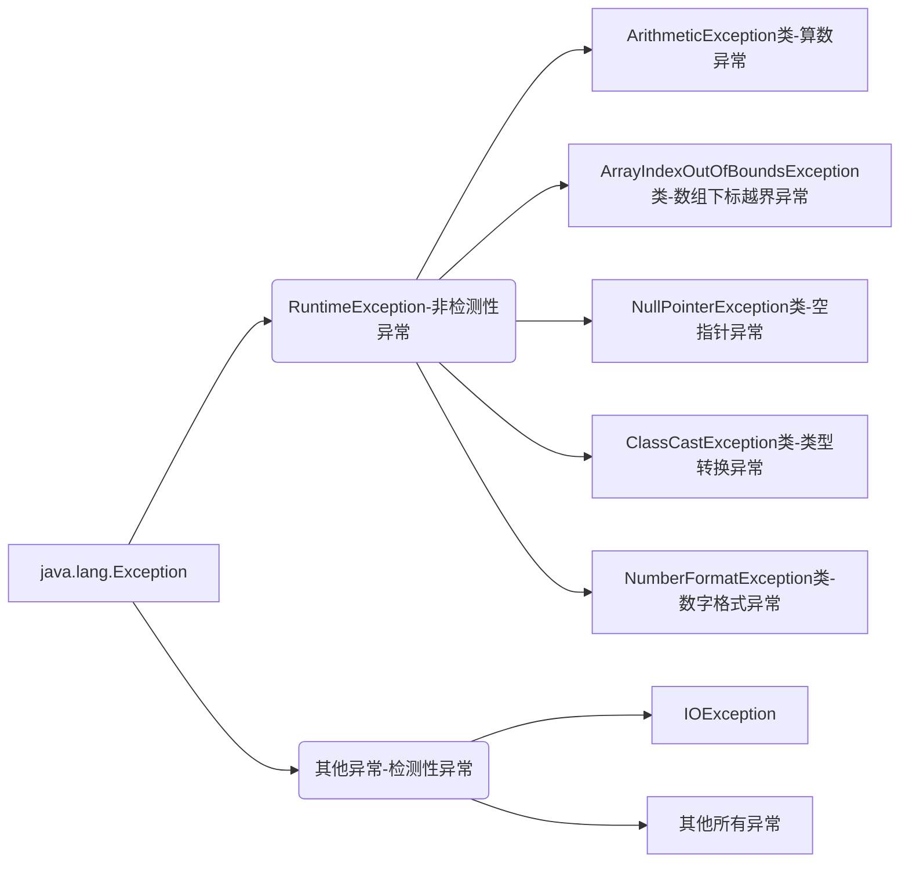
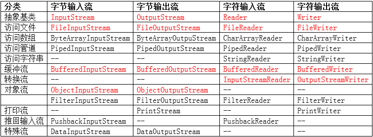
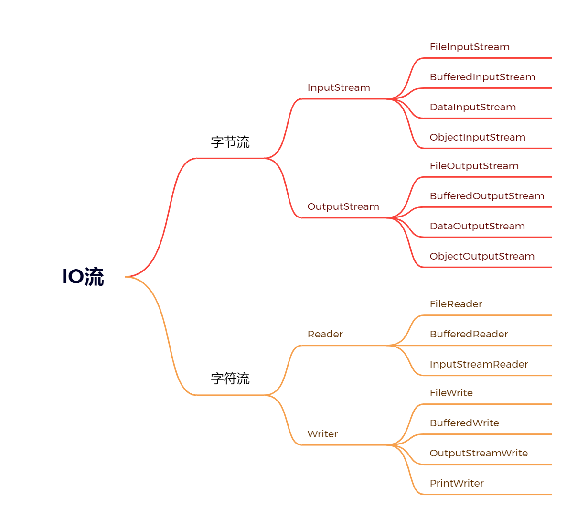
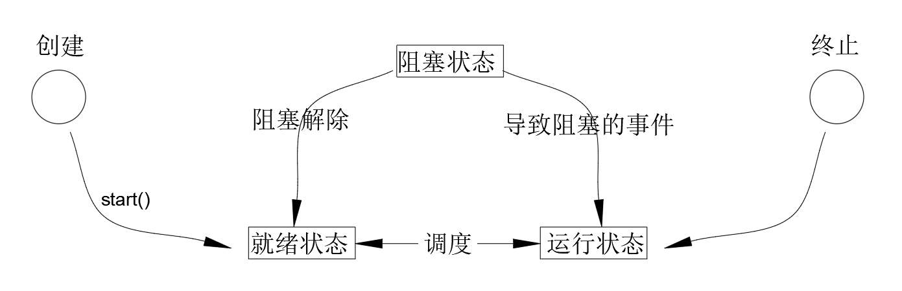
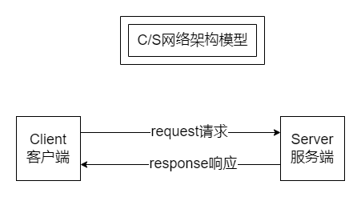
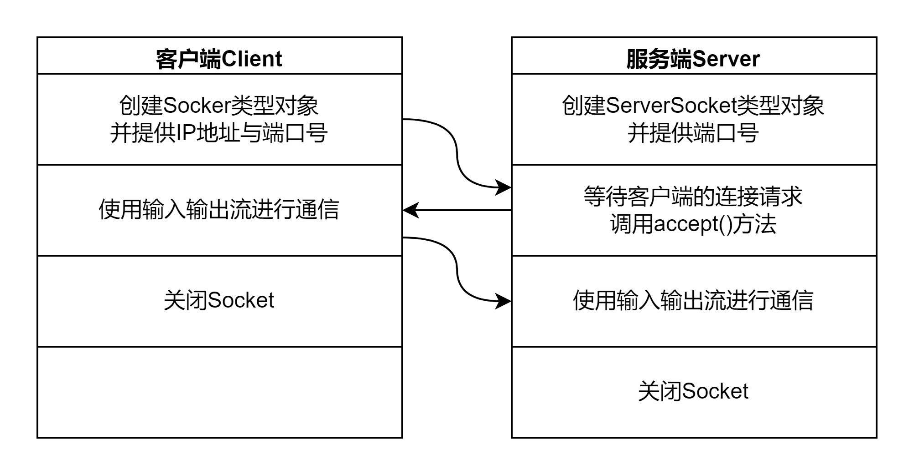
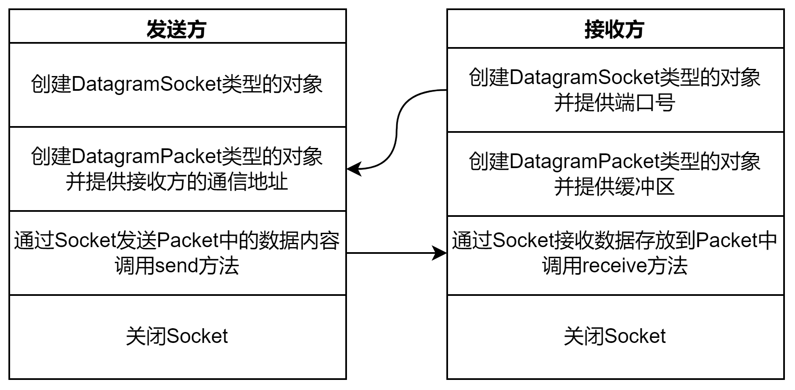

## 异常机制和File类

### 异常机制

#### 概念

-   java中主要指程序执行中发生的不正常情况
-   java.lang.Throwable类是Java语言中错误（Error）和异常（Exception）的超类
-   Error类主要用于描述Java虚拟机无法解决的严重错误，通常无法通过编码解决，故不作讨论
-   Exception主要用于描述因编码错误或偶然外在因素导致的轻微错误，通常可以编码解决

#### 异常的分类



>   注意：当程序执行过程中发生异常但又没有手动处理时，则有Java虚拟机采用默认方式处理异常，而默认处理方式就是：打印异常的名称，异常发生的原因，异常发生的位置以及终止程序

#### 异常的避免

-   在以后的开发中尽量使用if条件判断来避免异常的发生
-   但是过多的if条件判断会导致程序的代码加长、臃肿、可读性差；

#### 异常的捕获

语法格式：

```java
try{
    //可能发生异常的代码
} catch(异常类型 引用变量名){
    //针对该类异常的处理代码
}
...
finally{
    //无论是否发生异常都会执行的代码
}
```

注意事项：

-   当需要编写多个catch分支时，切记小类型应该放到大类型的前面；
-   懒人写法： `catch(Exception e){}`
-   finally通常用于进行善后处理，如：关闭已经打开的文件等

笔试考点：

```java
public static int test(){
    try {
        String st = null;
        st.length();
        return 0;
    } catch (ArrayIndexOutOfBoundsException e){
        e.printStackTrace();
        return 1;
    } finally {
        return 2;	//会提前结束方法并返回值
    }
}

public static void main(String[] args) {
    int t = test();
    System.out.println(t); 		//2
}
```

#### 异常的抛出

概念：在某些特殊情况下有些异常不能处理或者不便于处理时，就可以将该异常转移给该方法的调用者，这种方法叫做异常的抛出。当方法执行时出现异常，则底层生成一个异常类对象抛出，**此时异常代码后续的代码就不再执行**

语法格式：`访问权限 返回值类型 方法名称（形参列表）throws 异常类型1，异常类型2 ... {方法体}`	

```java
// 因为FileNotFoundException是IOException的子类，所以会被覆盖，即多态 
public static void test() throws IOException {
    FileInputStream file = new FileInputStream("d:/a.txt");
    file.close();
}

// 在main方法中不推荐抛出异常， JVM负担过重
public static void main(String[] args) {
    try {
        test();
    } catch (IOException e) {
        throw new RuntimeException(e);
    }
}
```

回顾：方法重写的原则：

1.   要求方法名相同、参数列表相同以及返回值类型相同，从jdk1.5开始支持返回子类类型；
2.   要求方法的访问权限不能变小，可以相同或者变大；
3.   要求方法不能抛出更大的异常

>   子类重写的方法不能抛出更大的异常，不能抛出平级不一样的异常，但可以抛出一样的异常、更小的异常以及不抛出异常

经验：

-   若父类中被重写的方法没有抛出异常时，则子类中重写的方法只能进行异常的捕获处理
-   若方法内部又以递进方式分别调用了好几个其他方法，则建议这些方法内可以使用抛出的方法处理到最后一层进行捕获方式处理

#### 自定义异常

概念：当需要在程序中表达年龄不合理的情况时，而Java官方没有提供这种针对性的异常，此时就需要自定义异常加以描述

流程：

1.   自定义xxxException异常类继承Exception类或者其子类
2.   提供两个版本的构造方法，一个是无参构造方法，另外一个是字符串作为参数的构造方法

异常的产生：

-   `throw new 异常类型(实参);`

-   例：`throw new ageException("年龄不合理")；`

>   Java采用的异常处理机制是将异常处理的程序代码集中在一起，与正常的程序代码分开，使得程序简洁、优雅、并易于维护

```java
//-------------自定义异常类AgeException---------
public class AgeException extends Exception{
    public AgeException() {
    }

    public AgeException(String message) {
        // 通过传入的参数来使用父类的输出
        super(message);
    }
}

//-------------People类，使用自定义异常-----------
public class People {
    private int age;
    public People() {
    }
    public People(int age) {
       setAge(age);
    }
    public int getAge() {
        return age;
    }

    public void setAge(int age) {
        if (age > 0 && age < 150) {
            this.age = age;
        } else {
            try {
                //调用异常，同时需要对异常进行处理
                throw new AgeException("年龄不合理啊！");
            } catch (AgeException e) {
                e.printStackTrace();
            }
        }
    }
}

//-------------People的实现类，用于测试-------
public class PeopleTest {
    public static void main(String[] args) {
        People p = new People(300);
        System.out.println(p.getAge());
        //AgeException: 年龄不合理啊！
    }
}
```

### File类（重点）

#### 概念

java.io.File类主要用于描述文件或目录路径的抽象表示信息，可以获取文件或目录的特征信息，如：大小等

#### 常用的方法


| 方法声明                                | 功能概述                                     |
| --------------------------------------- | -------------------------------------------- |
| **File**(String pathname)               | 根据参数指定的路径名来构造对象               |
| File(String parent, String child)       | 根据参数指定的父路径和子路径信息构造对象     |
| File(File parent, String child)         | 根据参数指定的父抽象路径和子路径信息构造对象 |
| boolean **exists**()                    | 测试此抽象路径名表示的文件或目录是否存在     |
| String **getName**()                    | 用于获取文件的名称                           |
| long **length**()                       | 返回由此抽象路径名表示的文件的长度           |
| long **lastModified**()                 | 用于获取文件的最后一次修改时间               |
| String **getAbsolutePath**()            | 用于获取绝对路径信息                         |
| boolean **delete**()                    | 用于删除文件，当删除目录时要求是空目录       |
| boolean **createNewFile**()             | 用于创建新的空文件                           |
| boolean **mkdir**()                     | 用于创建目录                                 |
| boolean **mkdirs**()                    | 用于创建多级目录                             |
| File[] **listFiles**()                  | 获取该目录下的所有内容                       |
| boolean **isFile**()                    | 判断是否为文件                               |
| boolean **isDirectory**()               | 判断是否为目录                               |
| File[] **listFiles**(FileFilter filter) | 获取目录下满足筛选器的所有内容               |

```java
public static void show(File files){
    File[] fList = files.listFiles();
    System.out.println();
    for (File tf : fList){
        if (tf.isFile()){ // 如果是文件直接打印，目录则加上标志便于区分
            System.out.print(tf.getName() + "  ");
        } else {
            System.out.print(" <" + tf.getName() + "> ");
            show(tf);
        }
    }
}

public static void main(String[] args) throws IOException {
    File f1 = new File("E:/java.md");
    if (f1.exists()){
        System.out.println("文件名称：" + f1.getName());
        System.out.println("文件大小：" + f1.length());
        Date d1 = new Date(f1.lastModified());
        SimpleDateFormat sdf = new SimpleDateFormat("y-M-d H-m-s");
        System.out.println("最后一次修改时间：" + sdf.format(d1));
        System.out.println(f1.delete() ? "文件删除成功" : "文件删除失败");
    } else {
        System.out.println(f1.createNewFile() ? "文件创建成功" : "文件创建失败");
    }

    File f2 = new File("E:/A/B/C"); // 创建一个多层目录
    if (f2.exists()){
        System.out.println("目录绝对路径：" + f2.getAbsolutePath());
        System.out.println(f2.delete() ? "目录删除成功" : "目录删除失败"); //只删一层
    } else {
        //System.out.println(f2.mkdir() ? "目录创建成功" : "目录创建失败");
        System.out.println(f2.mkdirs() ? "多级目录创建成功" : "目录创建失败");
    }

    File f3 = new File("E:/工程");

    //实现一个目录中下内容的打印，使用过滤器进行过滤
    //编写过滤器, 使用匿名内部类
    /*FileFilter fileFilter = new FileFilter() {
            @Override
            public boolean accept(File pathname) {
                // 只返回带有.py后缀的文件名
                return pathname.getName().endsWith(".py");
            }
        };*/
    // 推荐使用lambda表达式
    FileFilter fileFilter = (File pathname) -> {return pathname.getName().endsWith(".py");};
    File[] fList2 = f3.listFiles(fileFilter);
    System.out.println(Arrays.toString(fList2));

    // 实现一个目录以及子目录下的所有内容的打印
    show(f3);
}
```

### IO流

概念：指读写数据时想流水一样从一端到另外一段

#### 基本分类

1.   根据读写数据的基本单位不同，分为字节流和字符流
     -   字节流：以字节为单位进行数据读写的流，可以读写任意类型的文件
     -   字符流：以字符（两个字节）为单位的流，只能读写文本文件
2.   根据读写数据的方向不同，分为 输入流 和输出流
     -   输入流：读文件，数据从文件输入到程序中
     -   输出流：写文件，数据从程序输出到文件中
3.   根据流的角色不同，分为节点流和处理流
     -   节点流：指直接和输入输出源对接的流
     -   处理流：需要建立再节点流的基础之上的流

#### 体系结构



重点：

#### FileWriter类（重点）

概念：java.io.FIleWriter类主要用于将文本内容写入到文本文件

常用方法：

| 方法声明                                    | 功能介绍                                                    |
| ------------------------------------------- | ----------------------------------------------------------- |
| FileWriter(String fileName)                 | 根据参数指定的文件名构造对象                                |
| FileWriter(String fileName, boolean append) | 以追加的方式根据参数指定的文件名来构造对象                  |
| void write(int c)                           | 写入单个字符                                                |
| void write(char[] cbuf, int off, int len)   | 将指定字符数组中从偏移量off开始的len个字符写入此 文件输出流 |
| void write(char[] cbuf)                     | 将cbuf.length个字符从指定字符数组写入此文件输出 流中        |
| void flush()                                | 刷新流                                                      |
| void close()                                | 关闭流对象并释放有关的资源                                  |

#### FileReader类（重点）

概念：java.io.FileReader类主要用于从文本文件读取文本数据内容

常用的方法：

```java
public static void main(String[] args) {
    FileReader fr = null;
    FileWriter fw = null;
    try {
        fr = new FileReader("E:/b.txt");
        fw = new FileWriter("E:/c.txt");
        int res = 0;
        System.out.println("开始复制文件中...");
        while ((res = fr.read()) != -1){
            fw.write(res);
        }
        System.out.println("复制完成！");
    } catch (IOException e) {
        e.printStackTrace();
    } finally {
        if (null != fw && null != fr){
            try {
                fw.close();
                fr.close();
            } catch (IOException e) {
                e.printStackTrace();
            }
        }
    }
}
```


#### FileOutputStream类（重点）

概念：java.io.FileOutputStream类主要用于将图像数据之类的原始字节流写入到输出流中

常用的方法：

| 方法声明                                      | 功能介绍                                                    |
| --------------------------------------------- | ----------------------------------------------------------- |
| FileOutputStream(String name)                 | 根据参数指定的文件名来构造对象                              |
| FileOutputStream(String name, boolean append) | 以追加的方式根据参数指定的文件名来构造对象                  |
| void write(int b)                             | 将指定字节写入此文件输出流                                  |
| void write(byte[] b, int off, int len)        | 将指定字节数组中从偏移量off开始的len个字节写入 此文件输出流 |
| void write(byte[] b)                          | 将 b.length 个字节从指定字节数组写入此文件输出 流中         |
| void flush()                                  | 刷新此输出流并强制写出任何缓冲的输出字节                    |
| void close()                                  | 关闭流对象并释放有关的资源                                  |

#### FileInputStream类（重点）

概念：java.io.FileInputStream类主要用于从输入流中以字节流的方式读取图像数据等

常用的方法：

```java
public static void main(String[] args) {
    long l1 = System.currentTimeMillis();
    FileInputStream fis = null;
    FileOutputStream fos = null;
    try {
        fis = new FileInputStream("E:/Wordpress 网站.mp4");
        fos = new FileOutputStream("E:/test.mp4");
        System.out.println("开始复制视频。。。");
        /*
        int res;
            方法一：视频一个字节一个字节复制，但是过于缓慢，大文件不建议使用
            while ((res = fis.read()) != -1){
                fos.write(res);
            }*/
        /*方法二：大文件复制可以创建一个与文件一样大小的缓冲区，直接一次性复制，速度更快
          但是当文件过大时，无法申请一样大小的缓存区，真实内存不够
            int av = fis.available();
            byte[] bArr = new byte[av];
            fos.write(bArr);*/
        // 方法三：准备一个合适大小的缓冲区，大小为1024的倍数
        byte[] bArr = new byte[1024];
        int res=0;
        while ((res = fis.read(bArr)) != -1){
            fos.write(bArr,0,res);
        }
        System.out.println("复制完成！");
    } catch (IOException e) {
        e.printStackTrace();
    } finally {
        if (null != fos && null != fis){
            try {
                fos.close();
                fis.close();
            } catch (IOException e) {
                e.printStackTrace();
            }
        }
    }
    long l2 = System.currentTimeMillis();
    System.out.println("复制时间是：" + (l2-l1));
}
```

#### BufferedOutputStream类（重点）

概念：java.io.BufferedOutputStream类主要用于描述缓冲输出流，此时不用为写入的每个字节调用底层系统

常用的方法：

| 方法声明                                         | 功能介绍                                  |
| ------------------------------------------------ | ----------------------------------------- |
| BufferedOutputStream(OutputStream out)           | 根据参数指定的引用来构造对象              |
| BufferedOutputStream(OutputStream out, int size) | 根据参数指定的引用和缓冲区大小来构造 对象 |
| void write(int b)                                | 写入单个字节                              |
| void write(byte[] b, int off, int len)           | 写入字节数组中的一部分数据                |
| void write(byte[] b)                             | 写入参数指定的整个字节数组                |
| void flush()                                     | 刷新流                                    |
| void close()                                     | 关闭流对象并释放有关的资源                |

#### BufferedInputStream类（重点）

概念：java.io.BufferedInputStream类主要用于描述缓冲输入流

常用的方法：

```java
long l1 = System.currentTimeMillis();
// 文件的读入流和输出流
BufferedInputStream bis = null;
BufferedOutputStream bos = null;
try {
    bis = new BufferedInputStream(new FileInputStream("E:/Wordpress 网站.mp4"));
    bos = new BufferedOutputStream(new FileOutputStream("E:/a.mp4"));

    byte[] bArr = new byte[1024];
    int res = 0;
    // bis.read方法，如果读到末尾，就返回-1，一次读取的长度为bArr
    while ((res = bis.read(bArr)) != -1){
        bos.write(bArr,0,res);
    }
} catch (IOException e) {
    e.printStackTrace();
} finally {
    if (null != bos && null != bis) {
        try {
            bos.close();
            bis.close();
        } catch (IOException e) {
            e.printStackTrace();
        }
    }
}
long l2 = System.currentTimeMillis();
System.out.println("时间是：" + (l2-l1));
}
```

#### BufferedWriter类（重点）

概念：java.io.BufferedWriter类主要用于写入单个字符、字符数组以及字符串到输出流

常用的方法：

| 方法声明                                  | 功能介绍                                              |
| ----------------------------------------- | ----------------------------------------------------- |
| BufferedWriter(Writer out)                | 根据参数指定的引用来构造对象                          |
| BufferedWriter(Writer out, int sz)        | 根据参数指定的引用和缓冲区大小来构造对象              |
| void write(int c)                         | 写入单个字符到输出流中                                |
| void write(char[] cbuf, int off, int len) | 将字符数组cbuf中从下标off开始的len个字符写入输出流 中 |
| void write(char[] cbuf)                   | 将字符串数组cbuf中所有内容写入输出流中                |
| void write(String s, int off, int len)    | 将参数s中下标从off开始的len个字符写入输出流中         |
| void write(String str)                    | 将参数指定的字符串内容写入输出流中                    |
| void newLine()                            | 用于写入行分隔符到输出流中                            |
| void flush()                              | 刷新流                                                |
| void close()                              | 关闭流对象并释放有关的资源                            |

#### BufferedReader类（重点）

概念：java.io.BufferedReader类主要用于从输入流中读取单个字符、字符数组以及字符串

常用的方法：

```java
public static void main(String[] args) {
    BufferedReader br = null;
    BufferedWriter bw = null;
    try {
        br = new BufferedReader(new FileReader("E:/a.txt"));
        bw = new BufferedWriter(new FileWriter("E:/b.txt"));
        String st = null;
        // 如果当前行不为空，则在另一个文件中写入当前行
        while ((st = br.readLine()) != null){
            bw.write(st + "\n");
        }
    } catch (IOException e) {
        e.printStackTrace();
    } finally {
        if (bw != null && null != br){
            try {
                bw.close();
                br.close();
            } catch (IOException e) {
                e.printStackTrace();
            }
        }
    }
}
```

#### PrintStream类

概念：java.io.PrintStream类主要用于更加方便地打印各种数据内容。使用了构造方法传入一个输出对象之后，可以使用对象.print之类的方式往其中写入东西

常用的方法：

| 方法声明                      | 功能介绍                           |
| ----------------------------- | ---------------------------------- |
| PrintStream(OutputStream out) | 根据参数指定的引用来构造对象       |
| void print(String s)          | 用于将参数指定的字符串内容打印出来 |
| void println(String x)        | 用于打印字符串后并终止该行         |
| void flush()                  | 刷新流                             |
| void close()                  | 用于关闭输出流并释放有关的资源     |

#### PrintWriter类

概念：java.io.PrintWriter类主要用于将对象的格式化形式打印到文本输出流

常用的方法：

```java
//不断地提示用户输入要发送的内容，若发送的内容是"bye"则聊天结束，否则将用户输入的内容写入到文件d:/a.txt中。
//要求使用BufferedReader类来读取键盘的输入 System.in代表键盘输入
//要求使用PrintStream类负责将数据写入文件

public static void main(String[] args) {
    BufferedReader br = null;
    PrintStream ps = null;
    try {
        br = new BufferedReader(new InputStreamReader(System.in));
        ps = new PrintStream("d:/a.txt");
        while (true) {
            System.out.println("请输入你要发送的内容：");
            String str = br.readLine();
            if ("bye".equals(str)){
                System.out.println("聊天结束");
                break;
            }
            ps.println(str);
        }
    } catch (IOException e) {
        e.printStackTrace();
    } finally {
        if (null != ps && null != br){
            ps.close();
            try {
                br.close();
            } catch (IOException e) {
                e.printStackTrace();
            }
        }
    }
}
```

#### OutputStreamWriter类

概念：java.io.OutputStreamWriter类主要用于实现从字符流到字节流的转换

常用的方法：

| 方法声明                                                 | 功能介绍                          |
| -------------------------------------------------------- | --------------------------------- |
| OutputStreamWriter(OutputStream out)                     | 根据参数指定的引用来构造对象      |
| OutputStreamWriter(OutputStream out, String charsetName) | 根据参数指定的引用和编码构造 对象 |
| void write(String str)                                   | 将参数指定的字符串写入            |
| void flush()                                             | 刷新流                            |
| void close()                                             | 用于关闭输出流并释放有关的资 源   |

#### InputStreamReader类

概念：java.io.InputStreamReader类主要用于实现从字节流到字符流的转换

常用的方法：

`InputStreamReader(InputStream in) ; `

`InputStreamReader(InputStream in , String charsetName);`

`int read(char[] cbuf)` ;  `void close();`

#### DataOutputStream类（了解）

概念：java.io.DataOutputStream类主要用于以适当的方式将基本数据类型写入到输出流中

常用的方法：

| 方法声明                           | 功能介绍                                                     |
| ---------------------------------- | ------------------------------------------------------------ |
| DataOutputStream(OutputStream out) | 根据参数指定的引用构造对象 OutputStream类是个抽象 类，实参需要传递子类对象 |
| void writeInt(int v)               | 用于将参数指定的整数一次性写入输出流，优先写入高字 节        |
| void close()                       | 用于关闭文件输出流并释放有关的资源                           |

#### DataInputStream类（了解）

概念：java.io.DataInputStream类主要用于从输入流中读取基本数据类型的数据

常用的方法：

`DataInputStream(InputStream in)` ；

`int readInt() `; `void close()`

#### ObjectOutputStream类（重点）

概念：

-   java.io.ObjectOutputStream类主要用于将一个对象的所有内容整体写入到输出流中
-   只能将支持java.io.Serializable接口的对象写入流中
-   类通过实现java.io.Serializable接口以启动其序列化功能
-   所谓序列化主要指将一个对象需要存储的相关信息组织成字节序列的转换过程

常用的方法：

| 方法声明                             | 功能介绍                               |
| ------------------------------------ | -------------------------------------- |
| ObjectOutputStream(OutputStream out) | 根据参数指定的引用来构造对象           |
| void writeObject(Object obj)         | 用于将参数指定的对象整体写入到输出流中 |
| void close()                         | 用于关闭输出流并释放有关的资源         |

#### ObjectInputStream类（重点）

概念：

-   java.io.ObjectInputStream类主要用于从输入流一次性将对象整体读取出来
-   需要反序列化，序列化的逆过程

常用的方法：

`ObjectInputStream(InputStream in)`

`Object readObject() `;  `void close()`

```java
// --------一个用于测试的user类-----------------
public class User implements java.io.Serializable{
    @Serial
    private static final long serialVersionUID = 5497931932420790885L;

    private String userName;
    private String password;
    private transient String phoneNum; // 不参与序列化
    ...
}

// ----------ObjectOutputStreamTest类---------
public static void main(String[] args) {
    ObjectOutputStream oos = null;
    try {
        // 创建一个objectOutputStream类与某一文件关联
        oos = new ObjectOutputStream(new FileOutputStream("d:/a.txt"));
        // 准备一个user类并初始化
        User u1 = new User("fusi","helloWorld","110");
        // 将对象传入到ObjectOutputStream类中，写入到文件中
        oos.writeObject(u1);
    } catch (IOException e) {
        throw new RuntimeException(e);
    } finally {
        // 关闭资源
        if (null != oos){
            try {
                oos.close();
            } catch (IOException e) {
                e.printStackTrace();
            }
        }
    }
}

// ----------ObjectInputStreamTest类---------
// 此处简化，不写异常处理
public static void main(String[] args) {
    ObjectInputStream ois = new ObjectInputStream(new FileInputStream("d:/a.txt"));
    Object o = ois.readObject();
    System.out.println("获取到的对象是：" + o);
    ois.close();
}
```

序列化版本号：

序列化机制是通过在运行时判断类的serialVersionUID来验证版本一致性的，进行反序列化的时候，如果一致则进行，不一致则异常

transient关键字：

用于表示一个域不是该对象串行化的一部分。当一个对象被串行化的的时候，transient型变量的值不包括在串行化的表示中

经验：

当希望将多个对象写入文件时，通常建议将多个对象放入到一个集合中，然会将集合这个整体看作一个对象写入输出流中，避免通过返回值进行是否达到文件末尾的判断

#### RandomAccessFile类

概念：java.io.RandomAccessFile类主要支持对随机访问文件的读写操作

常用的方法：

| 方法声明                                   | 功能介绍                                                     |
| ------------------------------------------ | ------------------------------------------------------------ |
| RandomAccessFile(String name, String mode) | 根据参数指定的名称和模式构造对象 r: 以只读方式打开 rw：打开以便读取和写入 rwd:打开以便读取和写入，同步文件内容的更新 rws:打开以便读取和写入，同步文件内容和元数据 的更新 |
| int read()                                 | 读取单个字节的数据                                           |
| void seek(long pos)                        | 用于设置从此文件的开头开始测量的文件指针偏移 量              |
| void write(int b)                          | 将参数指定的单个字节写入                                     |
| void close()                               | 用于关闭流并释放有关的资源                                   |

## 多线程

### 概念：

基本概念：进程时资源分配的最小单位，线程是CPU调度的最小单位

理解：借用知乎上的比喻：进程=火车，线程=车厢

-   线程在进程下进行
-   一个进程可以包含多个线程
-   不同进程间数据很难共享，而同一进程下不同线程之间数据很易共享
-   进程减不会相互影响，一个线程挂掉将导致整个进程挂断

### 线程的创建（重中之重）

#### Thread类的概念

-   java.lang.Thread类代表线程，任何线程对象都是Thread类（子类）的实例
-   Thread类是线程的模板，封装了复杂的线程开启等操作

#### 创建方式

1.   自定义类继承Thread类并重写run方法，然后创建该类的对象调用start方法

     ```java
     // -------------一个创建了的线程------------------
     public class SubThreadRun extends Thread{
         @Override
         public void run() {
             for (int i=0 ; i<5 ; i++){
                 System.out.println("run（线1）中的输出是：" + i);
             }
         }
     }
     
     // -------------一个线程的实现类------------------
     public class SubThreadRunTest {
     
         public static void main(String[] args) {
             Thread tr = new SubThreadRun();
             // run方法相当于对普通成员方法的调用，一个执行完才会接着执行下一个：tr.run();
             // start方法会在main之外再启用一个tr线程，Java虚拟机会自动调用该方法中的run方法
             tr.start();
     
             for (int i=0 ; i<5 ; i++){
                 System.out.println("main（线2）中的输出是：" + i);
             }
         }
     }
     ```

     

2.   自定义类实现Runnable接口并重写run方法，创建该类的对象作为实参来构造Thread类型的对象，然后使用Thread类型的对象调用start方法

     ```java
     // -------------一个创建了的线程------------------
     public class SubRunnableRun implements Runnable{
         @Override
         public void run() {
             for (int i=0 ; i<5 ; i++) {
                 System.out.println("run中的输出是：" + i);
             }
         }
     }
     
     // -------------一个线程的实现类------------------
     public class SubRunnableRunTest {
         public static void main(String[] args) {
             //创建一个实现了Runnable类的对象
             SubRunnableRun srr = new SubRunnableRun();
             //创建一个Thread类型的对象，使用上面的对象作为实参
             Thread tr = new Thread(srr);
             tr.start();
     
             for (int i=0 ; i<5 ; i++) {
                 System.out.println("main中的输出是：" + i);
             }
         }
     }
     ```

#### 相关方法

| 方法声明                             | 功能介绍                                                     |
| ------------------------------------ | ------------------------------------------------------------ |
| Thread()                             | 使用无参的方式构造对象                                       |
| Thread(String name)                  | 根据参数指定的名称来构造对象                                 |
| Thread(Runnable target)              | 根据参数指定的引用来构造对象，其中Runnable是个接口类 型      |
| Thread(Runnable target, String name) | 根据参数指定引用和名称来构造对象                             |
| void run()                           | 若使用Runnable引用构造了线程对象，调用该方法时最终调 用接口中的版本 若没有使用Runnable引用构造线程对象，调用该方法时则啥 也不做 |
| void start()                         | 用于启动线程，Java虚拟机会自动调用该线程的run方法            |

#### 执行流程

1.   执行main方法的线程叫做主线程，执行run方法的线程叫做新线程/子线程
2.   当start方法调用成功之后，线程数+1，新启动的线程去执行run方法的代码，主线程继续向下执行
3.   当run方法执行完毕后子线程结束，当main方法执行完毕后主线程结束
4.   两个线程执行没有明确的先后执行次序，由系统调度算法来决定

#### 方式的比较

|      | 优点           | 缺点             |
| ---- | -------------- | ---------------- |
| 继承 | 代码简单       | 没办法继承其他类 |
| 接口 | 可以继承其他类 | 代码复杂         |

当然，也可以使用匿名内部类的方式来创建和启动线程

```java
// 使用匿名内部类的方式,此处简化了代码
// 简化的思路是：既然实例化之后还要引用.方法，不如直接使用实例.方法
new Thread() {
    @Override
    public void run(){
        System.out.println("你好啊，哈瑞");
    }
}.start();

// 使用匿名内部接口的方式，同样简化了代码
Runnable ra = () -> System.out.println("你好啊，杰西");
new Thread(ra).start();
// 或者，简化到一行代码
new Thread(() -> System.out.println("你好啊，杰西")).start();
```

#### 线程的生命周期（熟悉）



-   新建状态 - 使用new关键字创建之后进入的状态，此时线程并没有开始执行。
-   就绪状态 - 调用start方法后进入的状态，此时线程还是没有开始执行。
-   运行状态 - 使用线程调度器调用该线程后进入的状态，此时线程开始执行，当线程的时间片执行完毕后任务没有完成时回到就绪状态。
-   消亡状态 - 当线程的任务执行完成后进入的状态，此时线程已经终止。
-   阻塞状态 - 当线程执行的过程中发生了阻塞事件进入的状态，如：sleep方法。阻塞状态解除后进入就绪状态  

#### 线程的编号和名称（熟悉）

| 方法声明                      | 功能介绍                            |
| ----------------------------- | ----------------------------------- |
| long getId()                  | 获取调用对象所表示线程的编号        |
| String getName()              | 获取调用对象所表示线程的名称        |
| void setName(String name)     | 设置/修改线程的名称为参数指定的数值 |
| static Thread currentThread() | 获取当前正在执行线程的引用          |

```java
/**
 * 案例：
 * 自定义类继承Thread类并重写run方法，在run方法中先打印当前线程的编号和名称，然后将线程
 * 的名称修改为"zhangfei"后再次打印编号和名称。
 * 要求在main方法中也要打印主线程的编号和名称
 */
public class ThreadGetNameId {

    public static void main(String[] args) {
        new Thread() {
            @Override
            public void run(){
                System.out.print("--继承子线程的编号：" + getId())
                System.out.println("  继承子线程的名称：" + getName());
                setName("hello");
                System.out.println("--修改后继承子线程的名称：" + getName());
            }
        }.start();

        Runnable r = new Runnable() {
            @Override
                public void run() {
                Thread t1 = Thread.currentThread();
                System.out.print("**接口子线程的编号：" + t1.getId())
                System.out.println("  接口子线程的名称：" + t1.getName());
                t1.setName("hello");
                System.out.println("**修改接口子线程的名称：" + t1.getName());
            }
        };
        new Thread(r).start();

        Thread t2 = Thread.currentThread();
        System.out.print("主线程的编号：" + t2.getId())
        System.out.println("  主线程的名称：" + t2.getName());
        t2.setName("hello");
        System.out.println("修改后主线程的名称：" + t2.getName());
    }
}
```

#### 常用的方法（重点）

| 方法声明                          | 功能介绍                                                     |
| --------------------------------- | ------------------------------------------------------------ |
| static void yield()               | 当前线程让出处理器（离开Running状态），使当前线程进入Runnable 状态等待 |
| static void sleep(times)          | 使当前线程从 Running 放弃处理器进入Block状态, 休眠times毫秒, 再返 回到Runnable如果其他线程打断当前线程的Block(sleep), 就会发生 InterruptedException。 |
| int getPriority()                 | 获取线程的优先级                                             |
| void setPriority(int newPriority) | 修改线程的优先级。 优先级越高的线程不一定先执行，但该线程获取到时间片的机会会更多 一些 |
| void join()                       | 等待该线程终止                                               |
| void join(long millis)            | 等待参数指定的毫秒数                                         |
| boolean isDaemon()                | 用于判断是否为守护线程                                       |
| void setDaemon(boolean on)        | 用于设置线程为守护线程                                       |

```java
/**
 * 案例：创建两个线程，一个打印奇数，一个打印偶数
 * 在main方法中同时启动，主线程等待两个线程终止
 */

public class ThreadTwoTest implements Runnable{
    @Override
    public void run() {
        for (int i = 1 ; i < 20 ; i += 2){
            System.out.println("线程1中的i=" + i);
        }
    }

    public static void main(String[] args) {
        ThreadTwoTest ttt = new ThreadTwoTest();
        Thread t1 = new Thread(ttt);

        Thread t2 = new Thread() {
            @Override
            public void run(){
                for (int i = 2 ; i < 20 ; i += 2){
                    System.out.println("**线程2中的i=" + i);
                }
            }
        };

        t1.start();
        t2.start();

        System.out.println("主线程开始等待。。。");
        try {
            t1.join();
            t2.join();
        } catch (InterruptedException e) {
            throw new RuntimeException(e);
        }
        System.out.println("主线程等待结束");
    }
}
```

#### 线程同步机制（重点）

##### 概念：

-   当多个线程同时访问同一个共享资源时，可能会出现问题，此时就需要对线程之间进行通信和协调，该机制叫做线程的同步机制
-   异步操作：多线程并发的操作
-   同步操作：多线程串行的操作

##### 解决方案：

把只能单线程操作的部分，从并发操作改为串行操作

##### 实现方式：

使用synchronized关键字来实现同步/对象锁机制从而保证线程执行的原子性

1.   使用同步代码块的方式实现部分代码的锁定

     `synchronized(类类型的引用){所有需要锁定的代码；}`

2.   使用同步方法的方式实现所有代码的锁定

     直接使用synchronized关键字修饰整个方法即可：

     `synchronized(this){整个方法体的代码}`

##### 静态方法的锁定：

当我们对一个静态方法加锁时（`synchronized static`），那么该方法锁的对象是类对象，每个类都有唯一的一个类对象，获取类对象的方式：类名.class

静态方法与非静态方法同时使用了synchronized后他们之间是非互斥的关系。原因在于：静态方法锁的是类对象而非静态方法锁的是当前方法所属对象

##### 注意事项：

使用synchronized应注意：

1.   多个需要同步的线程在访问同步块时，看到的应该是同一个锁对象引用
2.   在使用同步块时应当尽量减少同步范围以提高并发的执行效率

##### 线程安全类和不安全类

-   StringBuffer类是线程安全的类，但StringBuffer类是线程安全的类，但StringBuilder类不是线程安全的类
-   Vector类和Hashtable类是线程安全的类，但ArrayList类和HashMap类不是线程安全的类
-   Collections.synchronizedList()和Collections.synchronizedMap()等方法实现安全

#### 使用Lock(锁)实现线程同步

概念：

-   java5开始提供更强大的线程同步机制--使用显式定义的同步锁对象来实现
-   java.util.concurrent.locks.Lock接口是控制多个线程对共享资源进行访问的工具
-   该接口的主要实现类是ReentrantLock类，该类拥有与synchronized相同的并发性，在以后的线程安全控制中，经常使用ReentrantLock类显示加锁和释放锁

常用的概念：

| 方法声明        | 功能介绍             |
| --------------- | -------------------- |
| ReentrantLock() | 使用无参方法构造对象 |
| void lock()     | 获取锁               |
| void unlock()   | 释放锁               |

与synchronized方式的比较：

-   Lock是显式锁，需要手动实现开启和关闭操作，而synchronized是隐式锁，执行锁定代码后自动释放
-   Lock性能更好

#### Object类常用的方法

| 方法声明                | 功能介绍                                                     |
| ----------------------- | ------------------------------------------------------------ |
| void wait()             | 用于使得线程进入等待状态，直到其它线程调用notify()或notifyAll()方 法 |
| void wait(long timeout) | 用于进入等待状态，直到其它线程调用方法或参数指定的毫秒数已经过 去为止 |
| void notify()           | 用于唤醒等待的单个线程                                       |
| void notifyAll()        | 用于唤醒等待的所有线程                                       |

案例：生产者消费者模型

.assets/01 生产者消费者模型.png)

```java
// -----------------------仓库类------------------------
public class StoreHouse {
    private int cnt = 0;
    public synchronized void productionBox() {
        if (cnt >= 0 && cnt < 10) {
            cnt++;
            System.out.println("生产一个产品，当前产品数：" + cnt);
            notify();
        } else {
            try {
                wait();
            } catch (InterruptedException e) {
                throw new RuntimeException(e);
            }
        }
    }

    public synchronized void consumerBox() {
        if (cnt > 0 && cnt <= 10) {
            cnt--;
            System.out.println("卖出一个产品，当前产品数：" + cnt);
            notify();
        } else {
            try {
                wait();
            } catch (InterruptedException e) {
                throw new RuntimeException(e);
            }
        }
    }
}

// -----------------------生产者类------------------------
public class ProductionThread extends Thread{
    private StoreHouse storeHouse;
    public ProductionThread(StoreHouse storeHouse) {
        this.storeHouse = storeHouse;
    }

    @Override
    public void run(){
        while (true){
            storeHouse.productionBox();
            try {
                Thread.sleep(100);
            } catch (InterruptedException e) {
                throw new RuntimeException(e);
            }
        }
    }
}
// -----------------------消费者类-----------------------
public class ConsumerThread extends Thread{
    private StoreHouse storeHouse;
    public ConsumerThread(StoreHouse storeHouse) {
        this.storeHouse = storeHouse;
    }

    @Override
    public void run(){
        while (true){
            storeHouse.consumerBox();
            try {
                Thread.sleep(1000);
            } catch (InterruptedException e) {
                throw new RuntimeException(e);
            }
        }
    }
}
// -----------------------测试类-----------------------
public class StoreHouseTest {
    public static void main(String[] args) {
        StoreHouse storeHouse = new StoreHouse();
        ProductionThread pt = new ProductionThread(storeHouse);
        ConsumerThread ct = new ConsumerThread(storeHouse);
        pt.start();
        ct.start();
    }
}
```

#### 线程池（熟悉）

##### 实现Callable接口

说明：第三种实现创建线程的方式：java.util.concurrent.Callable接口

特点：有返回值

常用的方法：

| 方法声明 | 功能介绍       |
| -------- | -------------- |
| V call() | 计算结果并返回 |

##### FutureTark类

说明：java.util.concurrent,FutureTask类用于描述可取消的异步运算

| 方法声明                      | 功能介绍                             |
| ----------------------------- | ------------------------------------ |
| FutureTask(Callable callable) | 根据参数指定的引用来创建一个未来任务 |
| V get()                       | 获取call方法计算的结果               |

```java
public class ThreadCallableTest implements Callable {
    @Override
    public Object call() throws Exception {
        return null;
    }

    public static void main(String[] args) {
        // 创建一个任务
        ThreadCallableTest tct = new ThreadCallableTest();
        // 把任务改造成线程池模式
        FutureTask ft = new FutureTask(tct);
        // 创建任务，启动
        Thread t = new Thread(ft);
        t.start();
        Object o = ft.get();	//此处需要处理异常 
    }
}
```

##### 线程池概念

如果访问服务器的客户端很多，如果服务器为每个客户不停的创建和销毁线程，会严重影响服务器的性能

概念：创建一些线程，当服务器接收到一个请求后，从线程池中取出一个空闲的线程为止服务，服务完后不关闭该线程，而是将线程返回到线程池中

##### 相关类和方法：

1.   java.util.concurrent.Executors类
2.   java.util.concurrent.ExecutorService接口

ExecutorService接口是真正的线程池接口，主要实现类是ThreadPoolExecutor。常用方法：

| 方法声明                       | 功能介绍                             |
| ------------------------------ | ------------------------------------ |
| void execute(Runnable command) | 执行任务和命令，通常用于执行Runnable |
| Future submit(Callable task)   | 执行任务和命令，通常用于执行Callable |
| void shutdown()                | 启动有序关闭                         |

## 网络编程

### 七层网络模型

OSI( Open System Interconnect ) , 即开放式系统互联

.assets/v2-2d62ba265be486cb94ab531912aa3b9c_r.jpg)

无论发送数据或者接收数据时，都需要经历上述过程进行打包与拆包

### 相关协议（笔试题）

通信协议：网络中的统一的标准

#### TCP协议：

概念：传输控制协议（Transmission Control Protocol），是一种面向连接的协议，类似于打电话

理解：

-   建立连接 --> 进行通信 --> 断开连接
-   传输前三次握手，传输后四次握手，是一种双全工的字节通信方式，可大数据传输
-   可靠，有序，效率低

#### UDP协议

概念：用户数据报协议（User Datagram Protocol），是一种非面向连接的协议，类似于写信

理解：

-   通信的过程不需要保持连接
-   双全工，数据大小限制在64k内
-   不保证可靠与有序，但效率高

#### IP地址

概念：互联网中的唯一地址标识

查看方式：

-   Windows：dos窗口使用ipconfig命令
-   Unix/Linux：在终端窗口中使用ifconfig命令

本地回环地址：127.0.0.1 主机名：localhost

#### 端口号

IP地址：可以定位到具体某一台设备

端口号：可以定位到该设备中具体某一个进程

端口号是一个16位二进制组成的整数，其中0~1024被系统占用

特殊的端口：

​	HTTP:80	FTP:21	Oracle:1521	MySQL:3306	Tomcat:8080

网络套接字：Socket：即IP地址+端口号

### 基于TCP协议的编程模型（重点）

#### C/S架构的简介



客户端部分：为每个用户所专有的，负责执行前台功能

服务器部分：由多个用户共享的信息与功能，招待后台服务

#### 编程模型



#### 相关类和方法

##### ServerSocket类

功能：java.net.ServerSocket类主要用于描述服务器套接字信息

常用的方法：

| 方法声明               | 功能介绍                       |
| ---------------------- | ------------------------------ |
| ServerSocket(int port) | 根据参数指定的端口号来构造对象 |
| Socket accept()        | 侦听并接收到此套接字的连接请求 |
| void close()           | 用于关闭套接字                 |

##### Socket类

功能：java.net.Socket类主要用于描述客户端套接字，是两台机器间通信的端点

常用的方法：

| 方法声明                       | 功能介绍                       |
| ------------------------------ | ------------------------------ |
| Socket(String host , int port) | 根据指定主机名和端口来构造对象 |
| InputStream getInputStream()   | 用于获取当前套接字的输入流     |
| OutputStream getOutputStream() | 用于获取当前套接字的输出流     |
| void close()                   | 用于关闭套接字                 |

注意事项：

-   客户端Socket与服务器端Socket对应，都包含输入和输出流
-   客户端的socket.getInputStream()连接服务端socket.getOutputStream()
-   服务端的socket.getInputStream()连接客户器socket.getOutputStream()

```java
// 服务端实现
public static void main(String[] args) {
    // 创建一个服务器ss，但是只有一个服务器还不够，缺少传输数据的功能
    ServerSocket ss = null;
    // 创建一个套接字对象，用于传输数据
    Socket a = null;
    // 创建一个输入数据流用于读取客户端的输入
    BufferedReader br = null;
    // 当然若希望能输出，就再创建一个输出数据流
    PrintStream ps = null;

    try {
        ss = new ServerSocket(8888);
        System.out.println("等待客户端的连接。。。");
        // 如果没有接收到客户端的消息，则会阻塞到accept方法这里
        a = ss.accept();
        System.out.println("客户端连接成功！");

        br = new BufferedReader(new InputStreamReader(a.getInputStream()));
        ps = new PrintStream(a.getOutputStream());
        while (true) {
            // ---------------接收信息------------------
            String str = br.readLine();
            System.out.println("收到客户端消息：" + str);
            if ("bye".equals(str)){
                System.out.println("系统已下线");
                break;
            }
            // ---------------发送信息------------------
            ps.println("消息已收到！");
            System.out.println("服务端消息发送成功！");
        }
    } catch (IOException e) {
        e.printStackTrace();
    } finally {
        try {
            assert a != null;
            assert br != null;
            assert ps != null;
            ps.close();
            br.close();
            a.close();
            ss.close();
        } catch (IOException e) {
            e.printStackTrace();
        }
    }
}
```

```java
// 客户端实现
public static void main(String[] args) {
    // 创建一个套接字对象，为了能表示地址，还需要把自己的地址写入进去
    Socket s = null;
    // 创建一个输出流对象，用于发送消息。如果希望从键盘输入，则需要一个扫描器
    PrintStream ps = null;
    Scanner sc = null;
    // 创建一个输入流对象，用于获取消息
    BufferedReader br = null;

    try {
        s = new Socket("127.0.0.1", 8888);
        System.out.println("与服务器成功连接！");

        sc = new Scanner(System.in);
        ps = new PrintStream(s.getOutputStream());
        br = new BufferedReader(new InputStreamReader(s.getInputStream()));
        while (true) {
            // ---------------发送信息------------------
            System.out.println("请输入你要发送的内容：");
            String str = sc.next();
            ps.println(str);
            if ("bye".equals(str)){
                System.out.println("消息结束");
                break;
            }
            // ---------------接收信息------------------
            System.out.println("收到了服务器发出的消息：" + br.readLine());
        }
    } catch (IOException e) {
        throw new RuntimeException(e);
    } finally {
        try {
            assert ps != null;
            assert br != null;
            br.close();
            sc.close();
            ps.close();
            s.close();
        } catch (IOException e) {
            e.printStackTrace();
        }
    }
}
```

### 基于UDP协议的编程模型

#### 编程模型



#### 相关类和相关方法

##### DatagramSocket类

主要用于描述发送和接收数据报的套接字

常用的方法：

| 方法声明                       | 功能介绍                           |
| ------------------------------ | ---------------------------------- |
| DatagramSocket()               | 使用无参的方式构造对象             |
| DatagramSocket(int port)       | 根据参数指定的端口号来构造对象     |
| void receive(DatagramPacket p) | 用于接收数据报存放到参数指定的位置 |
| void send(DatagramPacket p)    | 用于将参数指定的数据报发送出去     |
| void close()                   | 关闭Socket并释放相关资源           |

##### DatagramPacket类

主要用于描述数据报

常用的方法：

| 方法声明                                                     | 功能介绍                                                    |
| ------------------------------------------------------------ | ----------------------------------------------------------- |
| DatagramPacket(byte[] buf, int length)                       | 根据参数指定的数组来构造对象，用于接 收长度为length的数据报 |
| DatagramPacket(byte[] buf, int length, InetAddress address, int port) | 根据参数指定数组来构造对象，将数据报 发送到指定地址和端口   |
| InetAddress getAddress()                                     | 用于获取发送方或接收方的通信地址                            |
| int getPort()                                                | 用于获取发送方或接收方的端口号                              |
| int getLength()                                              | 用于获取发送数据或接收数据的长度                            |

##### InetAddress类

java.net.InetAddress类用于描述互联网通信地址信息

常用的方法：

| 方法声明                                  | 功能介绍                         |
| ----------------------------------------- | -------------------------------- |
| static InetAddress getLocalHost()         | 用于获取当前主机的通信地址       |
| static InetAddress getByName(String host) | 根据参数指定的主机名获取通信地址 |

```java
//----------------------接收方-----------------------
public static void main(String[] args) {
    // 创建一个对象用于收发,只负责收发的动作，不负责处理里面的内容
    DatagramSocket ds = null;
    // 创建一个对象用于处理数据包内容，例如找个地方存放数据
    DatagramPacket dp;
    // 创建一个对象用于打包数据，并将数据包交给邮递员
    DatagramPacket dp2;
    try {
        ds = new DatagramSocket(8888);
        // -----------接收数据--------------
        byte[] bArr = new byte[20];
        dp = new DatagramPacket(bArr , bArr.length);
        System.out.println("开始接收数据");
        ds.receive(dp);
        System.out.println("接收到的数据是：" + new String(bArr,0,dp.getLength()) + "!");
        // -----------发送数据--------------
        byte[] bArr2 = "i know".getBytes();
        dp2 = new DatagramPacket(bArr2,bArr2.length,dp.getAddress(),dp.getPort());
        ds.send(dp2);
        System.out.println("回发数据成功");
    } catch (IOException e) {
        throw new RuntimeException(e);
    } finally {
        assert ds != null;
        ds.close();
    }
}
```

```java
//----------------------发送方-----------------------
public static void main(String[] args) {
    DatagramSocket ds = null;
    DatagramPacket dp;
    DatagramPacket dp2;
    try {
        ds = new DatagramSocket();
        // -----------发送数据--------------
        byte[] bArr = "hello".getBytes();
        dp = new DatagramPacket(bArr, bArr.length, InetAddress.getLocalHost() , 8888);
        System.out.println("发送数据");
        ds.send(dp);
        System.out.println("数据发送成功");
        // -----------接收数据--------------
        byte[] bArr2 = new byte[20];
        dp2 = new DatagramPacket(bArr2 , bArr2.length);
        ds.receive(dp2);
        System.out.println("接收到的回信：" + new String(bArr2,0,dp2.getLength()) + "!");
    } catch (IOException e) {
        throw new RuntimeException(e);
    } finally {
        assert ds != null;
        ds.close();
    }
}
```

### URL类（熟悉）

#### 概念：

java.net.URL类主要用于表示统一的资源定位器，通过URL可以访问万维网上的网络资源

#### 常用的方法：

| 方法声明                       | 功能介绍                         |
| ------------------------------ | -------------------------------- |
| URL(String spec)               | 根据参数指定的字符串信息构造对象 |
| String getProtocol()           | 获取协议名称                     |
| String getHost()               | 获取主机名称                     |
| int getPort()                  | 获取端口号                       |
| String getPath()               | 获取路径信息                     |
| String getFile()               | 获取文件名                       |
| URLConnection openConnection() | 获取URLConnection类的实例        |

#### URLConnection类

概念：

一个抽象类，该类表示应用程序和URL之间的通信链接的所有类的超类。主要实现类有支持HTTP特有功能的HttpURLConnection类

常用方法：

| 方法声明                     | 功能介绍   |
| ---------------------------- | ---------- |
| InputStream getInputStream() | 获取输入流 |
| void disconnect()            | 断开连接   |

## 反射机制

### 基本概念：

在某些场合中编写的代码不确定要创建什么类型的对象，也不确定要调用什么样的方法，这些都希望通过运行时传递的参数来决定，该机制叫做动态编程技术，也就是反射机制

>   反射机制就是动态创建对象并且动态调用方法的机制

.assets/反射机制3.drawio.png)

### Class类

#### 基本概念：

java.lang.Class类的实例可以用于描述Java应用程序中的类和接口，也就是一种数据类型

该类没有公共构造方法，该类的实例由java虚拟机和类加载器自动构造完成

#### 获取Class对象的方式

1.   使用数据类型.class的方式可以获取对应类型的Class对象（掌握）

     ```java
     Class c1 = String.class;  //class = java.lang.String
     c1 = int.class;     //class = int
     c1 = void.class;    //class = void
     ```

2.   使用引用/对象.getClass()的方式可以获取对应类型的Class对象

3.   使用包装类.TYPE的方式可以获取对应基本数据类型的Class对象

4.   使用Class.forName()的方式来获取参数指定类型的Class对象（掌握）

     ```java
     c1 = Class.forName("java.lang.String");
     // 这里需要注意，如果之间传入“String”的话会报错，需要完整的包名.类名
     // Class.forName("int") //Error, 不能获取基本数据类型的变量
     
     ```

5.   使用类加载器ClassLoader的方式获取指定类型的Class对象  

#### 常用的方法（掌握）

| 方法声明                                  | 功能介绍                                  |
| ----------------------------------------- | ----------------------------------------- |
| static Class<?> forName(String className) | 用于获取参数指定类型对应的Class对象并返回 |
| T newInstance() （已过时）                | 用于创建该Class对象所表示类的新实例       |

### Constructor类

基本概念：

java.lang.reflect.Constructor类主要用于描述获取到的构造方法信息

.assets/反射机制.drawio-1667486622885-14.png)

#### Class常用的方法

| 方法声明                                               | 功能介绍                                               |
| ------------------------------------------------------ | ------------------------------------------------------ |
| Constructor getConstructor(Class<?>... parameterTypes) | 用于获取此Class对象所表示类型中参数指定的 公共构造方法 |
| Constructor<?>[] getConstructors()                     | 用于获取此Class对象所表示类型中所有的公共 构造方法     |

#### Constructor类的常用方法

| 方法声明                          | 功能介绍                                                     |
| --------------------------------- | ------------------------------------------------------------ |
| T newInstance(Object... initargs) | 使用此Constructor对象描述的构造方法来构造Class对象代表类 型的新实例 |
| int getModifiers()                | 获取方法的访问修饰符                                         |
| String getName()                  | 获取方法的名称                                               |
| Class<?>[] getParameterTypes()    | 获取方法所有参数的类型                                       |

```java
// 使用反射机制创建无参对象
// 创建对象的类型可以从配置文件中获取
BufferedReader br = new BufferedReader(new InputStreamReader(new FileInputStream("E:/a.txt")));
String str = br.readLine();
Class c1 = Class.forName(str);

// 使用Constructor获取Class对象类中的无参构造方法
Constructor constructor = c1.getConstructor();
System.out.println(constructor.newInstance());
br.close();

// 使用反射机制构造有参对象，参数需要是class类型
Constructor constructor1 = c1.getConstructor(String.class, int.class);
constructor1.newInstance("fusi", 18);	//Person{name='fusi', age=18}

// 获取所有的构造方法
Constructor[] constructor2 = c1.getConstructors();
for (Constructor co : constructor2){
    co.getName();	//com.fusi.test20.Person
    Class[] cl = co.getParameterTypes();
    Arrays.toString(cl);	//[class java.lang.String, int]
}
```

### Field类

概念：java.lang.reflect.Field类主要用于描述获取到的单个成员变量信息

.assets/反射机制2.drawio.png)

#### Class类的常用方法

| 方法声明                            | 功能介绍                                                 |
| ----------------------------------- | -------------------------------------------------------- |
| Field getDeclaredField(String name) | 用于获取此Class对象所表示类中参数指定的单个成员变量 信息 |
| Field[] getDeclaredFields()         | 用于获取此Class对象所表示类中所有成员变量信息            |

#### Field类的常用方法

| 方法声明                           | 功能介绍                                                     |
| ---------------------------------- | ------------------------------------------------------------ |
| Object get(Object obj)             | 获取参数对象obj中此Field对象所表示成员变量的数值             |
| void set(Object obj, Object value) | 将参数对象obj中此Field对象表示成员变量的数值修改为参数 value的数值 |
| void setAccessible(boolean flag)   | 当实参传递true时，则反射对象在使用时应该取消 Java 语言访 问检查 |
| int getModifiers()                 | 获取成员变量的访问修饰符                                     |
| Class<?> getType()                 | 获取成员变量的数据类型                                       |
| String getName()                   | 获取成员变量的名称                                           |

```java
// 拷贝对象，并进行构造
Class c1 = Class.forName("com.fusi.test20.Person");
Constructor cs = c1.getConstructor(String.class , int.class);
Object obj = cs.newInstance("fusi", 20);
Field f1 = c1.getDeclaredField("name");
//不过此方法只能获取公有的方法，如果需要获取私有变量，则需要先去除审查机制
f1.setAccessible(true);
System.out.println("获取到的成员变量是：" + f1.get(obj));
f1.set(obj,"xixifu");
System.out.println("更改后的成员变量是：" + f1.get(obj));

// 如果希望获取所有的成员变量，可以使用getDeclaredFields方法
Field[] f2 = c1.getDeclaredFields();
for (Field fi : f2) {
    fi.getModifiers(); // public的值为1  ; private的值为2
    fi.getName();   //name ; age
    fi.getType();   //class java.lang.String ; int
}
```

### Method类

概念：java.lang.reflect.Method类主要用于描述获取到的单个成员方法信息

#### Class类的常用方法

| 方法声明                                                  | 功能介绍                                                     |
| --------------------------------------------------------- | ------------------------------------------------------------ |
| Method getMethod(String name, Class<?>... parameterTypes) | 用于获取该Class对象表示类中名字为name参数为 parameterTypes的指定公共成员方法 |
| Method[] getMethods()                                     | 用于获取该Class对象表示类中所有公共成员方法                  |

#### Method类的常用方法

| 方法声明                                  | 功能介绍                                                    |
| ----------------------------------------- | ----------------------------------------------------------- |
| Object invoke(Object obj, Object... args) | 使用对象obj来调用此Method对象所表示的成员方法，实参传递args |
| int getModifiers()                        | 获取方法的访问修饰符                                        |
| Class<?> getReturnType()                  | 获取方法的返回值类型                                        |
| String getName()                          | 获取方法的名称                                              |
| Class<?>[] getParameterTypes()            | 获取方法所有参数的类型                                      |
| Class<?>[] getExceptionTypes()            | 获取方法的异常信息                                          |

```java
Class c = Class.forName("com.fusi.test20.Person");
Constructor constructor = c.getConstructor(String.class, int.class);
Object obj = constructor.newInstance("fusi", 20);

// 如果方法不需要参数，只需要放入方法名即可
Method m1 = c.getMethod("getName");
// 如果方法需要参数，则需要传入其类型的class值
Method m2 = c.getMethod("setName", String.class);

m2.invoke(obj,"xixifu");  // 没有返回值
Object invoke = m1.invoke(obj); // 有返回值

System.out.println("调用方法的返回值是：" + invoke);	// xixifu
```

### 其他结构信息

| 方法声明                         | 功能介绍           |
| -------------------------------- | ------------------ |
| Package getPackage()             | 获取所在的包信息   |
| Class<? super T> getSuperclass() | 获取继承的父类信息 |
| Class<?>[] getInterfaces()       | 获取实现的所有接口 |
| Annotation[] getAnnotations()    | 获取注解信息       |
| Type[] getGenericInterfaces()    | 获取泛型信息       |