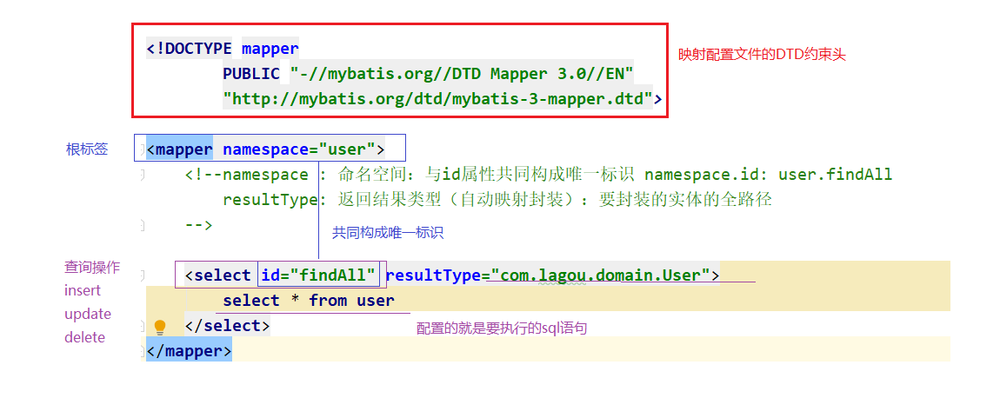
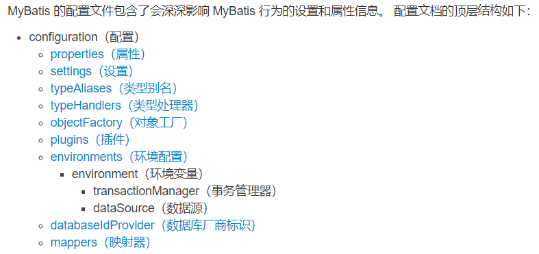
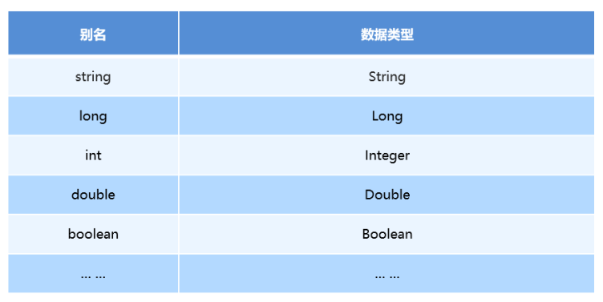
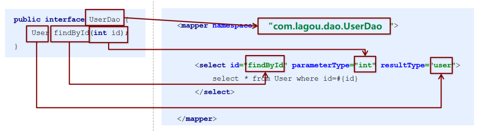

## 框架简介

### 三层架构

软件开发常用的架构是三层架构，之所以流行是因为有着清晰的任务划分。一般包括以下三层：

- 持久层：主要完成与数据库相关的操作，即对数据库的增删改查，也被叫做DAO层（Data Access Object ）
- 业务层：主要根据功能需求完成业务逻辑的定义和实现，也被叫做Service层或Business层
- 表现层：主要完成与最终软件使用用户的交互，需要有交互界面。也被叫做web层或者View层

三层架构之间调用关系为：表现层调用业务层，业务层调用持久层

层与层之间的数据交互：一般使用java实体对象

### 框架

框架可以理解为半成品软件，框架做好以后，接下来在它基础上进行开发  

#### 为什么使用框架：

框架封装好了一些冗余，且重用率低的代码。并且使用反射与动态代理机制，将代码实现了通用性，让开发人员把精力专注在核心的业务代码实现上  

#### 常见的框架

- 持久层框架：专注于解决数据持久化的框架。常用的有mybatis、hibernate、spring jdbc等等。
- 表现层框架：专注于解决与用户交互的框架。常见的有struts2、spring mvc等等。
- 全栈框架: 能在各层都给出解决方案的框架。比较著名的就是spring。  

> 企业中最常用的组合：Spring + Spring MVC + mybatis（SSM）  

## Mybatis简介

### 问题的出现

原始jdbc操作问题：

- 数据库连接创建、释放频繁造成系统资源浪费从而影响系统性能  
- sql 语句在代码中硬编码，造成代码不易维护  
- 查询操作时，需要手动将结果集中的数据手动封装到实体中  

解决思路：

- 使用数据库连接池初始化连接资源  
- 将sql语句抽取到xml配置文件中  
- 使用反射、内省等底层技术，自动将实体与表进行属性与字段的自动映射  

### 解决方案的给出

MyBatis是一个优秀的基于ORM的半自动轻量级持久层框架，它对jdbc的操作数据库的过程进行封装，使开发者只需要关注 SQL 本身，而不需要花费精力去处理例如注册驱动、创建connection、创建statement、手动设置参数、结果集检索等jdbc繁杂的过程代码  

Github地址：https://github.com/mybatis/mybatis-3/  

### ORM思想

ORM（Object Relational Mapping）对象关系映射

- O（对象模型）：

  实体对象，即在程序中根据数据库表结构建立的一个个实体javaBean

- R（关系型数据库的数据结构）：

  关系数据库领域的Relational（建立的数据库表）

- M（映射）：

  从R（数据库）到O（对象模型）的映射，可通过XML文件映射  

实现：

1. 让实体类和数据库表进行一一对应关系  
   - 实体类 <--> 数据库表
   - 实体类属性 <--> 表里面字段
2. 不需要直接操作数据库表，直接操作表对应的实体类对象

ORM是一种思想，mybatis采用ORM思想解决了实体和数据库映射的问题，对jdbc 进行了封装，屏蔽了jdbc api 底层访问细节，从而不用关心jdbc api

## Mybatis快速入门

MyBatis官网地址：http://www.mybatis.org/mybatis-3/

### Mybatis开发步骤

案例需求：通过mybatis查询数据库user表的所有记录，封装到User对象中，打印到控制台上  

步骤分析：

```markdown
1. 创建数据库及user表

2. 创建Maven工程，导入依赖（MySQL驱动、mybatis、junit）

3. 编写User实体类  

4. 编写UserMapper.xml映射配置文件（ORM思想）  

5. 编写sqlMapConfig.xml核心配置文件  
   - 数据库环境配置
   - 映射关系配置的引入(引入映射配置文件的路径)  

6. 编写测试代码 
   1. 加载核心配置文件
   2. 获取sqlSessionFactory工厂对象
   3. 获取sqlSession会话对象
   4. 执行sql
   5. 打印结果
   6. 释放资源  
```

### 代码实现

1. 创建user数据表

   ```mysql
   CREATE DATABASE `mybatis_db`;
   USE `mybatis_db`;
   
   CREATE TABLE `user` (
       `id` INT(11) NOT NULL AUTO_INCREMENT,
       `username` VARCHAR(32) NOT NULL COMMENT '用户名称',
       `birthday` DATETIME DEFAULT NULL COMMENT '生日',
       `sex` CHAR(1) DEFAULT NULL COMMENT '性别',
       `address` VARCHAR(256) DEFAULT NULL COMMENT '地址',
   	PRIMARY KEY (`id`)
   ) ENGINE=INNODB DEFAULT CHARSET=utf8;
   
   -- insert....
   INSERT INTO `user`(`id`,`username`,`birthday`,`sex`,`address`) 
   VALUES (1,'子慕','2020-11-11 00:00:00','男','北京海淀'),
   	   (2,'应颠','2020-12-12 00:00:00','男','北京海淀');
   ```

2. 导入MyBatis的坐标和其他相关坐标

   ```xml
   <!-- 引入相关依赖 -->
   <dependencies>
       <!-- 引入mybatis依赖  -->
       <dependency>
           <groupId>org.mybatis</groupId>
           <artifactId>mybatis</artifactId>
           <version>3.5.4</version>
       </dependency>
   
       <!-- 引入mysql驱动 -->
       <dependency>
           <groupId>mysql</groupId>
           <artifactId>mysql-connector-java</artifactId>
           <version>5.1.47</version>
       </dependency>
   
       <!-- 引入junit -->
       <dependency>
           <groupId>junit</groupId>
           <artifactId>junit</artifactId>
           <version>4.13.1</version>
       </dependency>
   </dependencies>
   
   <!-- 指定编码和版本 -->
   <properties>
       <project.build.sourceEncoding>UTF-8</project.build.sourceEncoding>
       <maven.compiler.encoding>UTF-8</maven.compiler.encoding>
       <maven.compiler.source>17</maven.compiler.source>
       <maven.compiler.target>17</maven.compiler.target>
   </properties>
   ```

3. 编写User实体  

   ```java
   public class User {
       private Integer id;
       private String username;
       private Date birthday;
       private String sex;
       private String address;
       // getter/setter 略
   }
   ```

4. 编写UserMapper映射文件

   ```xml
   <?xml version="1.0" encoding="UTF-8" ?>
   <!DOCTYPE mapper
           PUBLIC "-//mybatis.org//DTD Mapper 3.0//EN"
           "http://mybatis.org/dtd/mybatis-3-mapper.dtd">
   <mapper namespace="UserMapper">
       <select id="findAll" resultType="com.fusi.domain.User">
           select * from user
       </select>
   </mapper>
   ```

5. 编写MyBatis核心文件  

   ```xml
   <?xml version="1.0" encoding="UTF-8" ?>
   <!DOCTYPE configuration
           PUBLIC "-//mybatis.org//DTD Config 3.0//EN"
           "http://mybatis.org/dtd/mybatis-3-config.dtd">
   
   <configuration>
       <!--环境配置-->
       <environments default="mysql">
           <!--使用MySQL环境-->
           <environment id="mysql">
               <!--使用JDBC类型事务管理器-->
               <transactionManager type="JDBC"></transactionManager>
   
               <!--使用连接池-->
               <dataSource type="POOLED">
                   <property name="driver" value="com.mysql.jdbc.Driver" />
                   <property name="url" value="jdbc:mysql://127.0.0.1:3306
                         /mybatis_db?useSSL=false&characterEncoding=UTF-8" />
                   <property name="username" value="root" />
                   <property name="password" value="123456" />
               </dataSource>
           </environment>
       </environments>
   
       <mappers>
       	<mapper resource="com/fusi/mapper/UserMapper.xml"></mapper>
       </mappers>
   </configuration>
   ```

6. 编写测试类  

   ```java
   @Test
   public void mybatisQuickStart() throws IOException {
       // 加载核心配置文件
       InputStream resourceAsStream = Resources.getResourceAsStream("sqlMapConfig.xml");
   
       // 获取SqlSessionFaction工厂对象
       SqlSessionFactory sqlSessionFactory = new SqlSessionFactoryBuilder().build(resourceAsStream);
   
       // 获取sqlSession对象
       SqlSession sqlSession = sqlSessionFactory.openSession();
   
       // 执行sql 参数：statementid : namespace.id
       List<User> users = sqlSession.selectList("userMapper.findAll");
   
       // 遍历打印结果
       for (User user : users) {
           System.out.println(user);
       }
   
       // 关闭资源
       sqlSession.close();
   }
   ```

## Mybatis映射文件概述  



## Mybatis增删改查  

### 增

#### 编写映射文件UserMapper.xml  

```xml
<!--新增-->
<insert id="save" parameterType="com.fusi.domain.User">
	insert into user(username,birthday,sex,address)
		values(#{username},#{birthday},#{sex},#{address})
</insert>
```

#### 编写测试类

```java
@Test
public void testSave() throws Exception {
    // 加载核心配置文件
    InputStream is = Resources.getResourceAsStream("SqlMapConfig.xml");
    // 获取SqlSessionFactory工厂对象
    SqlSessionFactory sqlSessionFactory = new
    SqlSessionFactoryBuilder().build(is);
    // 获取SqlSession会话对象
    SqlSession sqlSession = sqlSessionFactory.openSession();
    
    // 创建user实例
    User user = new User();
    user.setUsername("jack");
    user.setBirthday(new Date());
    user.setSex("男");
    user.setAddress("北京海淀");
    
    // 执行sql
    sqlSession.insert("UserMapper.save", user);
    // DML语句，手动提交事务
    sqlSession.commit();
    // 释放资源
    sqlSession.close();
}
```

#### 注意事项

```markdown
- 插入语句使用insert标签
- 在映射文件中使用 parameterType 属性指定要插入的数据类型
- Sql语句中使用 #{实体属性名} 方式引用实体中的属性值
- 插入操作使用的API是sqlSession.insert(“命名空间.id”,实体对象);
- 插入操作涉及数据库数据变化，所以要提交事务，即sqlSession.commit()
```

### 修改

```xml
<!--修改-->
<update id="update" parameterType="com.fusi.domain.User">
    update user set username = #{username},birthday = #{birthday},
    sex = #{sex},address = #{address} where id = #{id}
</update>
```

```markdown
## 注意事项
- 修改语句使用update标签
- 修改操作使用的API是sqlSession.update(“命名空间.id”,实体对象)
```

### 删除

```xml
<!--删除-->
<delete id="delete" parameterType="java.lang.Integer">
	delete from user where id = #{id}
</delete>
```

```markdown
## 注意事项
- 删除语句使用delete标签
- Sql语句中使用#{任意字符串}方式引用传递的单个参数
- 删除操作使用的API是sqlSession.delete(“命名空间.id”,Object);
```

## Mybatis核心文件概述  

### MyBatis核心配置文件层级关系  



### MyBatis常用配置解析  

#### environments标签  

数据库环境的配置，支持多环境配置  

```xml
<!-- 指定默认的环境名称 -->
<environments default="development">
    <!-- 指定当前环境的名称 -->
    <environment id="development">
        <!-- 指定事务管理类型是JDBC -->
        <transactionManager type="JDBC"></transactionManager>

        <!-- 使用连接池 -->
        <dataSource type="POOLED">
              <property name="driver" value="${driver}"/>
              <property name="url" value="${url}"/>
              <property name="username" value="${username}"/>
              <property name="password" value="${password}"/>
        </dataSource>
        
    </environment>
</environments>
```

事务管理器（transactionManager）类型有两种：
- JDBC：
这个配置就是直接使用了JDBC 的提交和回滚设置，它依赖于从数据源得到的连接来管理事务作用域。
- MANAGED：
这个配置几乎没做什么。它从来不提交或回滚一个连接，而是让容器来管理事务的整个生命周期。
例如：mybatis与spring整合后，事务交给spring容器管理。

***

数据源（dataSource）常用类型有三种：

- UNPOOLED：

  这个数据源的实现只是每次被请求时打开和关闭连接。  

- POOLED：
  这种数据源的实现利用“池”的概念将 JDBC 连接对象组织起来。

- JNDI :
  这个数据源实现是为了能在如 EJB 或应用服务器这类容器中使用，容器可以集中或在外部配置数据源，然后放置一个 JNDI 上下文的数据源引用  

#### properties标签  

实际开发中，习惯将数据源的配置信息单独抽取成一个properties文件，该标签可以加载额外配置的properties：  

- jdbc.properties

  ```properties
  jdbc.driver=com.mysql.jdbc.Driver
  jdbc.url=jdbc:mysql://127.0.0.1:3306/mybatis_db?useSSL=false
  jdbc.username=root
  jdbc.password=123456
  ```

- sqlMapConfig.xml

  ```xml
  <!--加载properties文件-->
  <properties resource="jdbc.properties"></properties>
  
  <!-------------------------------------------------->
        <property name="driver" value="${jdbc.driver}"/>
        <property name="url" value="${jdbc.url}"/>
        <property name="username" value="${jdbc.username}"/>
        <property name="password" value="${jdbc.password}"/>
  <!-------------------------------------------------->
  ```

####  typeAliases标签  

类型别名是为 Java 类型设置一个短的名字。
为了简化映射文件 Java 类型设置，mybatis框架为我们设置好的一些常用的类型的别名：  



配置typeAliases

- sqlMapConfig.xml

  ```xml
  <!-- 设置别名-->
  <typeAliases>
      <!--给单个类起别名-->
      <typeAlias type="com.User" alias="user"></typeAlias>
      <!--给整个包起别名 不区分大小写-->
      <package name="com.fusi.domain"/>
  </typeAliases>
  ```

- UserMapper.xml

  ```xml
  <!-- 以前的方式 -->
  <select id="findUserById" parameterType="int" resultType="com.fusi.domain.User">
  
  <select id="findUserById" parameterType="int" resultType="user">
      select * from user where id = #{id}
  </select>
  ```

#### mappers标签  

该标签的作用是加载映射的，加载方式有如下几种：  

```xml
1. 使用相对于类路径的资源引用，例如：
<mapper resource="org/mybatis/builder/userMapper.xml"/>

2. 使用完全限定资源定位符（URL），例如：
<mapper url="file:///var/mappers/userMapper.xml"/>

下面两种mapper代理开发中使用

3. 使用映射器接口实现类的完全限定类名，例如：
<mapper class="org.mybatis.builder.userMapper"/>

4. 将包内的映射器接口实现全部注册为映射器，例如：
<package name="org.mybatis.builder"/>
```

## Mybatis的API概述

1. `SqlSession`工厂构建器`SqlSessionFactoryBuilder`

   - 常用API：`SqlSessionFactory build(InputStream inputStream) `

   - 通过加载Mabatis的核心文件的输入流的形式构建一个SqlSessionFactory对象

     ```java
     // 获取资源路径
     String resource = "org/mybatis/builder/mybatis-config.xml";
     
     // 加载资源文件，生成一个流对象
     InputStream inputStream = Resources.getResourceAsStream(resource);
     
     // 获取工厂的构造对象
     SqlSessionFactoryBuilder builder = new SqlSessionFactoryBuilder();
     
     // 工厂的构造对象通过流生成工厂对象
     SqlSessionFactory factory = builder.build(inputStream);
     ```

2. `SqlSession`工厂对象`SqlSessionFactory  `

   - SqlSessionFactory 有多个个方法创建SqlSession 实例。常用的有如下两个：  

     | 方法                            | 解释                         |
     | ------------------------------- | ---------------------------- |
     | openSession()                   | 默认手动提交事务             |
     | openSession(boolean autoCommit) | 如果设定为true，自动提交任务 |

3. `SqlSession`会话对象 

   - 包含所有执行语句、提交或回滚事务和获取映射器实例的方法  

     ```java
     <T> T selectOne(String statement, Object parameter)
     <E> List<E> selectList(String statement, Object parameter)
     int insert(String statement, Object parameter)
     int update(String statement, Object parameter)
     int delete(String statement, Object parameter)
     ```

   - 操作事务的方法主要有：

     ```java
     void commit()
     void rollback()
     ```

## Mybatis的dao层开发使用  

### 传统开发方式：

1. 编写UserMapper接口
2. 编写UserMapper实现
3. 编写UserMapper.xml

传统方式问题：

1. 实现类中，存在mybatis模板代码重复
2. 实现类调用方法时，xml中的sql statement 硬编码到java代码中  

解题思路：只写接口，不写实现类。只编写接口和Mapper.xml即可  

### 代理开发方式

采用 Mybatis 的基于接口代理方式实现持久层的开发，这种方式也是进入企业的主流  

基于接口代理方式的开发只需要程序员编写 Mapper 接口，Mybatis 框架会动态生成实现类的对象  

**这种开发方式要求我们遵循一定的规范**

- Mapper.xml映射文件中的namespace与mapper接口的全限定名相同

  ```sh
  main
  ├── java
  │   └── com
  │       └── fusi
  │           ├── mapper
  │           │   └── UserMapper.java🔸
  │           ├── domain
  │           │   └── User.java
  │           └── test
  │               └── MybatisTest.java
  └── resources
      ├── com
      │   └── fusi
      │       └── mapper
      │           └── UserMapper.xml🔸
      ├── jdbc.properties
      └── sqlMapConfig.xml
  ```

- Mapper接口方法名和Mapper.xml映射文件中定义的每个statement的id相同

- Mapper接口方法的输入参数类型和mapper.xml映射文件中定义的每个sql的parameterType的类型相同

- Mapper接口方法的输出参数类型和mapper.xml映射文件中定义的每个sql的resultType的类型相同  



1. 编写UserMapper接口

   ```java
   public interface UserMapper {
   	public List<User> findAll() throws Exception;
   }
   ```

2. 编写UserMapper.xml

   ```java
   <?xml version="1.0" encoding="UTF-8" ?>
   <!DOCTYPE mapper
       PUBLIC "-//mybatis.org//DTD Mapper 3.0//EN"
       "http://mybatis.org/dtd/mybatis-3-mapper.dtd">
   
   <mapper namespace="com.lagou.mapper.UserMapper">
       <!--查询所有-->
       <select id="findAll" resultType="user">
       	select * from user
       </select>
   </mapper>
   ```

3. 测试

   ```java
   @Test
   public void test() throws IOException {
       // 加载核心配置文件
       InputStream resourceAsStream = Resources.getResourceAsStream("sqlMapConfig.xml");
       // 获得SqlSessionFactory工厂对象
       SqlSessionFactory sqlSessionFactory = new SqlSessionFactoryBuilder().build(resourceAsStream);
       // 获得SqlSession会话对象
       SqlSession sqlSession = sqlSessionFactory.openSession();
   
       // 获取Mapper代理对象
       UserMapper mapper = sqlSession.getMapper(UserMapper.class);
       // 执行查询
       User userById = mapper.findUserById(1);
       // 释放资源
       System.out.println(userById);
   }
   ```

   


