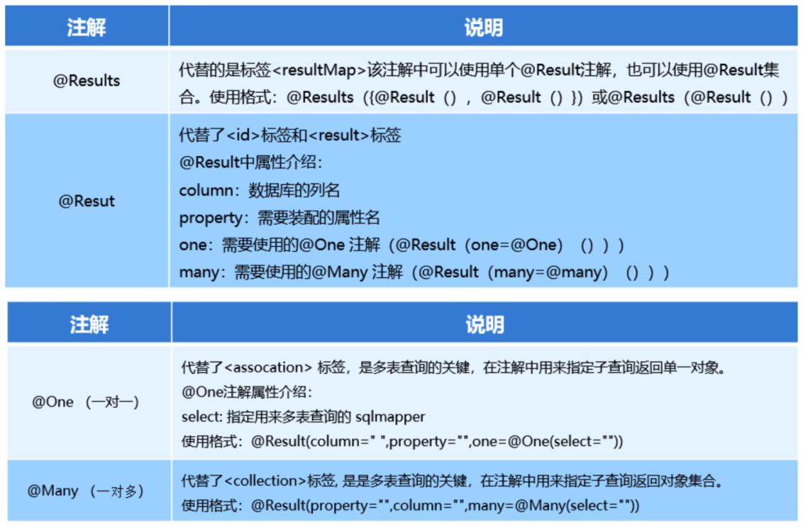

## MyBatis加载策略

### 延迟加载

在需要用到数据时才进行加载，不需要用到数据时就不加载数据。延迟加载也称懒加载。  

- 优点：
  先从单表查询，需要时再从关联表去关联查询，大大提高数据库性能，因为查询单表要比关联查询多张表速度要快。
- 缺点：
  因为只有当需要用到数据时，才会进行数据库查询，这样在大批量数据查询时，因为查询工作也要消耗时间，所以可能造成用户等待时间变长，造成用户体验下降。

在多表中：

- 一对多，多对多：通常情况下采用延迟加载
- 一对一，多对一：通常情况下采用立即加载

> 延迟加载是基于嵌套查询来实现的  

### 实现

#### 局部延迟加载

在association和collection标签中都有一个fetchType属性，通过修改它的值，可以修改局部的加载策略  

```xml
<!-- 开启一对多 延迟加载 -->
<resultMap id="userMap" type="user">
    <id column="id" property="id"></id>
    <result column="username" property="username"></result>
    <result column="password" property="password"></result>
    <result column="birthday" property="birthday"></result>
    <!--
        fetchType="lazy" 懒加载策略
        fetchType="eager" 立即加载策略
    -->
    <collection property="orderList" ofType="order" column="id"
   		select="com.lagou.dao.OrderMapper.findByUid" fetchType="lazy">
    </collection>
</resultMap>
```

#### 全局延迟加载  

在Mybatis的核心配置文件中可以使用setting标签修改全局的加载策略

```xml
<settings>
    <!--开启全局延迟加载功能-->
    <setting name="lazyLoadingEnabled" value="true"/>
</settings>
```

#### 设置触发延迟加载的方法  

在配置了延迟加载策略后，发现即使没有调用关联对象的任何方法，但是在调用当前对象的equals、clone、hashCode、toString方法时也会触发关联对象的查询

```xml
<settings>
    <!--所有方法都会延迟加载-->
    <setting name="lazyLoadTriggerMethods" value="toString()"/>
</settings>
```

> 局部的加载策略优先级高于全局的加载策略  

## MyBatis缓存

经常查询一些不经常发生变化的数据，可以使用缓存来提高查询效率  

像大多数的持久化框架一样，Mybatis也提供了缓存策略，通过缓存策略来减少数据库的查询次数，从而提高性能。 Mybatis中缓存分为一级缓存，二级缓存

### 一级缓存

一级缓存是SqlSession级别的缓存，是默认开启的  

所以在参数和SQL完全一样的情况下，我们使用同一个SqlSession对象调用一个Mapper方法，往往只执行一次SQL，因为使用SelSession第一次查询后，MyBatis会将其放在缓存中，以后再查询的时候，如果没有声明需要刷新，并且缓存没有超时的情况下，SqlSession都会取出当前缓存的数据，而不会再次发送SQL到数据库。  

一级缓存是SqlSession范围的缓存，执行SqlSession的C（增加）U（更新）D（删除）操作，或者调用clearCache()、commit()、close()方法，都会清空缓存

**清除**：

```java
@Test
public void testClearOneCache() throws Exception {
    SqlSession sqlSession = MybatisUtils.openSession();
    UserMapper userMapper = sqlSession.getMapper(UserMapper.class);
    User user1 = userMapper.findById(41);
    System.out.println("第一次查询的用户：" + user1);
    //调用sqlSession清除缓存的方法
    sqlSession.clearCache();
    User user2 = userMapper.findById(41);
    System.out.println("第二次查询的用户：" + user2);
}
```

```xml
<!-- 每次查询时，都会清除缓存 -->
< select flushCache="true"></select>
```

### 二级缓存

二级缓存是namspace级别（跨sqlSession）的缓存，是默认不开启的

二级缓存的开启需要进行配置，实现二级缓存的时候，MyBatis要求返回的POJO必须是可序列化的。也就是要求实现Serializable接口，配置方法很简单，只需要在映射XML文件配置 \<cache/\> 即可

```xml
<settings>
    <!--
        因为cacheEnabled的取值默认就为true，所以这一步可以省略不配置。
        为true代表开启二级缓存；为false代表不开启二级缓存。
    -->
    <setting name="cacheEnabled" value="true"/>
</settings>
```

二级缓存是mapper映射级别的缓存，多个SqlSession去操作同一个Mapper映射的sql语句，多个SqlSession可以共用二级缓存，二级缓存是跨SqlSession的。  

**问题：**

mybatis的二级缓存因为是namespace级别，所以在进行多表查询时会产生脏读问题  

故不建议使用

## MyBatis注解

Mybatis也可以使用注解开发方式，可以减少Mapper映射文件的编写

| 注解     | 作用                           | 替代                          |
| -------- | ------------------------------ | ----------------------------- |
| @Insert  | 新增                           | \<insert></insert\>           |
| @Delete  | 删除                           | \<delete></delete\>           |
| @Update  | 更新                           | \<update></update\>           |
| @Select  | 查询                           | \<select></select\>           |
| @Result  | 结果集封装                     | \<result></result\>           |
| @Results | 与@Result 组合，封装多个结果集 | \<resultMap></resultMap\>     |
| @One     | 实现一对一结果集封装           | \<association></association\> |
| @Many    | 实现一对多结果集封装           | \<collection></collection\>   |

### MyBatis注解的增删改查【重点】  

```java
// UserMapper接口
public interface UserMapper {
    @Select("SELECT * FROM `user`")
    public List<User> findAll();
    
    @Insert("INSERT INTO `user`(username,birthday,sex,address) 
            VALUES(#{username},#{birthday},#{sex},#{address})")
    public void save(User user);
    
    @Update("UPDATE `user` SET username = #{username},birthday = #{birthday},
            sex = #{sex},address = #{address} WHERE id = #{id}")
    public void update(User user);
            
    @Delete("DELETE FROM `user` where id = #{id}")
    public void delete(Integer id);
}
```

```xml
<!--使用了注解替代的映射文件，只需要加载使用了注解的Mapper接口即可-->
<mappers>
    <!--扫描使用注解的Mapper类-->
    <mapper class="com.lagou.mapper.UserMapper"></mapper>
</mappers>

<!---------------------------------------------------------->

<!--或者指定扫描包含映射关系的接口所在的包也可以-->
<mappers>
    <!--扫描使用注解的Mapper类所在的包-->
    <package name="com.lagou.mapper"></package>
</mappers>
```

### 使用注解实现复杂映射开发

| 说明           | 代替的标签      | 注解     | 属性介绍                                                     |
| -------------- | --------------- | -------- | ------------------------------------------------------------ |
| 结果映射       | \<resultMap\>   | @Results | @Result 或 @Results                                          |
|                |                 | @Result  | column: 数据库列名<br>property: 装配属性名<br>one: @One注解<br>many: @Many注解 |
|                |                 | @One     | select: 多表查询的SQL语句                                    |
|                |                 | @Many    | select: 子查询返回对象集合的SQL语句                          |
| 多表查询的关键 | \<association\> | @One     | 子查询返回单一对象                                           |
|                |                 | @Many    | 子查询返回对象集合                                           |



### 一对一查询

需求：查询一个订单，与此同时查询出该订单所属的用户  

```sql
SELECT * FROM orders;
SELECT * FROM `user` WHERE id = #{订单的uid};
```

**代码实现：**

```java
// OrderMapper接口
public interface OrderMapper {
    @Select("SELECT * FROM orders")
    @Results({
        @Result(id = true, column = "id", property = "id"),
        @Result(column = "ordertime", property = "ordertime"),
        @Result(column = "money", property = "money"),
        @Result(property = "user", javaType = User.class,column = "uid", 
                one = @One(select ="com.lagou.mapper.UserMapper.findById",
                           fetchType = FetchType.EAGER))
    })
    public List<Order> findAllWithUser();
}

// UserMapper接口
public interface UserMapper {
    @Select("SELECT * FROM `user` WHERE id = #{id}")
    public User findById(Integer id);
}
```

### 一对多查询

需求：查询一个用户，与此同时查询出该用户具有的订单

```sql
SELECT * FROM `user`;
SELECT * FROM orders where uid = #{用户id};
```

**代码实现**

```java
// UserMapper接口
public interface UserMapper {
    @Select("SELECT * FROM `user`")
    @Results({
        @Result(id = true, column = "id", property = "id"),
        @Result(column = "brithday", property = "brithday"),
        @Result(column = "sex", property = "sex"),
        @Result(column = "address", property = "address"),
        @Result(property = "orderList", javaType = List.class,column = "id" ,
        	many = @Many(select = "com.lagou.mapper.OrderMapper.findByUid"))
    })
    public List<User> findAllWithOrder();
}

// OrderMapper接口
public interface OrderMapper {
    @Select("SELECT * FROM orders WHERE uid = #{uid}")
    public List<Order> findByUid(Integer uid);
}
```

### 多对多查询

需求：查询所有用户，同时查询出该用户的所有角色  

```sql
SELECT * FROM `user`;
SELECT * FROM role r INNER JOIN user_role ur ON r.`id` = ur.`rid`
WHERE ur.`uid` = #{用户id};
```

**代码实现**

```java
// UserMapper接口
public interface UserMapper {
    @Select("SELECT * FROM `user`")
    @Results({
        @Result(id = true, column = "id", property = "id"),
        @Result(column = "brithday", property = "brithday"),
        @Result(column = "sex", property = "sex"),
        @Result(column = "address", property = "address"),
        @Result(property = "roleList", javaType = List.class,column = "id" ,
        	many = @Many(select = "com.lagou.mapper.RoleMapper.findByUid"))
    })
    public List<User> findAllWithRole();
}

// RoleMapper接口
public interface RoleMapper {
    @Select("SELECT * FROM role r INNER JOIN user_role ur ON r.`id` = ur.`rid` WHERE ur.`uid` = #{uid}")
    public List<Role> findByUid(Integer uid);
}
```

### 基于注解的二级缓存  

```java
// 在Mapper接口中使用注解配置二级缓存
@CacheNamespace
public interface UserMapper {...}
```

### 注解延迟加载

不管是一对一还是一对多 ，在注解配置中都有fetchType的属性  

- fetchType = FetchType.LAZY 表示懒加载
- fetchType = FetchType.EAGER 表示立即加载
- fetchType = FetchType.DEFAULT 表示使用全局配置  

### 比较

注解开发和xml配置优劣分析

1. 注解开发和xml配置相比，从开发效率来说，注解编写更简单，效率更高。
2. 从可维护性来说，注解如果要修改，必须修改源码，会导致维护成本增加。xml维护性更强。  