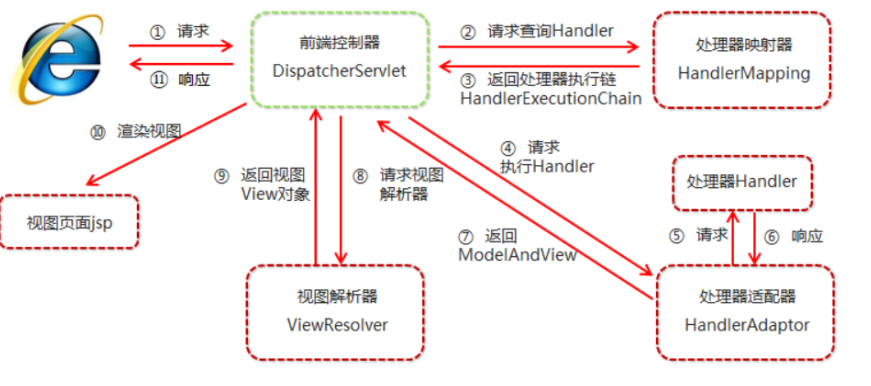

## SpringMVC基本应用

### MVC模式

MVC是软件工程中的一种软件架构模式，它是一种分离业务逻辑与显示界面的开发思想

- M（model）模型：处理业务逻辑，封装实体
- V（view）视图：展示内容
- C（controller）控制器：负责调度分发（1.接收请求、2.调用模型、3.转发到视图）

### 概述

SpringMVC是一种基于Java的实现MVC设计模式的轻量级Web框架

SpringMVC框架封装了原来Servlet中的共有行为，例如：参数封装，视图转发等  

### 快速入门

需求：客户端发起请求，服务器接收请求，执行逻辑并进行视图跳转。  

步骤分析：

1. 创建web项目，导入SpringMVC相关坐标

   ```xml
   <!-- 设置为web工程 -->
   <packaging>war</packaging>
   
   <dependencies>
       <!--springMVC坐标-->
       <dependency>
           <groupId>org.springframework</groupId>
           <artifactId>spring-webmvc</artifactId>
           <version>5.1.5.RELEASE</version>
       </dependency>
       <!--servlet坐标-->
       <dependency>
           <groupId>javax.servlet</groupId>
           <artifactId>javax.servlet-api</artifactId>
           <version>3.1.0</version>
           <scope>provided</scope>
       </dependency>
       <!--jsp坐标-->
       <dependency>
           <groupId>javax.servlet.jsp</groupId>
           <artifactId>jsp-api</artifactId>
           <version>2.2</version>
           <scope>provided</scope>
       </dependency>
   </dependencies>
   ```

2. 配置SpringMVC前端控制器 DispathcerServlet

   ```xml
   <!-------   src/main/webapp/WEB-INF/web.xml   ------->
   
   <?xml version="1.0" encoding="UTF-8"?>
   <web-app xmlns="http://xmlns.jcp.org/xml/ns/javaee"
           xmlns:xsi="http://www.w3.org/2001/XMLSchema-instance"
           xsi:schemaLocation="http://xmlns.jcp.org/xml/ns/javaee
           http://xmlns.jcp.org/xml/ns/javaee/web-app_3_1.xsd"
           version="3.1">
   
       <!--前端控制器-->
       <servlet>
           <servlet-name>dispatcherServlet</servlet-name>
           <servlet-class>org.springframework.web.servlet.DispatcherServlet</servlet-class>
           <init-param>
               <param-name>contextConfigLocation</param-name>
               <param-value>classpath:spring-mvc.xml</param-value>
           </init-param>
           <load-on-startup>2</load-on-startup>
       </servlet>
       <servlet-mapping>
           <servlet-name>dispatcherServlet</servlet-name>
           <url-pattern>/</url-pattern>
       </servlet-mapping>
       
       
   </web-app>
   ```

3. 编写Controller类和视图页面

   ```java
   // UserController.java
   
   public class UserController {
       public String quick() {
           System.out.println("quick running.....");
           return "/WEB-INF/pages/success.jsp";
       }
   }
   ```

   ```jsp
   <%-- /WEB-INF/pages/ success.jsp --%>
   
   <%@ page contentType="text/html;charset=UTF-8" language="java" %>
   <html>
   <head>
       <title>success</title>
   </head>
   <body>
       <h3>请求成功！</h3>
   </body>
   </html>
   ```

4. 使用注解配置Controller类中业务方法的映射地址

   ```java
   // UserController.java
   
   @Controller
   public class UserController {
       @RequestMapping("/quick")
       public String quick() {
           System.out.println("quick running.....");
           return "/WEB-INF/pages/success.jsp";
       }
   }
   ```

5. 配置SpringMVC核心文件 spring-mvc.xml

   ```xml
   <beans xmlns="http://www.springframework.org/schema/beans"
   xmlns:mvc="http://www.springframework.org/schema/mvc"
   xmlns:context="http://www.springframework.org/schema/context"
   xmlns:xsi="http://www.w3.org/2001/XMLSchema-instance"
   xsi:schemaLocation="http://www.springframework.org/schema/beans
   http://www.springframework.org/schema/beans/spring-beans.xsd
   http://www.springframework.org/schema/mvc
   http://www.springframework.org/schema/mvc/spring-mvc.xsd
   http://www.springframework.org/schema/context
   http://www.springframework.org/schema/context/spring-context.xsd">
       
       <!--配置注解扫描-->
       <context:component-scan base-package="com.fusi.controller"/>
       
   </beans>
   ```

### 总结

SpringMVC的开发步骤：

1. 创建web项目，导入SpringMVC相关坐标
2. 配置SpringMVC前端控制器 DispathcerServlet
3. 编写Controller类和视图页面
4. 使用注解配置Controller类中业务方法的映射地址
5. 配置SpringMVC核心文件 spring-mvc.xml  

## SpringMVC的执行流程

```
+----------------+     +-----------------+     +-----------------+
|                |     |                 |     |                 |
|   Dispatcher   |---->|  HandlerMapping |---->|  HandlerAdapter |
|    Servlet     |<----|                 |<----|                 |
|                |     +-----------------+     +-----------------+
+-------^--------+               ^                       ^
        |                        |                       |
        v                        v                       v
+-------+--------+      +--------+------+      +--------+------+
|                |      |               |      |               |
|  ViewResolver  |<-----|   Controller  |--->  |     View      |
|                |--->  |               |--->  |               |
+----------------+      +---------------+      +---------------+
```



### SpringMVC组件解析

1. 前端控制器：DispatcherServlet

   整个流程控制的中心，由它调用其他组件处理用户的请求，意义是降低了组件之间的耦合

2. 处理器映射器：HandlerMapping

   负责根据用户的请求找到Handler，即处理器，可以理解成电话薄或者是host

3. 处理器适配器：HandlerAdapter

   执行处理器的工具，可以理解为：通过电话簿找到了学生家里，负责和家长沟通的老师

4. 处理器：Handler *开发者编写*

   开发中要编写的具体业务，由Handler对具体的用户请求进行处理  

5. 视图解析器：ViewResolver

   负责将处理结果生成view视图，根据逻辑视图名解析成物理视图名，即具体的页面地址，可以理解为做饭，把未处理的食材转换为可以使用的饭菜

6. 视图：View *开发者编写*

   根据具体的视图名返回对应的页面，最常用的视图就是jsp，需要由程序员根据业务需求进行开发，鸡汤来喽

> 笔试题：springmvc中的三大组件是什么？
>
> - 处理器映射器：HandlerMapping
> - 处理器适配器：HandlerAdapter
> - 视图解析器：View Resolver  

```xml
<beans xmlns="http://www.springframework.org/schema/beans"
           xmlns:mvc="http://www.springframework.org/schema/mvc"
           xmlns:context="http://www.springframework.org/schema/context"
           xmlns:xsi="http://www.w3.org/2001/XMLSchema-instance"
           xsi:schemaLocation="http://www.springframework.org/schema/beans
    http://www.springframework.org/schema/beans/spring-beans.xsd
    http://www.springframework.org/schema/mvc
    http://www.springframework.org/schema/mvc/spring-mvc.xsd
    http://www.springframework.org/schema/context
    http://www.springframework.org/schema/context/spring-context.xsd">

        <!-- IOC注解扫描 -->
        <context:component-scan base-package="com.fusi.controller"/>

        <!-- 处理器映射器 和 处理器适配器功能增强 -->
        <mvc:annotation-driven />

        <!--视图解析器-->
        <bean id="viewResolver" class="org.springframework.web.servlet.view.InternalResourceViewResolver">
                <!-- 填充逻辑视图名的开头 -->
                <property name="prefix" value="/WEB-INF/pages/"/>
                <!-- 填充逻辑视图名的结尾 -->
                <property name="suffix" value=".jsp"/>
        </bean>

</beans>
```

### SpringMVC注解解析

- @Controller 

  SpringMVC基于Spring容器，所以在进行SpringMVC操作时，需要将Controller存储到Spring容器中，同时开启注解扫描

  ```xml
  <!--配置注解扫描-->
  <context:component-scan base-package="com.fusi.controller"/>
  ```

- @RequestMapping

  作用：用于建立请求 URL 和处理请求方法之间的对应关系

  位置：

  1. 类上：请求URL的第一级访问目录，此处不写，就相当于应用的根目录，作用是是URL可以按照模块化管理
  2. 方法上：请求URL的第二级访问目录

  属性：

  1. value：用于指定请求的URL。它和path属性的作用是一样的

  2. method：用来限定请求的方式

  3. params：用来限定请求参数的条件

     params={"accountName"} 表示请求参数中必须有accountName  

## SpringMVC的请求

客户端请求参数的格式是： `name=value&name=value....`

服务器要获取请求的参数的时候要进行类型转换，有时还需要进行数据的封装  

### 四种请求参数

SpringMVC可以接收如下类型的参数：

- 基本类型参数

  Controller中的业务方法的参数名称要与请求参数的name一致，参数值会自动映射匹配

  ```java
  // href="${pageContext.request.contextPath}/user/simpleParam?id=1&username=杰克"
  // --------------------------------------------------
  @RequestMapping("/simpleParam")
  public String simpleParam(Integer id,String username) {
      System.out.println(id + username);
      return "success";
  }
  ```

- 对象类型参数

  Controller中的业务方法参数的POJO属性名与请求参数的name一致，参数值会自动映射匹配

  ```java
  /* form表单
      action="${pageContext.request.contextPath}/user/pojoParam
      编号：<input type="text" name="id">
      用户名：<input type="text" name="username">
  */
  
  // ------------------------------------------------------
  public class User {
      Integer id;
      String username;
  }
  
  // ------------------------------------------------------
  @RequestMapping("/pojoParam")
  public String pojoParam(User user) {
      System.out.println(user);
      return "success";
  }
  ```

- 数组类型参数

  ```java
  /* form表单
      ${pageContext.request.contextPath}/user/arrayParam
      <input type="checkbox" name="ids" value="1">1<br>
      <input type="checkbox" name="ids" value="2">2<br>
  */
  
  // ------------------------------------------------------
  @RequestMapping("/arrayParam")
  public String arrayParam(Integer[] ids) {
      System.out.println(Arrays.toString(ids));
      return "success";
  }
  ```

- 集合类型参数  

  获得集合参数时，要将集合参数包装到一个POJO中才可以  

  ```xml
  <form action="${pageContext.request.contextPath}/user/queryParam" method="post">
      搜索关键字：
      <input type="text" name="keyword"> <br>
          
      user对象：
      <input type="text" name="user.id" placeholder="编号">
      <input type="text" name="user.username" placeholder="姓名"><br>
          
      list集合<br>
      第一个元素：
      <input type="text" name="userList[0].id" placeholder="编号">
      <input type="text" name="userList[0].username" placeholder="姓名"><br>
      第二个元素：
      <input type="text" name="userList[1].id" placeholder="编号">
      <input type="text" name="userList[1].username" placeholder="姓名"><br>
          
      map集合<br>
      第一个元素：
      <input type="text" name="userMap['u1'].id" placeholder="编号">
      <input type="text" name="userMap['u1'].username" placeholder="姓名"><br>
      第二个元素：
      <input type="text" name="userMap['u2'].id" placeholder="编号">
      <input type="text" name="userMap['u2'].username" placeholder="姓名"><br>
      <input type="submit" value="复杂类型">
  </form>
  ```

  

  ```java
  @RequestMapping("/queryParam")
  public String queryParam(QueryVo queryVo) {
      System.out.println(queryVo);
      return "success";
  }
  
  // ------------------------------------------------------
  @RequestMapping("/queryParam")
  public String queryParam(QueryVo queryVo) {
      System.out.println(queryVo);
      return "success";
  }
  ```

### 中文乱码过滤器

当post请求时，数据会出现乱码，我们可以设置一个过滤器来进行编码的过滤

```xml
<filter>
    <filter-name>characterEncodingFilter</filter-name>
    <filter-class>org.springframework.web.filter.CharacterEncodingFilter</filter-class>
    <init-param>
        <param-name>encoding</param-name>
        <param-value>UTF-8</param-value>
    </init-param>
</filter>
<filter-mapping>
    <filter-name>characterEncodingFilter</filter-name>
    <url-pattern>/*</url-pattern>
</filter-mapping>
```

### 自定义类型转换器

```java
// 设置自定义转换器  com.fusi.converter.DateConverter
public class DateConverter implements Converter<String, Date> {
    public Date convert(String dateStr) {
        //将日期字符串转换成日期对象 返回
        SimpleDateFormat format = new SimpleDateFormat("yyyy-MM-dd");
        Date date = null;	
        try {
            date = format.parse(dateStr);
        } catch (ParseException e) {
            e.printStackTrace();
        } 
        return date;
    }
}

// ------------------------------------------------------
@RequestMapping("/converterParam")
public String converterParam(Date birthday) {
    System.out.println(birthday);
    return "success";
}
```

```xml
<!--处理器映射器和适配器增强-->
<mvc:annotation-driven conversion-service="conversionService" />

<!--自定义转换器配置-->
<bean id="conversionService"
class="org.springframework.context.support.ConversionServiceFactoryBean">
    <property name="converters">
        <set>
            <bean class="com.fusi.converter.DateConverter"></bean>
        </set>
    </property>
</bean>
```

### 相关注解

- **@RequestParam**  

  当请求的参数name名称与Controller的业务方法参数名称不一致时，就需要通过@RequestParam注解显示的绑定

  ```java
  /*
      @RequestParam() 注解
      defaultValue 设置参数默认值
      name 匹配页面传递参数的名称
      required 设置是否必须传递参数，默认值为true；如果设置了默认值，值自动改为false
  */
  @RequestMapping("/findByPage")
  public String findByPage(@RequestParam(name = "pageNo",defaultValue = "1") Integer pageNum, 
                           @RequestParam(defaultValue = "5") Integer pageSize) {
      System.out.println(pageNum);
      System.out.println(pageSize);
      return "success";
  }
  ```

- **@RequestHeader**

  获取请求头的数据

  ```java
  @RequestMapping("/requestHead")
  public String requestHead(@RequestHeader("cookie") String cookie) {
      System.out.println(cookie);
      return "success";
  }
  ```

- **@CookieValue**

  获取cookie中的数据

  ```java
  @RequestMapping("/cookieValue")
  public String cookieValue(@CookieValue("JSESSIONID") String jesessionId) {
      System.out.println(jesessionId);
      return "success";
  }
  ```

### 获取Servlet相关API  

```java
@RequestMapping("/servletAPI")
public String servletAPI(HttpServletRequest request, 
                         HttpServletResponse response, 
                         HttpSession session) {
    System.out.println(request);
    System.out.println(response);
    System.out.println(session);
    return "success";
}
```

## SpringMVC的响应

### 页面跳转

1. 返回字符串逻辑视图

   直接返回字符串：此种方式会将返回的字符串与视图解析器的前后缀拼接后跳转到指定页面  

   ```java
   @RequestMapping("/returnString")
   public String returnString() {
       return "success";
   }
   ```

2. void原始ServletAPI

   可以通过request、response对象实现响应  

   ```java
   @RequestMapping("/returnVoid")
   public void returnVoid(HttpServletRequest request, 
                          HttpServletResponse response)throws Exception {
       // 1.通过response直接响应数据
       response.setContentType("text/html;charset=utf-8");
       response.getWriter().write("拉勾网");
   
       request.setAttribute("username", "拉勾教育");
       // 2.通过request实现转发
       request.getRequestDispatcher("/WEB-INF/pages/success.jsp").forward(request,response);
   
       // 3.通过response实现重定向
       response.sendRedirect(request.getContextPath() + "/index.jsp");
   }
   ```

3. ModelAndView

   后面介绍

### 返回数据

1. 直接返回字符串数据
2. 将对象或集合转为json返回

### 转发和重定向

企业开发我们一般使用返回字符串逻辑视图实现页面的跳转，这种方式其实就是请求转发  

- forward转发  

  如果用了forward：则路径必须写成实际视图url，不能写逻辑视图

  使用请求转发，既可以转发到jsp，也可以转发到其他的控制器方法  

  ```java
  @RequestMapping("/forward")
  public String forward(Model model) {
      model.addAttribute("username", "大厂招聘");
      return "forward:/WEB-INF/pages/success.jsp";
  }
  ```

- Redirect重定向

  可以不写虚拟目录，springMVC框架会自动拼接，并且将Model中的数据拼接到url地址上

  ```java
  @RequestMapping("/redirect")
  public String redirect(Model model) {
      model.addAttribute("username", "fusi教育");
      return "redirect:/index.jsp";
  }
  ```

### ModelAndView

- 方式一：

  在Controller中方法创建并返回ModelAndView对象，并且设置视图名称

  ```java
  @RequestMapping("/returnModelAndView1")
  public ModelAndView returnModelAndView1() {
      /*
          Model:模型 作用封装数据
          View：视图 作用展示数据
      */
      ModelAndView modelAndView = new ModelAndView();
      //设置模型数据
      modelAndView.addObject("username", " lagou");
      //设置视图名称
      modelAndView.setViewName("success");
      return modelAndView;
  }
  ```

- 方式二

  在Controller中方法形参上直接声明ModelAndView，无需在方法中自己创建，在方法中直接使用该对象设置视图，同样可以跳转页面

  ```java
  @RequestMapping("/returnModelAndView2")
  public ModelAndView returnModelAndView2(ModelAndView modelAndView) {
      //设置模型数据
      modelAndView.addObject("username", "itheima");
      //设置视图名称
      modelAndView.setViewName("success");
      return modelAndView;
  }
  ```

### @SessionAttributes

如果在多个请求之间共用数据，则可以在控制器类上标注一个 @SessionAttributes,配置需要在session中存放的数据范围，Spring MVC将存放在model中对应的数据暂存到 HttpSession 中  

> @SessionAttributes只能定义在类上

```java
@Controller
@SessionAttributes("username") //向request域存入的key为username时，同步到session域中
public class UserController {
    
    @RequestMapping("/forward")
    public String forward(Model model) {
        model.addAttribute("username", "子慕");
        return "forward:/WEB-INF/pages/success.jsp";
    } 
    
    @RequestMapping("/returnString")
    public String returnString() {
        return "success";
    }
}
```

### 总结

```markdown
- 页面跳转采用返回字符串逻辑视图
    1.forward转发
    	可以通过Model向request域中设置数据
    2.redirect重定向
    	直接写资源路径即可，虚拟目录springMVC框架自动完成拼接

- 数据存储到request域中
    Model model
        model.addAttribute("username", "子慕");
```

## 静态资源访问的开启

当有静态资源需要加载时，比如jquery文件，通过谷歌开发者工具抓包发现，没有加载到jquery文件，原因是SpringMVC的前端控制器DispatcherServlet的url-pattern配置的是 /（缺省）,代表对所有的静态资源都进行处理操作，这样就不会执行Tomcat内置的DefaultServlet处理，我们可以通过以下两种方式指定放行静态资源：  

- 方式一

  ```xml
  <!--在springmvc配置文件中指定放行资源-->
  <mvc:resources mapping="/js/**" location="/js/"/>
  <mvc:resources mapping="/css/**" location="/css/"/>
  <mvc:resources mapping="/img/**" location="/img/"/>
  ```

- 方式二

  ```xml
  <!--在springmvc配置文件中开启DefaultServlet处理静态资源-->
  <mvc:default-servlet-handler/>
  ```

  