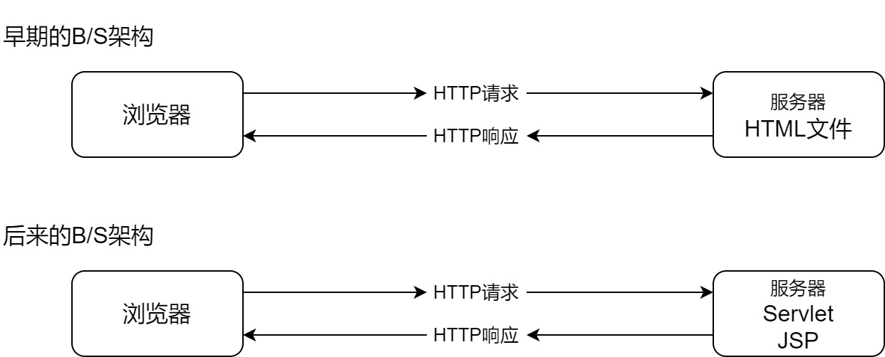
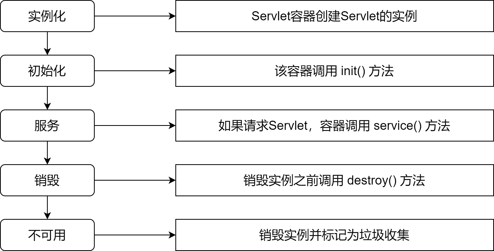

## 基本概念

### C/S架构

C/S架构（Client/Server，客户端/服务器模式），这种结构将需要处理的业务合理地分配到客户端和服务器端，客户端通常负责完成与用户的交互任务，服务器通常负责数据的管理  

优点：

- 客户端的界面和功能可以很丰富
- 应用服务器的负荷较轻
- 响应速度快

缺点：

- 适用面窄，用户群固定
- 维护和升级的成本高，所有的客户端都需要更新版本

### B/S架构

B/S架构（Browser/Server，浏览器/服务器模式） ，该结构将系统功能实现的主要业务逻辑集中到服务器端，极少数业务逻辑在浏览器实现，浏览器通常负责完成与用户的交互任务，服务器通常负责数据的管理  

优点：

- 无需安装客户端，只要有浏览器即可。
- 适用面广，用户群不固定。
- 通过权限控制实现多客户访问的目的，交互性较强。
- 维护和升级的成本低，无需更新所有客户端版本。  

缺点：

- 应用服务器的负荷较重。
- 浏览器的界面和功能想要达到客户端的丰富程度需要花费大量的成本。
- 在跨浏览器上不尽如人意，适配比较麻烦。  

### JavaWeb

web资源主要分为以下两种：

- 静态资源：Web页面中供人们浏览的数据始终不变
- 动态资源：Web页面中供人们浏览的数据由程序产生，不同时间看到的页面不一定相同

JavaWeb主要指使用Java语言进行动态Web资源开发技术的统称，是解决相关Web互联网领域的技术总和



## HTTP协议

### 基础概念

HTTP协议（HyperText Transfer Protocol，超文本传输协议）是由W3C（万维网联盟）组织制定的一种应用层协议 ，主要涉及浏览器的发请求格式和服务器的响应格式  

HTTP默认的端口号为80，HTTPS默认的端口号为443。  

### HTTP请求格式

客户端发送一个HTTP请求到服务器的请求消息主要包括：请求行、请求头、空白行和请求体。

```
POST /task01_demo01/demo1.html HTTP/1.1			//请求行
Host: localhost:8088							//请求头
Content-Length: 21
Cache-Control: max-age=0
User-Agent: Mozilla/5.0 (Windows NT 6.1; WOW64)
												//空白行
name=scott&pwd=123456							//请求体
```

### HTTP响应格式

通常情况下服务器接收并处理客户端发过来的请求后会返回一个HTTP的响应消息，主要包括：响应行、响应头、空白行和响应体  

```html
HTTP/1.1 200 OK									//响应行
Content-Type: text/html							//响应头
Content-Length: 588
Date: Thu, 08 Sep 2021 12:59:54 GMT
												//空白行
<html><head><title>示例1</title></head>		   //响应体
<body><h1>这是一个HTML页面</h1></body>
</html>
```

## Tomcat服务器:star:

### 基本概念

Tomcat本意为公猫，最初由Sun公司成员开发，后来变为开源项目贡献给Apache软件基金会

Tomcat 服务器是一个开源的轻量级Web应用服务器，在中小型系统和并发量小的场合下被普遍使用，是开发和调试Servlet、JSP 程序的首选  

### 目录结构

| 目录    | 作用                                                       |
| ------- | ---------------------------------------------------------- |
| bin     | 主要存放二进制可执行文件和脚本                             |
| conf    | 主要存放各种配置文件                                       |
| lib     | 主要用来存放Tomcat运行需要加载的jar包                      |
| logs    | 主要存放Tomcat在运行过程中产生的日志文件                   |
| temp    | 主要存放Tomcat在运行过程中产生的临时文件                   |
| webapps | 主要存放应用程序，当Tomcat启动时会去加载该目录下的应用程序 |
| work    | 主要存放tomcat在运行时的编译后文件，例如JSP编译后的文件    |

### 启动与关闭

启动：bin --> startup.bat，若控制台稳定出现即启动成功

关闭：bin --> shutdown.bat，关闭Tomcat服务器

> - 启动之前首先安装JDK并配置环境变量JAVA_HOME，若希望Tomcat服务器可以在任意路径启动，则需要配置环境变量CATALINA_HOME  
> - 启动信息乱码的处理方式：logging.properties文件修改为
>   java.util.logging.ConsoleHandler.encoding = GBK  

### 配置文件

server.xml文件时服务器的主配置文件，可以设置端口号、域名或IP、默认加载的项目，请求编码等

```xml
<Connector port="8888" protocol="HTTP/1.1"
                connectionTimeout="20000"
                redirectPort="8443" />
```

tomcat-users.xml文件用来配置管理Tomcat服务器的用户与权限

```xml
<role rolename="manager-gui"/>
<user username="admin" password="123456" roles="manager-gui"/>
```

## Servlet的概念和使用:star:

### 基本概念

Servlet（Server Applet）是Java Servlet的简称，称为小服务程序或服务连接器，是Java语言编写的服务器端程序，换句话说，Servlet就是运行在服务器上的Java类  

Servlet用来完成B/S架构下客户端请求的响应处理，也就是交互式地浏览和生成数据，生成动态Web内容  

### Servlet的编程步骤

1. 建立一个Java Web Application项目并配置Tomcat服务器

2. 自定义类实现Servlet接口或继承HttpServlet类（推荐）并重写service方法

3. 将自定义类的信息配置到web.xml文件并启动项目，配置方式如下：

   ```xml
   <!-- 配置Servlet -->
   <servlet>
       <!-- HelloServlet是Servlet类的别名 -->
       <servlet-name> HelloServlet </servlet-name>
       <!-- com.lagou.task01.HelloServlet是包含路径的真实的Servlet类名 -->
       <servlet-class> com.lagou.task01.HelloServlet </servlet-class>
   </servlet>
   
   <!-- 映射Servlet -->
   <servlet-mapping>
       <!-- HelloServlet是Servlet类的别名，与上述名称必须相同 -->
       <servlet-name> HelloServlet </servlet-name>
       <!-- /hello是供浏览器使用的地址 -->
       <url-pattern> /hello </url-pattern>
   </servlet-mapping>
   ```

> 在浏览器上访问的方式为：`http://localhost:8080/工程路径/url-pattern的内容  `

### Servlet接口

#### 基本概念：

javax.servlet.Servlet接口用于定义所有servlet必须实现的方法

#### 常用的方法：

| 方法声明                                                  | 功能介绍                                                     |
| --------------------------------------------------------- | ------------------------------------------------------------ |
| void **init**(ServletConfig config)                       | 由servlet容器调用，以向servlet指示servlet正在被放入服务中    |
| void **service**(ServletRequest req, ServletResponse res) | 由servlet容器调用，以允许servlet响应请求                     |
| ServletConfig getServletConfig()                          | 返回ServletConfig对象，该对象包含此servlet的初始化和启动参数 |
| String getServletInfo()                                   | 返回有关servlet的信息，如作者、版本和版权                    |
| void **destroy**()                                        | 由servlet容器调用，以向servlet指示该servlet正在退出服务      |

```java
public class HelloServlet implements Servlet {
    @Override
    public void init(ServletConfig servletConfig) throws ServletException {}

    @Override
    public ServletConfig getServletConfig() {
        return null;
    }

    @Override
    public void service(ServletRequest servletRequest, ServletResponse servletResponse) throws ServletException, IOException {
        System.out.println("获得web请求并已响应");
    }

    @Override
    public String getServletInfo() {
        return null;
    }

    @Override
    public void destroy() {
    }
}
```

### GenericServlet类

#### 基本概念：

javax.servlet.GenericServlet类主要用于定义一个通用的、与协议无关的servlet，该类实现了Servlet接口。

若编写通用servlet，只需重写service抽象方法即可  

#### 常用方法

| 方法声明                                                     | 功能介绍                              |
| ------------------------------------------------------------ | ------------------------------------- |
| abstract void **service**(ServletRequest req, ServletResponse res) | 由servlet容器调用允许servlet响应 请求 |

```java
public class HelloServlet2 extends GenericServlet {
    @Override
    public void service(ServletRequest servletRequest, ServletResponse servletResponse) throws ServletException, IOException {
        System.out.println("使用继承GenericServlet的方式获得servlet");
    }
}
```

### HttpServlet类

#### 基本概念

javax.servlet.http.HttpServlet类是个抽象类并继承了GenericServlet类

用于创建适用于网站的HTTP Servlet，该类的子类必须至少重写一个方法  

#### 常用的方法

| 方法声明                                                     | 功能介绍                             |
| ------------------------------------------------------------ | ------------------------------------ |
| void **doGet**(HttpServletRequest req, HttpServletResponse resp) | 处理客户端的GET请求                  |
| void **doPost**(HttpServletRequest req, HttpServletResponse resp) | 处理客户端的POST请求                 |
| void **init**()                                              | 进行初始化操作                       |
| void **service**(HttpServletRequest req, HttpServletResponse resp) | 根据请求决定调用doGet还是 doPost方法 |
| void **destroy**()                                           | 删除实例时释放资源                   |

```java
@WebServlet(name = "HelloServlet4", value = "/hello4")
public class HelloServlet4 extends HttpServlet {
    @Override
    protected void doGet(HttpServletRequest request, HttpServletResponse response) throws ServletException, IOException {
        System.out.println("使用Get方式");
    }


    @Override
    protected void doPost(HttpServletRequest request, HttpServletResponse response) throws ServletException, IOException {
        System.out.println("使用Post方式");
    }

  /*  @Override
    protected void service(HttpServletRequest req, HttpServletResponse resp) throws ServletException, IOException {
        System.out.println("使用注解的方式代替配置文件");
        String method = req.getMethod();
        System.out.println("获取到的请求方式为：" + method);
        if ("get".equalsIgnoreCase(method)){
            doGet(req,resp);
        }
        if ("post".equalsIgnoreCase(method)){
            doPost(req,resp);
        }
    }*/
}
```

### Servlet的生命周期



- 构造方法只被调用一次，当第一次请求Servlet时调用构造方法来创建Servlet的实例。

- init方法只被调用一次，当创建好Servlet实例后立即调用该方法实现Servlet的初始化。

- service方法被多次调用，每当有请求时都会调用service方法来用于请求的响应。

- destroy方法只被调用一次，当该Servlet实例所在的Web应用被卸载前调用该方法来释放当前占用的资源  

  ```java
  public class HelloServlet3 extends HttpServlet {
  
      public HelloServlet3() {
          System.out.println("无参构造被调用了");
      }
  
      @Override
      protected void service(HttpServletRequest req, HttpServletResponse resp) throws ServletException, IOException {
          System.out.println("通过HttpServlet的方式重写，也是使用最多的方式");
      }
  
      @Override
      public void init() throws ServletException {
          System.out.println("开始初始化。。");
      }
  
      @Override
      public void destroy() {
          System.out.println("对象已销毁");
      }
  }
  ```

## POST和GET请求:star:

### GET请求

发出GET请求的主要方式：

1. 在浏览器输入URL并回车
2. 点击\<a\>超链接
3. 点击submit按钮，提交\<form method="get"\>表单  

特点：会将请求数据添加到请求URL地址的后面，只能提交少量的数据、不安全  

### POST请求

发出POST请求的方式：

- 点击submit按钮，提交\<form method="get"\>表单 

特点：请求数据添加到HTTP协议体中，可提交大量数据、安全性好  

### ServletRequest接口

#### 基本概念

javax.servlet.ServletRequest接口主要用于向servlet提供客户端请求信息，可以从中获取到任何请求信息。

Servlet容器创建一个ServletRequest对象，并将其作为参数传递给Servlet的service方法。  

#### 常用方法

| 方法声明                                      | 功能介绍                                                     |
| --------------------------------------------- | ------------------------------------------------------------ |
| String **getParameter**(String name)          | 以字符串形式返回请求参数的值，如果该参数不存在，则返回空值   |
| String[] **getParameterValues**( String name) | 返回一个字符串对象数组，其中包含给定请求参数所具有的所有值，如果该参数不存在，则返回空值 |
| Enumeration **getParameterNames**()           | 返回包含此请求中包含的参数名称的字符串对象的枚举。如果请求没有参数，则方法返回空枚举 |
| Map<String, String[]> **getParameterMap**()   | 返回请求参数的键值对，一个键可以对应多个值                   |
| String getRemoteAddr()                        | 返回发送请求的客户端或最后一个代理的IP地址                   |
| int getRemotePort()                           | 返回发送请求的客户端或最后一个代理的端口号                   |

```html
<!DOCTYPE html>
<html lang="en" xmlns="http://www.w3.org/1999/html">
<head>
    <meta charset="UTF-8">
    <title>测试参数的请求和获取</title>
</head>
<body>
<form action="parameterServlet" method="post">
    姓名：<input type="text" name="name"/> <br>
    年龄：<input type="text" name="age"/><br>
    爱好：<input type="checkbox" name="hobby" value="Java"/>java
        <input type="checkbox" name="hobby" value="C"/>C
        <input type="checkbox" name="hobby" value="C++"/>C++<br>
    <input type="submit">
</form>
</body>
</html>
```

```java
@WebServlet(name = "parameterServlet", value = "/parameterServlet")
public class parameterServlet extends HttpServlet {
    @Override
    protected void doGet(HttpServletRequest request, HttpServletResponse response) throws ServletException, IOException {
        // 一般get请求直接调用doPost方法，即所有请求都交给doPost方法处理
        this.doPost(request,response);
    }

    @Override
    protected void doPost(HttpServletRequest request, HttpServletResponse response) throws ServletException, IOException {
        // 设置请求信息中的编码方式从而解决乱码问题
        request.setCharacterEncoding("UTF-8");

        
        // 获取请求参数的方法一
        // 获取请求参数name的值，
        String name = request.getParameter("name");
        System.out.println("获取到的姓名为：" + name);
        
        // 如果可能有多个值，可以返回一个字符串集，使用for循环输出
        String[] hobbies = request.getParameterValues("hobby");
        System.out.print("获取到的爱好为：");
        for(String hob : hobbies){
            System.out.print(hob + " ");
        }
        System.out.println();
		
        // 可以使用枚举，使用迭代器将数据输出
        Enumeration<String> parameterNames = request.getParameterNames();
        System.out.print("获取到的name为：");
        while (parameterNames.hasMoreElements()){
            System.out.print(parameterNames.nextElement() + " ");
        }

        // 获取请求参数的方法二
        System.out.println();
        Map<String, String[]> parameterMap = request.getParameterMap();
        Set<Map.Entry<String, String[]>> entries = parameterMap.entrySet();
        for (Map.Entry<String, String[]> ma : entries){
            System.out.print(ma.getKey() + " 对应的数值有：");
            for (String str : ma.getValue()){
                System.out.print(str + " ");
            }
            System.out.println();
        }
    }
}
```

### HttpServletRequest 接口

#### 基本概念

- javax.servlet.http.HttpServletRequest接口是ServletRequest接口的子接口，主要用于提供HTTP请求信息的功能。
- 不同于表单数据，在发送HTTP请求时，HTTP请求头直接由浏览器设置。
- 可直接通过HttpServletRequest对象提供的一系列get方法获取请求头数据。  

#### 常用的方法

| 方法声明                     | 功能介绍                                      |
| ---------------------------- | --------------------------------------------- |
| String getRequestURI()       | 返回此请求的资源路径信息                      |
| StringBuffer getRequestURL() | 返回此请求的完整路径信息                      |
| String getMethod()           | 返回发出此请求的HTTP方法的名称，例如GET、POST |
| String getQueryString()      | 返回路径后面请求中附带的参数                  |
| String getServletPath()      | 返回此请求中调用servlet的路径部分             |

```java
// 其他信息的获取
System.out.println("发送请求的客户端IP地址为：" + request.getRemoteAddr()); 
	// 0:0:0:0:0:0:0:1
System.out.println("发送请求的客户端端口号为：" + request.getRemotePort()); 
	// 12054
System.out.println("请求资源的路径为：" + request.getRequestURI());      
	// /test01_demo02/parameterServlet
System.out.println("请求资源的完整路径为：" + request.getRequestURL());  
	//http://localhost:8080/test01_demo02/parameterServlet
System.out.println("请求方式为：" + request.getMethod());     // POST
System.out.println("请求的附带参数为：" + request.getQueryString()); // null
System.out.println("请求的servlet路径为：" + request.getServletPath()); 
	// /parameterServlet
```

### ServletResponse接口  

#### 基本概念

- javax.servlet.ServletResponse接口用于定义一个对象来帮助Servlet向客户端发送响应
- Servlet容器创建ServletResponse对象，并将其作为参数传递给servlet的service方法  

#### 常用方法

| 方法声明                         | 功能介绍                                                     |
| -------------------------------- | ------------------------------------------------------------ |
| PrintWriter getWriter()          | 返回可向客户端发送字符文本的PrintWriter对象                  |
| String getCharacterEncoding()    | 获取响应内容的编码方式                                       |
| void setContentType(String type) | 如果尚未提交响应，则设置发送到客户端响应的内容类型。内容类型 可以包括字符编码规范，例如text/html;charset=UTF-8 |

```java
	@Override
    protected void doPost(HttpServletRequest request, HttpServletResponse response) throws ServletException, IOException {
        // 像浏览器发送响应
        String characterEncoding = response.getCharacterEncoding();
        System.out.println("服务器响应数据的默认编码方式为：" + characterEncoding); //ISO-8859-1
        // 修改编码方式为UTF-8
        response.setContentType("text/html;charset=UTF-8");
        PrintWriter writer = response.getWriter();
        writer.write("I believe <br>");
        writer.write("我相信");
        System.out.println("数据发送成功");
        writer.close();
    }
```

### HttpServletResponse接口  

#### 基本概念：

javax.servlet.http.HttpServletResponse接口继承ServletResponse接口，以便在发送响应时提供特定于HTTP的功能。  

#### 常用的方法

| 方法声明                           | 功能介绍                                          |
| ---------------------------------- | ------------------------------------------------- |
| void sendRedirect(String location) | 使用指定的重定向位置URL向客户端发送临时重定向响应 |

```java
// 继承HttpServlet
public class HelloWorld extends HttpServlet {
    // 重写HttpServlet中的doGet方法
    protected void doGet(HttpServletRequest request, HttpServletResponse
    response)
    throws IOException, ServletException {
        // 设置响应输出编码，避免中文乱码
        response.setContentType(“text/html;charset=utf-8”);
        // 获取响应输出流
        PrintWriter out= response.getWriter();
        // 利用输出流输出信息
        out.println(“<html><body> Hello world！</body></html>”);
        //关闭流
        out.close();
    }
}
```

## Servlet接收中文乱码:star:

### 接收乱码的原因：

浏览器在提交表单时，会对中文参数值进行自动编码。当Tomcat服务器接收到浏览器请求后自动解码，当编码与解码方式不一致时,就会导致乱码。  

### 解决Post接收乱码

```java
//接收之前设置编码方式：
	request.setCharacterEncoding("utf-8");
/*提示：
	必须在调用request.getParameter("name")之前设置*/
```

### 解决Get接收乱码

```java
将接收到的中文乱码重新编码:
    // 接收到get请求的中文字符串
    String name = request.getParameter("name");
    // 将中文字符重新编码，默认编码为ISO-8859-1
    String userName = new String(name.getBytes(“ISO-8859-1”),“utf-8");
```

### 解决响应乱码

```java
// 设置响应输出编码，避免中文乱码
response.setContentType("text/html;charset=utf-8");
```

## ServletConfig接口（熟悉）

### 概念：

javax.servlet.ServletConfig接口用于描述Servlet本身的相关配置信息，在初始化期间用于将信息传递给Servlet配置对象。  

### 配置方法

```xml
<!-- 在web.xml中配置ServletConfig初始化参数 -->
<servlet>
    <servlet-name>actionservlet</servlet-name>
    <servlet-class>com.lagou.demo01.ActionServlet</servlet-class>
    <!-- 配置 Serlvet 的初始化参数 -->
    <init-param>
        <!-- 参数名 -->
        <param-name>config</param-name>
        <!-- 参数值 -->
        <param-value>struts.xml</param-value>
    </init-param>
</servlet>
```

### 常用的方法

| 方法声明                             | 功能介绍                                                     |
| ------------------------------------ | ------------------------------------------------------------ |
| String getServletName()              | 返回Servlet的别名                                            |
| String getInitParameter(String name) | 返回包含初始化参数值的字符串，如果该参数不存在，则返回null   |
| Enumeration getInitParameterNames()  | 将servlet的初始化参数的名称作为字符串对象的枚举返回，如果 servlet没有初始化参数，则返回空枚举 |
| ServletContext getServletContext()   | 返回对调用方正在其中执行的ServletContext的引用               |

## ServletContext接口（熟悉）

### 概念：

- javax.servlet.ServletContext接口主要用于定义一组方法，Servlet使用这些方法与它的Servlet容器通信。
- 服务器容器在启动时会为每个项目创建唯一的一个ServletContext对象，用于实现多个Servlet之间的信息共享和通信。
- 在Servlet中通过`this.getServletContext()`方法可以获得ServletContext对象。  

### 配置方法

```xml
<!--在web.xml中配置ServletContext初始化参数 -->
<context-param>
    <param-name>username</param-name>
    <param-value>scott</param-value>
<context-param>
<context-param>
    <param-name>password</param-name>
    <param-value>tiger</param-value>
<context-param>
```

### 常用方法

| 方法声明                                      | 功能介绍                                                     |
| --------------------------------------------- | ------------------------------------------------------------ |
| String getInitParameter(String name)          | 返回包含初始化参数值的字符串，如果该参数不存在，则返回 null  |
| Enumeration getInitParameterNames()           | 将servlet的初始化参数的名称作为字符串对象的枚举返回，如 果servlet没有初始化参数，则返回空枚举 |
| String getRealPath(String path)               | 返回包含给定虚拟路径的实际路径的字符串                       |
| String getContextPath()                       | 返回与此上下文关联的主路径                                   |
| InputStream getResourceAsStream(String path)  | 将位于指定路径的资源作为InputStream对象返回                  |
| void setAttribute(String name, Object object) | 将指定的属性名和属性值绑定到当前对象                         |
| Object getAttribute(String name)              | 根据执行的属性名获取属性值                                   |
| void removeAttribute(String name)             | 删除指定的属性名信息                                         |


