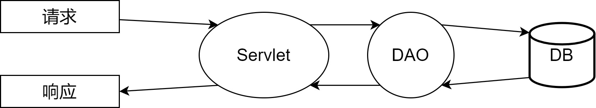
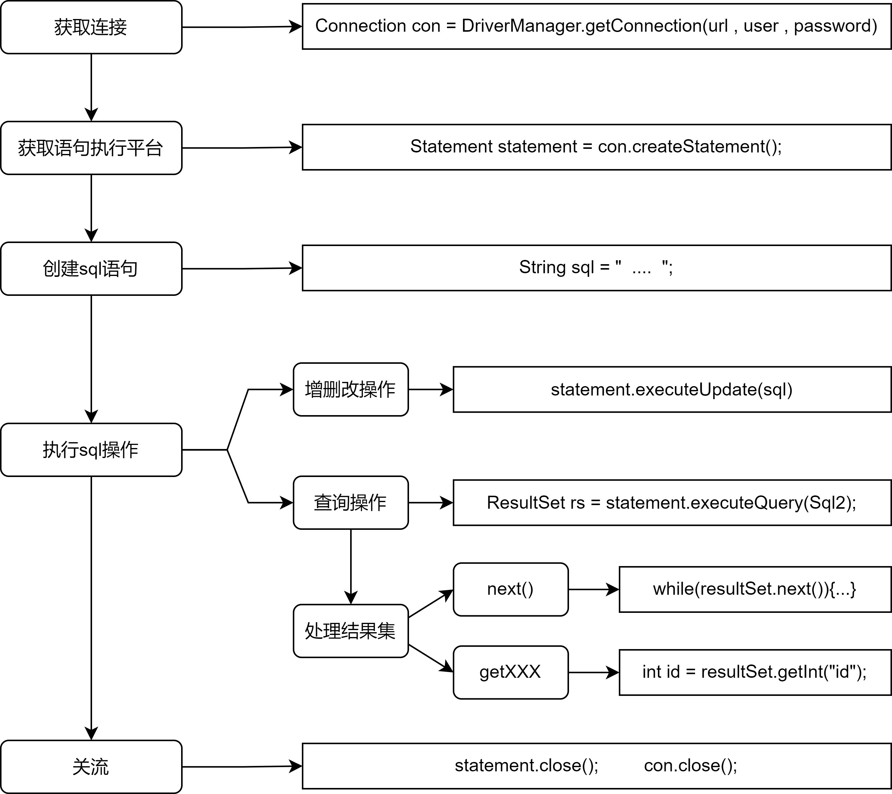

## Servlet+JDBC应用（重点）

在Servlet中可以使用JDBC技术访问数据库，常见功能如下：  

- 查询DB数据，然后生成显示页面，例如：列表显示功能。
- 接收请求参数，然后对DB操作，例如：注册、登录、修改密码等功能。  

为了方便重用和便于维护等目的，经常会采用DAO（Data Access Object）模式对数据库操作进行独立封装  



### DAO工厂（工厂模式）

工厂类：封装了对象的创建细节，为调用者提供符合要求的对象

### JDBC回顾



## 重定向:star:

### 概念

重定向是指当浏览器请求一个URL时，服务器返回一个重定向指令以及一个302状态码，告诉浏览器地址已经变了，麻烦使用新的URL再重新发送新请求。

### 方法

实现重定向需要借助javax.servlet.http.HttpServletResponse接口中的以下方法：

| 方法声明                               | 功能介绍                                          |
| -------------------------------------- | ------------------------------------------------- |
| void **sendRedirect**(String location) | 使用指定的重定向位置URL向客户端发送临时重定向响应 |

```java
@Override
protected void doPost(HttpServletRequest request, HttpServletResponse response) throws ServletException, IOException {
    response.sendRedirect("target.html");
}
```

### 原理

```ascii
┌───────┐   GET /hi     ┌───────────────┐
│Browser│ ────────────> │RedirectServlet│
│       │ <──────────── │               │
└───────┘   302         └───────────────┘


┌───────┐  GET /hello   ┌───────────────┐
│Browser│ ────────────> │ HelloServlet  │
│       │ <──────────── │               │
└───────┘   200 <html>  └───────────────┘
```

### 特点

- 重定向之后，浏览器地址栏的URL会发生改变
- 重定向过程中会将前面Request对象销毁，然后创建一个新的Request对象
- 重定向的URL可以是其它项目工程 

## 转发:star:

### 概念

一个Web组件（Servlet/JSP）将未完成的处理通过容器转交给另外一个Web组件继续处理，转发的各个组件会共享Request和Response对象。  

### 方法

- 绑定数据到Request对象

  | 方法声明                                | 功能介绍                                                   |
  | --------------------------------------- | ---------------------------------------------------------- |
  | Object getAttribute(String name)        | 将指定属性值作为对象返回，若给定名称属性不存在，则返回空值 |
  | void setAttribute(String name,Object o) | 在此请求中存储属性值                                       |

- 获取转发器对象

  | 方法声明                                                | 功能介绍                                                     |
  | ------------------------------------------------------- | ------------------------------------------------------------ |
  | RequestDispatcher **getRequestDispatcher**(String path) | 返回一个RequestDispatcher对象，该对象充当位于给定路径上的资源的包装器 |

- 转发操作

  | 方法声明                                                     | 功能介绍                                                     |
  | ------------------------------------------------------------ | ------------------------------------------------------------ |
  | void **forward**(ServletRequest request, ServletResponse response) | 将请求从一个servlet转发到服务器上的另一个资源（Servlet、JSP文件或HTML文件） |

  ```java
  @Override
  protected void doPost(HttpServletRequest request, HttpServletResponse response) throws ServletException, IOException {
      // 获取转发器rd
      RequestDispatcher rd = request.getRequestDispatcher("/target");
      // 使用forward进行转发操作
      requestDispatcher.forward(request,response);
  }
  ```

### 特点

- 转发之后浏览器地址栏的URL不会发生改变。
- 转发过程中共享Request对象。
- 转发的URL不可以是其它项目工程（例如baidu.com）

### 重定向和转发的比较  


## Servlet线程安全:star:

- 服务器在收到请求之后，会启动一个线程来进行相应的请求处理。
- 默认情况下，服务器为每个Servlet只创建一个对象实例。当多个请求访问同一个Servlet时，会有多个线程访问同一个Servlet对象，此时就可能发生线程安全问题。
- 多线程并发逻辑，需要使用synchronized对代码加锁处理，但尽量避免使用  

## 状态管理:star:

HTTP 协议是一个无状态的协议，简单理解就是两次请求/响应无法记录或保存状态信息。

但是动态 Web 项目开发是需要保存请求状态的，比如用户的登录状态，但 HTTP 协议层不支持状态保存，所以需要有状态管理解决方案来解决这个问题。

> 简单理解，就是http没有状态，是个脸盲，一次连接之后下一次就又不认识了，为了能保证持续对话，需要加一个标记，例如脑门上刻个"用户A"之类的，这样就可以这次没说完的话下次接着聊了

多次交互的数据状态可以在客户端保存，也可以在服务器端保存。状态管理主要分为以下两类：

- 客户端管理：将状态保存在客户端。基于Cookie技术实现。
- 服务器管理：将状态保存在服务器端。基于Session技术实现。  

## Cookie技术:star:

Cookie本意为"饼干"的含义，在这里表示客户端以"名-值"形式进行保存的一种技术  

- 浏览器向服务器发送请求时，服务器将数据以Set-Cookie消息头的方式响应给浏览器，然后浏览器会将这些数据以文本文件的方式保存起来。
- 当浏览器再次访问服务器时，会将这些数据以Cookie消息头的方式发送给服务器  

### 方法

- 使用javax.servlet.http.Cookie类的构造方法实现Cookie的创建

  | 方法声明                          | 功能介绍                 |
  | --------------------------------- | ------------------------ |
  | Cookie(String name, String value) | 根据参数指定数值构造对象 |

- 使用javax.servlet.http.HttpServletResponse接口的成员方法实现Cookie的添加  

  | 方法声明                      | 功能介绍                 |
  | ----------------------------- | ------------------------ |
  | void addCookie(Cookie cookie) | 添加参数指定的对象到响应 |

  ```java
  @Override
  protected void doPost(request, response) throws ... {
      // 创建cookie
      Cookie cookie = new Cookie("name", "liubei");
      // 返回cookie到浏览器上
      response.addCookie(cookie);
  }
  ```

- 使用javax.servlet.http.HttpServletRequest接口的成员方法实现Cookie对象的获取

  | 方法声明              | 功能介绍                         |
  | --------------------- | -------------------------------- |
  | Cookie[] getCookies() | 返回此请求中包含的所有Cookie对象 |

- 使用javax.servlet.http.Cookie类的构造方法实现Cookie对象中属性的获取和修改  

  | 方法声明                       | 功能介绍                 |
  | ------------------------------ | ------------------------ |
  | String getName()               | 返回此Cookie对象中的名字 |
  | String getValue()              | 返回此Cookie对象的数值   |
  | void setValue(String newValue) | 设置Cookie的数值         |

  ```java
  @Override
  protected void doPost(request, response) throws ... {
      // 获取cookie对象
  	Cookie[] cookies = request.getCookies();
      // 获取cookie信息
      for (Cookie co : cookies){
          System.out.println("获取到的Cookie name是：" + co.getName() + 
                             " 对应的value是：" + co.getValue());
      }
  }
  ```

### 生命周期

默认情况下，浏览器会将Cookie信息保存在内存中，只要浏览器关闭，Cookie信息就会消失

如果希望关闭浏览器后Cookie信息仍有效，可以通过Cookie类的成员方法实现

| 方法声明                   | 功能介绍                               |
| -------------------------- | -------------------------------------- |
| int getMaxAge()            | 返回cookie的最长使用期限（以秒为单位） |
| void setMaxAge(int expiry) | 设置cookie的最长保留时间（秒）         |

```java
@Override
protected void doPost(request, response) throws ... {
    // 创建cookie并将其返回到浏览器
    Cookie cookie = new Cookie("name", "liubei");
    response.addCookie(cookie);
    // 获取其生命周期长度
    // 如果为负数，则是随着浏览器关闭而关闭
    // 如果为0则即刻关闭，如果是整数，则代表秒数
    int maxAge = cookie.getMaxAge();
    System.out.println("cookie的生命周期是：" + maxAge);
    cookie.setMaxAge(60*10);	// 生命周期设置为十分钟
}
```

### 路径问题

浏览器在访问服务器时，会比较Cookie的路径与请求路径是否匹配，只有匹配的Cookie才会发送给服务器  

Cookie的默认路径等于添加这个Cookie信息时的组件路径，例如：`/项目名/目录/add`请求添加了一个Cookie信息，则该Cookie的路径是 `/项目名/目录  `

访问的请求地址必须符合Cookie的路径或者其子路径时，浏览器才会发送Cookie信息  

| 方法声明                 | 功能介绍             |
| ------------------------ | -------------------- |
| void setPath(String uri) | 设置cookie的路径信息 |

### 特点

Cookie技术不适合存储所有数据，程序员只用于存储少量、非敏感信息，原因如下：

- 将状态数据保存在浏览器端，不安全。
- 保存数据量有限制，大约4KB左右。
- 只能保存字符串信息。
- 可以通过浏览器设置为禁止使用。  

## Session技术:star:

Session本意为"会话"的含义，是用来维护一个客户端和服务器关联的一种技术  

浏览器访问服务器时，服务器会为每一个浏览器都在服务器端的内存中分配一个空间，用于创建一个Session对象，该对象有一个id属性且该值唯一，我们称为SessionId，并且服务器会将这个**SessionId**以**Cookie**方式发送给浏览器存储  

浏览器再次访问服务器时会将SessionId发送给服务器，服务器可以依据SessionId查找相对应的Session对象  

### 方法

- 使用javax.servlet.http.HttpServletRequest接口的成员方法实现Session的获取  

  | 方法声明                     | 功能介绍                                            |
  | ---------------------------- | --------------------------------------------------- |
  | HttpSession **getSession**() | 返回此请求关联的当前Session，若此请求没有则创建一个 |

- 使用javax.servlet.http.HttpSession接口的成员方法实现判断和获取  

  | 方法声明            | 功能介绍                  |
  | ------------------- | ------------------------- |
  | boolean **isNew**() | 判断是否为新创建的Session |
  | String **getId**()  | 获取Session的编号         |

  ```java
  @Override
  protected void doPost(request, response) throws ... {
      // 获取session或者创建一个session
      HttpSession session = request.getSession();
      // 判断是否为新创建的session
      System.out.println(session.isNew()? "是新创建的session" : "不是新创建的session");
      // 如果是，打印id
      System.out.println("对应的session的id为：" + session.getId());
  }
  ```

- 使用javax.servlet.http.HttpSession接口的成员方法实现属性的管理

  | 方法声明                                         | 功能介绍                                                     |
  | ------------------------------------------------ | ------------------------------------------------------------ |
  | Object **getAttribute**(String name)             | 返回在此会话中用指定名称绑定的对象，如果没有对象在 该名称下绑定，则返回空值 |
  | void **setAttribute**(String name, Object value) | 使用指定的名称将对象绑定到此会话                             |
  | void **removeAttribute**(String name)            | 从此会话中删除与指定名称绑定的对象                           |

  ```java
  @Override
  protected void doPost(request, response) throws ... {        
  	// 获取对应的session
      HttpSession session = request.getSession();
      // 设置属性名和属性值
      session.setAttribute("name","machao");
      System.out.println("获取到的session的值为" + session.getAttribute("name"));
      // 删除指定属性名的属性值
      session.removeAttribute("name");
      System.out.println("获取到的session的值为" + session.getAttribute("name"));
  }
  ```

### 生命周期

为了节省服务器内存空间资源，服务器会将空闲时间过长的Session对象自动清除掉，服务器默认的超时限制一般是30分钟  

- 使用javax.servlet.http.HttpSession接口的成员方法实现失效实现的获取和设置

  | 方法声明                                  | 功能介绍     |
  | ----------------------------------------- | ------------ |
  | int getMaxInactiveInterval()              | 获取失效时间 |
  | void setMaxInactiveInterval(int interval) | 设置失效时间 |

- 可以配置web.xml文件修改失效时间

  ```xml
  <session-config>
  	<session-timeout>30</session-timeout>
  </session-config>
  ```

### 特点

- 数据比较安全。
- 能够保存的数据类型丰富，而Cookie只能保存字符串。
- 能够保存更多的数据，而Cookie大约保存4KB。
- 数据保存在服务器端会占用服务器的内存空间，如果存储信息过多、用户量过大，会严重影响服务器的性能。  

