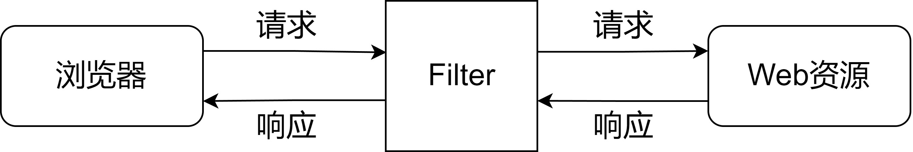

## Filter过滤器

### 概念

Filter本意为”过滤“的含义，是JavaWeb的三大组件之一

- 三大组件：`Servlet`、`Filter`、`Listener  `

过滤器是向 Web 应用程序的请求和响应处理添加功能的 Web 服务组件

过滤器相当于浏览器与Web资源之间的一道过滤网，在访问资源之前通过一系列的过滤器对请求进行修改、判断以及拦截等，也可以对响应进行修改、判断以及拦截等  



### 使用方式

自定义类实现Filter接口并重写doFilter方法  

```java
public class LoginFilter implements Filter {
    public void doFilter(ServletRequest request, ServletResponse response,
    FilterChain chain) throws IOException,ServletException {
        //TODO 处理逻辑，必须调用下面的方法
        chain.doFilter(request,response);
    }
}
```

在web.xml文件中配置过滤器

```xml
<filter>
    <filter-name>LoginFilter</filter-name>
    <filter-class>com.lagou.LoginFilter</filter-class>
</filter>

<filter-mapping>
    <filter-name>LoginFilter</filter-name>
    <url-pattern>/*</url-pattern>
</filter-mapping>
```

### Filter接口


