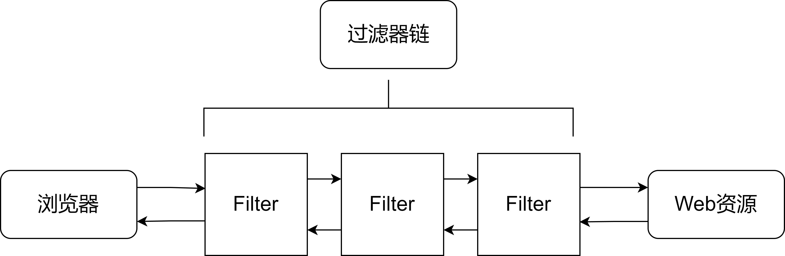

## Filter过滤器

### 概念

Filter本意为"过滤"的含义，是JavaWeb的三大组件之一

- 三大组件：`Servlet`、`Filter`、`Listener  `

过滤器是向 Web 应用程序的请求和响应处理添加功能的 Web 服务组件

过滤器相当于浏览器与Web资源之间的一道过滤网，在访问资源之前通过一系列的过滤器对请求进行修改、判断以及拦截等，也可以对响应进行修改、判断以及拦截等  


### 使用方式

自定义类实现Filter接口并重写doFilter方法  

```java
public class LoginFilter implements Filter {
    public void doFilter(ServletRequest request, ServletResponse response,
    FilterChain chain) throws IOException,ServletException {
        //TODO 处理逻辑，必须调用下面的方法
        chain.doFilter(request,response);
    }
}
```

在web.xml文件中配置过滤器

```xml
<filter>
    <filter-name>LoginFilter</filter-name>
    <filter-class>com.lagou.LoginFilter</filter-class>
</filter>

<filter-mapping>
    <filter-name>LoginFilter</filter-name>
    <url-pattern>/*</url-pattern>
</filter-mapping>
```

### Filter接口

javax.servlet.Filter接口主要用于描述过滤器对象，可以对资源的请求和资源的响应操作进行筛选操作 

#### 常用方法：

| 方法声明                                                     | 功能介绍                |
| ------------------------------------------------------------ | ----------------------- |
| void init(FilterConfig filterConfig)                         | 实现过滤器的初始化 操作 |
| void doFilter(ServletRequest request, ServletResponse response, FilterChain chain) | 执行过滤操作的功能      |
| void destroy()                                               | 实现过滤器的销毁操 作   |

```java
// 判断Session中是否有用户信息，如果没有则拦截，有则放行
@Override
public void doFilter(ServletRequest servletRequest, ServletResponse servletResponse, FilterChain filterChain) throws IOException, ServletException {
    // 首先将类型转换成HttpServletRequest类型，然后调用它的getSession方法获取session
    HttpServletRequest hsp = (HttpServletRequest) servletRequest;
    HttpSession session = hsp.getSession();
    // 获取session中的"userName"属性的值，然后进行判断
    Object userName = session.getAttribute("userName");
    if (null == userName){
        // 如果值为空，那就返回到login页面
        servletRequest.getRequestDispatcher("login.jsp").forward(servletRequest, servletResponse);
    } else {
        // 如果值不为空，那就放行
        filterChain.doFilter(servletRequest, servletResponse);
    }
}
```

### FilterConfig接口

javax.servlet.FilterConfig接口主要用于描述过滤器的配置信息

#### 常用方法

| 方法声明                             | 功能介绍                 |
| ------------------------------------ | ------------------------ |
| String getFilterName()               | 获取过滤器的名字         |
| String getInitParameter(String name) | 获取指定的初始化参数信息 |
| Enumeration getInitParameterNames()  | 获取所有的初始化操作名称 |
| ServletContext getServletContext()   | 获取ServletContext对象   |

### 多个过滤器的使用

如果有多个过滤器都满足过滤的条件，则容器**依据映射的先后顺序**来调用各个过滤器  



### 优点

实现代码的"可插拔性"，即增加或减少某个功能模块，不会影响程序的正常执行
可以将多个相同处理逻辑的模块集中写在过滤器里面，可实现重复利用、也方便代码的维护  

## Listener监听器  

### 概念

Servlet规范中定义的一种特殊的组件（接口），用来监听Servlet容器产生的事件并进行相应的处理  

容器产生的事件分类如下：

- 生命周期相关的事件
- 属性状态相关的事件
- 存值状态相关的事件  

### 分类

| 监听器类型                                       | 功能介绍                            |
| ------------------------------------------------ | ----------------------------------- |
| javax.servlet.ServletRequestListener             | 监听request作用域的创建和销毁       |
| javax.servlet.ServletRequestAttributeListener    | 监听request作用域的属性状态变化     |
| javax.servlet.http.HttpSessionListener           | 监听session作用域的创建和销毁       |
| javax.servlet.http.HttpSessionAttributeListener  | 监听session作用域的属性状态变化     |
| javax.servlet.ServletContextListener             | 监听application作用域的创建和销毁   |
| javax.servlet.ServletContextAttributeListener    | 监听application作用域的属性状态变化 |
| javax.servlet.http.HttpSessionBindingListener    | 监听对象与session的绑定和解除       |
| javax.servlet.http.HttpSessionActivationListener | 监听session数值的钝化和活化         |

### ServletRequestListener  

在ServletRequest创建和关闭时都会通知ServletRequestListener监听器

常用方法：

| 方法声明                                         | 功能介绍                       |
| ------------------------------------------------ | ------------------------------ |
| void requestInitialized(ServletRequestEvent sre) | 实现ServletRequest对象的初始化 |
| void requestDestroyed(ServletRequestEvent sre)   | 实现ServletRequest对象的销毁   |

### ServletRequestAttributeListener  

向ServletRequest添加、删除或者替换一个属性的时候，会收到通知

常用方法：

| 方法声明                                                  | 功能介绍       |
| --------------------------------------------------------- | -------------- |
| void attributeAdded(ServletRequestAttributeEvent srae)    | 增加属性时触发 |
| void attributeReplaced(ServletRequestAttributeEvent srae) | 修改属性时触发 |
| void attributeRemoved(ServletRequestAttributeEvent srae)  | 删除属性时触发 |

### HttpSessionListener

当一个HttpSession刚被创建或者失效（invalidate）的时候，会收到通知

常用方法：

| 方法声明                                  | 功能介绍                                                     |
| ----------------------------------------- | ------------------------------------------------------------ |
| void sessionCreated(HttpSessionEventse)   | 当一个HttpSession对象被创建时会调用这个方法                  |
| void sessionDestroyed(HttpSessionEventse) | 当一个HttpSession超时或者调用HttpSession的invalidate()方法让它销毁时，将会调用这个方法 |

### HttpSessionAttributeListener 

HttpSession中添加、删除或者替换一个属性的时候，将会收到通知

常用方法：

| 方法声明                                           | 功能介绍                                   |
| -------------------------------------------------- | ------------------------------------------ |
| void attributeAdded(HttpSessionBindingEvent se)    | 当往会话中加入一个属性的时候会调用这个方法 |
| void attributeRemoved(HttpSessionBindingEventse)   | 当从会话中删除一个属性的时候会调用这个方法 |
| void attributeReplaced(HttpSessionBindingEvent se) | 当改变会话中的属性的时候会调用这个方法     |

### ServletContextListener

在ServletContext创建和关闭时都会通知ServletContextListener监听器  

常用方法：

| 方法声明                                         | 功能介绍                                                     |
| ------------------------------------------------ | ------------------------------------------------------------ |
| void contextInitialized(ServletContextEvent sce) | 当ServletContext创建的时候，将会调用这个方法                 |
| void contextDestroyed(ServletContextEvent sce)   | 当ServletContext销毁的时候（例如关闭应用服务器 或者重新加载应用），将会调用这个方法 |

### ServletContextAttributeListener

向ServletContext添加、删除或者替换一个属性的时候，会通知此监听器

常用方法：

| 方法声明                                                  | 功能介绍                                  |
| --------------------------------------------------------- | ----------------------------------------- |
| void attributeAdded(ServletContextAttributeEvent scae)    | 往ServletContext中加入一个属性的时 候触发 |
| void attributeRemoved(ServletContextAttributeEvent scae)  | 从ServletContext中删除一个属性的时 候触发 |
| void attributeReplaced(ServletContextAttributeEvent scae) | 改变ServletContext中属性的时候触发        |

### HttpSessionBindingListener

HttpSession中绑定和解除绑定时，会通知此服务器

常用方法：

| 方法声明                                         | 功能介绍                   |
| ------------------------------------------------ | -------------------------- |
| void valueBound(HttpSessionBindingEvent event)   | 有对象绑定时调用该方法     |
| void valueUnbound(HttpSessionBindingEvent event) | 有对象解除绑定时调用该方法 |

### HttpSessionActivationListener  

当有session数值的钝化和活化操作时，会通知此监听器

常用方法：

| 方法声明                                       | 功能介绍               |
| ---------------------------------------------- | ---------------------- |
| void sessionWillPassivate(HttpSessionEvent se) | 有钝化操作时调用该方法 |
| void sessionDidActivate(HttpSessionEvent se)   | 有活化操作时调用该方法 |

配置context.xml文件：

```xml
<Manager className="org.apache.catalina.session.PersistentManager" saveOnRestart="true">
    <!-- 配置文件存放的路径信息，可以自由指定 -->
    <Store className="org.apache.catalina.session.FileStore" directory="C:\session"/>
</Manager>
```

### 实战案例

```java
public class OnlineUser implements HttpSessionListener, ServletContextListener {
    // 设置一个servletcontext对象的引用作为全局对象来记录当前用户的数量
    private ServletContext servletContext = null;

    @Override
    public void contextInitialized(ServletContextEvent servletContextEvent) {
        servletContext = servletContextEvent.getServletContext();
    }

    @Override
    public void contextDestroyed(ServletContextEvent servletContextEvent) {
        servletContext = null;
    }

    @Override
    public void sessionCreated(HttpSessionEvent httpSessionEvent) {
        System.out.println("有新用户上线了");
        Object count = servletContext.getAttribute("count");
        // 若当前用户为第一个用户，直接将值设置为1
        if (null == count) {
            servletContext.setAttribute("count",1);
        } else {
            // 若当前用户不是第一个用户，则将值+1再设置进去
            Integer integer = (Integer)count;
            integer++;
            servletContext.setAttribute("count",integer);
        }
        System.out.println("当前在线用户为：" + servletContext.getAttribute("count"));
    }

    @Override
    public void sessionDestroyed(HttpSessionEvent httpSessionEvent) {
        System.out.println("有用户已下线");
    }
}
```


