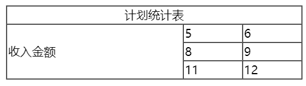
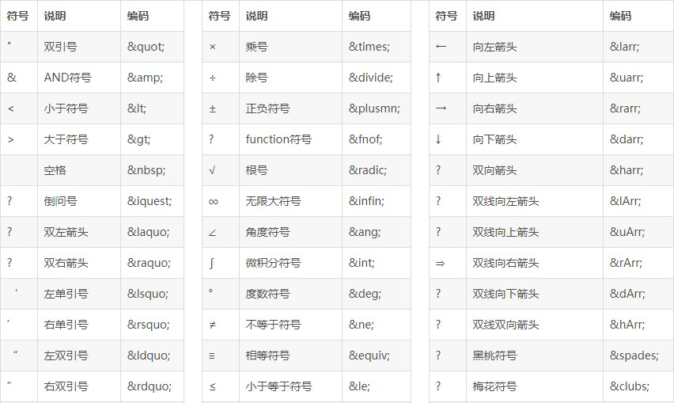
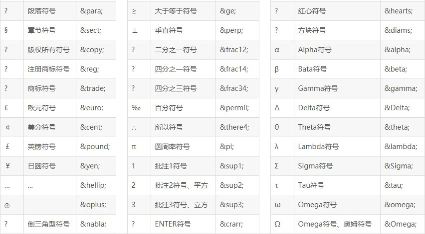
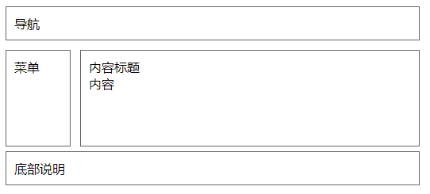
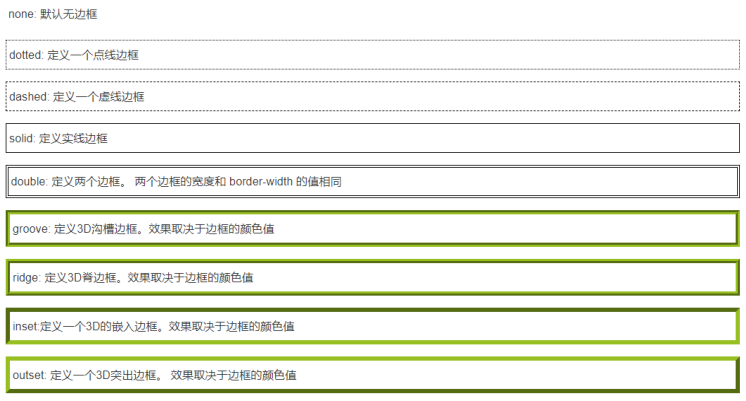
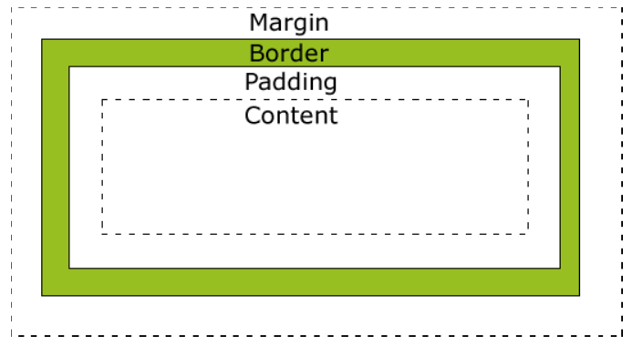
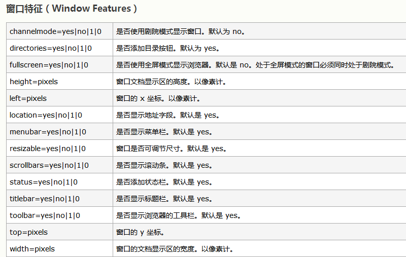

# HTML

## 文件标签

<table>
    <tr>
        <td colspan=2>标签</td>
        <td>作用</td>
    </tr>
    <tr>
        <td colspan=2>&lt;html&gt;</td>
        <td>代表当前书写的是一个HTML文档</td>
    </tr>
    <tr>
        <td colspan=2>&lt;head&gt;</td>
        <td>存储的本页面的一些重要的信息，它不会显示</td>
    </tr>
    <tr>
        <td colspan=2>&lt;title&gt;</td>
        <td>用于定义页面的标题的，是head的子标签</td>
    </tr>
    <tr>
        <td rowspan=4>&lt;body&gt;</td>
    </tr>
    <tr>
        <td>test</td>
        <td>用于设置文字颜色</td>
    </tr>
    <tr>
        <td>bgcolor</td>
        <td>用于设置页面背景色</td>
    </tr>
    <tr>
        <td>background</td>
        <td>用于设置页面背景图片</td>
    </tr>
</table>

## 排版标签

| 标签                                               |                        功能                         |
| :------------------------------------------------- | :-------------------------------------------------: |
| \<!-- 注释 --\>                                    |                        注释                         |
| \<br/\>   or  \<br\>                               |                        换行                         |
| \<p\>  <br />常用标签：align :设置对齐方式         | 段落，会自动换行<br />对齐方式：left  right  center |
| \<hr\><br />常用标签：align , size , width , color |                     水平线标签                      |
| \<div\>                                            |         块标签，起到容器的作用，会自动换行          |

## 字体标签

| \<font\>常用属性 | 功能                                |
| ---------------- | ----------------------------------- |
| face             | 字体，例如：宋体，隶书              |
| size             | 用于设置字的大小 默认设置1-7，7最大 |
| color            | 用于设置字的颜色                    |

颜色的表达方式：

1. 使用十六进制，取值范围 \#000000 ~ #FFFFFF  当颜色值成对时，例如：\#cc3300 可以简化为： \#c30
2. RGB颜色表示法：RGB(x,y,x) 。x、y、z是0 ～ 255之间的整数。rgb字母大小写无所谓

| 标签            | 作用                                                         |
| --------------- | ------------------------------------------------------------ |
| \<h1> ... \<h6> | 给一段文字起一个标题<br />自动换行，字体加粗，相互之前有一定的距离 |
| \<b\>           | 字体加粗                                                     |
| \<i\>           | 字体倾斜                                                     |
| \<del\>         | 删除线                                                       |
| \<u\>           | 下划线                                                       |

## 列表标签

- ol：有序列表
  - type='A'：字母排序
  - type='I'：罗马排序
  - start=“3” 序列从几开始
- ul：无序列表
  - type="disc"：默认，实心圆
  - type="square"：方块
  - type="circle"：空心圆

## 图像标签

| \常用属性                                         | 作用                   |
| ------------------------------------------------------- | ---------------------- |
| src                                                     | 图片的路径             |
| width                                                   | 图片宽度               |
| height                                                  | 图片高度               |
| border                                                  | 图片边框               |
| alt                                                     | 图片不显示时的文本信息 |
| title                                                   | 鼠标悬停时的文本信息   |
| align<br />可取值：left , right , middle , top , bottom | 图片附件文字的对其方式 |

## 超链接标签

| \<a\>常用属性                      | 作用                                                         |
| ---------------------------------- | ------------------------------------------------------------ |
| href                               | 要跳转的路径                                                 |
| target<br />可取值：_blank , _self | 规定在何处打开这个链接<br />可取值：新窗口 ， 本窗口（默认） |

```html
<!-- 发邮件 -->
<a href="mailto:sunguoan@163.com">联系站长</a>

<!-- qq聊天窗口 -->
<a href="tencent://message/?uin=19998539&Menu=yes">
	
</a>
```

## 表格

<table>
    <tr>
        <td rowspan=6>&lt;table&gt; 定义一个表格</td>
        <td colspan=2>border</td>
        <td>边框，取值单位为像素</td>
    </tr>
    <tr>
        <td colspan=2>width</td>
        <td>表格的宽度</td>
    </tr>
    <tr>
        <td rowspan=3>align</td>
        <td>left</td>
        <td>左对齐</td>
    </tr>
    <tr>
        <td>right</td>
        <td>右对齐</td>
    </tr>
    <tr>
        <td>center</td>
        <td>居中对齐</td>
    </tr>
    <tr>
        <td colspan=2>cellspacing</td>
        <td>单元格间距，通常设置0为单线表格</td>
    </tr>
    <tr>
        <td >&lt;tr&gt; 表格中的行(table row)</td>
        <td colspan=2>align</td>
        <td>对齐方式</td>
    </tr>
    <tr>
        <td rowspan=3>&lt;td&gt;表格中的单元格(table DataCell)</td>
    </tr>
    <tr>
        <td colspan=2>colspan</td>
        <td>合并列</td>
    </tr>
    <tr>
        <td colspan=2>rowspan</td>
        <td>合并行</td>
    </tr>
</table>

```html
<table border="1" width="400px" align="center" cellspacing="0">
    <tr align="center">
        <td colspan="3">计划统计表</td>
    </tr>
    <tr>
        <td rowspan="3">收入金额</td>
        <td>5</td>
        <td>6</td>
    </tr>
    <tr>
        <td>8</td>
        <td>9</td>
    </tr>
    <tr>
        <td>11</td>
        <td>12</td>
    </tr>
</table>
```



## 表单标签

- 表单可以让我们将录入信息携带到服务器端。简单说，通过表单可以将要提交的数据提交到指定的位置。
- 但一个一个的提交，不方便。表单正好解决了这个问题，将所有的数据形成一个整体，一起提交给服务器。
- 常见的 登录页面、注册页面 都离不开表单的应用

| \<form\>属性                 | 作用                                                         |
| ---------------------------- | ------------------------------------------------------------ |
| action                       | 表单提交的目的地                                             |
| method<br />方式：get , post | 表单提交的方式<br />get：明文提交，传送数据量少<br />post：密文提交，传送数据量大 |

### 表单中的元素（控件）

| \<input\>的type属性                                          | 作用                     |
| ------------------------------------------------------------ | ------------------------ |
| text<br />--placeholder：提示文本<br />--maxlength：最多可输入的字符数量 | 默认值：普通的文本输入框 |
| password                                                     | 密码输入框               |
| checkbox<br />--checked：被选中                              | 多选框/复选框            |
| radio                                                        | 单选按钮                 |
| file                                                         | 上传文件                 |
| reset                                                        | 重置按钮                 |
| submit                                                       | 提交按钮                 |
| button                                                       | 普通按钮                 |

| 其他元素                                 | 作用                                 |
| ---------------------------------------- | ------------------------------------ |
| \<select\><br />--option：selected被选中 | 下拉列表/下拉框                      |
| \<textarea\>                             | 文本域：多行文本框                   |
| \<button\>                               | 按钮，可以用在form中，也可以单独使用 |

> 1. 所有表单中的元素都要具有名称，便于服务器识别
> 2. 单选框要想可以一次只选择一个，要具有相同的name
> 3. 所有的复选框以组为单位，组内的每个复选框都应该具有相同的name值

## 框架标签

通过\<frameset>和<frame\>框架标签可以定制HTML页面布局。可以理解为：用多个页面拼装成一个页面

>  框架标签和body标签不共存。“有你没我，有我没你”

```html
<frameset rows="10%,*,13%">
    <frame src="top.html"></frame>
    <frameset cols="15%,*">
        <frame src="left.html"></frame>
        <frame src="right.html"></frame>
    </frameset>
    <frame src="foot.html"></frame>
</frameset>
```

## 其他标签和特殊字符

### \<meta\>

\<meta>标签必须写在<head\>标签之间.

```html
<meta charset="UTF-8">
<meta name="viewport" content="width=device-width, initial-scale=1.0">
<meta http-equiv="X-UA-Compatible" content="ie=edge">
```

1. 当前页面的字符编码gbk：中文简体
2. 这里的名字是viewport（显示窗口）
   数据是文本内容content="width=device-width,initial-scale=1.0"，也就是显示窗口宽度是客户端的屏幕宽度（就是满屏！），显示的文字和图形的初始比例是1.0
3. 每个电脑内置的IE版本是不一样的，为了兼容所有的版本以最高级模式渲染文档，也就是任何IE版本都以当前版本所支持的最高级标准模式渲染

```html
<!-- 通过meta标签来设置页面加载后在指定的时间后跳转到指定的页面 -->
<meta http-equiv="refresh" content="5; url=http://www.lagou.com">
```

### \<link\>标签

使用link标签来导入css

link标签必须写在\<head\>中

### 特殊字符





## HTML5新特性

H5包含H4

### 区别

1. 大小写不敏感
2. 引号可以省略
3. 书写时可以省略结尾标签

### 新增语义化标签

- section标签：表示页面中的内容区域，部分，页面的主体部分
- article标签：文章
- aside标签：文章内容之外的，标题
- header标签：头部，页眉，页面的顶部
- hgroup标签：内容与标题的组合
- nav标签：导航
- figure标签：图文并茂
- foot：页脚，页面的底部



### 媒体标签

想在网页上播放视频，就要使用\<video\>，属性有：

- src：媒体资源文件的位置

- controls：控制面板

- autoplay：自动播放（谷歌失效，360浏览器可以）

- loop：循环播放

```html
<video src="img/html-css-js之间的关系.mp4" controls loop autoplay></video>
```

### 新增表单控件

表单的控件更加丰富了
- \<input\>，修改type属性：
  - color：调色板
  - date：日历
  - month：月历
  - week：周历
  - number：数值域
    - min：最小值（默认值是1）
    - max：最大值（默认值无上限）
    - step：递增量
  - range：滑块
  - search：搜索框（带×号，可一键删除框中内容）
- 进度条\<progress/\>
- 高亮\<mark\>
- 联想输入框\<datalist\> （模糊查询）
- 选项\<option\>

# CSS

## CSS与HTML结合方式

### 内联/行内样式

使用style属性来引用css代码

- 优点：简单方便
- 缺点：只能对一个标签进行修饰。  

```html
<div style="color:red"> hello world </div>
```

### 内部样式表

我们通过\<style>标签来声明我们的CSS. 通常<style\>标签我们推荐写在head和body之间  

- 优点：可以通过多个标签进行统一的样式设置
- 缺点：它只能在本页面上进行修饰
- 语法：选择器 {属性:值;属性:值}  

```html
<style>
    div{
        color:red;
    }
</style>

<body>
    <div> hello world </div>
</body>
```

### 外部样式表

需要单独定义一个CSS文件，后缀名为.css

在\<head>中使用<link\>标签引用外部的css文件  

方式一：

```html
<style>
@import 'css/css01.css'
</style>
```

方式二：

```html
<head>
	...
    <link rel="stylesheet" href="***.css">
</head>
```

区别：

- 加载顺序不同  
  - @import方式导入会先加载html，如果网络条件不好，就会先看到没有修饰的页面
  - link方式，它会先加载样式表  

- @import方式导入css样式，它是不支持javascript的动态修改的。而link支持。  

三种样式表的优先级：满足就近原则
内联 > 内部 > 外部  

## CSS使用

### CSS选择器

1. 标签选择器

   它可以对页面上相同的标签进行统一的设置，它描述的就是标签的名称  

2. 类选择器

   类选择器在使用时使用"."来描述，它描述的是元素上的class属性值  

3. ID选择器

   它只能选择一个元素，使用 "#" 引入，引用的是元素的id属性值  

   具有唯一性

4. 选择器组

   逗号表示，谁和谁  

5. 派生选择器

   - 子代：父子关系（隔代不管）
   - 后代：父子孙，曾孙，从孙...  

```html
<style>
    /*元素选择器*/
    h2{
        color: red;
    }
    
    /*类选择器*/
    #a{
        color: red;
    }

    /*ID选择器*/
    .b{
        color:red;
    }

    /*选择器组*/
    #a,.b{
        color:red;
    }

    /*派生选择器-子代*/
    div>p{
        color:red;
    }
    /*派生选择器-后代*/
    div p{
        color:red;
    }
</style>

<body>
    <h2 class="a">hello,k</h2>
    <h2 id="b">hello,g</h2>
    <div>
        <p>one</p>
        <p>two</p>
    </div>
</body>
```

#### CSS伪类

CSS伪类可对css的选择器添加一些特殊效果
伪类属性列表：

- :active 向被激活的元素添加样式。
- :hover 当鼠标悬浮在元素上方时，向元素添加样式。
- :link 向未被访问的链接添加样式。
- :visited 向已被访问的链接添加样式。
- :first-child 向元素的第一个子元素添加样式。  

超链接的伪类：要遵守使用顺序，爱恨原则 **L** o **V** e **H** **A** t e，lvha  

```css
a:link {color: #FF0000} /* 未访问的链接 */
a:visited {color: #00FF00} /* 已访问的链接 */
a:hover {color: #FF00FF} /* 鼠标移动到链接上 */
a:active {color: #0000FF} /* 选定的链接 */
```

## CSS基本属性

### 文本属性

- 指定字体：font-family : value;
- 字体大小：font-size : value;
  - px：像素
  - em：倍数
- 字体加粗：font-weight : normal/bold;
- 文本颜色：color : value;
- 文本排列：text-align : left/right/center;
- 文字修饰：text-decoration : none/underline;
- 行高：line-height : value;
- 首行文本缩进：text-indent : value （2em）;  

### 背景属性

CSS 允许应用纯色作为背景，也允许使用背景图像创建相当复杂的效果。  

- background-color 设置元素的背景颜色。

- background-image 把图像设置为背景。  

  ```css
  background-image: url('img/1.jpg');
  ```

- background-repeat 设置背景图像的墙纸效果，是否及如何重复

  - repeat：在垂直方向和水平方向重复，为重复值
  - repeat-x：仅在水平方向重复
  - repeat-y：仅在垂直方向重复
  - no-repeat：仅显示一次

- background-position 设置背景图像的起始位置

  1. ：控制水平方向 x轴： 正值，向右移动； 负值，向左移动

  2. ：控制垂直方向 y轴： 正值，向下移动； 负值，向上移动  

     ```css
     /* 图片向左移动50px，向下移动100px （可以为负值） */
     background-position:50px 100px;
     ```

- background-attachment 背景图像是否固定或者随着页面的其余部分滚动  

  - 默认值是 scroll：默认情况下，背景会随文档滚动

  - 可取值为 fixed：背景图像固定，并不会随着页面的其余部分滚动，常用于实现称为水印的图像  

    ```css
    background-attachment: fixed;
    ```

### 列表属性

CSS列表属性作用如下：

- 设置不同的列表项标记为有序列表
- 设置不同的列表项标记为无序列表
- 设置列表项标记为图像  

有两种类型的列表：

- 无序列表 - 列表项标记用特殊图形（如小黑点、小方框等）
- 有序列表 - 列表项的标记有数字或字母  

使用CSS，可以列出进一步的样式，并可用图像作列表项标记  

| 关键字               | 样式标记             |
| -------------------- | -------------------- |
| none                 | 无标记。（去除标记） |
| disc                 | 默认。标记是实心圆   |
| circle               | 空心圆               |
| square               | 实心方块             |
| decimal              | 数字                 |
| decimal-leading-zero | 0开头的数字标记      |
| lower-roman          | 小写罗马数字         |
| upper-roman          | 大写罗马数字         |
| lower-alpha          | 小写英文字母         |
| upper-alpha          | 大写英文字母         |

### 边框属性

CSS边框属性允许你指定一个元素边框的样式和颜色  

```css
<style>
    div{
        border-width: 20px;
        border-color: green;
        border-style: outset;
    }
</style>
<body>
	<div>hello</div>
</body>
```



### 轮廓属性

轮廓（outline）是绘制于元素周围的一条线，位于边框边缘的外围，可起到突出元素的作用。

轮廓和边框的区别：

- 边框 (border) 可以是围绕元素内容和内边距的一条或多条线；
- 轮廓（outline）是绘制于元素周围的一条线，位于边框边缘的外围

CSS outline 属性规定元素轮廓的样式、颜色和宽度。  

```css
/* 宽度，颜色，样式*/
outline: 5px red dashed;
```

### 盒子模型

所有HTML元素可以看作盒子，在CSS中，"box model"这一术语是用来设计和布局时使用  

CSS盒子模型本质上是一个盒子，封装周围的HTML元素，它包括：边距，边框，填充，和实际内容。
盒子模型允许我们在其它元素和周围元素边框之间的空间放置元素。  



- margin(外边距) - 盒子与盒子之间的距离
- border(边框) - 盒子的保护壳
- padding(内边距/填充) - 内填充，盒子边与内容之间的距离
- content(内容) - 盒子的内容，显示的文本或图像  

## CSS定位

### 默认定位

- 块级元素：h1~h6，p, div 等，自上而下，垂直排列（自动换行）；可以改变宽高  

- 行内元素：a,b,span,等，从左向右，水平排列（不会换行）；不能改变宽高  
- 行内块元素：input,img等，从左向右，水平排列（自动换行）；可以改变宽高  

### 浮动定位

让元素“飞”起来。不仅可以靠着左边或右边。还可以消除“块级”的自动换行的特性

float取值：  

- none ：不浮动
- left：贴着左边 浮动
- right：贴着右边 浮动  

### 相对定位

和原来的位置进行比较，进行移动定位（偏移）  

```css
position: relative;
top: 30px;
left:50px;
```

### 绝对定位

本元素与已定位的祖先元素的距离

- 如果父级元素定位了，就以父级为参照物；
- 如果父级没定位，找爷爷级，爷爷定位了，以爷爷为参照物。
- 如果爷爷没定位，继续向上找，都没定位的话，body是最终选择。  

```css
position: absolute;
top: 30px;
left:50px;
```

### 固定定位

将元素的内容固定在页面的某个位置，当用户向下滚动页面时元素框并不随着移动  

```css
position: fixed;
top: 30px;
left:50px;
```

### z-index

如果有重叠元素，使用z轴属性，定义上下层次。  

```css
z-index: 2
```

- z轴属性，要配合相对或绝对定位来使用。
- z值没有额定数值（只要是整型就可以，只要记住谁的z值大，谁在上面就行）

  ## CSS3

### 圆角

border-radius：左上 右上 右下 左下;
border-radius：四个角;
border-radius：50%; 圆形  

```css
/* 如果有四个值，分别应用到左上 右上 右下 左下;*/
border-radius: 10px 20px 30px 40px

/* 如果只有一个值，那么默认应用到四个角上*/
border-radius: 50px

/* 可以使用角度 */
border-radius: 50%
```

### 盒子阴影

box-shadow：1 2 3 4 5;

1. 水平偏移
2. 垂直偏移
3. 模糊半径
4. 扩张半径
5. 颜色  

```css
box-shadow: 20px 30px 20px 10px red; 
```

### 渐变

#### 线性渐变

```css
background:linear-gradient([方向/角度]，颜色列表)；

/* 颜色列表，可以多个颜色 */
background: linear-gradient(red,black);
background: linear-gradient(red,black,pink, green);

/* 使用方向，方向可以多个 */
background: linear-gradient(to left,red,black);
background: linear-gradient(to top left,red,black);

/* 角度 */
background: linear-gradient(30deg,red,black);
```

#### 径向渐变

以圆心向外发散

```css
background: radial-gradient(颜色列表);

/* 颜色列表，可以多个颜色 */
background: radial-gradient(red, black, pink, green);
```

### 背景

#### 背景位置

background-origin：指定了背景图像的位置区域  

- border-box : 背景贴边框的边
- padding-box : 背景贴内边框的边
- content-box : 背景贴内容的边  

```css
/* 背景贴边框的边 */
background-origin: border-box;

/* 背景贴内边框的边 */
background-origin: padding-box;

/* 背景贴内容的边 */
background-origin: content-box;
```

#### 背景裁切

background-clip:  

```css
/* 边框开切 */
background-clip: border-box;

/* 内边距开切 */
background-clip: padding-box;

/* 内容开切 */
background-clip: content-box;
```

#### 背景大小

background-size:  

```css
/* 缩放成完全覆盖背景区域最小大小 */
background-size: cover;

/* 缩放成完全适应背景区域最大大小 */
background-size: contain;
```

### 过渡动画

#### 过渡

从一个状态到另一个状态，中间的“缓慢”过程；
缺点是，控制不了中间某个时间点。  

transition｛1 2 3 4｝  

1. 过渡或动画模拟的css属性
2. 完成过渡所使用的时间
3. 过渡函数
   - linear：匀速
   - ease：逐渐慢下来
   - ease-in：加速
   - ease-out：减速
   - ease-in-out：先加速后减速
4. 过渡开始出现的延迟时间  

```css
<style>
	/*创建基本样式*/
    div{
        width: 100px;
        height: 50px;
        border: 2px solid red;
    }

	/*创建一个width的动画，当width变化时，此动画会启用*/
    .a{
        transition: width 2s linear 1s;
    }

	/*创建一个伪类，改变了其基本样式*/
    div:hover{ width: 300px;}
</style>

<body>
    <div class="a">hello</div>
</body>
```

#### 动画

从一个状态到另一个状态，过程中每个时间点都可以控制。  

- 关键帧：@keyframes 动画帧 { from{} to{} } 或者{ 0%{} 20%{}... }
- 动画属性：animation{ 1 , 2 , 3 , 4 , 5 }
  1. 动画帧
  2. 执行时间
  3. 过渡函数
  4. 动画执行的延迟（可省略）
  5. 动画执行的次数  

```html
<style>
    /*创建外框的基本样式*/
    div {
        width: 700px;
        border: 1px solid red;
    }

    /*创建动画，从0边距到550边距,即：移动位置*/
    @keyframes x {
        from { margin-left: 0px; }
        to { margin-left: 550px; }
    }

    /*应用动画到图片上*/
    img {
        animation: x 3s linear 2;
    }
</style>

<body>
    <div>
        
    </div>
</body>
```

# JavaScript

## JS介绍

### JS特点

- 可以使用任何文本编辑工具编写，只需要浏览器就可以执行程序  

- 解释执行：事先不编译，逐行执行

- 基于对象：内置大量现成对象

- 适宜：

  - 客户端数据计算

  - 客户端表单合法性验证

  - 浏览器事件的触发

  - 网页特殊显示效果制作  

### JS组成

- ECMAScript：定义核心语法，关键字，运算符，数据类型等系列标准
- DOM：文档对象模型，将一个html页面的所有节点看成是一个一个的对象。更有层次感的管理每一个节点。
- BOM：浏览器对象模型，是对浏览器窗口进行访问和操作。使用 BOM，开发者可以移动窗口、改变状态栏中的文本以及执行其他与页面内容不直接相关的动作。
  - 弹出新的浏览器窗口  
  - 移动、关闭浏览器窗口以及调整窗口大小
  - 提供 Web 浏览器详细信息的定位对象
  - 提供用户屏幕分辨率详细信息的屏幕对象
  - 对 cookie 的支持
  - IE 扩展了 BOM，加入了 ActiveXObject 类，可以通过 JavaScript 实例化 ActiveX对象，进而实现ajax局部刷新技术  

## HTML与JS结合方式

使用JS的三种方式

### 行内脚本

1. 点击按钮（触发）

2. 弹框（具体的操作）  

   ```html
   <button onclick="alert('弹框测试')">点我一下</button>
   ```

### 内部脚本

1. 使用\<script></script\>

2. 标准是写在head和body之间（脖子位置），但其实只要写在html文件内部就可以  

   ```html
   <body>
       <script>
       	alert("弹框");
       </script>
   </body>
   ```

### 外部脚本

- 在外部，建议是创建一个js目录，里面放入js文件

- 在html页面中使用src进行导入

  ```html
  <script src="js/xx.js"></script>
  ```

> 以上使用脚本的三种方式的优先级，谁在上，谁先执行。因为是解释性语言。  

## JS使用

### 变量

因为js是弱类型语言，所以，在定义变量的时候，所有的数据类型都是var  

- 声明变量： `var x ; var x,y;  `

- 数值类型：number
  - 不区分整型数值和浮点型数值
  - 所有数字都采用 64 位浮点格式存储，类似于double 格式  

- 字符串：string
  - 首尾由单引号或双引号括起  var str = "hello world";

- 布尔类型：0和1，也用true和false表示，因为本质是数字，所有可以进行数学运算

#### 自动类型转换

| 类型转换                                       | 例子            |
| ---------------------------------------------- | --------------- |
| 数字 + 字符串：数字转换为字符串                | 10+’a’ -> 10a   |
| 数字 + 布尔值：true转换为1，false转换为0       | true+5->6       |
| 字符串 + 布尔值：布尔值转换为字符串true或false | true+’a’->truea |
| 布尔值 + 布尔值：布尔值转换为数值1或0          | true+true->2    |

#### 数据类型转换函数

| 函数       | 作用                                                      |
| ---------- | --------------------------------------------------------- |
| parseInt   | 强制转换为整数，若不能转换，则返回NaN                     |
| parseFloat | 强制转换为浮点数，若不能转换，则返回NaN                   |
| typeof     | 查询数值当前类型，返回 string / number / boolean / object |

#### null与undefined

- null 在程序中代表“无值”或者“无对象”，可以用来清楚变量的内容
- undefined声明了变量但从未赋值或者对象属性不存在

#### 算术运算

加(＋)、 减(－)、 乘( * ) 、除( / ) 、余数( % )  、递增( ++ ) 、递减( -- )  

#### 关系运算

| 关系运算                     | 符号 |
| ---------------------------- | ---- |
| 严格相等（类型和数值都相同） | ===  |
| 非严格相等                   | !==  |

#### 逻辑运算符

逻辑非（!）、逻辑与（&&）、逻辑或（||）  

#### 控制语句

> 和java一致，可以略过

```js
// 判断语句
if (表达式1) {
	// 语句1;
}else if (表达式2){
	// 语句2;
} else{
	// 语句4;
}

switch (表达式) {
    case 值1:
    	// 语句1;
    	break;
    case 值2:
    	// 语句2;
    	break;
    default:
    	// 语句4;
}

//循环语句
for (var i=1 ; i<=5 ; i++){
	alert(i);
}

while (条件){
	// 语句1;
	...
}
```

### 常用字符串API

| API                     | 作用                                       |
| ----------------------- | ------------------------------------------ |
| length                  | 获取字符串的长度（字符串中字符的个数）属性 |
| toUpperCase/toLowerCase | 转大小写                                   |
| charAt(下标)            | 返回某个下标上的字符                       |
| indexof(字符)           | 查找字符串中字符出现的首次下标             |
| lastIndexof(字符)       | 查找字符串中字符最后一次出现的下标         |
| substring(开始，结束)   | 截取字符串中一部分 ， 前开后闭结构         |
| replace(旧的,新的)      | 将字符串中的旧字符替换成新字符             |
| split(分割的节点)       | 一个字符串切割成N个小字符串，返回数组类型  |

```js
var str = "hello world";
console.log( str.length );

// 转大小写
console.log( "大写："+str.toUpperCase() );
console.log( "小写："+str.toLowerCase() );

// 返回某个下标上的字符
console.log(str.charAt(8));
// 返回某个下标上的字符的unicode编码
console.log(str.charCodeAt(12));

// 获取o字符在str中第一次和最后一次出现的下标
console.log(str.indexOf("o"));
console.log(str.lastIndexOf("o"));

// 截取字符串中的一部分
console.log(str.substring(2,4));

// 将字符串中的旧字符替换成新字符
console.log(str.replace("he","ba"))

// 分割字符串，返回一个数组类型
console.log(str.split(" "))
```

### 数组

#### 创建与初始化数组

```js
// 创建数组
var arr1 = new Array();

// 第一种
var arr1 = new Array();
arr1[0] = 110;
arr1[1] = 119;
// 第二种，创建的同时填入值
var arr1 = new Array(10,"a",true);
// 第三种，直接使用 中括号+值 进行创建
var arr1 = [10,"a",true];
for (var i = 0; i < arr1.length; i++) {
	console.log(arr1[i]);
}
```

#### 数组的常用方法

| 方法                                                         | 功能                                             |
| ------------------------------------------------------------ | ------------------------------------------------ |
| tostring()                                                   | 将数组转换成字符串                               |
| join(连接符号)                                               | 将数组中的每个元素用连接符号连接成一个新的字符串 |
| concat(新元素)                                               | 将原来的数组连接新元素，原数组不变               |
| slice(开始，结束)                                            | 在数组中提取一部分，形成新的数组                 |
| reverse()                                                    | 数组的反转（倒序）                               |
| sort()  <br />arr.sort()：字符排序<br />arr.sort(func) ：数值排序 | 数组排序                                         |

### Math数学对象

- Math 对象用于执行数学任务

- 没有构造函数 Math()
- 无需创建，直接把 Math 作为对象使用就可以调用其所有属性和方法  


```js
// 返回0-9之间任意一个随机数字
var i = Math.random() * 10;
var j = Math.floor(i);
console.log(j);
```

### Number对象

Number.fixed(2);  自带四舍五入功能

```js
var n = new Number( 12.345 );
var n1 = n.toFixed(2); // 12.35，固定两位小数，第三位小数四舍五入
console.log( n1 );

var x = new Number( 12.3 );
var n2 = x.toFixed(2); // 12.30，固定两位小数，位数不够，0来补齐
console.log( n2 );
```

### 正则表达式

- 以 /^ 开头，以 $/ 结束

```js
var reg1 = /^\d{3,6}$/; // 匹配纯数字3-6个
var reg2 = new RegExp(“^\\d{3,6}$");
```

```js
// 方式1
var age = "18"; // 判断：1-3位纯数字
var reg = /^\d{1,3}$/; // 以/^开始，以$/结束
var b = reg.test(age); // 验证是否匹配，返回一个布尔类型

// 方式2
var name = "abc123"; // 大小写字母和数字的组合（特殊字符不能出现）, 5~8位
var reg = new RegExp("^[a-zA-Z0-9]{5,8}$"); // 以^开始，以$结束
var b = reg.test(name); // 验证是否匹配，返回一个布尔类型
```

### 日期对象

| Date()方法        | 作用              |
| ----------------- | ----------------- |
| getFullYear()     | 获取年份          |
| getMonth()        | 获取月份，从0开始 |
| getDate()         | 获取日期          |
| getHours()        | 获取小时          |
| getMinutes()      | 获取分钟          |
| getSeconds()      | 获取秒钟          |
| getMilliseconds() | 获取毫秒数        |

```js
// 获取时间，不过获取到的时间格式不符合中国人的阅读习惯
var time = new Date();

var year = time.getFullYear(); // 年份
var month = time.getMonth() + 1; //月份从0开始，11结束，所以国内习惯要+1
var day = time.getDate(); // 几号
var hour = time.getHours(); // 几点
var mm = time.getMinutes(); // 分钟
var s = time.getSeconds(); //秒
var ms = time.getMilliseconds(); // 毫秒， 1000毫秒 = 1秒
```

### 函数

使用关键字 function 定义函数

```js
function 函数名( 形参列表 ){
    // 函数体
    return 返回值;
}
```

注意：

- 形参：一定不要带数据类型
- 分号是用来分隔可执行JavaScript语句。 由于函数声明不是一个可执行语句，所以不以分号结束。  

#### 无返回值

```js
function qiuhe(a, b) {
	var he = a + b;
	console.log("两数之和：" + he);
} 
qiuhe(3,4);
```

#### 有返回值

```js
function qiuhe(a, b) {
	var he = a + b;
	return "两数之和：" + he;
} 
var s = qiuhe(3,4);
console.log( s );
```

#### 参数对象

在函数内部，调用参数列表的属性  

```js
function func(a,b,c){
	console.log( arguments.length ); // 获得参数的个数
	console.log( arguments[1] ); // 获得下标为1的参数
}
```

#### 构造函数

函数同样可以通过内置的 JavaScript 函数构造器（Function()）定义  

```js
var myFunction = new Function("a", "b", "return a * b");
var x = myFunction(4, 3);
console.log(x);
```

#### 匿名函数

```js
var fn = function(a, b) {// 没有名字的函数，应该用一个变量来接收
	return a * 10 + b;
};
console.log( fn(3, 4) );
```

#### 全局函数

| 函数      | 作用                     |
| --------- | ------------------------ |
| isNaN     | 检查其参数是否是非数字值 |
| eval      | 用来转换字符串中的运算   |
| encodeURI | 转码                     |
| decodeURI | 解码                     |

> 注意是URI不是URL

```js
console.log( isNaN( 123 ) ); // 数字，false

var str = "1+3";
console.log( str ); // 输出：“1+3“ , +会认定为一种字符符号而已，没有加法的作用
console.log( eval( str ) ); // 让字符串中的运算符号生效

var cod = encodeURI("止境"); //转码，把汉字转为一串英文字符
var cod = decodeURI(cod); //解码，上过程的反过程
```

#### 闭包

闭包的概念：

- 指有权访问另一个函数作用域中的变量的函数，一般情况就是在一个函数中包含另一个函数。  

闭包的作用：

- 访问函数内部变量、保持函数在环境中一直存在，不会被垃圾回收机制处理；  

首先了解一下什么是全局变量，什么是局部变量

```js
a = 10; // 全局变量，声明的时候可以不使用var
function test(){
	b = 20; // 不适用var声明的变量，就是全局变量
	var c = 30; // 用var声明，并且在函数的内部的变量叫局部变量
}
```

闭包，通过函数A内部的函数B去访问A中的变量a，并返回出去，使得外部可以得到返回出来的a，这样就避免了外部函数直接访问A中变量带来的风险

```js
function test1(){
	var count = 0; //局部变量
	function jia(){
		return count+=1;
	} 
    return jia;
} 
var fn = test1(); // 0
fn();	// 1
fn(); 	// 2
```

闭包是一种保护私有变量的机制，在函数执行时形成私有的作用域，保护里面的私有变量不 受外界干扰。  

- 优点：方便调用上下文中声明的局部变量逻辑紧密，可以在一个函数中再创建个函数，避免了传参的问题
- 闭包的缺点：因为使用闭包，可以使函数在执行完后不被销毁，保留在内存中，如果大量使用闭包就会造成内存泄露，内存消耗很大

### 弹框输出

- 普通弹框 alert("hello，拉勾");  

- 控制台日志输出 console.log("谷歌浏览器按F12进入控制台");  

- 页面输出 document.write("\<h2>我爱你中国</h2\>"); 将\<h2>元素输出到<body\>中  

- 确认框 confirm("确定删除吗？");  

- 输入框 prompt("请输入姓名：");  

  ```js
  var b = confirm("确定删除吗？");
  if(b){
  	document.write( "<h1>删除成功！</h1>" );
  }else{
  	document.write( "<h1>你取消了操作</h1>" );
  }
  
  var name = prompt("请输入你的名字：");
  document.write( "<h1>大名："+name+"！</h1>" );
  ```

## DOM操作

DOM：文档对象模型，就是将页面中所有的标签元素都看成是一个对象（一片叶子），主树干定义为根节点（根元素），所有的标签都是从根元素延伸出去的，摸清结构，找到某个标签就不再困难了  

- 在节点树中，顶端节点就是根节点（root）
- 每个节点都有父节点（除了根节点）
- 任何一个节点都可以拥有任意数量的子节点
- 同胞是拥有相同父节点的节点  

### DOM访问

| document  方法       | 作用                           |
| -------------------- | ------------------------------ |
| getElementById       | 通过id属性获得元素节点对象     |
| getElementsByName    | 通过name属性获得元素节点对象集 |
| getElementsByTagName | 通过标签名称获得元素节点对象集 |

```js
// 获取id为"username"的元素的值，也就是获取内容
var name = document.getElementById("username").value ;

// 获取name为"one"的元素，如果是多个，则返回一个列表
var arr = document.getElementsByName("one");
// 例如，如果获取的对象是一个输入框
arr[0] 	// 输出为：<input type="checkbox" name="one">
arr[0].checked // 输出为false，此时如果对其进行赋值，让其为true，则会勾选选择框

//通过标签名获得元素对象集合
var rows = document.getElementsByTagName("tr");
rows[0].style.backgroundColor = "pink";
```

### DOM修改

修改 HTML DOM 意味着许多不同的方面：  

- 改变 HTML 内容
- 改变 CSS 样式
- 改变 HTML 属性
- 创建新的 HTML 元素
- 删除已有的 HTML 元素
- 改变事件（处理程序）  

```js
// 改变一个 <h2> 元素的 HTML 内容 :
// <h2 id="hello">你好！</h2>
document.getElementById("hello").innerHTML = "good bye";

// 改变一个<h2>的 HTML 样式
document.getElementById("hello").style.color = "red";
document.getElementById("hello").style.fontFamily = "微软雅黑";
```

#### 添加节点

点击按钮，在页面中创建一张图片  

```html
<body>
    <button onclick="add()">添加</button>
    <div></div>
    <script>
        function add(){
            // 创建一个节点，并填充其属性
            var img = document.createElement("img"); 
            img.setAttribute("src","/img/cat.gif");
            img.setAttribute("title","小猫咪"); 
            img.setAttribute("id","cat");
            // 获取div节点，并把上面的节点填充到第一个div中
            var divs = document.getElementsByTagName("div");
            divs[0].appendChild(img);
        }
    </script>
</body>
```

#### 删除节点

点击按钮，把上面刚创建的图片从页面上删除  

```js
// <button onclick="del()">删除</button>

function del(){
	var img = document.getElementById("cat");
    // 通过自己杀掉自己~~~
	img.parentNode.removeChild(img); // 必须通过父节点，才能删除子节点
}
```

#### 替换节点

点击按钮，把上面刚创建的图片替换成另一张  

```js
function rep(){
var imgold = document.getElementById("cat");
    // 方法一：通过修改元素的属性，做的替换
    img.setAttribute("src","../lagou-html/img/2.jpg");
    
    // 方法二：使用替换函数，进行替换
    var imgnew = document.createElement("img");
    imgnew.setAttribute("src","/img/1.jpg");
    imgold.parentNode.replaceChild( imgnew, imgold );
}
```

### 事件

js捕获某个动作而做出的反馈
HTML 事件的例子：

- 当用户点击鼠标时
- 当网页已加载时
- 当图片已加载时
- 当鼠标移动到元素上时
- 当输入字段被改变时
- 当 HTML 表单被提交时
- 当用户触发按键时  

#### 窗口事件(Window Events)

仅在 body 和 frameset 元素中有效  

- onload：当文档被载入时执行脚本  

```html
<body onload="test()">
    <script>
        function test() {
            // 当文档被载入时，把页面内容改成”哈哈哈哈“
        	document.write("哈哈哈哈");
        }
    </script>
</body>
```

#### 表单元素事件(Form Element Events)

仅在表单元素中有效。

- onblur 当元素失去焦点时执行脚本
- onfocus 当元素获得焦点时执行脚本  

```html
<body>
    <script>
        function a() {
        	console.log("获得焦点==被激活");
        } 
        function b() {
        	console.log("失去焦点");
        }
    </script>
    
    <form action="">
        <p>帐号：<input onfocus="a()" onblur="b()" /></p>
        <p>密码：<input /></p>
    </form>
</body>
```

#### 鼠标事件 (Mouse Events)  

- onclick 当鼠标被单击时执行脚本
- ondblclick 当鼠标被双击时执行脚本
- onmouseout 当鼠标指针移出某元素时执行脚本
- onmouseover 当鼠标指针悬停于某元素之上时执行脚本  

```html
<body>
    
    
    <script>
        function shang(img){
            img.style.border = "5px solid red";
        } 
        function xia(img){
            img.style.border = "5px solid white";
        }
    </script>
</body>
```

#### 键盘事件

- onkeydown 按下去
- onkeyup 弹上来  

```html
<script>
    window.onkeydown = function(){
    	// event：事件源（按键）
    	// console.log( "按键编码："+event.keyCode );
        if(event.keyCode == "13"){ // 回车键
        	alert("登录成功！");
        }
    } 
    window.onkeyup = function(){
    	console.log(event.keyCode); // 按住按键不松手是不会触发的
    }
</script>
```

#### 事件冒泡

创建两个div，一个大一些，一个小一些

当执行的时候，先子，后父。事件的触发顺序自内向外，这就是事件冒泡；  

#### 事件捕获

创建两个div，一个大一些，一个小一些  

先父,后子。事件触发顺序变更为自外向内，这就是事件捕获  

### 面向对象OOP 

- 使用Object创建通用对象  

  ```js
  var user = new Object();
  user.name = "吕布";
  user.age = 21;
  user.say = function(){
  	console.log("hello world");
  }
  user.say();
  ```

- 使用构造函数

  ```js
  function userinfo(name , age){
      this.name = name;
      this.age = age;
      this.say = function(){
          console.log("hello world");
      }
  } 
  var user = new userinfo("詹姆斯",35);
  user.say();
  ```

- 使用直接量

  ```js
  var user = {
      username : "孙悟空",
      age : 527,
      say : function(){
      	console.log("hello world");
      }
  };
  user.say();
  ```

### JSON

JSON(JavaScript Object Notation) 是一种轻量级的数据交换格式。  

```json
{
    属性1：值1，
    属性2：值2，
    ....
}
```

## BOM操作

就是javascript对浏览器的一些常规操作的方法  

### window对象



```html
<button onclick="kai()">极速入职</button>
<script>
    function kai(){
    	window.open("http://lagou.com" , "拉勾网" ,"width=500,height=300,left=400");
    } 
</script>
```

#### screen屏幕对象  

```js
// 获取分辨率
var x = window.screen.width;
var y = window.screen.height);
```

#### location定位  

包含有关当前 URL 的信息，通常用来做页面跳转  

```js 
var url = location.href; // 当前页面的URL路径地址
location.reload(); // 重新加载当前页面（刷新）
location.href = "http://lagou.com"; // 跳转页面
```

#### history浏览器历史  

history对象会记录浏览器的痕迹  

```js
history.go(-1); //上一级页面
history.back(); // 与go(-1)是等价的
```

#### navigator 导航（了解）  

window.navigator 对象包含有关访问者浏览器的信息;  

```js
var str = "";
str += "<p>浏览器的代号："+ navigator.appCodeName +"</p>";
str += "<p>浏览器的名称："+ navigator.appName+"</p>";
str += "<p>浏览器的版本："+ navigator.appVersion+"</p>";
str += "<p>硬件平台："+ navigator.platform+"</p>";
str += "<p>用户代理："+ navigator.userAgent +"</p>";
str += "<p>启用Cookies："+navigator.cookieEnabled+"</p>";
document.write(str);
```

#### 存储对象

用起来和我们在java中map很相似，都是键值对的方式存数据  

##### 本地存储 localStorage  

在关闭窗口或标签页之后将会删除这些数据  

```js
// 保存数据
localStorage.setItem("name","curry");
// 提取数据
localStorage.getItem("name");
// 删除数据
localStorage.removeItem("name");

// 三种方式保存数据
localStorage["a"] = 1;
localStorage.b = 2;
localStorage.setItem("c",3);
```

##### 会话存储 sessionStorage  

会话，就是保持浏览器别关闭。  

关闭浏览就等于结束了一次会话。开启浏览器就意味着创建了一次会话。  

```js
// 保存数据
sessionStorage.setItem("name", "klay");

// 提取数据
var lastname = sessionStorage.getItem("name");

// 删除指定键的数据
sessionStorage.removeItem("name");

// 删除所有数据
sessionStorage.clear();
```

### 计时操作

#### 周期性定时器 setInterval  

setInterval(1,2)：周期性触发代码exp （常用）  

1. 执行语句
2. 时间周期，单位为毫秒  

```js
function bian(){
    console.log("hello world");
} 
setInterval(bian,100); // 每隔0.1秒，执行一次bian函数
```

#### 停止定时器 clearInterval  

```js
function begin() {
	timer = setInterval(bian, 100); // 没有使用var，所以timer是全局变量
} 
function stop() {
	clearInterval(timer); // 停止定时器
}
```

#### 一次性定时器 setTimeout  

相当于延迟的效果，只执行一次  

```js
function bian(){
	document.body.style.backgroundColor = "red";
}

//3秒之后调用
setTimeout(bian,3000);
```


