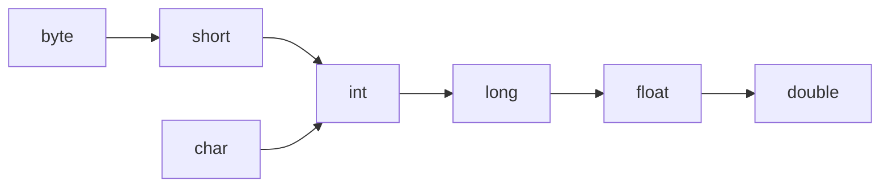

## 一、变量和数据类型

### 1.1 变量

基本概念：可以发生变化的单个数据的存储单元

变量声明方式：`数据类型 变量名 = 初始值；`

固定格式搭配：

```java
/*
* 多行备注
*/
public class Filename{
    public static void main(String[] args){
        System.out.println(); //单行注释
    }
}
```

变量的分类：

- 局部变量：作用范围是从声明一直到方法体结束
- 块变量：作用范围，从声明一直到语句块结束

### 1.2 标识符

- 由数字、字母、下划线以及$等组成，其中数字不能开头
- 不能使用关键字，不建议使用中文，不建议使用过长的变量名

#### 实例1

```java
/*
 编程实现变量的输入输出
*/
import java.util.Scanner;

public class VarIOText{
    public static void main(String[] args){
        System.out.println("请输入你的名字和年龄");
        //创建一个扫描器来扫描键盘的输入，System.in表示键盘的输入
        Scanner sc = new Scanner(System.in);
        String name = sc.next();
        int age = sc.nextInt();
        System.out.println("name = " + name + "，age = " + age);
    }
}
```

### 1.3 数据类型

#### （1）基本数据类型

- byte，short，int，long，float，double，boolean，char

#### （2）引用数据类型

- 数组、类、接口、枚举、标注

### 1.4 进制

- 八进制和十六进制其实都是二进制的简写

#### 二进制

表示方式：前缀：0b/0B

二进制的最高位（最左边）用于代表符号位，若该位是0则表示非负数，若该位是1则表示负数，注意：**此最高位表示的是所有位数的最高位**，例如64位的最高位

- 正十进制转为二进制的方法：
  - 除2取余法：需倒叙计数
  - 拆分法：需记忆二进制权重：1，2，4，8，16，32，64，128，。。。
- 正二进制转为十进制：
  - 加权法：使用二进制的每个数字乘以当前位的权重再累加
- 负十进制转二进制：
  - 取十进制绝对值转二进制，负数需补码，然后按位取反再加一
  - 验证：使正负二进制相加，若为0，则正确，需注意高位溢出

- 负二进制转十进制：
  - 先减一，按位取反，改为负号


### 1.5 字节

单个字节共8位，去掉符号位，则有7位，有正负，故为：**127 ~ -128**

### 1.6 整数类型

| 类型  | 字节数 | 十进制大小     |
| ----- | ------ | -------------- |
| byte  | 1      | 128            |
| short | 2      | 32768 （三万） |
| int   | 4      | 一百六十万     |
| long  | 8      | 二十亿以上     |

 需注意：直接写出的整数类型叫做	直接量/常量/字面值

**数据类型的默认值为int**

故若大于int范围，则应整数过大无法赋值，若希望赋值，则需在直接量后面加上L

#### 考点：

1. 为何变量命名不能以数字开头

   有可能会被识别成直接量

2. `int a=25; byte b=a; ` 报错

   因为a不是直接量，是变量

### 1.7 浮点类型

float 和double 推荐使用double，java也默认使用double

若要存为float，则需在末尾加成f或F

| 类型   | 精度   | 字节 | 有效数字     |
| ------ | ------ | ---- | ------------ |
| float  | 单精度 | 4    | 7位有效数字  |
| double | 双精度 | 8    | 15位有效数字 |

需注意：浮点类型有误差，例如 0.1+0.2=3.000....4 

若希望精确计算：java.math.BigDecimal

### 1.8 布尔类型

用于描述真假信息，类型：boolean

数值只有两个：true 和 false 。1和0都不算

大小可以认为是一个字节

### 1.9 字符类型

用于描述单个字符的数据类型，存储的是ASCII码

| 类型 | 表达方式 | 字节 | 符号位   | 大小      |
| ---- | -------- | ---- | -------- | --------- |
| char | 单引号   | 2    | 无符号位 | 0 ~ 65535 |

#### ASCII码

ASCII码数量有限，只用于记录英文语境中常用一些内容，故一般使用String类型

如希望打印字符对应的ASCII码，例如a的ASCII，可使用`int(a)`进行强制类型转换输出

需记忆几个常用的码：

| 字符   | ASCII | 字符 | ASCII |
| ------ | ----- | ---- | ----- |
| '0'    | 48    | 空格 | 32    |
| 'A'    | 65    | 'a'  | 97    |
| 换行符 | 10    |      |       |

#### Unicode

java字符类型采用Unicode字符集编码，所有字符都是16位，是世界通用的长字符集

一般使用\u开头，需用单引号引用

#### 特殊字符

\：反斜杠，转义符，表示特殊字符的字符意义

\t：制表符

\n：换行符

#### 字符串的判断

字符串判断是否相等：`"字符串1".equals("字符串2")`

### 1.10 基本数据类型的之间的转换：

自动类型转换：小尺寸转大尺寸



强制类型转换：大尺寸转小尺寸

- `目标类型 变量名 = （目标类型）源类型变量名`
- 尽量不要使用强转

## 二、运算符

###  2.1 算术运算符

基本运算符：

| +    | -    | *    | /                        | %          |
| ---- | ---- | ---- | ------------------------ | ---------- |
| 加法 | 减法 | 乘法 | 除法（整数相除仍未整数） | 取余、取模 |

需注意：声明两个变量时，推荐使用分号加换行的方式，更加明晰，不建议挨在一行

算术运算的基本概念：
- 表达式组成：操作符（运算符），操作数（数据类型）

注意点：
1. java中整数相除时，结果值只保留整数部分，舍弃小数部分

2. 若希望保留小数，则改变其中的任一操作数使之为浮点数即可

   - 使用强制类型转换：(double)num，尽量不要用

   - 让其中一个数乘或除以1.0即可，推荐使用

3. 0不能作为被除数

   - **ArithmeticException**，算术异常，需记忆

   - 若整数除以0.0,则输出Infinity无穷

   - 若0/0.0,输出NaN,不是一个数

####  案例：拆分整数为时分秒

```java
/*
 * 输入正整数使用算术运算符进行拆分输出时分秒
 *
 * */

import java.util.Scanner;
public class TwoCase {
	public static void main(String[] args) {
		System.out.println("请输入需要拆分的正整数");
		Scanner sc = new Scanner(System.in);
		int i1 = sc.nextInt();
		boolean b1 = i1 > 0;
		System.out.println("是否为正整数：" + b1);
		int hours = i1 / 3600;
		int minites = i1 / 60 % 60;
		int seconds = i1 % 60;
		System.out.println("时间是" +hours+ " hou "+minites+" min " +seconds+" sec");
	}
}
```


#### 字符串连接符运算符

可以实现字符串与其他符号的连接

何时为运算，何时为连接：
	只有当加号+两边都不是字符串时，则为运算符
	判定是从左往右进行的，判定后类型会变换

> (a+b+c) (a+b+c+"") (a+""+b+c)  (""+a+b+c)


###  2.2 关系运算符

| <    | >    | <=       | >=       | ==   | !=     |
| ---- | ---- | -------- | -------- | ---- | ------ |
| 小于 | 大于 | 小于等于 | 大于等于 | 等于 | 不等于 |

注意：**输出为布尔类型**，故而赋值时需使用boolean

###  2.3 自增减运算符

只用于变量，常量不可变

- ++ : 自增运算符，使当前变量自身的数值加一
- -- : 自减运算符，使当前变量自身的数值减一

使用格式：
- a++; //等同于a = a+1;因为是等号在后，故是先赋值后运算
- ++a; //等同于a = a+1;因为是等号在前，故是先运算后赋值

但是！对于自身的值的变化效果是等同的，即a的变化是相同的

不同的是，a++和++a这两个表达式本身，须知表达式的在空间的位置和变量的位置并不同，故若两者不赋值的话是没有差异的，若赋值，等于把表达式的值赋给了其他对象

例：`a = 1; b=a++; c=++a; `三者a,b,c的值分别为为：3,1,3

### 2.4 逻辑运算符

- && 逻辑与运算符，相当于“并且”。比较严厉，不能容忍假
- || 逻辑或运算符，相当于“或者“ 。 比较宽容，可以容忍假，只要不是全假就可以通过
- ！逻辑非运算符，相当于”取反“

> 逻辑运算符的操作数均为boolean表达式

#### 逻辑运算符的短路特性

- 对于逻辑与，若第一个表达式为假，则结果为假，此时跳过第二个表达式
- 对于逻辑或，若第一个为真，则跳过第二个

#### 案例：判断输入的数值是否为三位数

问：为什么不能直接使用`(100 <= num <=999)`，而要使用`(100 <= num && num <=999)`

答：因为第一个运算之后，100<=num这个整体就变成了一个布尔类型的值，布尔无法与int类型进行比对

> 逻辑运算符主要用于连接多个关系运算符作为最终运算的表达式，用于实现多条件的连接
>
> 即关系运算符的升级

### 2.5 条件/三目运算符

格式：条件表达式？表达式1：表达式2

判断条件表达式是否成立，若成立执行1，否则则执行2

#### 案例：使用三目运算符找到用户输入的两个值的最大值并打印

```java
public class ThreeEyes{
    public static void main (String[] args){
        System.out.println("请输入两个值");
        Scanner sc = new Scanner(System.in);
        double num1 = sc.nextDouble();
        double num2 = sc.nextDouble();
        
        System.out.println("两数中的最大值为："+(num1>num2? num1:num2))
    }
}
```


### 2.6 赋值运算符

=：用于将等号右边的数据赋值给左边的变量，覆盖变量

> 再次提醒：表达式本身也有值，其本身之值即为所附之值

### 2.7 复合赋值运算符

+= ，-=，*= ，/=，。。。

例：a += 2; 等同于a = a + 2

#### 复合运算符考点

##### 考点一

```java
byte b = 10;
b = b + 2;  //错误：不兼容的格式，从int到byte可能会有损失，无法赋值
```

原因：`byte+int `结果是int，`byte+byte`结果依然是int，这是一种编译器优化，防止加法出现溢出

解决方法：对整体使用强制类型转换：`b = (byte)(b+2)`

> 在这里，`b += 2;` 结果上等价于`b = b + 2;`但真正等价于 `b = (byte)(b+2)`

##### 考点二

a=\=2; 2=\=a;(推荐该方式)  a=2;   2=a;(报错，值无法改变)

### 2.8 移位运算符

| <<                  | >>                       | >>>                     |
| ------------------- | ------------------------ | ----------------------- |
| 左移，右边使用0补充 | 右移，左边使用符号位补充 | 逻辑右移，左边使用0补充 |

> 左移一位相当于当前整数的2倍，右移一位相当于当前整数除以2

####  位运算符

| &              | \|     | ~        | ^        |
| -------------- | ------ | -------- | -------- |
| 按位与，1真0假 | 按位或 | 按位取反 | 按位异或 |

### 2.9 运算符的优先级

- （）优先级最高
- =优先级最低
- 若无法确认优先级，则使用（）来确认即可

## 三、流程控制语句

### 3.1 分支结构

使用场景：当需要进行条件判断并使用结果时，使用分支结构

#### if分支结构

基本结构：`if(条件表达式){当条件为真时的运行内容；}`

案例：使用if分支判断最大值。推荐使用假设法，假设一个为真

```java
int a = sc.nextInt();
int b = sc.nextInt();
int max = a;
if (b>max){
    max = b;
    System.out.println("最大值为：" + max);
}
```

#### if else分支结构

基本结构：`if(条件表达式){语句块1；}else{语句块2；}`

#### if else if else分支结构

基本结构：`if (条件表达式1){语句块1;} else if (条件表达式2){语句块2;}....else{语句块n;}`

#### switch case 分支结构

基本结构：

switch (变量表达式){case 字面值1语句块1;break;     ... default 语句块n;    }

案例：使用switch分支结构实现成绩的等级判断

```java
import java.util.Scanner;
public class Three{
    public static void main(String[] args){

        System.out.println("请输入你的成绩：" );
        Scanner sc = new Scanner(System.in);
        int num = sc.nextInt();

        switch(num / 10){
            case 10: //System.out.println("等级A");break;
            case 9 : System.out.println("等级A");break;
            case 8 : System.out.println("等级B");break;
            case 7 : System.out.println("等级C");break;
            case 6 : System.out.println("等级D");break;
            default: System.out.println("等级E");
        }
    }
}
```

>  注意：case穿透。若缺少break，下行的case无论是否匹配，都会运行其对应语句块

### 3.2 循环结构

使用场景：若希望重复执行一段代码，使用循环

> 任何重复的程序逻辑都可以通过 顺序、分支、循环 三种程序结构实现

#### for循环

基本格式：`for (初始条件；条件表达式；修改初始值表达式){循环体;}`

需注意的是：初始条件不能直接使用`i=1`;而应该使用`int i=1;`

案例：三种方式实现for循环判断并输出1~100的所有奇数

```java
//判断是否能被2整除
for(int i = 1;i <=100;i++){
    if(0 != i%2){
        System.out.print(i+" " );
    }
}
System.out.println("");

//递进步数改为2
for (int i = 1 ;i<=100 ; i+=2){
    System.out.print(i+" ");
}
System.out.println("");

//改变输出条件
for (int i = 1; i<=50;i++){
    System.out.print(i*2-1+" ");
}
```

#### continue关键字

作用：用在循环中，用于结束本次循环从而开始下一次循环

案例：使用for循环打印1~20之间的所有整数，若遇到5的倍数则不打印

```java
for (int i = 1;i<20;i++){
    if (0 == i%5){
        continue;
    }
    System.out.println(i);
}
```

#### break关键字

作用：用在循环体中，用于退出循环

`for(;;) `这种没有循环条件的循环叫做无限循环、死循环

案例：提示用户输入聊天内容，并输出，直到用户输入"bye"结束聊天

> 注意这个案例中关于boolean语句以及三目运算符的使用

```java
import java.util.Scanner;
public class Three{
    public static void main(String[] args){
        
        boolean whose = true;
        for(;;){
            System.out.println("请"+ (whose?"你":"他") +"输入要发送的内容");
            Scanner sc = new Scanner(System.in);
            String str = sc.next();
            
            if ("bye".equals(str)){
                System.out.println("聊天结束");
                break;
            }
            whose = !whose;
            System.out.println((whose?"他":"你")+"说：" + str);
        }
    }
}
```

#### 双重for循环

基本格式：for(;;){ for(;;){循环体} }

使用场景：一般需要打印多行多列的时候需要使用双重for循环

案例：打印各种类型的星号组合

```java
//顺序打印星号
for(int i=1;i<=5;i++){					//*
    for(int j=1;j<=i;j++){				//**
        System.out.print("*");			//***
    }
    System.out.println("");
}

//逆序打印星号
for(int i=1;i<=5;i++){					//***
    for(int j=5-i;j>=0;j--){			//**
        System.out.print("*");			//*
    }
    System.out.println("");
}

// 塔形打印星号
for(int i=1;i<=5;i++){
    for(int k=1;k<=5-i;k++){			//  *
        System.out.print(" ");			// ***
    }									//*****
    for(int j=1;j<=2*i-1;j++){
        System.out.print("*");
    }
    System.out.println("");
}
```

案例：使用break和双重for循环打印100以内的所有素数

> 注意其中boolean的使用以及为什么j的范围要限制到i的平方根以内（为了避免重复）

```java
for (int i=2;i<=100;i++){
    boolean bool=true;
    for(int j=2;j<=Math.sqrt(i);j++){
        if(0 == i%j){
            bool = false;
            break;
        }
    }
    if(bool){
        System.out.print(i+"   ");
    }
}
```

#### while循环

基本格式：while(条件表达式){循环体；}

和for循环的比较：

- while循环更适合于明确循环条件但不明确循环次数的场合
- for循环更适合用于明确循环次数或范围的场合

案例：提示用户输入一个任意位数的正整数然后反向输出

> 注意观察如何从整数中取出每一位数

```java
import java.util.Scanner;
public class WhileLoop{
    public static void main(String[] args){

        System.out.println("请输入一个整数：");
        Scanner sc = new Scanner(System.in);
        int num = sc.nextInt();

        int res = 0;	
        int temp = num; //创建副本，用于保护原值
        while(temp>0){
            res = temp%10 + res*10;
            temp = temp/10;
        }
        System.out.println(num+"逆序后的结果是："+res);
    }
}
```

#### 循环笔试考点

- while(){} 与 while();{}的区别，即分号的位置所带来的影响

若无分号，大括号内为循环体

若有分号，则等同于while(){;} ，这是一个空语句，可用于延时（但不推荐，在一直消耗资源）

## 四、数组

### 4.1 一维数组

基本概念：在内存空间中申请的一段连续的存储单元 ，呈线性排列，体现为一种引用数据类型

使用场景：但需要在java中记录多个类型相同的数据内容时，则声明一个一维数组

声明方式：`数据类型[] 数组名称 = new 数据类型[ 数组的长度 ]` 

常用属性：length，可以用于获取数组的长度，例如 `num = arr.length`

访问方式：通过下标的方式访问数组中的每一个元素，下标从0开始

常见异常：**ArrayIndexOutOfBoundsException** 数组下标越界异常，需记忆

#### 一维数组的初始化：

- 动态方式：不设置初始值，只输入长度。例如：`int[] arr = new int[5];`

  元素的初始值：byte,short,char,int,long为0；float和double为0.0；boolean为false；

- 静态方式：声明数组的同时赋予初始值

  格式：`数据类型[] 数组名称 = {初始值1，初始值2，初始值3}；`

  例如：`char[] arr = {'a', 'b', 'c', 'd', 'e'};`

案例： 统计输入的整数的各个数字的出现次数

```java
import java.util.Scanner;
public class FourAndFive{
    public static void main(String[] args){

        System.out.println("请输入一个正整数：");
        Scanner sc = new Scanner(System.in);
        int num = sc.nextInt();

        int[] arr = new int[10];

        int cop = num;
        while(cop>0){
            arr[cop%10]++;
            cop /= 10
        }

        for(int i=0;i<arr.length;i++){
            if(arr[i] != 0){
                System.out.println(i + "的个数为：" + arr[i]);
            }
        }
    }
}
```

#### 内存结构分析

堆区：一大块存储空间，用于存放引用类型的数据

- 引用数据类型的变量存在堆区，例如数组

栈区：用于存放程序运行过程中所有的局部变量

- 基本数据类型的变量直接在栈区中声明，只用一个位置
- 引用类型的变量其在堆区对应的地址存在于栈区

一个数组的声明的过程：

- 先使用`new int[5]`指令在堆区申请一段空间，并记下这个空间的位置，以防空间乱流
- 再使用`int[] arr`指令在栈区申请一个空间，并命名为arr
- 使用` = `号进行赋值，把再堆区的位置坐标放到栈区申请的空间中，数组的声明完成

案例：一维数组的增删减改

```java
//创建一个含有五个元素的数组
int[] arr = new int[5];

//赋值11，22，33，44给前4个值
for(int i=0;i<arr.length-1;i++){
    arr[i] = (i+1)*11;
}

//输出数组内容
for(int i=0;i<arr.length;i++){
    System.out.print(arr[i] + " ");
}
System.out.println();

//插入55到第一个位置，其他元素依次后移
for(int i=arr.length;i>1;i--){
    arr[i-1] = arr[i-2];
}
arr[0] = 55;
System.out.println(Array.toString[arr]);

//删除第一个元素55，其他元素依次前移
for(int i=0;i<arr.length;i++){
    if (i==arr.length-1){
        arr[i] = 0;
    }else{
        arr[i] = arr[i+1];
    }
}
System.out.println(Arrays.toString(arr));

//查找是否有元素22，若有则修改为220
for(int i=0;i<arr.length;i++){
    if(arr[i]==22){
        arr[i] = 220;
    }
    System.out.print(arr[i] + " ");
}
```

#### 数组的优缺点：

优点：速度快

缺点：要求元素类型相同；且空间连续，长度不可改；增删改减可能会移动大量元素，效率低

#### 数组的拷贝

官方提供了一个基本的拷贝功能：arraycope

`System.arraycopy(arr,1,brr,0,3);` ：

​	将arr中下标为1开始的三个元素拷贝到brr从0 开始的位置

考点：brr = arr; //这是数组的拷贝吗？

答： 不是，只是把数组arr在堆区的位置信息拷贝给了brr

#### 数组工具类

java.util.Arrays类可以实现对数组中的元素的遍历，查找，排序等操作

| 常用方法                           | 作用                                                 |
| ---------------------------------- | ---------------------------------------------------- |
| toString(int[] a)                  | 输出数组中的内容                                     |
| fill(int[] a , int val)            | 将参数指定元素赋值给数组中所有元素                   |
| equals(boolean[] a1, boolean[] a2) | 判断两个数组中的元素和位置是否完全相等               |
| sort(int[] a)                      | 对数组中的元素进行从小到大排序                       |
| search(int[] a , int key)          | 从数组中查找指定元素的位置，若不存在则返回无效的下标 |

使用方法：

`import java.util.Arrays;`

`Arrays.toString(arr);`

### 4.2 二维数组

基本概念：多个一维数组组合在一起而形成的数组，二维数组中的每个元素都是一个一维数组

声明方式：`int[][] arr = new int[][];`

#### 二维数组的初始化：

- 动态初始化：

​	`数组类型[][] 数组名称 = new 数据类型[行数][列数]；`

- 静态初始化：

​	`数组类型[][] 数组名称 = {{,},{,}...}；`

#### length 

- 一维数组的length代表的是元素的个数

- 二维数组的length表示的是一维数组的个数，也即行数

#### 案例：输出n行的杨辉三角

```java
import java.util.Scanner;
import java.util.Arrays;

public class FourAndFive{

    public static void main(String[] args){

        System.out.println("请输入一个整数：");
        Scanner sc = new Scanner(System.in);
        int num = sc.nextInt();

        int[][] arr = new int[num][];
        
		//二维数组一般需要配合双重for循环使用
        for (int i=0;i<num;i++){
            arr[i] = new int[i+1];
            for(int j=0;j<=i;j++){
                if(j==0 || j==i){
                    arr[i][j] = 1;
                } else{
                    arr[i][j] = arr[i-1][j] + arr[i-1][j-1];
                }
            }
        }

        for(int i=0;i<num;i++){
            for(int j=0;j<=i;j++){
                System.out.print(arr[i][j] + " ");
            }
            System.out.println();
        }
    }
}

```

## 五、习题

### 5.1 课后习题

1. 编程题 实现双色球抽奖游戏中奖号码的生成，中奖号码由 6 个红球号码和 1 个蓝球号码组成。 其中红球号码要求随机生成 6 个 1~33 之间**不重复**的随机号码。 其中蓝球号码要求随机生成 1 个 1~16 之间的随机号码。 

   ```java
   import java.util.Random;
   import java.util.Arrays;
   
   public class FourAndFive{
       public static void main(String[] args){
           Random ra = new Random();
           int[] arr = new int[7];
   
           for(int i=0;i<arr.length-1;i++){
               arr[i] = ra.nextInt(33)+1;
               for (int j=0;j<i;j++){
                   if (arr[i] == arr[j]){
                       i--;
                       break;
                   }
               }
           }
   
           arr[6] = ra.nextInt(16)+1;
           System.out.println(Arrays.toString(arr));
       }
   }
   ```

   

2. 编程题 实现数组扩容。自定义数组长度（用户指定），扩容规则：当已存储元素数量达到总容量的 80%时，扩容到原容量的1.5 倍。 例如，原容量是 10，当输入第 8 个元素时，数组进行扩容，容量从 10 变 15。

   ```java
   import java.util.Scanner;
   
   public class FourAndFive{
       public static void main(String[] args){
   
           System.out.println("请输入一个整数：");
           Scanner sc = new Scanner(System.in);
           int num = sc.nextInt();
   
           int[] arr = new int[num];
           int[] brr;
           System.out.println("数组的长度为：" + arr.length);
   
           for (int i=0;i<arr.length;i++){
               System.out.println("请输入一个整数填充数组：");
               arr[i] = sc.nextInt();
               if (i>=arr.length*0.8){
                   System.out.println("数组长度达到警戒线，将扩容");
                   brr = new int[arr.length>>1 + arr.length];
                   System.arraycopy(arr,0,brr,0,i);
                   arr = brr;
                   System.out.println("数组的长度为：" + arr.length);
               }
           }
       }
   }
   ```

   ### 5.2 笔试题

   1. 设计一套砝码要求能测量出1~100之间的任意重量，请问至少需要多少个砝码，以及每个砝码各个的重量是多少？

      答：七个即可：1，2，4，8，16，32，64。可采用列举法，每一个新增法码的重量都要大于前面砝码重量的和

   2. 简述：&和&&之间的区别

      答：&不止可以用于位运算，同样可以用于逻辑与，两者之间的区别是：&没有短路特性

   3. 简述：i++ 与 ++i的异同

      答：看前文，一个先赋值后运算，一个先运算后赋值。但是i的值一样的

   4. 如何使用最有效率的方法计算2乘以8

      答：使用移位运算符，左移一位是乘以2：2<<3;

   5. 如何在不借助第三个变量的情况下，实现两个整数变量的交换

      答，使用加减法，

      例：`a=1;b=2;`  解：`a = a+b; b=a-b; a=a-b;`

      或使用位运算：

      解：`a=a^b;b=a^b;a=a^b`
