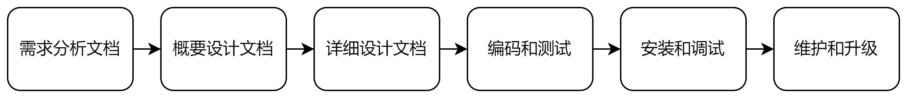
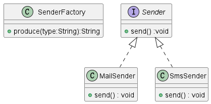
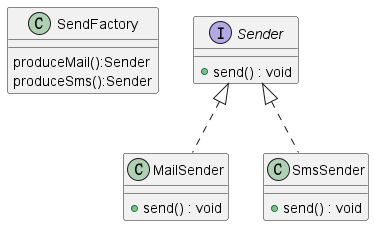
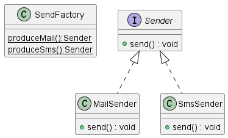
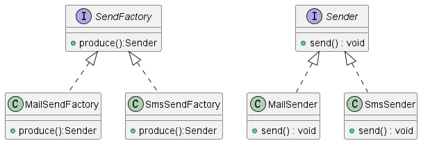
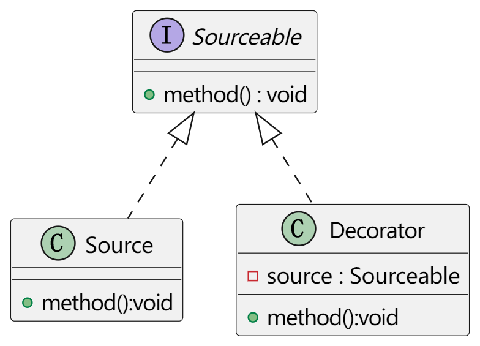
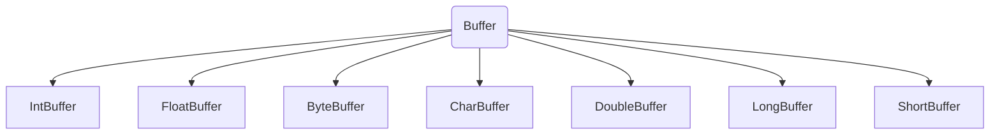
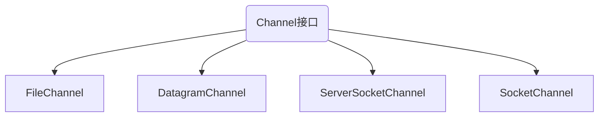
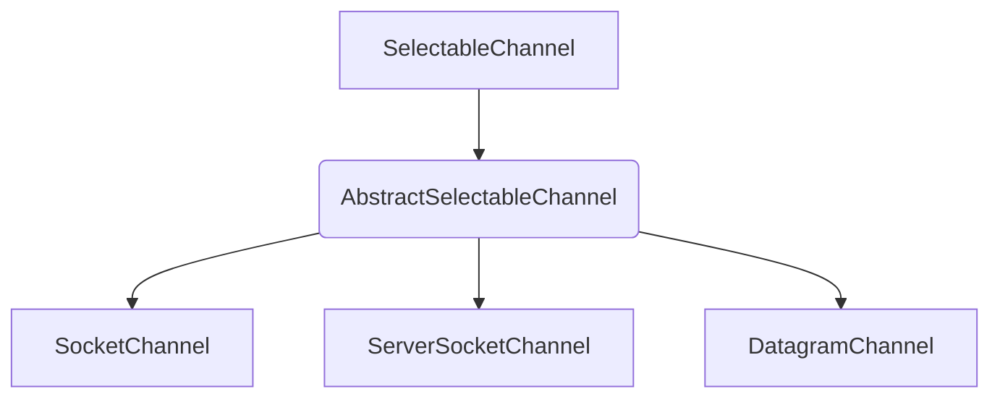

## 常用设计原则和设计模式

### 常用的设计原则（需记忆）

#### 软件开发流程



#### 常用的设计原则

| 原则                             | 概念                                                         |
| -------------------------------- | ------------------------------------------------------------ |
| 开闭原则                         | 对扩展开放对修改关闭，提供程序的扩展性                       |
| 里氏代换原则                     | 多使用多态的方式                                             |
| 依赖倒转原则                     | 尽量多依赖于抽象类或接口而不是具体实现类，规范子类           |
| 接口隔离原则                     | 尽量多使用小接口而不是大接口，避免接口污染，降低耦合         |
| 迪米特法则<br />（最少知道原则） | 一个实体应当尽量少与其他实体之间发生相互作用<br />高内聚，低耦合 |
| 合成复用原则                     | 尽量多使用合成/聚合的方式，而不是继承的方式                  |

### 常用的设计模式

概念：设计模式是一种用于固定场合的固定套路

#### 基本分类

| 模式       | 实例                                          |
| ---------- | --------------------------------------------- |
| 创建型模式 | 单例设计模式、工厂方法模式、抽象工程模式、... |
| 结构型模式 | 装饰器模式、代理模式、...                     |
| 行为型模式 | 模板设计模式、...                             |

### 设计模式详解（重点）

#### 单例设计模式

单例设计模式主要分为：饿汉式和懒汉式，懒汉式需要对多线程进行同步处理

```java
public class Singleton {
    // 私有化构造方法
    private Singleton(){}
    // 声明本类类型的引用指向本类类型的对象，懒汉式在get时在创建对象
    // private static Singletion si = new Singleton();饿汉式
    private static Singleton si = null;	//懒汉式

    // 提供公有的get方法负责将对象返回出去
    public static Singleton getSingleton(){
        if (null == si) {
            // 上锁，只会在第一次运行此方法的时候会运行
            synchronized (Singleton.class) {
                if (null == si) {
                    si = new Singleton();
                }
            }
        }
        return si;
    }
}
```

#### 普通工厂模式

概念：普通工厂模式就是建立一个工厂类，对实现了同一接口的不同实现类进行实例的创建

类图结构：




```java
public Sender produce(String str){
    if ("mail".equals(str)){
        return new MailSender();
    } else if ("sms".equals(str)) {
        return new SmsSender();
    } else {
        return null;
    }
}

// -----------test类main方法--------------
SendFactory sf = new SendFactory();
Sender s = sf.produce("mail");
s.send();
```

主要缺点：

在普通工厂方法模式中，如果传递的字符串出错，则不能正确创建对象，并且可能出现空指针异常

#### 多个工厂方法模式

类图结构



主要缺点

在多个工厂方法模式中，为了能够正确创建对象，先需要创建工厂类的对象才能调用工厂类中的生产方法

```java
public Sender produceMail(){
    return new MailSender();
}

public Sender produceSms(){
    return new SmsSender();
}

// -----------test类main方法--------------
SendFactory sf = new SendFactory();
Sender s = sf.produceMail;
s.send();
```

#### 静态工厂方法模式

类图结构：



```java
public static Sender produceMail(){
    return new MailSender();
}

public static Sender produceSms(){
    return new SmsSender();
}

// -----------test类main方法--------------
Sender s = SendFactory.produceMail;
s.send();
```

实际意义：

工厂方法模式适合：凡是出现了大量的产品需要创建且具有相同的接口时，可以通过工厂模式进行创建

主要缺点：

工厂模式有一个问题就是：类的创建依赖工厂类，也就是说，若需要扩展生产心得产品，就必须对工厂的代码进行修改，这就违背了开闭原则

#### 抽象工厂模式

类图结构：



```java
public class SmsSendFactory implements Provider{
    @Override
    public Sender produce(){
        return new SmsSender();
    }
}
```


#### 装饰器模式

概念：

装饰器模式就是给一个对象动态的增加一些新功能，要求装饰对象和被装饰对象实现同一个接口，装饰对象持有被装饰对象的实例

类图结构：



```java
public class Source implements Sourceable{
    @Override
    public void method() {
        System.out.println("a很好");
    }
}

// Source的功能无法满足客户，为了不违背开闭原则，新建一个类用于实现扩展方法，即进行装饰
public class Decorator implements Sourceable{
    // 这里声明一个其他类的变量，然后使用构造方法传入实例，即合成复用原则
    private Sourceable Source;

    public Decorator(Sourceable source) {
        this.Source = source;
    }

    @Override
    public void method() {
        Source.method();
        System.out.println("b也不错");
    }
}

// -----------test类main方法--------------
Sourceable sourceable= new Decorator(new Source());
sourceable.method();	//a很好 \n b也不错
```

实际意义：

-   可以实现一个类功能的扩展；
-   可以动态的增加功能，而且还能动态撤销

缺点：产生过多相似的对象，不易排错

>   和代理模式的区别：装饰模式是在原来的基础上进行改进，所以还需要创建一个原有类的对象作为参数传入，而代理模式不需要传入原有类的对象，直接在内部创建了对象

#### 代理模式

概念：

代理模式就是找一个代理模式就是找一个代理类替原对象进行一些操作

类图结构：


```java
public class Proxy implements Sourceable{
    private Source source;
    public Proxy() {
        // 代理模式自己创建对象，装饰模式传入一个对象
        this.source = new Source();
    }

    @Override
    public void method() {
        source.method();
        System.out.println("重点是权限");
    }
}
```

实际意义：

如果在使用的时候需要对原有的方式进行改进，可以采用一个代理类调用原有方法，并且对产生的结构进行控制。使用代理模式可以将功能划分的更加清晰，有助于后期维护

>   装饰器模式关注在一个对象动态的添加方法，代理模式关注于控制对对象的访问

#### 模板方法模式

概念：一个抽象类中封装了一个固定流程，流程中的具体步骤由不同子类进行不同的实现，通过抽象类让固定的流程产生不同的结果

类图结构：


```java
public abstract class AbstractCalculator {
    
    public int splitExpression(String exp,String op){
        String[] sArr = exp.split(op);
        return calculate(Integer.parseInt(sArr[0]),Integer.parseInt(sArr[1]));
    };
    // 一个抽象方法，通过不同的子类去实现不同的功能
    public abstract int calculate(int ia , int ib);
}

public class Plus extends AbstractCalculator {
    @Override
    public int calculate(int ia, int ib) {
        return ia + ib;
    }
}

// -----------test类main方法--------------
AbstractCalculator ac = new Plus();
int i = ac.splitExpression("1+1", "\\+"); // java中的转义字符是两个正斜杠
System.out.println("结果是：" + i);
```

实际意义：

-   将多个子类共有且逻辑基本相同的内容提取出来实现代码的复用
-   不同的子类实现不同的效果形成多态，有助于后期维护

## 新特性

### Java8新特性

#### 函数式接口

函数式接口主要指只包含一个抽象方法的接口

Java8提供@FunctionalInterface注解来定义函数式接口，若定义的接口不符合函数式的规范便会报错

Java8中增加了java.util.function包，包含了常用的函数式接口，例如：

| 接口名称      | 方法声明          | 功能介绍                     |
| ------------- | ----------------- | ---------------------------- |
| Consumer      | void accept(T t)  | 根据指定的参数执行操作       |
| Supplier      | T get()           | 得到一个返回值               |
| Function<T,R> | R apply(T t)      | 根据指定的参数执行操作并返回 |
| Predicate     | boolean test(T t) | 判断指定的参数是否满足条件   |

```java
// 根据指定的参数执行操作
Consumer co = new Consumer() {
    @Override
    public void accept(Object o) {
        System.out.println(o);
    }
};
co.accept("有参数没有返回值");

// 得到一个返回值
Supplier su = new Supplier() {
    @Override
    public Object get() {
        return "有返回值没有参数";
    }
};
System.out.println(su.get());

// 根据指定的参数执行操作并返回
Function fu = new Function() {
    @Override
    public Object apply(Object o) {
        return o +"有返回值";
    }
};
System.out.println(fu.apply("有参数"));

// 判断指定的参数是否满足条件
Predicate pr = new Predicate() {
    @Override
    public boolean test(Object o) {
        System.out.println("判断指定的参数是否满足条件");
        return false;
    }
};
pr.test(1);
```

#### Lambda表达式

Lambda表达式是实例化函数式接口的重要方式，使用Lambda表达式可以使代码变得更加简洁紧凑

Lambda表达式：由 参数列表、->、方法体组成

语法格式：(参数列表) -> { 方法体; } - 其中()、参数类型、{} 以及return关键字 可以省略  

```java
Consumer co1 = (Object o) -> {System.out.println(o);};
co1.accept("有参数没有返回值");

// 如果有返回值，可以把 return和{} 一块省略
Supplier su1 = () -> "有返回值没有参数";
System.out.println(su1.get());

// 如果只有一个传入参数也可以省略，java有猜测机制
Function fu1 = (o) -> o + "有返回值";
System.out.println(fu1.apply("有参数"));
```

#### 方法引用

方法引用主要指通过方法的名字来指向一个方法而**不需要为方法引用提供方法体**，该方法的调用交给函数式接口执行

方法引用使用一对冒号 :: 将类或者对象与方法名进行连接，方式如下：

-   对象的非静态方法引用	ObjectName :: MethodName
-   类的静态方法引用          ClassName :: StaticMethodName
-   类的非静态方法引用       ClassName :: MethodName
-   构造器的引用                 ClassName :: new
-   数组的引用                    TypeName[] :: new

```java
// 使用lambda表达式
Function<String , Integer> f2 = s -> Integer.parseInt(s);
// 使用方法引用
Function<String , Integer> f3 = Integer::parseInt;

Comparator<Integer> c2 = ((o1, o2) -> Integer.compare(o1,o2));
Comparator<Integer> c3 = Integer::compareTo;

Supplier<Person> s2 = () -> new Person();
Supplier<Person> s3 = Person::new;
```

方法引用是在特定场景下lambda表达式的一种简化表示，可以进一步简化代码的编写使得代码更加紧凑精简

#### Stream接口

概念：

-   java.util.stream.Stream接口是对集合功能的增强，可以对集合元素进行复杂的查找、过滤、筛选等操作
-   Stream接口借助于Lambda表达式极大的提高编程效率和程序可读性，同时它提供串行和并行两种模式进行汇聚操作，并发模式能够充分利用多核处理器的优势

##### 使用步骤

1.   创建Stream，通过一个数据源来获取一个流
2.   转换Stream，每次转换返回一个新的Stream对象
3.   对Stream进行聚合操作并产生结果

##### 创建方式：

-   通过调用集合的默认方法来获取流，如：default Stream stream()
-   通过数组工具类中的静态方法来获取流，如：static IntStream stream(int[] array)
-   通过Stream接口的静态方法来获取流，如：static Stream of(T... values)
-   通过Stream接口的静态方法来获取流，static Stream generate(Supplier<? extends T> s)

##### 中间操作

-   筛选和切片的常用方法：

    | 方法声明                                      | 功能介绍                   |
    | --------------------------------------------- | -------------------------- |
    | Stream filter(Predicate<? super T> predicate) | 返回一个包含匹配元素的流   |
    | Stream distinct()                             | 返回不包含重复元素的流     |
    | Stream limit(long maxSize)                    | 返回不超过给定元素数量的流 |
    | Stream skip(long n)                           | 返回丢弃前n个元素后的流    |

-   映射的常用方法：

    | 方法声明                                                     | 功能介绍                                            |
    | ------------------------------------------------------------ | --------------------------------------------------- |
    | Stream map(Function<? super T,? extends R> mapper)           | 返回每个处理过元素组成的流                          |
    | Stream flatMap(Function<? super T,? extends Stream<? extends R>> mapper) | 返回每个被替换过元素组成的流，并 将所有流合成一个流 |

-   排序的常用方法：

    | 方法声明                                        | 功能介绍                         |
    | ----------------------------------------------- | -------------------------------- |
    | Stream sorted()                                 | 返回经过自然排序后元素组成的流   |
    | Stream sorted(Comparator<? super T> comparator) | 返回经过比较器排序后元素组成的流 |

##### 终止操作

匹配与查找的常用方法：

| 方法声明                                          | 功能介绍               |
| ------------------------------------------------- | ---------------------- |
| Optional findFirst()                              | 返回该流的第一个元素   |
| boolean allMatch(Predicate<? super T> predicate)  | 返回所有元素是否匹配   |
| boolean noneMatch(Predicate<? super T> predicate) | 返回没有元素是否匹配   |
| Optional max(Comparator<? super T> comparator)    | 根据比较器返回最大元素 |
| Optional min(Comparator<? super T> comparator)    | 根据比较器返回最小元素 |
| long count()                                      | 返回元素的个数         |
| void forEach(Consumer<? super T> action)          | 对流中每个元素执行操作 |

规约的常用方法：

| 方法声明                                    | 功能介绍           |
| ------------------------------------------- | ------------------ |
| Optional reduce(BinaryOperator accumulator) | 返回结合后的元素值 |

收集的常用方法：

| 方法声明                                            | 功能介绍                 |
| --------------------------------------------------- | ------------------------ |
| <R,A> R collect(Collector<? super T,A,R> collector) | 使用收集器对元素进行处理 |
| List<T> toList()                                    | 收集所有元素组成一个列表 |

```java
// -----------------Person implements Comparable<Person>--------------
@Override
public int compareTo(Person o) {return this.getAge() - o.getAge();}
//--------------------------------------------------------------------
List<Person> pArr = new ArrayList<>();
...
   
// 先把数组转换为流模式，然后进行筛选，获取所有大于18岁的，最后进行打印
pArr.stream().filter(person -> person.getAge() >=18).forEach(System.out::println);

// 对数组进行判断，如果没有大于48岁的就返回true
boolean b = pArr.stream().noneMatch(person -> person.getAge() > 48);

// 先把数组转换为流模式，然后丢弃前两个后再保留前三个，输出打印
pArr.stream().skip(2).limit(3).forEach(System.out::println);

// 进行排序，这里使用了自然排序，需要在Person中重写Comparator接口
pArr.stream().sorted().forEach(System.out::println);

// 返回最大值或者最小值，分别使用年龄和姓名
Optional<Person> max = pArr.stream().max((o1, o2) -> o1.getAge() - o2.getAge());
System.out.println(max);
Optional<Person> min = pArr.stream().min((o1, o2) -> o1.getName().compareTo(o2.getName()));

// 使用map获取其中的某个元素，map(person -> person.getAge)可以简化成下面的写法
pArr.stream().map(Person::getAge).forEach(System.out::println);

// 返回所有年龄的累加和,需要传入的是年龄而不是Person对象
// reduce((integer1,integer2) -> integer1 + integer2);可以简化成下面这种模式
pArr.stream().map(Person::getAge).reduce(Integer::sum);

// 返回所有姓名组合而成的一组列表
//collect(Collectors.toList())可以简化成直接使用toList()
pArr.stream().map(Person::getName).toList().forEach(System.out::println);
```

#### Optional类

概念：java.util.Optional类可以理解为一个简单的容器，其值可能是null或者不是null，代表一个值存在或者不存在

该类的引入解决空指针异常，不用显式进行空置检测

常用的方法：

| 方法声明                                             | 功能介绍                                        |
| ---------------------------------------------------- | ----------------------------------------------- |
| static Optional ofNullable(T value)                  | 根据参数指定数值来得到Optional类型的对 象       |
| Optional map(Function<? super T,? extends U> mapper) | 根据参数指定规则的结果来得到Optional类 型的对象 |
| T orElse(T other)                                    | 若该值存在就返回，否则返回other的数 值。        |

### Java9新特性

#### 模块化系统

概念：

模块就是代码和数据的封装体，模块的代码被组织成多个包，每个包中包含Java类和接口，模块的数据则包括资源文件和其他静态信息  

语法格式：

module-info.java 文件中，我们可以用新的关键词module来声明一个模块，具体如下：module 模块名称 {}  

#### 集合工厂方法

基本概念：

Java9的List、Set和Map集合中增加了静态工厂方法of实现不可变实例的创建，不允许添加null对象

意义：

保证线程安全，节省空间和时间开销，可以当作一个常量对待

#### InputStream的增强

InputStream类中提供了transferTo方法实现将数据直接传输到OutputStream中。  

```java
InputStream is = new FileInputStream("d:/a.txt");
OutputStream os = new FileOutputStream("d:/b.txt");
is.transferTo(os);
os.close();
is.close();
```

### Java10概述

局部变量类型推断：

Java10可以使用var作为局部变量类型推断标识符，此符号仅适用于局部变量，增强for循环的索引，以及传统for循环的本地变量  

实际意义：

避免了信息冗余，对其了变量名，更容易阅读

```java
// 因为可以从后面的内容中获取到类型，故可以使用var直接代替
// int a = 18;
var a = 18;

// List<Integer> li = new ArrayList<>();
// 这里如果使用var,需要在后面加上泛型，不然会变成object类型
var li = new ArrayList<Integer>();
```

### Java11的新特性

简化的编译运行操作以及String类新增方法

#### String类新增方法

| 方法声明                                             | 功能介绍                                        |
| ---------------------------------------------------- | ----------------------------------------------- |
| boolean isBlank()                                    | 判断字符串是否为空或只包含空白代码点            |
| Optional map(Function<? super T,? extends U> mapper) | 根据参数指定规则的结果来得到Optional类 型的对象 |
| T orElse(T other)                                    | 若该值存在就返回，否则返回other的数 值。        |

## NIO

### NIO概念

即：java New IO，是jdk1.4后提供的IO API

java API中提供了两套NIO，一套是针对标准输入输出NIO，另一套是网络编程NIO

NIO和IO 作用和目的相同，实现方式不同，NIO可以替代标准Java IO的IO API。

IO以流的方式处理数据，NIO以块的方式处理数据

#### 流与块的比较

面向流的IO一次一个字节的处理数据，一个输入流产生一个字节，一个输出流就消费一个字节。
面向块的NIO系统以块的形式处理数据。每一个操作都在一步中产生或消费一个数据块。按块要比按流快的多  

#### NIO新特性

| IO                        | NIO                           |
| ------------------------- | ----------------------------- |
| 面向流（Stream Oriented） | 面向缓冲区（Buffer Oriented） |
| 阻塞IO（Blocking IO）     | 非阻塞IO（Non Blocking IO）   |
| （无）                    | 选择器（Selectors）           |

#### 核心组件

核心组件：

-   通道（ Channel ）
-   缓冲区（ Buffer ）
-   选择器（ Selector ）  

NIO不使用流的方式处理数据，而是以缓冲区Buffer和Channel管道配合使用来处理数据

Selector是因为NIO可以使用异步的非阻塞才加入的东西


-   Channel管道比作是铁路，不与数据打交道，只负责运输数据

-   Buffer缓冲区比作成火车，与数据做接触

而NIO就是**通过Channel管道运输着存储数据的Buffer缓冲区来实现数据的处理**  

### Buffer缓冲区

作用：缓冲区，用来存放具体要被传输的数据，比如文件、scoket 等。这里将数据装入 Buffer 再通过通道进行传输。Buffer 就是一个用来保存不同数据类型的数组
在 NIO 中，所有的缓冲区类型都继承于抽象类 Buffer，**最常用的就是 ByteBuffer**，对于 Java 中的基本类型，基本都有一个具体 Buffer 类型与之相对应  



#### ByteBuffer的创建方式

```java
// *最常用* 在堆中创建缓冲区：allocate(int capacity)  
ByteBuffer buffer1 = ByteBuffer.allocate(10);

//在系统内存创建缓冲区：
ByteBuffer buffer2 = ByteBuffer.allocateDirect(10);
//通过普通数组创建缓冲区：
byte[] arr = {97,98,99};
ByteBuffer buffer3 = ByteBuffer.wrap(arr);
```

#### 常用方法

核心方法：读取缓冲区的数据，写数据到缓冲区

-   put(byte b) ： 给数组添加元素
-   get() ：获取一个元素  
-   flip() ：切换成读模式，即：`limit = position; position = 0;`
-   clear() ：清空缓存区，即：`position = 0; limit = capacity;`

```java
//创建对象
ByteBuffer buffer = ByteBuffer.allocate(10);

//put(byte b) : 给数组添加元素
buffer.put((byte)10);
buffer.put((byte)20);
buffer.put((byte)30);

//把缓冲数组变成普通数组
byte[] arr = buffer.array();

//get() :获取一个元素
byte b = buffer.get(1);	//20 
```

#### Buffer类四个核心变量属性

1.   容量Capacity
     缓冲区能够容纳的数据元素的最大数量。容量在缓冲区创建时被设定，并且永远不能被改变。
2.   界限Limit
     缓冲区中可以操作数据的大小，从limit开始后面的位置不能操作。
3.   位置Position
     下一个要被读或写的元素的位置。Position会自动由相应的 get( ) 和 put( ) 函数更新。
4.   标记Mark
     一个备忘位置。用于记录上一次读写的位置。  

```java
public static void show(Buffer bb){
    System.out.print("capacity:" + bb.capacity());
    System.out.print("  limit:" + bb.limit());
    System.out.print("  position:" + bb.position());
}

public static void main(String[] args) {
    // 1. 使用allocate创建一个指定大小为10的缓冲区
    ByteBuffer bb = ByteBuffer.allocate(10);
    show(bb);   // capacity:10  limit:10  position:0

    // 2. 使用put往缓冲区中存放数据
    bb.put(new String("hello").getBytes());
    show(bb);   // capacity:10  limit:10  position:5

    // 3. 使用flip切换成读模式，读模式让limit等于position,让position等于0
    bb.flip();
    show(bb); // capacity:10  limit:5  position:0

    // 4. 使用get输出数据，输出后position走到limit的位置
    byte[] bytes = new byte[bb.limit()];
    bb.get(bytes);
    System.out.println(new String(bytes));
    show(bb); // capacity:10  limit:5  position:5

    // 5. 使用clear清空数据，position回到0，limit回到capacity
    bb.clear();
    show(bb); // capacity:10  limit:10  position:0
}
```

### Channel通道

java.nio.channels接口。Channel 表示 IO 源与目标打开的连接  ，类似于传统的“流”

#### Channel API



| 实现类              | 作用                                                         |
| ------------------- | ------------------------------------------------------------ |
| FileChannel         | 用于读取、写入、映射和操作文件的通道                         |
| DatagramChannel     | 通过 UDP 读写网络中的数据通道                                |
| SocketChannel       | 通过 TCP 读写网络中的数据。                                  |
| ServerSocketChannel | 可以监听新进来的 TCP 连接，对每一个新进来 的连接都会创建一个 |

#### FileChannel使用

```java
public static void main(String[] args) throws IOException {
    // 通道依赖于IO流
    FileInputStream fis = new FileInputStream("E:/DuoLaA.jpg");
    FileOutputStream fos = new FileOutputStream("./DuoLaA.jpg");

    // 使用getChannel方法获取管道对象
    FileChannel fic = fis.getChannel();
    FileChannel foc = fos.getChannel();

    // 创建一个Buffer缓冲区用于存放数据
    ByteBuffer bb = ByteBuffer.allocate(1024);

    // 传输数据
    while (fic.read(bb) != -1){
        bb.flip();
        foc.write(bb);
        bb.clear();
    }

    // 关闭数据流
    fos.close();
    fis.close();
}
```

#### 网络编程收发消息

```java
//------------------------客户端------------------------
// 创建一个网络管道，需调用open方法才可以获取到对应的实例
SocketChannel sc = SocketChannel.open();
//  指定要连接的端口号和端口，参数是另一个实例，然后再传入具体参数
sc.connect(new InetSocketAddress("127.0.0.1",8888));

// 创建一个buffer用于传输数据
ByteBuffer buffer = ByteBuffer.allocate(1024);

// 使用buffer传数据后记得使用flip
buffer.put("hello?".getBytes());
buffer.flip();

// 发送数据，然后关闭代码
sc.write(buffer);
sc.close();

//------------------------服务端------------------------
// 创建一个网络管道，需要使用open方法
ServerSocketChannel ssc = ServerSocketChannel.open();
// 使用bind方法绑定一个端口号
ssc.bind(new InetSocketAddress(8888));

// 连接客户端，如果不进行其他配置会进入阻塞状态
//ssc.configureBlocking(false);此语句可以设置非阻塞
SocketChannel sc = ssc.accept();

// 创建一个buffer数组用于存储数据
ByteBuffer bb = ByteBuffer.allocate(1024);
// 读取客户端发来的消息，进行打印
int len = sc.read(bb);
System.out.println(new String(bb.array(),0,len));

// 关流
ssc.close();
```

### Selector选择器

多路复用：一个选择器可以同时监听多个服务器端口, 帮多个服务器端口同时等待客户端的访问  

与Channel的关系：选择器（Selector） 是 Channel（通道）的多路复用器，Selector 可以同时监控多个 通道的 IO（输入输出） 状况。  

作用：

选择器提供选择执行已经就绪的任务的能力。从底层来看，Selector提供了询问通道是否已经准备好执行每个I/O操作的能力。Selector 允许单线程处理多个Channel。仅用单个线程来处理多个Channels的好处是，只需要更少的线程来处理通道。事实上，可以只用一个线程处理所有的通道，这样会大量的减
少线程之间上下文切换的开销。  

#### 可选择通道

只有继承了抽象类SelectableChannel的类才可以被Selector复用



通道和选择器之间的关系，使用注册的方式完成。SelectableChannel可以被注册到Selector对象上，在注册的时候，需要指定通道的哪些操作，是Selector感兴趣的  

#### 注册

使用`Channel.register(Selector sel , int ops)`方法，将一个通道注册到一个选择器

-   `Selector sel`：指定通道要注册的选择器是谁  
-   `int ops`：指定选择器需要查询的通道操作  

| ops                     | 作用 |
| ----------------------- | ---- |
| SelectionKey.OP_READ    | 可读 |
| SelectionKey.OP_WRITE   | 可写 |
| SelectionKey.OP_CONNECT | 连接 |
| SelectionKey.OP_ACCEPT  | 接收 |

#### 选择键（SelectionKey）

Channel和Selector的关系确定好后，并且一旦通道处于某种就绪的状态，就可以被选择器（select()）查询到
Selector可以不断的查询Channel中发生的操作的就绪状态。并且挑选感兴趣的操作就绪状态。一旦通道有操作的就绪状态达成，并且是Selector感兴趣的操作，就会被Selector选中，放入选择键集合中  

-   select() :选择器等待客户端连接的方法
    阻塞问题:
    1.   在开始没有客户访问的时候是阻塞的
    2.   在有客户来访问的时候方法会变成非阻塞的
    3.   如果客户的访问被处理结束之后,又会恢复成阻塞的

-   selectedKeys() :选择器会把被连接的服务端对象放在Set集合中,这个方法就是返回一个Set集合 

#### Selector使用流程

创建Selector：

```java
// 1、获取Selector选择器
Selector selector = Selector.open();
```

注册Channel到Selector：

要实现Selector管理Channel，需要将channel注册到相应的Selector上  

```java
// 2、获取通道
ServerSocketChannel serverSocketChannel =
ServerSocketChannel.open();
// 3.设置为非阻塞
serverSocketChannel.configureBlocking(false);
// 4、绑定连接
serverSocketChannel.bind(new
InetSocketAddress(SystemConfig.SOCKET_SERVER_PORT));
// 5、将通道注册到选择器上,并制定监听事件为：“接收”事件
serverSocketChannel.register(selector，SelectionKey.OP_ACCEPT);
```

注意：与Selector一起使用时，Channel必须处于非阻塞模式下，否则将抛出异常IllegalBlockingModeException  

轮番查询：

通过Selector的 select() 方法，可以查询出已经就绪的通道操作，这些就绪的状态集合，包存在一个元素是SelectionKey对象的Set集合中。
select()方法返回的int值，表示有多少通道已经就绪
而一旦调用select()方法，并且返回值不为0时，下一步工干啥？
通过调用Selector的selectedKeys()方法来访问已选择键集合，然后迭代集合的每一个选择键元素，根据就绪操作的类型，完成对应的操作  
