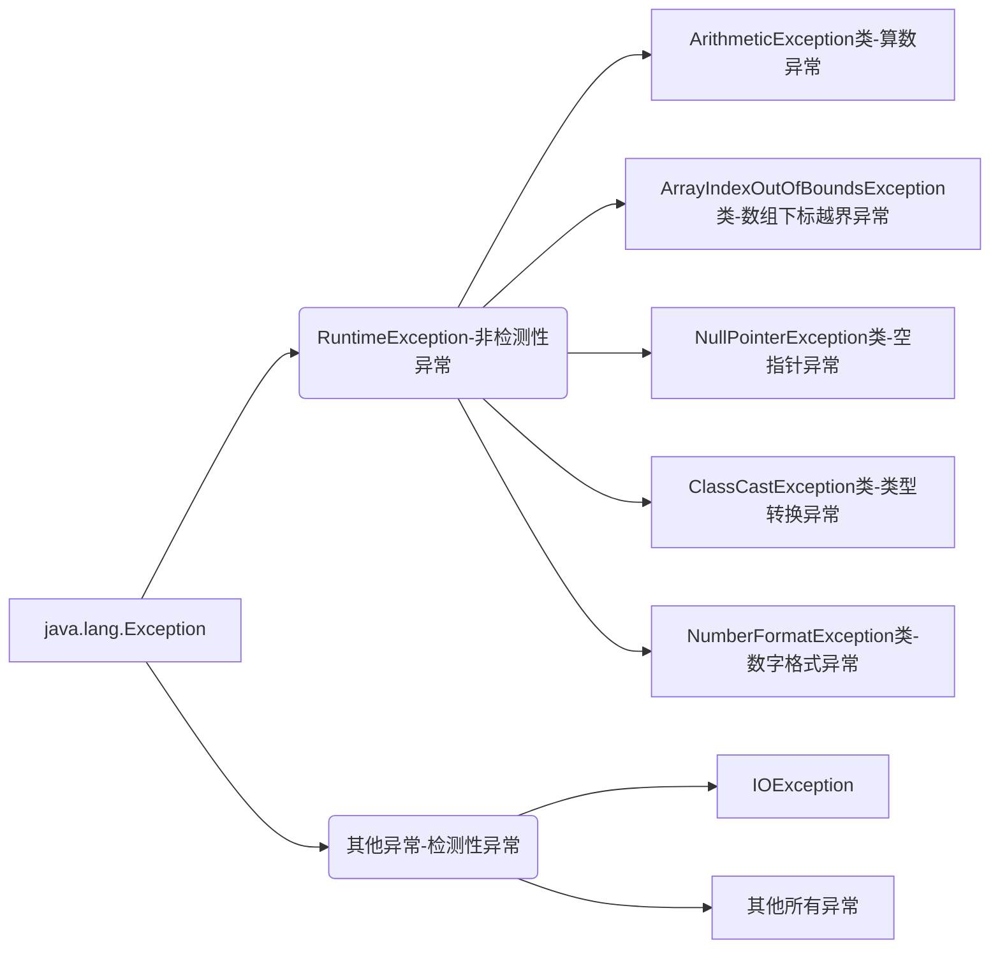
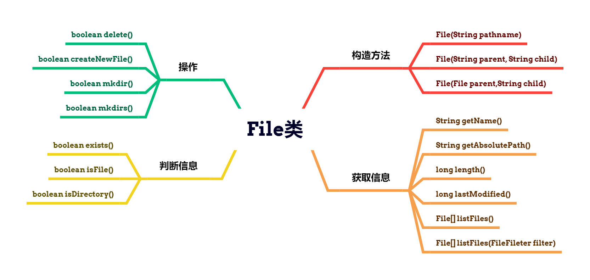
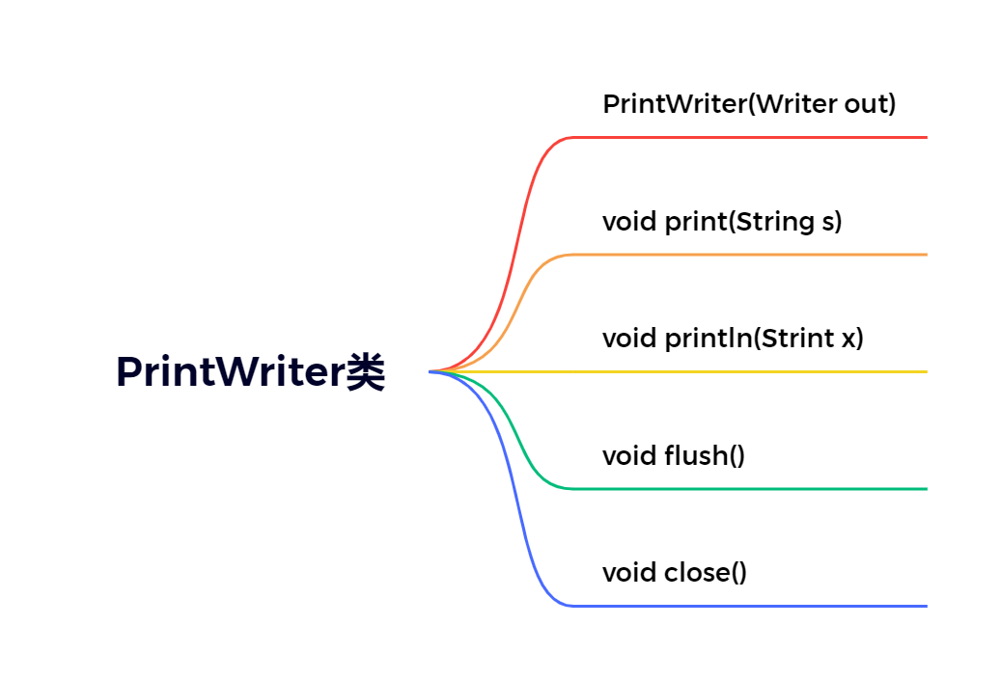

## 异常机制和File类

### 异常机制

#### 概念

-   java中主要指程序执行中发生的不正常情况
-   java.lang.Throwable类是Java语言中错误（Error）和异常（Exception）的超类
-   Error类主要用于描述Java虚拟机无法解决的严重错误，通常无法通过编码解决，故不作讨论
-   Exception主要用于描述因编码错误或偶然外在因素导致的轻微错误，通常可以编码解决

#### 异常的分类



>   注意：当程序执行过程中发生异常但又没有手动处理时，则有Java虚拟机采用默认方式处理异常，而默认处理方式就是：打印异常的名称，异常发生的原因，异常发生的位置以及终止程序

#### 异常的避免

-   在以后的开发中尽量使用if条件判断来避免异常的发生
-   但是过多的if条件判断会导致程序的代码加长、臃肿、可读性差；

#### 异常的捕获

语法格式：

```java
try{
    //可能发生异常的代码
} catch(异常类型 引用变量名){
    //针对该类异常的处理代码
}
...
finally{
    //无论是否发生异常都会执行的代码
}
```

注意事项：

-   当需要编写多个catch分支时，切记小类型应该放到大类型的前面；
-   懒人写法： `catch(Exception e){}`
-   finally通常用于进行善后处理，如：关闭已经打开的文件等

笔试考点：

```java
public static int test(){
    try {
        String st = null;
        st.length();
        return 0;
    } catch (ArrayIndexOutOfBoundsException e){
        e.printStackTrace();
        return 1;
    } finally {
        return 2;	//会提前结束方法并返回值
    }
}

public static void main(String[] args) {
    int t = test();
    System.out.println(t); 		//2
}
```

#### 异常的抛出

概念：在某些特殊情况下有些异常不能处理或者不便于处理时，就可以将该异常转移给该方法的调用者，这种方法叫做异常的抛出。当方法执行时出现异常，则底层生成一个异常类对象抛出，**此时异常代码后续的代码就不再执行**

语法格式：`访问权限 返回值类型 方法名称（形参列表）throws 异常类型1，异常类型2 ... {方法体}`	

```java
// 因为FileNotFoundException是IOException的子类，所以会被覆盖，即多态 
public static void test() throws IOException {
    FileInputStream file = new FileInputStream("d:/a.txt");
    file.close();
}

// 在main方法中不推荐抛出异常， JVM负担过重
public static void main(String[] args) {
    try {
        test();
    } catch (IOException e) {
        throw new RuntimeException(e);
    }
}
```

回顾：方法重写的原则：

1.   要求方法名相同、参数列表相同以及返回值类型相同，从jdk1.5开始支持返回子类类型；
2.   要求方法的访问权限不能变小，可以相同或者变大；
3.   要求方法不能抛出更大的异常

>   子类重写的方法不能抛出更大的异常，不能抛出平级不一样的异常，但可以抛出一样的异常、更小的异常以及不抛出异常

经验：

-   若父类中被重写的方法没有抛出异常时，则子类中重写的方法只能进行异常的捕获处理
-   若方法内部又以递进方式分别调用了好几个其他方法，则建议这些方法内可以使用抛出的方法处理到最后一层进行捕获方式处理

#### 自定义异常

概念：当需要在程序中表达年龄不合理的情况时，而Java官方没有提供这种针对性的异常，此时就需要自定义异常加以描述

流程：

1.   自定义xxxException异常类继承Exception类或者其子类
2.   提供两个版本的构造方法，一个是无参构造方法，另外一个是字符串作为参数的构造方法

异常的产生：

-   `throw new 异常类型(实参);`

-   例：`throw new ageException("年龄不合理")；`

>   Java采用的异常处理机制是将异常处理的程序代码集中在一起，与正常的程序代码分开，使得程序简洁、优雅、并易于维护

```java
//-------------自定义异常类AgeException---------
public class AgeException extends Exception{
    public AgeException() {
    }

    public AgeException(String message) {
        // 通过传入的参数来使用父类的输出
        super(message);
    }
}

//-------------People类，使用自定义异常-----------
public class People {
    private int age;
    public People() {
    }
    public People(int age) {
       setAge(age);
    }
    public int getAge() {
        return age;
    }

    public void setAge(int age) {
        if (age > 0 && age < 150) {
            this.age = age;
        } else {
            try {
                //调用异常，同时需要对异常进行处理
                throw new AgeException("年龄不合理啊！");
            } catch (AgeException e) {
                e.printStackTrace();
            }
        }
    }
}

//-------------People的实现类，用于测试-------
public class PeopleTest {
    public static void main(String[] args) {
        People p = new People(300);
        System.out.println(p.getAge());
        //AgeException: 年龄不合理啊！
    }
}
```

### File类（重点）

#### 概念

java.io.File类主要用于描述文件或目录路径的抽象表示信息，可以获取文件或目录的特征信息，如：大小等

#### 常用的方法



| 方法声明                                | 功能概述                                     |
| --------------------------------------- | -------------------------------------------- |
| **File**(String pathname)               | 根据参数指定的路径名来构造对象               |
| File(String parent, String child)       | 根据参数指定的父路径和子路径信息构造对象     |
| File(File parent, String child)         | 根据参数指定的父抽象路径和子路径信息构造对象 |
| boolean **exists**()                    | 测试此抽象路径名表示的文件或目录是否存在     |
| String **getName**()                    | 用于获取文件的名称                           |
| long **length**()                       | 返回由此抽象路径名表示的文件的长度           |
| long **lastModified**()                 | 用于获取文件的最后一次修改时间               |
| String **getAbsolutePath**()            | 用于获取绝对路径信息                         |
| boolean **delete**()                    | 用于删除文件，当删除目录时要求是空目录       |
| boolean **createNewFile**()             | 用于创建新的空文件                           |
| boolean **mkdir**()                     | 用于创建目录                                 |
| boolean **mkdirs**()                    | 用于创建多级目录                             |
| File[] **listFiles**()                  | 获取该目录下的所有内容                       |
| boolean **isFile**()                    | 判断是否为文件                               |
| boolean **isDirectory**()               | 判断是否为目录                               |
| File[] **listFiles**(FileFilter filter) | 获取目录下满足筛选器的所有内容               |

```java
public class FileTest {

    public static void show(File files){
        File[] fList = files.listFiles();
        System.out.println();
        for (File tf : fList){
            if (tf.isFile()){ // 如果是文件直接打印，目录则加上标志便于区分
                System.out.print(tf.getName() + "  ");
            } else {
                System.out.print(" <" + tf.getName() + "> ");
                show(tf);
            }
        }
    }

    public static void main(String[] args) throws IOException {
        File f1 = new File("E:/java.md");
        if (f1.exists()){
            System.out.println("文件名称：" + f1.getName());
            System.out.println("文件大小：" + f1.length());
            Date d1 = new Date(f1.lastModified());
            SimpleDateFormat sdf = new SimpleDateFormat("y-M-d H-m-s");
            System.out.println("最后一次修改时间：" + sdf.format(d1));
            System.out.println(f1.delete() ? "文件删除成功" : "文件删除失败");
        } else {
            System.out.println(f1.createNewFile() ? "文件创建成功" : "文件创建失败");
        }

        File f2 = new File("E:/A/B/C"); // 创建一个多层目录
        if (f2.exists()){
            System.out.println("目录绝对路径：" + f2.getAbsolutePath());
            System.out.println(f2.delete() ? "目录删除成功" : "目录删除失败"); //只删一层
        } else {
            //System.out.println(f2.mkdir() ? "目录创建成功" : "目录创建失败");
            System.out.println(f2.mkdirs() ? "多级目录创建成功" : "目录创建失败");
        }

        File f3 = new File("E:/工程");

        //实现一个目录中下内容的打印，使用过滤器进行过滤
        //编写过滤器, 使用匿名内部类
        /*FileFilter fileFilter = new FileFilter() {
            @Override
            public boolean accept(File pathname) {
                // 只返回带有.py后缀的文件名
                return pathname.getName().endsWith(".py");
            }
        };*/
        // 推荐使用lambda表达式
        FileFilter fileFilter = (File pathname) -> {return pathname.getName().endsWith(".py");};
        File[] fList2 = f3.listFiles(fileFilter);
        System.out.println(Arrays.toString(fList2));

        // 实现一个目录以及子目录下的所有内容的打印
        show(f3);
    }
}
```

### IO流

概念：指读写数据时想流水一样从一端到另外一段

#### 基本分类

1.   根据读写数据的基本单位不同，分为字节流和字符流
     -   字节流：以字节为单位进行数据读写的流，可以读写任意类型的文件
     -   字符流：以字符（两个字节）为单位的流，只能读写文本文件
2.   根据读写数据的方向不同，分为 输入流 和输出流
     -   输入流：读文件，数据从文件输入到程序中
     -   输出流：写文件，数据从程序输出到文件中
3.   根据流的角色不同，分为节点流和处理流
     -   节点流：指直接和输入输出源对接的流
     -   处理流：需要建立再节点流的基础之上的流

#### 体系结构


重点：

#### FileWriter类（重点）

概念：java.io.FIleWriter类主要用于将文本内容写入到文本文件

常用方法：

| 方法声明                                    | 功能介绍                                                    |
| ------------------------------------------- | ----------------------------------------------------------- |
| FileWriter(String fileName)                 | 根据参数指定的文件名构造对象                                |
| FileWriter(String fileName, boolean append) | 以追加的方式根据参数指定的文件名来构造对象                  |
| void write(int c)                           | 写入单个字符                                                |
| void write(char[] cbuf, int off, int len)   | 将指定字符数组中从偏移量off开始的len个字符写入此 文件输出流 |
| void write(char[] cbuf)                     | 将cbuf.length个字符从指定字符数组写入此文件输出 流中        |
| void flush()                                | 刷新流                                                      |
| void close()                                | 关闭流对象并释放有关的资源                                  |

#### FileReader类（重点）

概念：java.io.FileReader类主要用于从文本文件读取文本数据内容

常用的方法：

```java
public static void main(String[] args) {
    FileReader fr = null;
    FileWriter fw = null;
    try {
        fr = new FileReader("E:/b.txt");
        fw = new FileWriter("E:/c.txt");
        int res = 0;
        System.out.println("开始复制文件中...");
        while ((res = fr.read()) != -1){
            fw.write(res);
        }
        System.out.println("复制完成！");
    } catch (IOException e) {
        e.printStackTrace();
    } finally {
        if (null != fw && null != fr){
            try {
                fw.close();
                fr.close();
            } catch (IOException e) {
                e.printStackTrace();
            }
        }
    }
}
```


#### FileOutputStream类（重点）

概念：java.io.FileOutputStream类主要用于将图像数据之类的原始字节流写入到输出流中

常用的方法：

| 方法声明                                      | 功能介绍                                                    |
| --------------------------------------------- | ----------------------------------------------------------- |
| FileOutputStream(String name)                 | 根据参数指定的文件名来构造对象                              |
| FileOutputStream(String name, boolean append) | 以追加的方式根据参数指定的文件名来构造对象                  |
| void write(int b)                             | 将指定字节写入此文件输出流                                  |
| void write(byte[] b, int off, int len)        | 将指定字节数组中从偏移量off开始的len个字节写入 此文件输出流 |
| void write(byte[] b)                          | 将 b.length 个字节从指定字节数组写入此文件输出 流中         |
| void flush()                                  | 刷新此输出流并强制写出任何缓冲的输出字节                    |
| void close()                                  | 关闭流对象并释放有关的资源                                  |

#### FileInputStream类（重点）

概念：java.io.FileInputStream类主要用于从输入流中以字节流的方式读取图像数据等

常用的方法：

```java
public static void main(String[] args) {
    long l1 = System.currentTimeMillis();
    FileInputStream fis = null;
    FileOutputStream fos = null;
    try {
        fis = new FileInputStream("E:/Wordpress 网站.mp4");
        fos = new FileOutputStream("E:/test.mp4");
        System.out.println("开始复制视频。。。");
        /*
        int res;
            方法一：视频一个字节一个字节复制，但是过于缓慢，大文件不建议使用
            while ((res = fis.read()) != -1){
                fos.write(res);
            }*/
        /*方法二：大文件复制可以创建一个与文件一样大小的缓冲区，直接一次性复制，速度更快
          但是当文件过大时，无法申请一样大小的缓存区，真实内存不够
            int av = fis.available();
            byte[] bArr = new byte[av];
            fos.write(bArr);*/
        // 方法三：准备一个合适大小的缓冲区，大小为1024的倍数
        byte[] bArr = new byte[1024];
        int res=0;
        while ((res = fis.read(bArr)) != -1){
            fos.write(bArr,0,res);
        }
        System.out.println("复制完成！");
    } catch (IOException e) {
        e.printStackTrace();
    } finally {
        if (null != fos && null != fis){
            try {
                fos.close();
                fis.close();
            } catch (IOException e) {
                e.printStackTrace();
            }
        }
    }
    long l2 = System.currentTimeMillis();
    System.out.println("复制时间是：" + (l2-l1));
}
```

#### BufferedOutputStream类（重点）

概念：java.io.BufferedOutputStream类主要用于描述缓冲输出流，此时不用为写入的每个字节调用底层系统

常用的方法：

| 方法声明                                         | 功能介绍                                  |
| ------------------------------------------------ | ----------------------------------------- |
| BufferedOutputStream(OutputStream out)           | 根据参数指定的引用来构造对象              |
| BufferedOutputStream(OutputStream out, int size) | 根据参数指定的引用和缓冲区大小来构造 对象 |
| void write(int b)                                | 写入单个字节                              |
| void write(byte[] b, int off, int len)           | 写入字节数组中的一部分数据                |
| void write(byte[] b)                             | 写入参数指定的整个字节数组                |
| void flush()                                     | 刷新流                                    |
| void close()                                     | 关闭流对象并释放有关的资源                |

#### BufferedInputStream类（重点）

概念：java.io.BufferedInputStream类主要用于描述缓冲输入流

常用的方法：

```java
long l1 = System.currentTimeMillis();
// 文件的读入流和输出流
BufferedInputStream bis = null;
BufferedOutputStream bos = null;
try {
    bis = new BufferedInputStream(new FileInputStream("E:/Wordpress 网站.mp4"));
    bos = new BufferedOutputStream(new FileOutputStream("E:/a.mp4"));

    byte[] bArr = new byte[1024];
    int res = 0;
    while ((res = bis.read(bArr)) != -1){
        bos.write(bArr,0,res);
    }
} catch (IOException e) {
    e.printStackTrace();
} finally {
    if (null != bos && null != bis) {
        try {
            bos.close();
            bis.close();
        } catch (IOException e) {
            e.printStackTrace();
        }
    }
}
long l2 = System.currentTimeMillis();
System.out.println("时间是：" + (l2-l1));
}
```

#### BufferedWriter类（重点）

概念：java.io.BufferedWriter类主要用于写入单个字符、字符数组以及字符串到输出流

常用的方法：

| 方法声明                                  | 功能介绍                                              |
| ----------------------------------------- | ----------------------------------------------------- |
| BufferedWriter(Writer out)                | 根据参数指定的引用来构造对象                          |
| BufferedWriter(Writer out, int sz)        | 根据参数指定的引用和缓冲区大小来构造对象              |
| void write(int c)                         | 写入单个字符到输出流中                                |
| void write(char[] cbuf, int off, int len) | 将字符数组cbuf中从下标off开始的len个字符写入输出流 中 |
| void write(char[] cbuf)                   | 将字符串数组cbuf中所有内容写入输出流中                |
| void write(String s, int off, int len)    | 将参数s中下标从off开始的len个字符写入输出流中         |
| void write(String str)                    | 将参数指定的字符串内容写入输出流中                    |
| void newLine()                            | 用于写入行分隔符到输出流中                            |
| void flush()                              | 刷新流                                                |
| void close()                              | 关闭流对象并释放有关的资源                            |

#### BufferedReader类（重点）

概念：java.io.BufferedReader类主要用于从输入流中读取单个字符、字符数组以及字符串

常用的方法：

```java
public static void main(String[] args) {
    BufferedReader br = null;
    BufferedWriter bw = null;
    try {
        br = new BufferedReader(new FileReader("E:/a.txt"));
        bw = new BufferedWriter(new FileWriter("E:/b.txt"));
        String st = null;
        while ((st = br.readLine()) != null){
            bw.write(st + "\n");
        }
    } catch (IOException e) {
        e.printStackTrace();
    } finally {
        if (bw != null && null != br){
            try {
                bw.close();
                br.close();
            } catch (IOException e) {
                e.printStackTrace();
            }
        }
    }
}
```


#### PrintStream类

概念：java.io.PrintStream类主要用于更加方便地打印各种数据内容

常用的方法：

| 方法声明                      | 功能介绍                           |
| ----------------------------- | ---------------------------------- |
| PrintStream(OutputStream out) | 根据参数指定的引用来构造对象       |
| void print(String s)          | 用于将参数指定的字符串内容打印出来 |
| void println(String x)        | 用于打印字符串后并终止该行         |
| void flush()                  | 刷新流                             |
| void close()                  | 用于关闭输出流并释放有关的资源     |

#### PrintWriter类

概念：java.io.PrintWriter类主要用于将对象的格式化形式打印到文本输出流

常用的方法：

```java
//不断地提示用户输入要发送的内容，若发送的内容是"bye"则聊天结束，否则将用户输入的内容写入到文件d:/a.txt中。
//要求使用BufferedReader类来读取键盘的输入 System.in代表键盘输入
//要求使用PrintStream类负责将数据写入文件

public static void main(String[] args) {
    BufferedReader br = null;
    PrintStream ps = null;
    try {
        br = new BufferedReader(new InputStreamReader(System.in));
        ps = new PrintStream("d:/a.txt");
        while (true) {
            System.out.println("请输入你要发送的内容：");
            String str = br.readLine();
            if ("bye".equals(str)){
                System.out.println("聊天结束");
                break;
            }
            ps.println(str);
        }
    } catch (IOException e) {
        e.printStackTrace();
    } finally {
        if (null != ps && null != br){
            ps.close();
            try {
                br.close();
            } catch (IOException e) {
                e.printStackTrace();
            }
        }
    }
}
```

#### OutputStreamWriter类

概念：java.io.OutputStreamWriter类主要用于实现从字符流到字节流的转换

常用的方法：

| 方法声明                                                 | 功能介绍                          |
| -------------------------------------------------------- | --------------------------------- |
| OutputStreamWriter(OutputStream out)                     | 根据参数指定的引用来构造对象      |
| OutputStreamWriter(OutputStream out, String charsetName) | 根据参数指定的引用和编码构造 对象 |
| void write(String str)                                   | 将参数指定的字符串写入            |
| void flush()                                             | 刷新流                            |
| void close()                                             | 用于关闭输出流并释放有关的资 源   |

#### InputStreamReader类

概念：java.io.InputStreamReader类主要用于实现从字节流到字符流的转换

常用的方法：

`InputStreamReader(InputStream in) ; `

`InputStreamReader(InputStream in , String charsetName);`

`int read(char[] cbuf)` ;  `void close();`

#### DataOutputStream类（了解）

概念：java.io.DataOutputStream类主要用于以适当的方式将基本数据类型写入到输出流中

常用的方法：

| 方法声明                           | 功能介绍                                                     |
| ---------------------------------- | ------------------------------------------------------------ |
| DataOutputStream(OutputStream out) | 根据参数指定的引用构造对象 OutputStream类是个抽象 类，实参需要传递子类对象 |
| void writeInt(int v)               | 用于将参数指定的整数一次性写入输出流，优先写入高字 节        |
| void close()                       | 用于关闭文件输出流并释放有关的资源                           |

#### DataInputStream类（了解）

概念：java.io.DataInputStream类主要用于从输入流中读取基本数据类型的数据

常用的方法：

`DataInputStream(InputStream in)` ；

`int readInt() `; `void close()`

#### ObjectOutputStream类（重点）

概念：

-   java.io.ObjectOutputStream类主要用于将一个对象的所有内容整体写入到输出流中
-   只能将支持java.io.Serializable接口的对象写入流中
-   类通过实现java.io.Serializable接口以启动其序列化功能
-   所谓序列化主要指将一个对象需要存储的相关信息组织成字节序列的转换过程

常用的方法：

| 方法声明                             | 功能介绍                               |
| ------------------------------------ | -------------------------------------- |
| ObjectOutputStream(OutputStream out) | 根据参数指定的引用来构造对象           |
| void writeObject(Object obj)         | 用于将参数指定的对象整体写入到输出流中 |
| void close()                         | 用于关闭输出流并释放有关的资源         |

#### ObjectInputStream类（重点）

概念：

-   java.io.ObjectInputStream类主要用于从输入流一次性将对象整体读取出来
-   需要反序列化，序列化的逆过程

常用的方法：

`ObjectInputStream(InputStream in)`

`Object readObject() `;  `void close()`

```java
// --------一个用于测试的user类-----------------
public class User implements java.io.Serializable{
    @Serial
    private static final long serialVersionUID = 5497931932420790885L;

    private String userName;
    private String password;
    private transient String phoneNum; // 不参与序列化
    ...
}

// ----------ObjectOutputStreamTest类---------
public static void main(String[] args) {
    ObjectOutputStream oos = null;
    try {
        // 创建一个objectOutputStream类与某一文件关联
        oos = new ObjectOutputStream(new FileOutputStream("d:/a.txt"));
        // 准备一个user类并初始化
        User u1 = new User("fusi","helloWorld","110");
        // 将对象传入到ObjectOutputStream类中，写入到文件中
        oos.writeObject(u1);
    } catch (IOException e) {
        throw new RuntimeException(e);
    } finally {
        // 关闭资源
        if (null != oos){
            try {
                oos.close();
            } catch (IOException e) {
                e.printStackTrace();
            }
        }
    }
}

// ----------ObjectInputStreamTest类---------
// 此处简化，不写异常处理
public static void main(String[] args) {
    ObjectInputStream ois = new ObjectInputStream(new FileInputStream("d:/a.txt"));
    Object o = ois.readObject();
    System.out.println("获取到的对象是：" + o);
    ois.close();
}
```

序列化版本号：

序列化机制是通过在运行时判断类的serialVersionUID来验证版本一致性的，进行反序列化的时候，如果一致则进行，不一致则异常

transient关键字：

用于表示一个域不是该对象串行化的一部分。当一个对象被串行化的的时候，transient型变量的值不包括在串行化的表示中

经验：

当希望将多个对象写入文件时，通常建议将多个对象放入到一个集合中，然会将集合这个整体看作一个对象写入输出流中，避免通过返回值进行是否达到文件末尾的判断

#### RandomAccessFile类

概念：java.io.RandomAccessFile类主要支持对随机访问文件的读写操作

常用的方法：

| 方法声明                                   | 功能介绍                                                     |
| ------------------------------------------ | ------------------------------------------------------------ |
| RandomAccessFile(String name, String mode) | 根据参数指定的名称和模式构造对象 r: 以只读方式打开 rw：打开以便读取和写入 rwd:打开以便读取和写入，同步文件内容的更新 rws:打开以便读取和写入，同步文件内容和元数据 的更新 |
| int read()                                 | 读取单个字节的数据                                           |
| void seek(long pos)                        | 用于设置从此文件的开头开始测量的文件指针偏移 量              |
| void write(int b)                          | 将参数指定的单个字节写入                                     |
| void close()                               | 用于关闭流并释放有关的资源                                   |