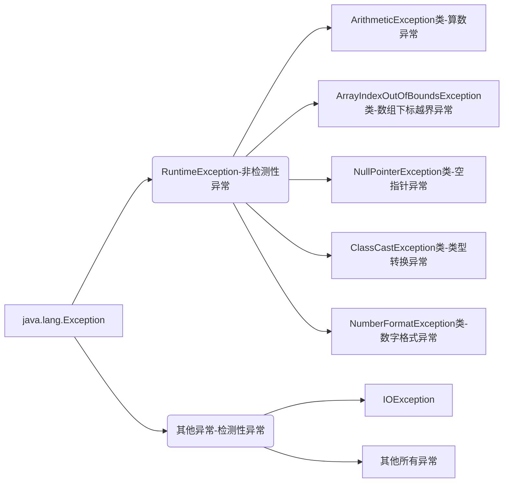

## 异常机制和File类

### 异常机制

#### 概念

-   java中主要指程序执行中发生的不正常情况
-   java.lang.Throwable类是Java语言中错误（Error）和异常（Exception）的超类
-   Error类主要用于描述Java虚拟机无法解决的严重错误，通常无法通过编码解决，故不作讨论
-   Exception主要用于描述因编码错误或偶然外在因素导致的轻微错误，通常可以编码解决

#### 异常的分类



>   注意：当程序执行过程中发生异常但又没有手动处理时，则有Java虚拟机采用默认方式处理异常，而默认处理方式就是：打印异常的名称，异常发生的原因，异常发生的位置以及终止程序

#### 异常的避免

-   在以后的开发中尽量使用if条件判断来避免异常的发生
-   但是过多的if条件判断会导致程序的代码加长、臃肿、可读性差；

#### 异常的捕获

语法格式：

```java
try{
    //可能发生异常的代码
} catch(异常类型 引用变量名){
    //针对该类异常的处理代码
}
...
finally{
    //无论是否发生异常都会执行的代码
}
```

注意事项：

-   当需要编写多个catch分支时，切记小类型应该放到大类型的前面；
-   懒人写法： `catch(Exception e){}`
-   finally通常用于进行善后处理，如：关闭已经打开的文件等

笔试考点：

```java
public static int test(){
    try {
        String st = null;
        st.length();
        return 0;
    } catch (ArrayIndexOutOfBoundsException e){
        e.printStackTrace();
        return 1;
    } finally {
        return 2;	//会提前结束方法并返回值
    }
}

public static void main(String[] args) {
    int t = test();
    System.out.println(t); 		//2
}
```

#### 异常的抛出

概念：在某些特殊情况下有些异常不能处理或者不便于处理时，就可以将该异常转移给该方法的调用者，这种方法叫做异常的抛出。当方法执行时出现异常，则底层生成一个异常类对象抛出，**此时异常代码后续的代码就不再执行**

语法格式：`访问权限 返回值类型 方法名称（形参列表）throws 异常类型1，异常类型2 ... {方法体}`	

```java
// 因为FileNotFoundException是IOException的子类，所以会被覆盖，即多态 
public static void test() throws IOException {
    FileInputStream file = new FileInputStream("d:/a.txt");
    file.close();
}

// 在main方法中不推荐抛出异常， JVM负担过重
public static void main(String[] args) {
    try {
        test();
    } catch (IOException e) {
        throw new RuntimeException(e);
    }
}
```

回顾：方法重写的原则：

1.   要求方法名相同、参数列表相同以及返回值类型相同，从jdk1.5开始支持返回子类类型；
2.   要求方法的访问权限不能变小，可以相同或者变大；
3.   要求方法不能抛出更大的异常

>   子类重写的方法不能抛出更大的异常，不能抛出平级不一样的异常，但可以抛出一样的异常、更小的异常以及不抛出异常

经验：

-   若父类中被重写的方法没有抛出异常时，则子类中重写的方法只能进行异常的捕获处理
-   若方法内部又以递进方式分别调用了好几个其他方法，则建议这些方法内可以使用抛出的方法处理到最后一层进行捕获方式处理

#### 自定义异常

概念：当需要在程序中表达年龄不合理的情况时，而Java官方没有提供这种针对性的异常，此时就需要自定义异常加以描述

流程：

1.   自定义xxxException异常类继承Exception类或者其子类
2.   提供两个版本的构造方法，一个是无参构造方法，另外一个是字符串作为参数的构造方法

异常的产生：

-   `throw new 异常类型(实参);`

-   例：`throw new ageException("年龄不合理")；`

>   Java采用的异常处理机制是将异常处理的程序代码集中在一起，与正常的程序代码分开，使得程序简洁、优雅、并易于维护

```java
//-------------自定义异常类AgeException---------
public class AgeException extends Exception{
    public AgeException() {
    }

    public AgeException(String message) {
        // 通过传入的参数来使用父类的输出
        super(message);
    }
}

//-------------People类，使用自定义异常-----------
public class People {
    private int age;
    public People() {
    }
    public People(int age) {
       setAge(age);
    }
    public int getAge() {
        return age;
    }

    public void setAge(int age) {
        if (age > 0 && age < 150) {
            this.age = age;
        } else {
            try {
                //调用异常，同时需要对异常进行处理
                throw new AgeException("年龄不合理啊！");
            } catch (AgeException e) {
                e.printStackTrace();
            }
        }
    }
}

//-------------People的实现类，用于测试-------
public class PeopleTest {
    public static void main(String[] args) {
        People p = new People(300);
        System.out.println(p.getAge());
        //AgeException: 年龄不合理啊！
    }
}
```

### File类（重点）

#### 概念

java.io.File类主要用于描述文件或目录路径的抽象表示信息，可以获取文件或目录的特征信息，如：大小等

#### 常用的方法

| 方法声明                                | 功能概述                                     |
| --------------------------------------- | -------------------------------------------- |
| **File**(String pathname)               | 根据参数指定的路径名来构造对象               |
| File(String parent, String child)       | 根据参数指定的父路径和子路径信息构造对象     |
| File(File parent, String child)         | 根据参数指定的父抽象路径和子路径信息构造对象 |
| boolean **exists**()                    | 测试此抽象路径名表示的文件或目录是否存在     |
| String **getName**()                    | 用于获取文件的名称                           |
| long **length**()                       | 返回由此抽象路径名表示的文件的长度           |
| long **lastModified**()                 | 用于获取文件的最后一次修改时间               |
| String **getAbsolutePath**()            | 用于获取绝对路径信息                         |
| boolean **delete**()                    | 用于删除文件，当删除目录时要求是空目录       |
| boolean **createNewFile**()             | 用于创建新的空文件                           |
| boolean **mkdir**()                     | 用于创建目录                                 |
| boolean **mkdirs**()                    | 用于创建多级目录                             |
| File[] **listFiles**()                  | 获取该目录下的所有内容                       |
| boolean **isFile**()                    | 判断是否为文件                               |
| boolean **isDirectory**()               | 判断是否为目录                               |
| File[] **listFiles**(FileFilter filter) | 获取目录下满足筛选器的所有内容               |