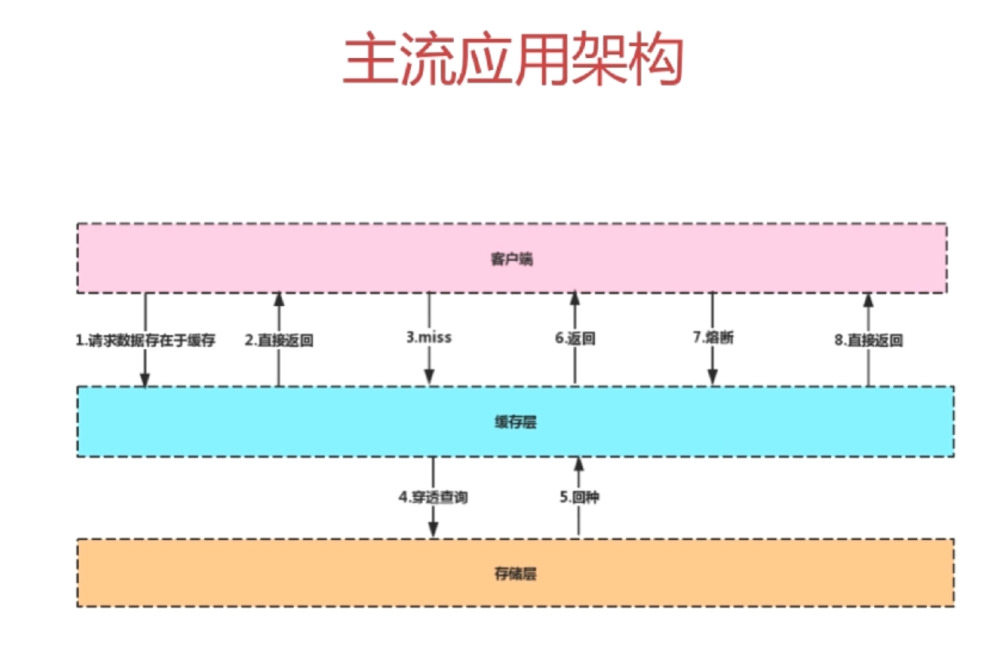

## 缓存中间件

### Memcache和Redis的区别

| 特性           | Redis                  | Memcache         |
| :------------- | :--------------------- | :--------------- |
| 支持的数据类型 | 数据类型丰富           | 简单数据对象     |
| 数据持久化     | 支持数据磁盘持久化存储 | 不支持数据持久化 |
| 主从复制       | 支持主从复制           | 不支持主从复制   |
| 分片           | 支持分片               | 不支持分片       |

### Redis为什么快

Redis可以做到100000+QPS（每秒十万+的查询次数）

原因：

- 完全基于内容，绝大多数请求是纯粹的内存操作，执行效率高
- 数据结构简单，对数据操作也简单
- 采用单线程，单线程也能处理高并发请求，想多核也可启动多实例
- 使用多路IO复用模型，非阻塞IO

### 多路IO复用模型

FD：文件描述符，一个打开的文件通过唯一的描述符进行引用，该描述符是打开文件的元数据到文件本身的映射

传统的阻塞IO模型

> 传统的阻塞IO模型是一种同步IO模型，它的工作方式是当应用程序向操作系统请求IO操作时，操作系统会一直等待，直到IO操作完成并返回结果，期间应用程序会被阻塞（即停止运行），无法执行其他任务。在这种模型下，当应用程序需要进行多个IO操作时，必须等待前一个IO操作完成后才能进行下一个IO操作，因此IO操作的效率较低，尤其是在需要进行大量IO操作时，会严重影响应用程序的性能。

多路复用模型

Redis采用的IO多路复用函数：epoll / kqueue / evport / select

如何选用：

- 因地制宜
- 优先选择时间复杂度为O(1)的IO多路复用函数作为底层实现
- 以时间复杂度为O(n)的select作为保底
- 基于react设计模式监听IO事件

## Redis常用数据类型

- String：最基本的数据类型，二进制安全
- Hash：String元素组成的字典，适合用于存储对象
- List：列表，按照String元素插入顺序排序
- Set：String元素组成的无序集合，通过哈希表实现，不允许重复
- Sorted Set：通过分数来为集合中的成员进行从小到大的排序

## 从海量数据中查询某一固定前缀的Key

KEYS pattern：查找所有符合给定模式Pattern的key

使用Scan命令

SCAN cursor [pattern] [count]

- 基于游标的迭代器，需要基于上一次的游标延续之前的迭代过程
- 以0作为游标开始一次新的迭代，直到命令返回游标0完成一次遍历
- 不保证每次执行都返回某个给定数量的元素，支持模糊查询
- 一次返回的数量不可控，只能是大概率符合count参数

## 如何使用Redis实现分布式锁

分布式锁需要解决的问题：

- 互斥性
- 安全性

- 死锁
- 容错

### 方案一：使用setNX

setNX key value ：如果key不存在，则创建并赋值

- 时间复杂度：O(1)
- 返回值：成功1；失败0

如何解决setNX长期有效的问题：

expire key seconds：设置key的生存时间，当key过期时，会被自动删除

缺点：原子性得不到满足

### 方案二：使用set

Set key value [EX seconds] [PX milliseconds] [NX|XX]

- EX second ：设置键的过期时间为second秒
- PX millisecond：设置键的过期时间为millisecond毫秒
- NX：只有键不存在时，才对键进行设置
- XX：只有键已经存在时，才对键进行设置操作
- Set操作成功完成时，返回ok，否则返回nil

### 大量的key同时过期的注意事项

集中过期，由于清除大量的key很耗时，会出现短暂的卡顿现象

解决方法：在设置key的过期时间的时候，给每个key加上随机值

## 如何使用Redis做异步队列

### 方案一：

使用List作为队列，Rpush生产消息，Lpop消费消息

缺点：没有等待队列里有值就直接消费

弥补：可以通过在应用层引入sleep机制去调用Lpop重试

### 方案二：

BLpop key [key ...] timeout：阻塞直到队列有消息或者超时

缺点：只能供一个消费者消费

### 方案三：

使用pub/sub：主题订阅者模式

发送者（pub）发送消息，订阅者（sub）接收消息

缺点：消息的发布时无状态的，无法保证可达

## Redis如何持久化

