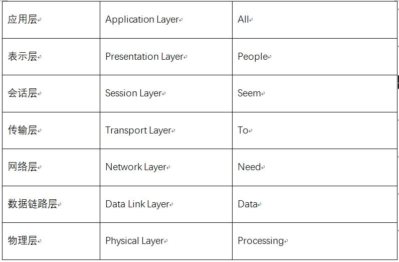
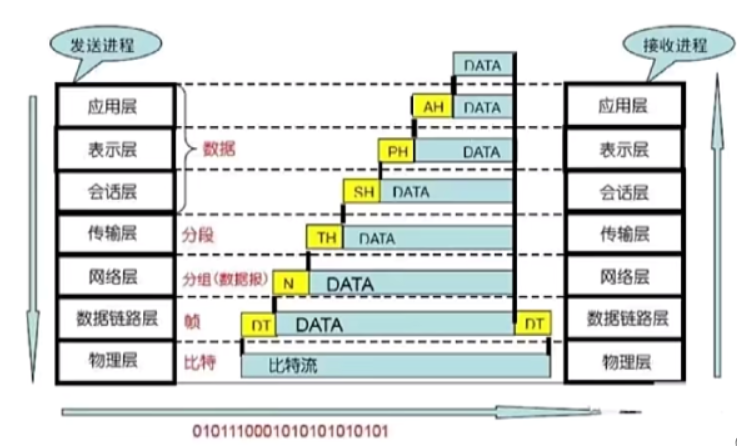

## 网络基础知识

### OSI开放式互联参考模型

1. 物理层：机械、电子、定时接口铁牛信道上的原始比特流传输
2. 数据链路层：物理寻址，同时将原始比特流转变为逻辑传输线路
3. 网络层：控制子网的运行，如逻辑编址、分组传输、路由选择 。**IP协议**
4. 传输层：**TCP\UDP**、接收上一层的数据，在必须要的时候把数据进行分割，并将这些数据交给网络层
5. 会话层：不同机器上的用户之间简历及管理会话，**SSL、TLS**
6. 表示层：信息的语法语义以及它们的关联，如加密解密、转换翻译、压缩解压缩
7. 应用层：**HTTP协议**

快捷记忆：All People Seem To Need Data Processing.（所有人似乎都需要数据处理）






一个通俗易懂的比喻是：假设你要给你的朋友寄一封信，你需要写好信件（应用层），然后把信件装进信封（表示层），写上收件人地址和发件人地址（会话层），把信封装进一个快递包裹（传输层），然后把快递包裹交给快递员（网络层），快递员把包裹送到邮局（数据链路层），邮局把包裹放进邮袋（物理层），最后邮袋被运送到收件人所在地，收件人拿到邮袋并取出信封，读取信件内容（应用层）。

### TCP/IP协议：OSI的实现

| OSI七层模型 | TCP/IP概念层模型 |
| ----------- | ---------------- |
| 应用层      | / 应用层         |
| 表示层      | \| 应用层        |
| 会话层      | \ 应用层         |
| 传输层      | 传输层           |
| 网络层      | 网络层           |
| 数据链路层  | / 链路层         |
| 物理层      | \ 链路层         |

## TCP的三次握手

### TCP简介

- 面向连接的、可靠的、基于字节流的传输层通信协议
- 将应用层的数据流分割成报文段并发送给目标节点的TCP层
- 数据包都有序号，对方收到则发送ACK确认，未收到则重传
- 使用校验和来检验数据在传输过程中是否有误

### TCP Flags

- **SYN：同步序号，用于建立连接过程**

- **ACK：确认序号标志**

- PSH：push标志
- RST：重置连接标志

- URG：紧急指针标志

- **FIN：finish标志，用于释放连接**

### TCP三次握手


在TCP/IP协议中，TCP协议提供可靠的连接服务，采用三次握手建立一个连接。

第一次握手：建立连接时，客户端发送SYN包 (sym=j) 到服务器，并进入SYN_SEND状态，等待服务器确认

第二次握手：服务器收到SYN包，必须确认客户的SYN (ack=j+1)，同时自己也发送一个SYN包(syn=k)，即 SYN+ACK包，此时服务器进入SYN_RECV状态

第三次握手：客户端收到服务器的SYN+ACK包，向服务器发送确认包ACK (ack=k+1) ，此包发送完毕，客户端和服务器进入 ESTABLISHED 状态，完成三次握手

**为什么需要三次握手才能建立连接？**

> 为了初始化Sequence Number的初始值

### 首次握手的隐患

#### SYN超时

SYN超时是指客户端发送SYN包后，如果服务器没有及时响应，客户端会重新发送SYN包。如果服务器仍然没有响应，客户端会一直重复发送SYN包，直到超时。这种情况可能会导致以下问题：

1. 浪费网络资源：客户端不断发送SYN包，会占用网络带宽和服务器资源，浪费网络资源。
2. 延迟连接建立：由于客户端需要等待SYN超时后才能重新发送SYN包，因此会延迟连接的建立时间。
3. 安全问题：SYN超时可能会被攻击者利用，例如SYN洪泛攻击，攻击者发送大量的SYN包，导致服务器无法响应正常的连接请求。

#### 原因分析

- ServerL收到Client的SYN,回复SYN-ACK的时候未收到ACK确认
- Server2不断重试直至超时，Linux默认等待63秒才断开连接

#### 措施：

1. 调整SYN超时时间：可以适当增加SYN超时时间，避免频繁重传SYN包。
2. **使用SYN Cookie技术**：SYN Cookie是一种防止SYN洪泛攻击的技术，可以有效减少SYN超时的问题。
3. 优化网络环境：优化网络环境，加强网络安全防护，可以减少SYN超时的发生。

**建立连接后，client出现故障如何解决？**

保活机制：

1. 向对方发送保活探测报文，如果没有收到响应则继续发送
2. 尝试次数达到保活探测数仍未收到响应则中断连接

## TCP的四次挥手

挥手是为了终止连接：


TCP连接必须经过2MSL后才真正释放掉

### 一些概念的理解

- TCP四次挥手中的ACK和ack的区别

  ```
  在TCP的四次挥手过程中，ACK和ack都是指确认信息的概念，但大小写的不同意味着它们的含义不同。
  
  ACK（大写）是TCP协议中的一个标识符，表示确认收到了对方发来的数据段。
  
  ack（小写）则是通常指TCP数据包中的确认序号字段，它是指接收方当前期望接收到的下一个数据包的序号，也就是表示已经收到了前一个数据包的编号。
  ```

- FIN的作用：

  ```
  FIN用于TCP连接主动断开，请求释放连接，避免数据混乱和资源浪费。是连接释放的必要标记。
  当一方向另外一方发送一个FIN时，它不能再发送任何数据。但是，它仍然可以接收数据直到它收到另一方发来的FIN后关闭连接。从另一方面来说，TCP连接的关闭是一个双向的过程，双方都需要发送FIN消息来完成连接的释放过程。
  ```

- seq与ack的关系

  ```
  Seq（序列号）用于标识TCP报文段中数据的顺序，ack（确认号）用于表示对方期望接收的下一个字节的序号。Seq和ack的关系是，接收方通过发送ack确认序号来告诉发送方已经接收并成功处理了哪些数据，这样发送方就知道下一次该从哪个Seq开始发送数据了。
  ```

### TCP 四次挥手流程

TCP采用四次挥手来释放连接

第一次挥手：Client发送一个FIN，用来关闭Client到Server的数据传送，Client进入FIN_WAIT1状态；

第二次挥手：Server收到FIN后，发送一个ACK给Client，确认序号为收到序号+1（与SYN相同，一个FIN占用一个序号)，Server进入CLOSE_WAIT状态；

第三次挥手：Server发送一个FIN，用来关闭Server到Client的数据传送，Server进入LAST_ACK状态；

第四次挥手：Client收到FIN后，Client进入TIME_WAIT状态，接着发送一个ACK给Server，确认序号为收到序号+1，Server进入CLOSED状态，完成四次挥手。

### 一些问题

- 如何理解TIME_WAIT状态

  ```markdown
  - 确保有足够的时间让对方收到ACK包
  - 避免新旧连接混淆
  ```

- 为什么需要四次握手才能断开连接

  ```
  因为全双工，发送方和接收方都需要FIN报文和ACK报文
  ```

- 服务器出现大量CLOSE_WAIT状态的原因

  ```markdown
  对方关闭socketi连接，我方忙于读或写，没有及时关闭连接
  
  - 检查代码，特别是释放资源的代码
  - 检查配置，特别是处理请求的线程配置
  
  获取CLOSE_WAIT状态:
  >> netstat -an | awk '$1 == "tcp" && $NF == "CLOSE_WAIT" {print}'
  
  - netstat -an：列出所有TCP连接的状态信息
  - awk：选择与输出匹配的行
  - '$1 == "tcp" && $NF == "CLOSE_WAIT" {print}'：选择状态为CLOSE_WAIT的TCP连接并输出
  ```
  

## UDP 

### UDP的特点

- 面向非连接
- 不维护连接状态，支持同时向多个客户端传输相同的消息
- 数据包报头只有8个字节，额外开销较小
- 吞吐量只受限于数据生成速率、传输速率以及机器性能
- 尽最大努力交付，不保证可靠交付，不需要维持复杂的链接状态表
- 面向报文，不对应用程序提交的报文信息进行拆分或者合并

### 与TCP的区别

- 面向连接 vs 无连接
- 可靠性
- 有序性
- 速度
- 量级

## TCP滑动窗口

1. RTT和RTO

   - RTT：发送一个数据包到收到对应的ACK，所花费的时间

   - RTO：重传时间间隔

2. TCP使用滑动窗口做流量控制与乱序重排

   - 保证TCP的可靠性

   - 保证TCP的流控特性

## HTTP与HTTPS

### HTTP

1. 主要特点

   - 支持客户/服务器模式
   - 简单快速
   - 灵活
   - 无连接
   - 无状态

2. 请求结构

   HTTP请求由三个部分组成：请求行、请求头和请求体。

   - 请求行（Request Line）：由请求方法、请求URL和HTTP版本组成，以一个空格分隔。例如：

     ```http
     GET /index.html HTTP/1.1
     ```

   - 请求头（Request Header）：由多个字段组成，每个字段由字段名、冒号和字段值组成，以一个回车换行符（\r\n）分隔。例如：

     ```http
     Host: www.example.com
     User-Agent: Mozilla/5.0 (Windows NT 10.0; Win64; x64) AppleWebKit/537.36 (KHTML, like Gecko) Chrome/91.0.4472.77 Safari/537.36
     Accept-Language: zh-CN,zh;q=0.9
     ```

   - 请求体（Request Body）：一般用于POST请求，提交表单或上传文件等操作。请求体由多个字段组成，以一个回车换行符分隔。例如：

     ```http
     username=test&password=123456
     ```

3. 响应结构

   下面使用Markdown语法描述HTTP响应结构：

   HTTP响应由三个部分组成：状态行、响应头和响应体。

   - 状态行（Status Line）：由HTTP版本、状态码和状态描述组成，以一个空格分隔。例如：

     ```http
     HTTP/1.1 200 OK
     ```

   - 响应头（Response Header）：由多个字段组成，每个字段由字段名、冒号和字段值组成，以一个回车换行符（\r\n）分隔。例如：

     ```http
     Server: nginx/1.14.0
     Content-Type: text/html; charset=utf-8
     Content-Length: 12539
     ```

   - 响应体（Response Body）：服务器返回的实际响应数据。例如：

     ```html
     <!DOCTYPE html>
     <html>
         <head>
             <title>Example</title>
         </head>
         <body>
             <h1>Hello, World!</h1>
         </body>
     </html>
     ```

4. 请求/响应的步骤

   - 客户端连接到Web服务器
   - 发送HTTP请求
   - 服务器接受请求并返回HTTP响应
   - 释放连接TCP连接

5. 在浏览器地址栏键入URL,按下回车之后经历的流程

   - DNS解析
   - TCP连接
   - 发送HTTP请求
   - 服务器处理请求并返回HTTP报文
   - 浏览器解析渲染页面
   - 连接结束

6. 常见的HTTP状态码

   - 200OK：正常返回信息
   - 400 Bad Request：客户端请求有语法错误，不能被服务器所理解
   - 401 Unauthorized：请求未经授权，这个状态代码必须和WWW-Authenticate报头域一起使用
   - 403 Forbidden：服务器收到请求，但是拒绝提供服务
   - 404 Not Found：请求资源不存在，eg,输入了错误的URL
   - 500 Internal Server Error：服务器发生不可预期的错误
   - 503 Server Unavailable：服务器当前不能处理客户端的请求，一段时间后可能恢复正常

### GET请求和POST请求的区别

- Http报文层面：GET将请求信息放在URL，POST放在报文体中
- 数据库层面：GET符合幂等性和安全性，POST不符合
- 其他层面：GET可以被缓存、被存储，而POST不行

### Cookie和Session的区别

1. Cookie简介：
   - 是由服务器发给客户端的特殊信息，以文本的形式存放在客户端
   - 客户端再次请求的时候，会把Cookiel回发
   - 服务器接收到后，会解析Cookie生成与客户端相对应的内容

2. Session简介
   - 服务器端的机制，在服务器上保存的信息
   - 解析客户端请求并操作session id，按需保存状态信息

3. Session的实现方式
   - 使用Cookie来实现
   - 使用URL回写来实现
4. 两者区别
   - Cookie数据存放在客户的浏览器上，Session数据放在服务器上
   - Session相对于Cookie更安全
   - 若考虑减轻服务器负担，应当使用Cookie

### HTTPS


1. SSL(Security Sockets Layer，安全套接层)
   - 为网络通信提供安全及数据完整性的一种安全协议
   - 是操作系统对外的API,SSL3.0后更名为TLS
   - 采用身份验证和数据加密保证网络通信的安全和数据的完整性
2. 加密方式：
   - 对称加密：加密和解密都使用同一个密钥
   - 非对称加密：加密使用的密钥和解密使用的密钥是不相同的
   - 哈希算法：将任意长度的信息转换为固定长度的值，算法不可逆
   - 数字签名：证明某个消息或者文件是某人发出/认同的

3. HTTPS数据传输流程
   - 浏览器将支持的加密算法信息发送给服务器
   - 服务器选择一套浏览器支持的加密算法，以证书的形式回发浏览器
   - 浏览器验证证书合法性，并结合证书公钥加密信息发送给服务器
   - 服务器使用私钥解密信息，验证哈希，加密响应消息回发浏览器
   - 浏览器解密响应消息，并对消息进行验真，之后进行加密交互数据

4. 两者区别
   - HTTPS需要到CA申请证书，HTTP不需要
   - HTTPS密文传输，HTTP明文传输
   - 连接方式不同，HTTPS默认使用443端口，HTTP使用80端口
   - HTTPS=HTTP+加密+认证+完整性保护，较HTTP安全

## Socket

Socket是对TCP/IP协议的抽象，是操作系统对外开放的接口

面试题：编写一个网络应用程序，有客户端与服务器端，客户端向服务器发送一个字符串，服务器收到该字符串后将其打印到命令行上，然后向客户端返回该字符串的长度，最后，客户端输出服务器端返回的该字符串的长度，分别用TCP和UDP两种方式去实现


