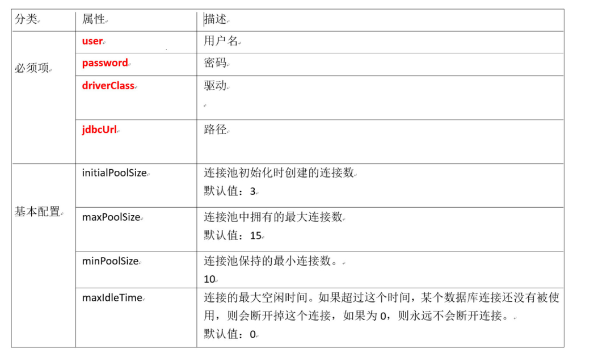

# JDBC

**概述:**	JDBC是接口，驱动是接口的实现，没有驱动就无法完成数据库连接，从而不能操作数据库。每个数据库厂商都需要提供自己的驱动，用来连接自己公司的数据库，也就是说驱动一般由数据库生成厂商提供

即：JDBC是用来实现通过java来操作数据库的一套接口

## JDBC开发

### 可忽略的操作：注册驱动

- JDBC规范定义驱动接口： `java.sql.Driver`
- MySql驱动包提供了实现类： `com.mysql.jdbc.Driver`  

使用`Class.forName(数据库驱动实现类)`来加载和注册数据库驱动，数据库驱动由数据库厂商提供

### 获取连接

- Connection 接口，代表一个连接对象 ,具体的实现类由数据库的厂商实现
- 使用 DriverManager类的静态方法,getConnection可以获取数据库的连接  

| 获取连接的静态方法                                           | 说明                                             |
| ------------------------------------------------------------ | ------------------------------------------------ |
| Connection getConnection(String url, String user, String password) | 通过连接字符串和用户名,密码来获取数据 库连接对象 |

#### getConnection连接参数说明

| 连接参数 | 说明                                               |
| -------- | -------------------------------------------------- |
| user     | 登录用户名                                         |
| password | 登录密码                                           |
| url      | mySql URL的格式 jdbc:mysql://localhost:3306/数据库 |

> 例URL : jdbc:mysql://localhost:3306/db4?characterEncoding=UTF-8  

```java
public class JDBCDemo02 {
	public static void main(String[] args) throws Exception {
        //1.注册驱动
        Class.forName("com.mysql.jdbc.Driver");
        
        //2.获取连接 url,用户名, 密码
        String url = "jdbc:mysql://localhost:3306/db4";
        Connection con = DriverManager.getConnection(url, "root", "123456");
    }
}
```

### 获取语句执行平台

- 通过Connection的createStatement方法获取sql执行对象

  | Connection接口中的方法      | 说明                 |
  | --------------------------- | -------------------- |
  | Statement createStatement() | 创建 SQL语句执行对象 |

- Statement：代表一条语句对象，用于发送SQL语句给服务器，用于执行静态SQL语句并返回它所生成结果的对象

  | Statement类 常用方法                | 说明（增删改、查）                                         |
  | ----------------------------------- | ---------------------------------------------------------- |
  | int executeUpdate(String sql);      | 执行insert update delete语句.返回int类型,代表受影响的行 数 |
  | ResultSet executeQuery(String sql); | 执行select语句, 返回ResultSet结果集对象                    |

```java
//1.获取连接 url,用户名, 密码
String url = "jdbc:mysql://localhost:3306/db4";
Connection con = DriverManager.getConnection(url, "root", "123456");

//2.获取语句执行平台
Statement statement = con.createStatement();

//3.执行创建表操作，增删改操作 使用executeUpdate,增加一张表
String sql = "create table test01(id int, name varchar(20),age int);";
int i = statement.executeUpdate(sql);	//i代表的是受影响的行数

//4.执行查询操作，使用executeQuery，返回一个结果集
String sql2 = "select * from table where id>10";
ResultSet rs = statement.executeQuery(Sql2);

//7.关闭流
statement.close();
con.close();
```

### 处理结果集

只有在执行查询操作的时候，才会处理结果集

#### ResultSet接口

作用：封装数据库查询的结果集，对结果集进行遍历，取出每一条记录

| ResultSet接口方法          | 说明                                                         |
| -------------------------- | ------------------------------------------------------------ |
| boolean next()             | 1) 游标向下一行 <br />2) 返回 boolean 类型，如果还有下一条记录，返回 true，否则返回 false |
| xxx getXxx( String or int) | 1) 如果参数是 String ，则去获取对应列名的数据，例如name <br />2) 如果参数是int，则去获取对应列号的数据，例如1<br />3) xxx代表的是数据的类型，例如name是String类型的，age是int类型的 |

```java
String sql = "select * from jdbc_user";
//执行查询操作,返回的是一个 ResultSet 结果对象
ResultSet resultSet = statement.executeQuery(sql);

//使用while循环
while(resultSet.next()){
    //获取id
    int id = resultSet.getInt("id");
    //获取姓名
    String username = resultSet.getString("username");
    //获取生日
    Date birthday = resultSet.getDate("birthday");
    System.out.println(id + " = " +username + " : " + birthday);
}
```

### 释放资源

- 需要释放的对象：ResultSet 结果集，Statement 语句，Connection 连接  
- 释放原则：先开的后关，后开的先关。ResultSet ==> Statement ==> Connection  ，并且语句放在finally中

### 流程总结

1. 获取驱动（略）
2. 获取连接：getConnection(url,user,password)
3. 获取Statement对象：createStatement()
4. 处理结果集（只在查询时处理）
5. 释放资源

## JDBC实现增删改查

### JDBC工具类

工具类包含的内容：

- 可以把几个字符串定义成常量，例如：用户名，密码，URL，驱动类
- 获取数据库的连接：getConnection()
- 关闭资源

```java
public class JDBCUtils {
    //1. 定义字符串常量, 记录获取连接所需要的信息
    public static final String DRIVERNAME = "com.mysql.jdbc.Driver";
    public static final String URL = "jdbc:mysql://localhost:3306/db4?characterEncoding=UTF-8";
    public static final String USER = "root";
    public static final String PASSWORD = "123456";
    
    //2.获取连接的静态方法
    public static Connection getConnection(){
        try {
            //获取连接对象
            Connection connection = DriverManager.getConnection(URL, USER, PASSWORD);
            //返回连接对象
            return connection;
        } catch (SQLException e) {
            e.printStackTrace();
            return null;
        }
    }
    
    //3.关闭资源
    public static void close(Connection con, Statement st){
        if(con != null && st != null){
            try {
                st.close();
                con.close();
            } catch (SQLException e) {
                e.printStackTrace();
            }
        }
    }
    
    public static void close(Connection con, Statement st, ResultSet rs){
        if(rs != null){
            try {
            	rs.close();
            } catch (SQLException e) {
            	e.printStackTrace();
            }
        } 
        close(con,st);
    }
}
```

### 使用工具类进行操作

`jdbc:mysql://localhost:3306/db4?characterEncoding=UTF-8`
//characterEncoding=UTF-8 指定字符的编码、解码格式。  

#### 增删改操作

```java
//1.通过工具类获取连接
Connection connection = JDBCUtils.getConnection();

//2.获取Statement
Statement statement = connection.createStatement();

//3.执行Sql
String sql = "insert into jdbc_user values(null,'张万','123','2020/1/1')";
statement.executeUpdate(sql);

//4.关闭流
JDBCUtils.close(connection,statement);
```

#### 查操作

```java
//1.获取连接对象
Connection connection = JDBCUtils.getConnection();

//2.获取Statement对象
Statement statement = connection.createStatement();

String sql = "SELECT * FROM jdbc_user WHERE username = '张百万';";
ResultSet resultSet = statement.executeQuery(sql);

//3.处理结果集
while(resultSet.next()){
    //通过列名 获取字段信息
    int id = resultSet.getInt("id");
    String username = resultSet.getString("username");
    String password = resultSet.getString("password");
    String birthday = resultSet.getString("birthday");
    System.out.println(id+" "+username+" " + password +" " + birthday);
} 

//4.释放资源
JDBCUtils.close(connection,statement,resultSet);
```

## SQL注入问题

- 什么是SQL注入：

  我们让用户输入的密码和 SQL 语句进行字符串拼接。用户输入的内容作为了 SQL 语句语法的一部分，改变了 原有SQL 真正的意义，以上问题称为 SQL 注入  

- 如何实现注入：

  根据用户输入的数据，拼接出的字符串

  ```mysql
  -- 用户如果输入正确的 name 和 password，返回True，可以登录
  select * from jdbc_user where username = 'name' and password = 'password';
  
  -- 但是用户输入了一个可以被当成语句的密码：abc' or '1'='1  导致错误的密码也可以登录
  select * from jdbc_user where username = 'abc' and password = 'abc' or '1'='1'; 
  ```

- 如何解决

  要解决 SQL 注入就不能让用户输入的密码和我们的 SQL 语句进 行简单的字符串拼接  

## 预处理对象

### PreparedStatement接口

- PreparedStatement 是 Statement 接口的子接口，继承于父接口中所有的方法。它是一个预编译的 SQL 语句对象.
- 预编译: 是指SQL 语句被预编译,并存储在 PreparedStatement 对象中。然后可以使用此对象多次高效地执行该语句  

### 特点

- 因为有预先编译的功能，提高 SQL 的执行效率。
- 可以有效的防止 SQL 注入的问题，安全性更高  

### 获取对应的语句执行平台

同样是通过connection创建的对象

| Connection 接口中的方法                        | 说明                                                         |
| ---------------------------------------------- | ------------------------------------------------------------ |
| PreparedStatement prepareStatement(String sql) | 指定预编译的 SQL 语句， SQL 语句中使用占位符 ? 创建一个语句对象 |

### 接口常用方法

和statement方法一致

| 常用方法                  | 说明                                   |
| ------------------------- | -------------------------------------- |
| int executeUpdate();      | 执行insert update delete语句.          |
| ResultSet executeQuery(); | 执行select语句. 返回结果集对象 Resulet |

### 使用步骤

1. 编写SQL语句，未知内容使用?占位：

   `"SELECT * FROM jdbc_user WHERE username=? AND password=?";  `

2. 获得 PreparedStatement 对象

3. 设置实际参数：setXxx(占位符的位置, 真实的值) 

4. 执行参数化 SQL 语句

5. 关闭资源  

| setXxx重载方法                               | 说明                                  |
| -------------------------------------------- | ------------------------------------- |
| void setDouble(int parameterIndex, double x) | 将指定参数设置为给定 Java double 值。 |
| void setInt(int parameterIndex, int x)       | 将指定参数设置为给定 Java int 值。    |
| void setString(int parameterIndex, String x) | 将指定参数设置为给定 Java String 值。 |
| void setObject(int parameterIndex, Object x) | 使用给定对象设置指定参数的值。        |

```java
//4.1 编写SQL 使用 ? 占位符方式
String sql = "select * from jdbc_user where username = ? and password = ?";
PreparedStatement ps = connection.prepareStatement(sql);

//4.2 设置占位符参数
ps.setString(1,name);
ps.setString(2,pass);

//5. 执行查询 处理结果集
ResultSet resultSet = ps.executeQuery();
...
    
//6.释放资源
JDBCUtils.close(connection,statement,resultSet);
```

### Statement 与 PreparedStatement的区别  

1. Statement用于执行静态SQL语句，在执行时，必须指定一个事先准备好的SQL语句。 
2. PrepareStatement是预编译的SQL语句对象，语句中可以包含动态参数“?”，在执行时可以为“?”动态设置参数值
3. PrepareStatement可以减少编译次数提高数据库性能  

## JDBC 控制事务

### 事务相关API

使用Connection中的方法实现事务管理

| 方法                                   | 说明                                                         |
| -------------------------------------- | ------------------------------------------------------------ |
| void setAutoCommit(boolean autoCommit) | 参数是 true 或 false 如果设置为 false，表示关闭自动提交，相 当于开启事务 |
| void commit()                          | 提交事务                                                     |
| void rollback()                        | 回滚事务                                                     |

### 使用步骤

1. 获取连接
2. 开启事务
3. 获取到 PreparedStatement , 执行两次更新操作
4. 正常情况下提交事务
5. 出现异常回滚事务
6. 最后关闭资源  

```java
public static void main(String[] args) {

    Connection con = null;
    PreparedStatement ps = null;
    try {
        // 创建连接
        con = JDBCUtils.getConnection();
        // 关闭自动提交，开启事务
        con.setAutoCommit(false);

        // 获取PrepareStatement执行平台
        String sql1 = "update account  set money = money - ? where name = ? ";
        ps = con.prepareStatement(sql1);

        // 执行第一次更新命令
        ps.setDouble(1,500.00);
        ps.setString(2,"tom");
        ps.executeUpdate();

        // 获取PrepareStatement执行平台
        String sql2 = "update account  set money = money + ? where name = ? ";
        ps = con.prepareStatement(sql2);
        
        // 执行第二次更新命令
        ps.setDouble(1,500.00);
        ps.setString(2,"jack");
        ps.executeUpdate();

        // 提交事务
        con.commit();
        System.out.println("转账成功");
    } catch (SQLException e) {
        e.printStackTrace();
        try {
            con.rollback();
        } catch (SQLException ex) {
            System.out.println("sorry");
            throw new RuntimeException(ex);
        }
    } finally {
    }
}
```

# 数据库连接池&DBUtils

## 数据库连接池

### 什么是连接池：

类似于线程池，为了减少系统消耗，需要尽量减少“获得连接”或“释放资源”这种行为，通过共享连接Connection可以达成这一要求。这就是连接池，可以重复使用Connection，当使用完Connection后，调用Connection的close()方法不会真的关闭Connection，而是归还到池中

- 如何使用连接池：

Java提供了公共的接口：`javax.sql.DataSource`。各个厂商需要让自己的连接池实现这个接口，这样应用程序可以方便的切换不同厂商的连接池！

- 常用的连接池有：

  - DBCP连接池

  - C3P0连接池

  - Druid连接池

### DBCP连接池

DBCP是一个开源的连接池，是Apache成员之一，在企业开发中比较常见，

#### 编写工具类：

连接数据库表的工具类，采用DBCP连接池的方式来完成

- Java中提供了一个连接池的规则接口：`DataSoure`，它是Java中提供的连接池
- DBCP包中提供了`DataSoure`接口的实现类，我们要用的具体的连接池`BasicDataSoure`类

```java
public class DBCPUtils{
    //1.定义常量 保存数据库连接的相关信息
    public static final String DRIVERNAME = "com.mysql.jdbc.Driver";
    public static final String URL = "jdbc:mysql://localhost:3306/db5?characterEncoding=UTF-8";
    public static final String USERNAME = "root";
    public static final String PASSWORD = "123456";
    
    //2.创建连接池对象 (有DBCP提供的实现类)
	public static BasicDataSource dataSource = new BasicDataSource();
    
    //3.使用静态代码块进行配置
    static{
        dataSource.setDriverClassName(DRIVERNAME);
        dataSource.setUrl(URL);
        dataSource.setUsername(USERNAME);
        dataSource.setPassword(PASSWORD);
    }
    
    //4.获取连接的方法
    public static Connection getConnection() throws SQLException {
        //从连接池中获取连接
        Connection connection = dataSource.getConnection();
        return connection;
    }
    
    //5.释放资源，这里不再重复
    public static void close(Connection con, Statement statement){...}
    public static void close(Connection con, Statement statement,ResultSet resultSet){...}
}
```

#### 常见配置项

| 属性            | 描述           |
| --------------- | -------------- |
| driverClassName | 数据库驱动名称 |
| url             | 数据库地址     |
| username        | 用户名         |
| password        | 密码           |
| maxActive       | 最大连接数量   |
| maxIdle         | 最大空闲连接   |
| minIdle         | 最小空闲连接   |
| initialSize     | 初始化连接     |

### C3P0连接池

C3P0是一个开源的JDBC连接池,支持JDBC3规范和JDBC2的标准扩展。目前使用它的开源项目有`Hibernate`、`Spring`等。  

使用时需要导入`c3p0-config.xml`配置文件，可以放到src下，也可以放到资源文件夹中

```xml
<!-- 此处只描述命名配置，默认配置不再重复描述 -->
<!--配置连接池mysql-->
<named-config name="mysql">
<property name="driverClass">com.mysql.jdbc.Driver</property>
<property name="jdbcUrl">jdbc:mysql://localhost:3306/db5</property>
<property name="user">root</property>
<property name="password">123456</property>
<property name="initialPoolSize">10</property>
<property name="maxIdleTime">30</property>
<property name="maxPoolSize">100</property>
<property name="minPoolSize">10</property>
</named-config>
<!--配置连接池2,可以配置多个-->
```

#### 编写工具类

C3P0提供的核心工具类：`ComboPooledDataSource  `，如果使用连接池，就必须创建该类的对象

- `new ComboPooledDataSource(); `使用默认配置
- `new ComboPooledDataSource("mysql"); `使用命名配置  

```java
public class C3P0Utils {
    
    //1.创建连接池对象 C3P0对DataSource接口的实现类
    
    //1.1使用的配置是 配置文件中的默认配置
    //public static ComboPooledDataSource dataSource = new ComboPooledDataSource();
    
    //1.2使用指定的配置
    public static ComboPooledDataSource dataSource = new ComboPooledDataSource("mysql");
    
    //获取连接的方法
    public static Connection getConnection() throws SQLException {
        return dataSource.getConnection();
	}
     //5.释放资源，这里不再重复
    public static void close(Connection con, Statement statement){...}
    public static void close(Connection con, Statement statement,ResultSet resultSet){...}
}
```

#### 常见配置



### Druid连接池

Druid（德鲁伊）是阿里巴巴开发的号称为监控而生的数据库连接池，Druid是目前最好的数据库连接池。在功能、性能、扩展性方面，都超过其他数据库连接池，同时加入了日志监控，可以很好的监控DB池连接和SQL的执行情况。  

需要导入配置文件，格式是properties形式的，

例如：druid.properties

```properties
driverClassName=com.mysql.jdbc.Driver
url=jdbc:mysql://127.0.0.1:3306/db5?characterEncoding=UTF-8
username=root
password=123456
initialSize=5
maxActive=10
maxWait=3000
```

#### 编写工具类

获取数据库连接池对象：

- 通过工厂来来获取 `DruidDataSourceFactory`类的`createDataSource`方法
- `createDataSource(Properties p)` 方法参数可以是一个属性集对象  

```java
public class DruidUtils {
    //1.定义成员变量
	public static DataSource dataSource;
    
    //2.静态代码块
    static{
        try {
            //3.创建属性集对象
            Properties p = new Properties();

            //4.加载配置文件 Druid 连接池不能够主动加载配置文件 ,需要指定文件
            InputStream inputStream = DruidUtils.class.getClassLoader().getResourceAsStream("druid.properties");

            //5. 使用Properties对象的 load方法 从字节流中读取配置信息
            p.load(inputStream);

            //6. 通过工厂类获取连接池对象
            dataSource = DruidDataSourceFactory.createDataSource(p);

        } catch (Exception e) {
            e.printStackTrace();
        }
    }
    
    //3.获取连接的方法
    public static Connection getConnection(){
        try {
            return dataSource.getConnection();
        } catch (SQLException e) {
            e.printStackTrace();
            return null;
        }
    }

     //5.释放资源，这里不再重复
    public static void close(Connection con, Statement statement){...}
    public static void close(Connection con, Statement statement,ResultSet resultSet){...} 
}
```

### 测试类

```java
public class Test {
	public static void main(String[] args) throws SQLException {
        //1.获取连接
        Connection con = DBCPUtils.getConnection();
        Connection con = C3U0Utils.getConnection();
		Connection con = DruidUtils.getConnection();
        
        //2.获取Statement对象
		Statement statement = con.createStatement();
        
        //3.执行查询
        String sql = "select ename from employee where salary between 3000 and 5000";
    	ResultSet resultSet = statement.executeQuery(sql);
        
        //4.处理结果集
        while(resultSet.next()){
            String ename = resultSet.getString("ename");
            System.out.println(ename);
        }
        
        //5.释放资源
        DBCPUtils.close(con,statement,resultSet);
        C3P0Utils.close(con,ps,resultSet);
		DruidUtils.close(con,statement,resultSet);
    }
}
```

## DBUtils工具类

使用JDBC时可以发现冗余的代码过多，为了简化开发，我们使用DBUtils

Commons DbUtils是Apache组织提供的一个对JDBC进行简单封装的开源工具类库，使用它能够简化JDBC应用程序的开发，同时也不会影响程序的性能。  

使用方式：

DBUtils就是JDBC的简化开发工具包，需要项目导入commons-dbutils-1.6.jar。  

### DBUtils核心功能介绍

1. `QueryRunner `中提供对sql语句操作的API.
2. `ResultSetHandler`接口，用于定义select操作后，怎样封装结果集.
3. `DbUtils`类,他就是一个工具类,定义了关闭资源与事务处理相关方法.  

### 相关知识

#### 表和类之间的关系

1. 整个表可以看做是一个类
2. 表中的一行记录,对应一个类的实例(对象)
3. 表中的一列,对应类中的一个成员属性  

#### JavaBean组件

为了实现表和类一一对应，我们使用JavaBean组件来代表一个表

JavaBean就是一个类，开发中通常用于封装数据，有以下特点：

1. 需要实现 序列化接口, Serializable (暂时可以省略)
2. 提供私有字段: private 类型 变量名;
3. 提供 getter 和 setter
4. 提供 空参构造  

创建Employee类（JB组件）和数据库的employee表对应  

- 可以创建一个 entity包,专门用来存放 JavaBean类  

```java
// 创建一个JB组件，一般类名和数据表名一致
public class Employee implements Serializable {
    private int eid;
    private String ename;
    private int age;
    private String sex;
    private double salary;
    private Date empdate;
    //空参 getter setter省略
}
```

### DBUtils完成CRUD

#### QueryRunner核心类

构造方法：

- `QueryRunner()`：手动方法创建，执行增删改查操作时需要提供对应的连接
- `QueryRunner(DataSource ds)` ,提供数据源（连接池），DBUtils底层自动维护连接connection  

常用方法：

- `update(Connection conn, String sql, Object... params)` ，用来完成表数据的增加、删除、更新操作 
- `query(Connection conn, String sql, ResultSetHandler<T> rsh, Object... params) `，用来完成表数据的查询操作  

#### QueryRunner的创建

```java
// 两种创建模式：手动模式，自动模式
//1. 手动方式 创建QueryRunner对象
QueryRunner qr = new QueryRunner();

//2. 自动创建 传入数据库连接池对象
QueryRunner qr2 = new QueryRunner(DruidUtils.getDataSource());
```

自动模式需要传入连接池对象

```java
//获取连接池对象,可以放在对应的工具类中
public static DataSource getDataSource(){
	return dataSource;
}
```

#### QueryRunner实现增、删、改操作  

核心方法：`update(Connection conn, String sql, Object... params)  `

| 参数            | 说明                                                         |
| --------------- | ------------------------------------------------------------ |
| Connection con  | 数据库连接对象, 自动模式创建QueryRun 可以不传 ,手动模式必须传递 |
| String sql      | 占位符形式的SQL ,使用 ? 号占位符                             |
| Object... param | Object类型的 可变参,用来设置占位符上的参数                   |

步骤：

1. 创建QueryRunner(手动或自动)
2. 占位符方式 编写SQL
3. 设置占位符参数
4. 执行  

```java
// 增
@Test
public void testInsert() throws SQLException {
    //1.创建 QueryRunner 手动模式创建
    QueryRunner qr = new QueryRunner();
    
    //2.编写 占位符方式 SQL
    String sql = "insert into employee values(?,?,?,?,?,?)";
    
    //3.设置占位符的参数
    Object[] param = {null,"张百万",20,"女",10000,"1990-12-26"};
    
    //4.执行 update方法
    Connection con = DruidUtils.getConnection();
    int i = qr.update(con, sql, param);
    
    //5.释放资源
    DbUtils.closeQuietly(con);
}

// 删
@Test
public void testUpdate() throws SQLException {
    //1.创建QueryRunner对象 自动模式,传入数据库连接池
    QueryRunner qr = new QueryRunner(DruidUtils.getDataSource());
    
    //2.编写SQL
    String sql = "update employee set salary = ? where ename = ?";
    
    //3.设置占位符参数
    Object[] param = {0,"张百万"};
    
    //4.执行update, 不需要传入连接对象
    qr.update(sql,param);
}
```

#### QueryRunner实现查询操作  

##### ResultSetHandler  接口

`ResultSetHandler`可以对查询出来的ResultSet结果集进行处理，达到一些业务上的需求。  

##### ResultSetHandler 结果集处理类  

| ResultSetHandler 实现类 | 说明                                                         |
| ----------------------- | ------------------------------------------------------------ |
| ArrayHandler            | 将结果集中的第一条记录封装到一个Object[]数组中，数组中的每一个元素就是这 条记录中的每一个字段的值 |
| ArrayListHandler        | 将结果集中的每一条记录都封装到一个Object[]数组中，将这些数组在封装到List集 合中。 |
| BeanHandler             | 将结果集中第一条记录封装到一个指定的javaBean中.              |
| BeanListHandler         | 将结果集中每一条记录封装到指定的javaBean中，再将这些javaBean在封装到List 集合中 |
| ColumnListHandler       | 将结果集中指定的列的字段值，封装到一个List集合中             |
| KeyedHandler            | 将结果集中每一条记录封装到Map<String,Object>,在将这个map集合做为另一个 Map的value,另一个Map集合的key是指定的字段的值。 |
| MapHandler              | 将结果集中第一条记录封装到了Map<String,Object>集合中，key就是字段名称， value就是字段值 |
| MapListHandler          | 将结果集中每一条记录封装到了Map<String,Object>集合中，key就是字段名称， value就是字段值，在将这些Map封装到List集合中。 |
| ScalarHandler           | 它是用于封装单个数据。例如 select count(*) from 表操作。     |

##### ResultSetHandler 常用实现类测试  

- QueryRunner的查询方法
- query方法的返回值都是泛型,具体的返回值类型,会根据结果集的处理方式,发生变化  

| 方法                                                    | 说明                                |
| ------------------------------------------------------- | ----------------------------------- |
| query(String sql, handler ,Object[] param)              | 自动模式创建QueryRunner, 执行查询<b |
| query(Connection con,String sql,handler,Object[] param) | 手动模式创建QueryRunner, 执行查询   |

```java
//查询id为5的记录,封装到数组中
//ArrayHandler 将结果集的第一条数据封装到数组中
@Test
public void testFindById() throws SQLException {
    //1.创建QueryRunner
    QueryRunner qr = new QueryRunner(DruidUtils.getDataSource());
    
    //2.编写SQL
    String sql = "select * from employee where eid = ?";
    
    //3.执行查询,将ResultSetHandler类作为参数传入，可以返回一个泛型
    Object[] query = qr.query(sql, new ArrayHandler(), 5);
    
    //4.获取数据
    System.out.println(Arrays.toString(query));
}
//----------------------------------------------------------
//查询所有数据,封装到List集合中
//ArrayListHandler可以将每条数据先封装到数组中, 再将数组封装到集合中
@Test
public void testFindAll() throws SQLException {
    //1.创建QueryRunner
    QueryRunner qr = new QueryRunner(DruidUtils.getDataSource());
    
    //2.编写SQL
    String sql = "select * from employee";
    
    //3.执行查询
    List<Object[]> query = qr.query(sql, new ArrayListHandler());
    
    //4.遍历集合获取数据
    for (Object[] objects : query) {
   		System.out.println(Arrays.toString(objects));
    }
}

//----------------------------------------------------------
//查询id为3的记录,封装到指定JavaBean中
//BeanHandler 将结果集的第一条数据封装到 javaBean中
@Test
public void testFindByIdJavaBean() throws SQLException {
    QueryRunner qr = new QueryRunner(DruidUtils.getDataSource());
    
    String sql = "select * from employee where eid = ?";
    
    Employee employee = qr.query(sql, new BeanHandler<Employee>(Employee.class), 3);
    
    System.out.println(employee);
}
```

## 数据库批处理

批处理(batch) 操作数据库

- 批处理指的是一次操作中执行多条SQL语句，批处理相比于一次一次执行效率会提高很多。
- 当向数据库中添加大量的数据时，需要用到批处理  

### 实现批处理

Statement和PreparedStatement都支持批处理操作

此处以PreparedStatement  为例

1. 要用到的方法：

   | 方法                 | 说明                                                         |
   | -------------------- | ------------------------------------------------------------ |
   | void addBatch()      | 将给定的 SQL 命令添加到此 Statement 对象的当前命令列表中。 通过调用方法 executeBatch 可以批量执行此列表中的命令。 |
   | int[] executeBatch() | 每次提交一批命令到数据库中执行，如果所有的命令都成功执行了， 那么返回一个数组，这个数组是说明每条命令所影响的行数 |

2. mysql 批处理是默认关闭的，需要在URL中加一个参数才打开mysql 数据库批处理

   ```
   rewriteBatchedStatements=true
   例如: url=jdbc:mysql://127.0.0.1:3306/db5?characterEncoding=UTF-8&rewriteBatchedStatements=true
   ```

3. 使用批处理

   ```java
   //1.获取连接
   Connection con = DruidUtils.getConnection();
   
   //2.获取预处理对象
   String sql ="insert into testBatch(uname) values(?)";
   PreparedStatement ps = con.prepareStatement(sql);
   
   //3.创建 for循环 来设置占位符参数
   for (int i = 0; i < 10000 ; i++) {
       ps.setString(1,"小强"+i);
       //将SQL添加到批处理 列表
       ps.addBatch();
   } 
   
   //统一 批量执行
   ps.executeBatch();
   ```

## MySql元数据

除了表之外的数据都是元数据,可以分为三类

- 查询结果信息： UPDATE 或 DELETE语句 受影响的记录数。
- 数据库和数据表的信息： 包含了数据库及数据表的结构信息。
- MySQL服务器信息： 包含了数据库服务器的当前状态，版本号等。  

```mysql
-- 元数据相关的命令介绍

-- 1.查看服务器当前状态
select version();

-- 2.查看MySQl的版本信息
show status; 

-- 3.查询表中的详细信息
show columns from table_name;

-- 4.显示数据表的详细索引信息
show index from table_name; 

-- 5.列出所有数据库
show databases;

-- 6.显示当前数据库的所有表
show tables;

-- 7.获取当前的数据库名
select database();
```

### 使用JDBC获取元数据

#### 常用类介绍

- JDBC中描述元数据的类  

| 元数据类          | 作用                   |
| ----------------- | ---------------------- |
| DatabaseMetaData  | 描述数据库的元数据对象 |
| ResultSetMetaData | 描述结果集的元数据对象 |

- 获取元数据对象的方法 : getMetaData ()  

  - connection 连接对象, 调用 getMetaData () 方法,获取的是DatabaseMetaData 
  - PrepareStatement 预处理对象调用 getMetaData () , 获取的是ResultSetMetaData

- DatabaseMetaData的常用方法  

  | 方法说明                                             |
  | ---------------------------------------------------- |
  | getURL() : 获取数据库的URL                           |
  | getUserName(): 获取当前数据库的用户名                |
  | getDatabaseProductName(): 获取数据库的产品名称       |
  | getDatabaseProductVersion(): 获取数据的版本号        |
  | getDriverName(): 返回驱动程序的名称                  |
  | isReadOnly(): 判断数据库是否只允许只读 true 代表只读 |

- ResultSetMetaData的常用方法  

  | 方法说明                                                     |
  | ------------------------------------------------------------ |
  | getColumnCount() : 当前结果集共有多少列                      |
  | getColumnName(int i) : 获取指定列号的列名, 参数是整数 从1开始 |
  | getColumnTypeName(int i): 获取指定列号列的类型, 参数是整数 从1开始 |

```java
// ------------------ 获取数据库相关的元数据信息 --------------------
//1.获取数据库连接对象 connection
Connection connection = DruidUtils.getConnection();

//2.获取代表数据库的 元数据对象 DatabaseMetaData
DatabaseMetaData metaData = connection.getMetaData();

//3.获取数据库相关的元数据信息
String url = metaData.getURL();
System.out.println("数据库URL: " + url);
String userName = metaData.getUserName();
System.out.println("当前用户: " + userName );

// ------------------ 获取数据表相关的元数据信息 --------------------
//1.获取连接
Connection con = DruidUtils.getConnection();

//2.获取预处理对象
PreparedStatement ps = con.prepareStatement("select * from employee");
ResultSet resultSet = ps.executeQuery();

//3.获取结果集元素据对象
ResultSetMetaData metaData = ps.getMetaData();

//1.获取当前结果集 共有多少列
int count = metaData.getColumnCount();
System.out.println("当前结果集中共有: " + count + " 列");
```

# XML

## XML基本介绍

XML即可扩展标记语言（Extensible Markup Language）  

特点：

1. 可扩展的, 标签都是自定义的
2. 语法十分严格  

作用：

| 功能          | 说明                                                         |
| ------------- | ------------------------------------------------------------ |
| 存储数据      | 通常，我们在数据库中存储数据。不过，如果希望数据的可移植性更强，我们可以把数据存储 XML 文件中 |
| **配置文件**  | 作为各种技术框架的配置文件使用 (最多)                        |
| 在网络中 传输 | 客户端可以使用XML格式向服务器端发送数据,服务器接收到xml格式数据,进行解析 |

## 基础语法

### XML文档声明格式

> 文档声明必须写在第一行  

语法格式：

```xml
<?xml version="1.0" encoding="UTF-8"?>  
```

### 元素

Element 元素: 是XML文档中最重要的组成部分  

元素命名规则：

1. 不能使用空格，不能使用冒号
2. XML 标签名称区分大小写
3. XML 必须有且只有一个根元素  

```xml
<?xml version="1.0" encoding="UTF-8" ?>

<!--只能有一个根元素-->
<users>
    <!--但是可以有多个子元素元素-->
    <user id="01">
        <name>张三</name>
        <age>18</age>
    </user>

    <user id="02">
        <name>李四</name>
        <age>28</age>
    </user>
</users>

<!--这个是注释，可以是单行，也可以是多行，只要在“--”符号之间即可-->
```

### 属性

```xml
<bean id="" class=""> </bean>
```

1. 属性是元素的一部分，它必须出现在元素的开始标签中
2. 属性的定义格式：属性名=属性值，其中属性值必须使用单引或双引
3. 一个元素可以有0~N个属性，但一个元素中不能出现同名属性
4. 属性名不能使用空格、冒号等特殊字符，且必须以字母开头  

## XML约束

在XML技术里，可以编写一个文档来约束一个XML文档的书写规范，这称之为XML约束  

常见的xml约束：

1. DTD
2. Schema

作为程序员只要掌握两点

1. 会阅读
2. 会引入

### DTD约束

DTD（Document Type Definition），文档类型定义，用来约束XML文档。规定XML文档中元素的名称，子元素的名称及顺序，元素的属性等  

开发中，我们不会自己编写DTD约束文档，一般是通过框架提供的约束文档，编写对应的XML文档

- 创建约束文件 student.dtd

```dtd
<!ELEMENT students (student+) >
    <!ELEMENT student (name,age,sex)>
    <!ELEMENT name (#PCDATA)>
    <!ELEMENT age (#PCDATA)>
    <!ELEMENT sex (#PCDATA)>
    <!ATTLIST student number ID #REQUIRED>

<!--
    ELEMENT: 用来定义元素
    students (student+) : 代表根元素 必须是 <students>
    	student+ : 根标签中至少有一个 student子元素, + 代表至少一个
    student (name,age,sex): student 标签中包含的子元素,按顺序出现
    #PCDATA: 是普通文本内容
    ATTLIST: 用来定义属性
    student number ID #REQUIRED
    student子元素中 有一个ID属性叫做 number,是必须填写的
    ID: 唯一 值只能是字母或者下划线开头
-->
```

- 引入DTD

  两种方式：

  - 内部dtd：将约束规则定义在xml文档中
  - 外部：定义在外部dtd中，然后引用

  ```xml
  <?xml version="1.0" encoding="UTF-8" ?>
  <!DOCTYPE students SYSTEM "student.dtd">
  ```

### Schema约束

1. Schema是新的XML文档约束, 比DTD强大很多，是DTD 替代者；
2. Schema本身也是XML文档，但Schema文档的扩展名为xsd，而不是xml。
3. Schema 功能更强大，内置多种简单和复杂的数据类型
4. Schema 支持命名空间 (一个XML中可以引入多个约束文档)  

```xml
<?xml version="1.0"?>
<xsd:schema xmlns="http://www.lagou.com/xml"
            xmlns:xsd="http://www.w3.org/2001/XMLSchema"
            targetNamespace="http://www.lagou.com/xml"
            elementFormDefault="qualified">
    <xsd:element name="students" type="studentsType"/>
    <xsd:complexType name="studentsType">
        <xsd:sequence>
            <xsd:element name="student" type="studentType" minOccurs="0"
                         maxOccurs="unbounded"/>
        </xsd:sequence>
    </xsd:complexType>
    <xsd:complexType name="studentType">
        <xsd:sequence>
            <xsd:element name="name" type="xsd:string"/>
            <xsd:element name="age" type="ageType" />
            <xsd:element name="sex" type="sexType" />
        </xsd:sequence>
        <xsd:attribute name="number" type="numberType" use="required"/>
    </xsd:complexType>
    <xsd:simpleType name="sexType">
        <xsd:restriction base="xsd:string">
            <xsd:enumeration value="male"/>
            <xsd:enumeration value="female"/>
        </xsd:restriction>
    </xsd:simpleType>
    <xsd:simpleType name="ageType">
        <xsd:restriction base="xsd:integer">
            <xsd:minInclusive value="0"/>
            <xsd:maxInclusive value="200"/>
        </xsd:restriction>
    </xsd:simpleType>
    <xsd:simpleType name="numberType">
        <xsd:restriction base="xsd:string">
            <xsd:pattern value="hehe_\d{4}"/>
        </xsd:restriction>
    </xsd:simpleType>
</xsd:schema>
```

- XML引入Schema约束  

  ```xml
  <?xml version="1.0" encoding="UTF-8" ?>
  <students
      xmlns="http://www.lagou.com/xml"
      xmlns:xsi="http://www.w3.org/2001/XMLSchema-instance"
      xsi:schemaLocation="http://www.lagou.com/xml student.xsd"
  > 
      <student number="hehe_1234">
          <name>张百万</name>
          <age>25</age>
          <sex>female</sex>
      </student>
      <student number="hehe_0000">
          <name>小斌</name>
          <age>20</age>
          <sex>male</sex>
      </student>
  </students>
  ```

## XML解析

数据存储在XML后，我们就希望可以通过程序的方式获取XML的内容。如果使用Java基础的IO口，可以做到但是极其繁琐。故诞生了各种解析器，方便开发人员进行XML操作

### XML解析方式

- DOM：要求解析器把整个XML文档装载到内存，并解析成一个Document对象。  
  - 优点：元素与元素之间保留结构关系，故可以进行增删改查操作。
  - 缺点：XML文档过大，可能出现内存溢出显现。  

- SAX：是一种速度更快，更有效的方法。它逐行扫描文档，一边扫描一边解析。并以事件驱动的方式进行具体解析，每执行一行，都将触发对应的事件。（了解）  
  - 优点：占用内存少 处理速度快，可以处理大文件
  - 缺点：只能读，逐行后将释放资源。  

### XML常见的解析器

1. JAXP：sun公司提供的解析器，支持DOM和SAX两种思想
2. **DOM4J**：一款非常优秀的解析器 , Dom4j是一个易用的、开源的库，用于XML，XPath和XSLT。它应用于Java平台，采用了Java集合框架并完全支持DOM，SAX和JAXP。
3. Jsoup：jsoup 是一款Java 的HTML解析器 ,也可以解析XML
4. PULL：Android内置的XML解析方式，类似SAX。  

### DOM4J的使用


